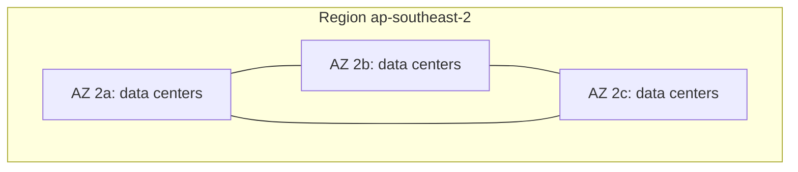

# 03 - Getting Started with AWS

Related: [[AWS Global Infrastructure]] · [[EC2]] · [[Route 53]] · [[IAM]] · [[CloudFront & Global Accelerator]]

## Chapter summary
- AWS launched 2002 internally; first public service **SQS (2004)**; **SQS, S3, EC2** relaunch in 2006.
- **Region** = cluster of data centers; most services are **region-scoped**; a few are global (IAM, Route 53, CloudFront, WAF).
- Choosing a region: **compliance, latency, service availability, pricing**.
- **AZ** = one or more discrete data centers with redundant power/network; 3 per region typically (min 3, max 6); isolated from each other, linked by high-bandwidth low-latency network.
- **Edge locations / points of presence** deliver content with low latency.
- Console: region selector top right; use the same region throughout the course; check the regional services table for availability.

---

## 01 - AWS Cloud Overview - Regions & AZ
(src: 03/01-AWS Cloud Overview - Regions & AZ)

- History: launched 2002 inside amazon.com; first public offering SQS in 2004; 2006 SQS, S3, EC2. Users: Dropbox, Netflix, Airbnb, NASA.
- Market: Gartner Magic Quadrant leader for many years; about $90B revenue (2023), ~31% market share in Q1 2024 (Microsoft second with 25%), leader for 13 consecutive years, over 1 million active users.
- Use cases: enterprise IT, backup and storage, big data analytics, website hosting, mobile/social backends, gaming servers.

[verify] Revenue, market share and "400+ points of presence in 90 cities, 40 countries" figures are dated.
> [!warning] Correction [note]
> AWS's global infrastructure page currently lists 39 regions, 124 AZs and 750+ CloudFront points of presence. Source: [AWS Global Infrastructure](https://aws.amazon.com/about-aws/global-infrastructure/). Revenue/market-share figures not verified.

### Regions
- Named e.g. `us-east-1`, `eu-west-3`. Regions are connected by AWS's private network.
- Using a service in another region is effectively a fresh start (separate resources).

> [!tip] Exam
> How to choose a region: **compliance** (data residency, e.g. French data stays in France), **latency** (close to users), **service availability** (not all regions have all services), **pricing** (varies by region).

### Availability Zones
- Each region has many AZs: usually **3**, minimum **3**, maximum **6**. Example: Sydney `ap-southeast-2` has `ap-southeast-2a`, `2b`, `2c`.
- Each AZ = one or more discrete data centers with redundant power, networking and connectivity; count is not disclosed.
- AZs are separated to be **isolated from disasters** (failure does not cascade); connected by high-bandwidth, ultra-low-latency networking.

> [!info] Diagram
> **Explanation:** A region contains multiple isolated AZs, each made of one or more data centers, interconnected by low-latency links.
> **Reference:** [AWS Global Infrastructure](https://aws.amazon.com/about-aws/global-infrastructure/)

### Edge locations
- Points of presence used to deliver content to end users at lowest latency (detailed later in the CloudFront section).

> [!tip] Exam
> **Global services**: IAM, Route 53, CloudFront, WAF. **Region-scoped**: EC2, Elastic Beanstalk, Lambda, Rekognition. Check the regional services table for availability.

---

## 02 - AWS Console UI Update
(src: 03/02-[Important] AWS Console UI Update)
- Console UI got rounder buttons and new colors; usability is the same. Videos may show the older UI.

---

## 03 - Tour of the AWS Console & Services
(src: 03/03-Tour of the AWS Console & Services in AWS)

- Console Home: **region selector** (top right), recently visited services, health, cost and usage info, tutorials. Pick a region geographically close to you (lowest latency); you need not be physically there.
- Find services via Services menu (alphabetical or by category) or the **search bar** (also finds features, blogs, docs).
- **Route 53** shows "Global" in the top right (no region selection); **EC2** shows a region and displays only that region's resources.
- Stay in the **same region** for the whole course.
- Use the AWS regional services table to check service availability per region (if a lab service is missing, switch region).

### Hands-on steps
1. Open Console Home; set the region selector to the region closest to you.
2. Browse Services menu by category; try the search bar (e.g. "route 53").
3. Open Route 53 (global) then EC2 (regional) and compare the region indicator.
4. Search "AWS global infrastructure" -> regional services table; check a region (e.g. Cape Town).

Not covered: none (all lectures have transcripts).
