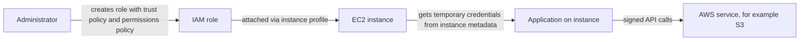

# 04 - IAM & AWS CLI

Related: [[IAM]] (Version C service note) · [[AWS CLI & CloudShell]] · [[EC2]] · [[Organizations & Identity Federation]]

## Chapter summary
- **IAM = Identity and Access Management**, a **global** service (no region selector). Root user is for account setup only; do not use or share it.
- **Users** = one per physical person; **Groups** contain **users only** (not other groups); a user may belong to several groups or none (not best practice).
- **Policies** are JSON documents granting permissions; attach to groups, users (inline) or roles. Apply **least privilege**.
- Policy structure: `Version` (2012-10-17), optional `Id`, `Statement[]` with optional `Sid`, `Effect` (Allow/Deny), `Principal`, `Action`, `Resource`, optional `Condition`. Exam focus: Effect, Principal, Action, Resource.
- Protect accounts with a **password policy** and **MFA** (up to 8 MFA devices per user; virtual, U2F key, hardware key fob, GovCloud key fob).
- Three ways to access AWS: **Management Console** (password + MFA), **CLI** and **SDK** (both protected by **access keys**). Access key ID = username, secret access key = password; never share.
- **CloudShell** = free browser terminal with credentials of the logged-in user; default region = current console region; files persist.
- **IAM Roles** give permissions to AWS services (EC2, Lambda, CloudFormation...), not people.
- Audit with the **Credentials Report** (account level) and **Access Advisor** (user level, last accessed services).

---

## 01 - IAM Introduction: Users, Groups, Policies
(src: 04/01-IAM Introduction- Users, Groups, Policies)

- IAM is global. The root user is created with the account; use it only to set up the account, then stop using/sharing it. Create users instead.
- Example org: Alice, Bob, Charles = developers group; David, Edward = operations group; Charles and David also in an audit group; Fred has no group.
  - **Groups only contain users, not other groups.**
  - Users need not belong to a group (not best practice); a user can belong to **multiple groups**.
- Users/groups get a **policy** (JSON) listing allowed services/actions (example: EC2 Describe, Elastic Load Balancing Describe, CloudWatch).
- **Least privilege principle**: give only the permissions a user needs (avoids cost and security disasters).

> [!tip] Exam
> Groups contain only users. IAM is global. Always least privilege.

---

## 02 - IAM Users & Groups Hands On
(src: 04/02-IAM Users & Groups Hands On)

- IAM console shows **Global** (region selector inactive): a user created in IAM is available everywhere. Seeing only the account ID at top right = you are the root user.
- Console offers **IAM Identity Center** (recommended) or an **IAM user**; the course (and exam) uses the IAM user.
- Auto-generated password + "must change at next sign-in" is the default for other people; a custom password is fine for yourself.
- Permissions added via group: group `admin` with policy `AdministratorAccess`. The user **inherits** permissions from the group (visible on the user as "attached via group").
- **Tags** are optional key/value metadata on resources (example: department = engineering).
- **Account alias** gives a friendlier, unique sign-in URL (account ID or alias is entered at IAM user sign-in).
- Use a private/incognito window to stay signed in as root and IAM user side by side (a second sign-in in the same window logs out the first).
- Do not lose the root and admin logins - recovery requires AWS support.

### Hands-on steps
1. Console search -> IAM; left menu -> Users -> Create user (e.g. `Stephane`).
2. Tick management console access; choose "I want to create an IAM user"; set a custom password; untick "must change at next sign-in".
3. Permissions: create group `admin` with `AdministratorAccess`; add the user to it.
4. Optionally add tag (department = engineering); Create user.
5. Check Groups -> admin -> user and permissions; check the user -> policy attached via group.
6. Dashboard -> create account alias; copy the sign-in URL.
7. Open a private window, paste the sign-in URL, sign in as IAM user (account ID/alias, username, password); compare top-right display with the root window.

---

## 03 - AWS Console Simultaneous Sign-in
(src: 04/03-AWS Console Simultaneous Sign-in)

- **Multi-session support**: enable it in the console, then "add session" to sign in to several accounts/roles in the same browser, each in its own window.
- Demo: created a 1 GB EBS volume in one session; the other session (different account) did not see it.

### Hands-on steps
1. Turn on multi-session in the account menu [screen action].
2. Add session -> sign in with another account ID/user.
3. Compare resources (e.g. EC2 -> Volumes) between the sessions.

---

## 04 - IAM Policies
(src: 04/04-IAM Policies)

- A policy on a **group** applies to every member; a user can also have an **inline policy** (attached only to that user). A user in multiple groups inherits all their policies (Charles: developers + audit; David: operations + audit).
- Policy JSON structure:

| Element | Meaning |
|---|---|
| `Version` | policy language version, usually `2012-10-17` |
| `Id` | optional identifier |
| `Statement` | one or more statements |
| `Sid` | optional statement ID |
| `Effect` | `Allow` or `Deny` |
| `Principal` | account/user/role the policy applies to (example: root of the account) |
| `Action` | list of API calls allowed/denied |
| `Resource` | list of resources the actions apply to (example: a bucket) |
| `Condition` | optional; when the statement applies |

> [!tip] Exam
> Know Effect, Principal, Action, Resource. Inline policy = attached to a single user.

---

## 05 - IAM Policies Hands On
(src: 04/05-IAM Policies Hands On)

- Removing the user from the `admin` group removed its permissions: IAM page showed 0 users and access denied for `iam:ListUsers`.
- `IAMReadOnlyAccess` attached directly lets the user view users/groups but **not create a group** (needs e.g. IAM full access).
- A user's effective policies come from different attachments: administrator access (inherited from group `admin`), a managed policy via group `developers`, and a policy attached directly.
- `AdministratorAccess` JSON: `Effect: Allow`, `Action: *`, `Resource: *` (`*` = anything). `IAMReadOnlyAccess` lists actions such as `Get*`, `List*` (wildcard = every API call starting with that prefix) on `Resource: *`.
- Custom policy: **visual editor** or **JSON editor**; example allows `iam:ListUsers` and `iam:GetUser` on all resources (named `MyIAMPermissions`).

### Hands-on steps
1. Users -> select user (member of `admin`); Groups -> admin -> remove the user; refresh IAM users page (access denied).
2. User -> Add permissions -> attach policies directly -> `IAMReadOnlyAccess`; refresh (works); try creating group `developers` (denied).
3. User groups -> create `developers`, add the user and attach any policy (the lecture picks the first one listed, irrelevant).
4. Re-add user to `admin`; open the user's permissions to see the three sources (group admin, group developers, direct).
5. Policies -> open `AdministratorAccess` and `IAMReadOnlyAccess` -> JSON tab to read the definitions.
6. Policies -> Create policy -> visual editor (IAM, ListUsers, GetUser, all resources) -> name `MyIAMPermissions` -> check JSON.
7. Clean up: delete group `developers`; remove the direct `IAMReadOnlyAccess` from the user.

---

## 06 - IAM MFA Overview
(src: 04/06-IAM MFA Overview)

Two defences against compromised users/groups:

**1. Password policy**: minimum length; required character types (uppercase, lowercase, number, non-alphanumeric); allow users to change own password; **expiration** (e.g. every 90 days); **prevent reuse**. Helps against brute force.

**2. MFA** = password (something you know) + security device (something you own). A stolen/hacked password alone is not enough. Protect at least the root account and ideally all IAM users.

| MFA device | Notes |
|---|---|
| Virtual MFA device | Google Authenticator (one phone at a time as per the lecture) or Authy (multi-token support); many root/IAM users on one app |
| U2F security key (physical) | e.g. **YubiKey** (third party); one key supports multiple root and IAM users |
| Hardware key fob | e.g. Gemalto (third party) |
| Hardware key fob for **AWS GovCloud (US)** | SurePassID (third party) |

> [!tip] Exam
> Know the four MFA device options and that password policy + MFA are the two protection mechanisms.

[verify] The device list (virtual app, U2F key, key fob, GovCloud fob) reflects the lecture's view.
> [!warning] Correction [note]
> AWS now lists three MFA types: **passkeys and security keys** (FIDO; incl. synced passkeys, YubiKey-style keys supporting multiple users), **virtual authenticator apps** (TOTP, can hold multiple tokens), and **hardware TOTP tokens**. **SMS-based MFA is no longer supported** for enabling. Source: [AWS MFA in IAM](https://docs.aws.amazon.com/IAM/latest/UserGuide/id_credentials_mfa.html). The GovCloud SurePassID claim was not checked.

---

## 07 - IAM MFA Hands On
(src: 04/07-IAM MFA Hands On)

- Password policy lives under **Account settings**: IAM default or custom (min length, character types, expiration e.g. 90 days, admin reset requirement, self-change, reuse prevention).
- Root MFA: account name -> Security credentials. Device types offered: **authenticator app**, **security key**, **hardware TOTP token**. The console asks for **two consecutive codes** to verify the device works. Up to **8 MFA devices** per user.
- Warning from instructor: people have locked themselves out by losing the MFA device; skip the hands-on if you risk that (MFA device can be removed afterwards).
- Afterwards sign-in = password then MFA code.

### Hands-on steps
1. IAM -> Account settings -> Password policy -> Edit; review options (do not have to save).
2. Root user -> account menu -> Security credentials -> Assign MFA device; name it (e.g. `my iPhone`); choose Authenticator app.
3. Scan the QR code with an authenticator app; enter two consecutive MFA codes -> Add MFA.
4. Log out and back in as root: password, then MFA code.

Note: lecture says up to eight devices; confirmed by [AWS MFA in IAM](https://docs.aws.amazon.com/IAM/latest/UserGuide/id_credentials_mfa.html).

---

## 08 - AWS Access Keys, CLI and SDK
(src: 04/08-AWS Access Keys, CLI and SDK)

| Access method | Protected by |
|---|---|
| Management Console | username + password (+ MFA) |
| CLI (command line interface) | access keys |
| SDK (software development kit) | access keys |

- **Access keys** are generated in the console by the user; treat **Access Key ID like a username** and **Secret Access Key like a password**; never share (colleagues can create their own).
- **CLI**: tool to call AWS services from a shell (`aws s3 cp ...`); direct access to the public APIs; scriptable/automatable; **open source on GitHub**.
- **SDK**: language-specific libraries embedded in application code (JavaScript, Python, PHP, .NET, Ruby, Java, Go, Node.js, C++), plus **mobile SDKs** (Android, iOS) and **IoT device SDKs**.
- The AWS CLI is built on the **AWS SDK for Python (Boto)**.

> [!tip] Exam
> CLI/SDK = access keys; console = password (+MFA). CLI is built on the Python SDK (Boto).

---

## 09 - AWS CLI Setup on Windows
(src: 04/09-AWS CLI Setup on Windows)

- Install **AWS CLI version 2** (improved performance/installer; same API as v1).
- Upgrade by re-downloading and re-running the MSI installer.

### Hands-on steps
1. Search "aws cli install windows", open the v2 docs, download the **MSI installer** and run it (Next, accept license, Install).
2. Open Command Prompt and run `aws --version`; expect `aws-cli/2.x ... Python ... Windows`.

---

## 10 - AWS CLI Setup on Mac OS X
(src: 04/10-AWS CLI Setup on Mac OS X)

### Hands-on steps
1. Open the AWS CLI v2 macOS install docs; download the **.pkg** graphical installer.
2. Continue through the installer (install for all users) -> Install.
3. In a terminal run `aws --version` (lecture example output: `aws-cli/2.0.10`).

---

## 11 - AWS CLI Setup on Linux
(src: 04/11-AWS CLI Setup on Linux)

### Hands-on steps
1. Open the AWS CLI v2 Linux install docs.
2. Run the three documented commands: download the zip (curl), unzip it, and run the installer with `sudo`.
3. Check with `aws --version` (or `/usr/local/bin/aws --version` if not on PATH); output shows aws-cli/2, Python, Linux, Botocore.

---

## 12 - AWS CLI Hands On
(src: 04/12-AWS CLI Hands On)

- Create access keys under user -> **Security credentials**. The console suggests alternatives (**CloudShell**, or CLI v2 with **IAM Identity Center**); tick the acknowledgement to continue. The secret key is shown **only once**.
- `aws configure` asks for: Access Key ID, Secret Access Key, default region name (e.g. `eu-west-1`; region code is visible in the console region dropdown), default output format (Enter = default).
- `aws iam list-users` returns the same information as the console (UserId, ARN, creation date, password last used).
- Removing the user from the `admin` group makes both console **and CLI** calls fail: **CLI permissions = the user's IAM permissions**. Re-add the user afterwards.

### Hands-on steps
1. User -> Security credentials -> Create access key (use case CLI) -> acknowledge recommendation -> create; keep the keys.
2. Terminal: `aws configure`; enter key ID, secret, region, default output.
3. Run `aws iam list-users`.
4. As root, remove the user from `admin`; rerun the command (no result/denied); re-add user to `admin`.

> [!tip] Exam
> CLI calls use the same IAM permissions as the console; keys are visible only once at creation.

---

## 13 - AWS CloudShell: Region Availability
(src: 04/13-AWS CloudShell- Region Availability)

> No transcript available for this lecture (raw file contains only a placeholder). The next lecture says CloudShell is not available in every region and points to the CloudShell FAQ.

---

## 14 - AWS CloudShell
(src: 04/14-AWS CloudShell)

- **CloudShell** = free terminal in AWS (icon at top right of the console). **Not available in all regions**; use a supported region to follow along. Terminal setup from earlier lectures works equally well.
- AWS CLI already installed (instructor saw version 2.x). Commands such as `aws iam list-users` run with **the credentials of the logged-in account**.
- **Default region = the region you are logged into** (CLI otherwise needs `--region`).
- **Persistent storage**: files in the home directory survive a CloudShell restart (example: `echo test > demo.txt`).
- Options: font size, light/dark theme; **upload/download files**; multiple tabs and split panes (several terminals at once).

[verify] CloudShell is free and files persist.
> [!warning] Correction [note]
> Unconfirmed: a fetched FAQ page returned only a summary of "free to use" and "1 GB persistent storage per region" without exact quotes. Verify on [CloudShell FAQ](https://docs.aws.amazon.com/cloudshell/latest/userguide/faq-list.html) before relying on the 1 GB figure.

### Hands-on steps
1. Click the CloudShell icon (top right) in a supported region and wait for the environment to start.
2. Run `aws --version` and `aws iam list-users`.
3. Create a file (`echo test > demo.txt`), restart CloudShell, confirm it persists.
4. Actions -> Download file (paste full path) / upload file; open a new tab or split view; adjust font/theme in preferences.

---

## 15 - IAM Roles for AWS Services
(src: 04/15-IAM Roles for AWS Services)

- Some AWS services must perform actions on your behalf, so they need permissions: an **IAM Role** is like a user but intended for **AWS services**, not people.
- Example: an **EC2 instance** assigned a role uses it when calling AWS; if the role's permissions allow the call, it succeeds.
- Common roles: **EC2 instance roles**, **Lambda function roles**, **CloudFormation roles**.

> [!info] Diagram
> **Explanation:** The administrator creates a role whose trust policy lets EC2 assume it and whose permissions policy defines allowed actions. The role is attached to the instance through an instance profile (handled by the console). The application reads temporary credentials from instance metadata and uses them for API calls, so no access keys are stored on the instance.
> **Reference:** [Use an IAM role to grant permissions to applications running on Amazon EC2 instances (IAM User Guide)](https://docs.aws.amazon.com/IAM/latest/UserGuide/id_roles_use_switch-role-ec2.html)

> [!tip] Exam
> Services (EC2, Lambda, CloudFormation) get permissions through roles, never through users/access keys.

---

## 16 - IAM Roles Hands On
(src: 04/16-IAM Roles Hands On)

- Roles page: some roles may already exist. Several role types can be created; the one needed for the course and exam is **AWS service** role.
- Role for EC2: choose service **EC2**, use case EC2; attach `IAMReadOnlyAccess`; name `DemoRoleForEC2`.
- **Trusted entities** (trust policy) = which service can **assume** the role (here EC2). The role is used later in the EC2 section (see [[05 - EC2 Fundamentals]]).

### Hands-on steps
1. IAM -> Roles -> Create role -> trusted entity type: AWS service -> service EC2 -> use case EC2.
2. Add permission `IAMReadOnlyAccess`.
3. Role name `DemoRoleForEC2`; verify trusted entities and permissions; Create role.

---

## 17 - IAM Security Tools
(src: 04/17-IAM Security Tools)

| Tool | Level | What it shows |
|---|---|---|
| **IAM Credentials Report** | account | all users and the status of their credentials |
| **IAM Access Advisor** | user | service permissions granted to a user and **when they were last accessed**; use it to remove unused permissions (least privilege) |

> [!tip] Exam
> Credentials Report = account level, per-user credential status. Access Advisor = user level, last-accessed services.

---

## 18 - IAM Security Tools Hands On
(src: 04/18-IAM Security Tools Hands On)

- **Credentials report** (IAM -> Credential report -> Download) is a CSV: one row per user (incl. root) with creation time, password enabled / last used / last changed / next rotation, **MFA active**, access keys created / last rotated / last used, and certificates. Useful to find users with stale passwords or unused credentials. Demo: MFA active on root, not on the IAM user; access keys exist for the IAM user, not for root.
- **Access Advisor** (user -> Access Advisor tab): lists services accessed and when (e.g. IAM, EC2, Organizations); many services never accessed. Drill into a service to see which policy granted access (administrator access in the demo). Use it to reduce permissions.

### Hands-on steps
1. IAM -> Credential report -> Download credential report; open CSV.
2. IAM -> Users -> select user -> Access Advisor tab; review service last-accessed list.

---

## 19 - IAM Best Practices
(src: 04/19-IAM Best Practices)

- Do not use the **root account** except for account setup.
- **One AWS user = one physical person**; never give your credentials to a friend, create another user.
- Assign users to **groups** and manage permissions at group level.
- Create a **strong password policy**; enforce **MFA**.
- Use **roles** for AWS services (including EC2 instances).
- Use **access keys** only for CLI/SDK; keep them secret.
- Audit with the **credentials report** and **Access Advisor**.
- Never share IAM user credentials or access keys.

> [!tip] Exam
> Root only for setup, MFA everywhere, roles for services, groups for permissions, least privilege.

---

## 20 - IAM Summary
(src: 04/20-IAM Summary)

- **Users** map to physical people (console password); **groups** contain users only; **policies** (JSON) define permissions for users/groups; **roles** are identities for AWS services such as EC2.
- Security: **MFA** and **password policy**.
- Access: **CLI** (commands) and **SDK** (programming language), both using **access keys**.
- Audit: **credentials report** and **Access Advisor**.

---

## Not covered in this chapter's lectures
- Lecture 13 (AWS CloudShell: Region Availability) has no transcript.
