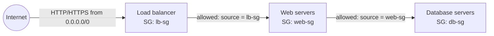
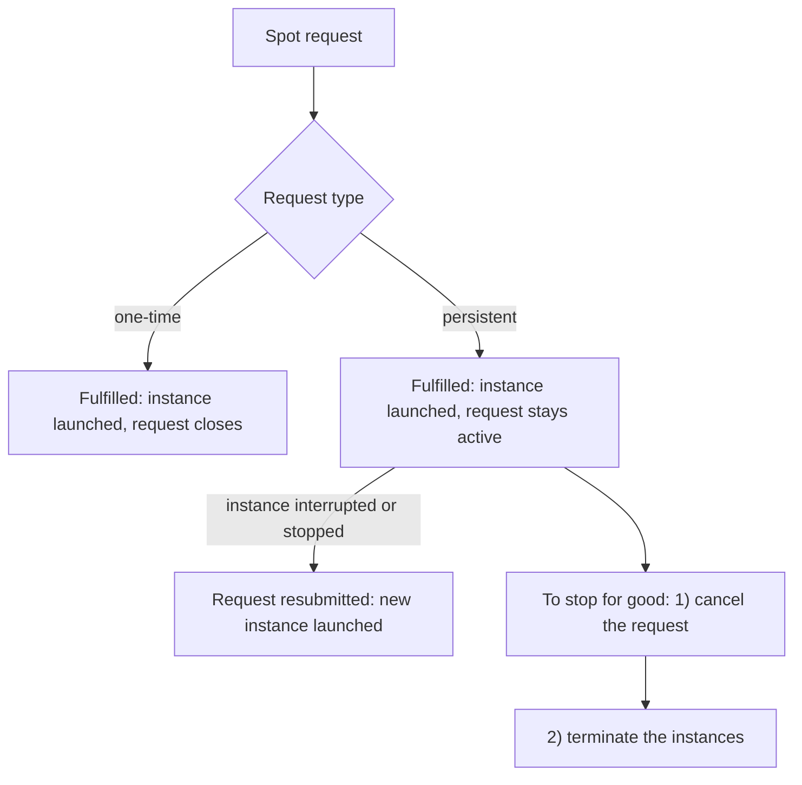

# 05 - EC2 Fundamentals

Related: [[EC2]] (Version C service note) · [[IAM]] · [[EBS]] · [[ELB]]

## Chapter summary
- **EC2 = Elastic Compute Cloud**, AWS's IaaS: rent virtual machines (instances), attach storage (EBS / instance store), distribute load (ELB), scale (ASG).
- Choosing an instance: OS (Linux / Windows / macOS), CPU, RAM, storage (network-attached EBS/EFS vs hardware-attached instance store), network card + public IP, firewall (security group), bootstrap script (**User Data**).
- **User Data** runs only once, at first boot, as root; more in it = slower boot.
- **Security groups** are allow-only, stateful-style firewalls outside the instance; default = all inbound blocked, all outbound allowed; can reference other security groups. **Timeout = security group; connection refused = application.**
- Ports to know: **22 SSH/SFTP, 21 FTP, 80 HTTP, 443 HTTPS, 3389 RDP**.
- Connect via SSH (Mac/Linux/Win10), PuTTY (older Windows) or browser-based **EC2 Instance Connect**; never put IAM access keys on an instance - **attach an IAM role**.
- **Purchasing options**: On-Demand, Reserved (Standard/Convertible), Savings Plans, Spot, Dedicated Hosts, Dedicated Instances, Capacity Reservations - match option to workload.
- **Spot**: up to 90% off, 2-minute interruption notice; cancel the Spot *request* before terminating instances; Spot Fleet allocation strategies (`lowestPrice`, `diversified`, `capacityOptimized`, `priceCapacityOptimized`).

---

## 01 - AWS Budget Setup
(src: 05/01-AWS Budget Setup)

- Set up a budget + alarm before doing any labs to avoid surprise bills.
- Billing console shows access denied for IAM users (even admins) until the **root user** activates *IAM user and role access to billing information* (Account settings). Can take a few refreshes to apply.
- Useful billing views: month-to-date and forecast cost, **Bills** (charges by service, per region), **Free Tier** page (current vs forecasted usage; forecast in red = you will be billed).
- Budgets (simplified templates):
  - **Zero spend budget** - email as soon as spend reaches $0.01.
  - **Monthly cost budget** (e.g. $10) - alerts at 85% actual, 100% actual, 100% forecasted.
- Example in the lecture: a bill showing NAT Gateway, EBS and Elastic IP costs under EC2 - check these when a bill surprises you.

### Hands-on steps
1. Root account -> Account -> enable IAM access to billing information.
2. Billing and Cost Management -> Budgets -> Create budget -> template: Zero spend; add email.
3. Create a second budget from the Monthly cost template ($10, alerts 85% / 100% / forecast 100%).

---

## 02 - EC2 Basics
(src: 05/02-EC2 Basics)

- EC2 is not one service but a set of building blocks: instances, EBS volumes, ELB, ASG.
- Configurable instance properties: OS (Linux most popular, Windows, macOS), CPU cores, RAM, storage (EBS/EFS network-attached, or EC2 Instance Store hardware-attached), network card speed and public IP type, **security group** rules, **EC2 User Data**.
- **Bootstrapping** = running commands when the machine starts. User Data:
  - runs **only once, at first start**;
  - runs as **root** (sudo rights);
  - typical use: install updates/software, download files;
  - the more it does, the longer boot takes.

> [!tip] Exam
> EC2 User Data = bootstrap script, runs once at first launch, as root.

---

## 03 - Create an EC2 Instance with User Data (Hands On)
(src: 05/03-Create an EC2 Instance with EC2 User Data to have a Website Hands On)

- Launch wizard parameters covered: Name/tags, AMI, instance type, key pair, network settings (security group), storage, advanced details (User Data).
- AMI used: **Amazon Linux 2**, 64-bit x86 (free tier eligible). Instance type **t2.micro** (free tier eligible; if unavailable in region, t3.micro). Free tier described as 750 hours/month for the first year plus 30 GB of EBS General Purpose SSD.
- Key pair: RSA; format **.pem** for Mac/Linux/Windows 10, **.ppk** for PuTTY (Windows 7/8).
- Default security group `launch-wizard-1` created with: SSH (22) from anywhere, plus HTTP (80) from anywhere (ticked for the web server).
- Root volume: 8 GB gp2; **Delete on termination = yes by default** (volume deleted when instance is terminated).
- User Data (pasted in Advanced details) updates packages, installs `httpd`, and writes an HTML "Hello World" page showing the private IP.
- Instance details: instance ID, **public IPv4** (used to reach it from the internet), **private IPv4** (internal AWS network), private DNS, AMI, key pair, security group, storage.
- Browse with **`http://<public-IP>`** - HTTPS is not configured, so `https://` hangs forever.
- Instance states: **Stop** (not billed for the instance; EBS volume kept), **Start**, **Terminate** (deleted).
- After stop -> start the **public IPv4 can change; the private IPv4 stays the same**.

> [!tip] Exam
> Public IP may change on stop/start; private IP does not. Terminate deletes the root volume by default.

[verify] The lecture states t2.micro is free tier eligible with 750 hours/month for the first 12 months.
> [!warning] Correction [note]
> For accounts created recently, AWS describes a Free account plan: US$100 sign-up credits (up to US$100 more from activities) and the plan ends after six months or when credits run out. Source: [Choosing a plan - AWS Billing](https://docs.aws.amazon.com/awsaccountbilling/latest/aboutv2/free-tier-plans.html). The exact eligible instance types were not confirmed.

[verify] The lecture uses **Amazon Linux 2** as the default AMI.
> [!warning] Correction [note]
> AWS states Amazon Linux 2 reached end of support on 30 June 2026 and recommends Amazon Linux 2023. Source: [Amazon Linux 2 FAQs](https://aws.amazon.com/amazon-linux-2/faqs/).

### Hands-on steps
1. EC2 console -> Instances -> Launch instances.
2. Name: `My First Instance`; AMI: Amazon Linux 2; type: t2.micro.
3. Create key pair `EC2 Tutorial` (RSA, .pem or .ppk).
4. Network settings: allow SSH from anywhere + allow HTTP from the internet.
5. Storage: leave 8 GB gp2.
6. Advanced details -> User Data: paste the course's `EC2 user data` script.
7. Launch -> View all instances -> wait for Running -> open `http://<public IPv4>`.
8. Test Instance state -> Stop / Start (note IP change); do not terminate.

---

## 04 - EC2 Instance Types Basics
(src: 05/04-EC2 Instance Types Basics)

- Families: **General purpose, Compute optimized, Memory optimized, Storage optimized, Accelerated computing, HPC optimized**.
- Naming: `m5.2xlarge` = **class** `m` + **generation** `5` + **size** `2xlarge`.

| Family | Good for | Name prefixes (examples) |
|---|---|---|
| General purpose | balanced compute/memory/network; web servers, code repos | T, M (course uses t2.micro) |
| Compute optimized | batch processing, media transcoding, high performance web servers, HPC, ML, dedicated gaming servers | C (C5, C6...) |
| Memory optimized | large in-memory datasets: relational/NoSQL DBs, distributed caches (ElastiCache), in-memory BI DBs, real-time big unstructured data | R (RAM), X1, High Memory, Z1 |
| Storage optimized | high-throughput local storage: OLTP, relational/NoSQL, Redis cache, data warehousing, distributed file systems | I, D, H1 |

- Comparison examples: t2.micro = 1 vCPU / 1 GB; r5.16xlarge = 16 vCPU / 512 GB; c5d.4xlarge = 16 vCPU / 32 GB.
- Tool mentioned: **ec2instances.info** (compare all instances, memory, vCPU, on-demand/reserved cost).
- The instructor says you do not need to memorize names, only the families and use cases.

> [!tip] Exam
> Map workload to family: CPU-heavy -> C, RAM-heavy -> R/X/Z, local disk IOPS-heavy -> I/D/H.

---

## 05 - Security Groups & Classic Ports Overview
(src: 05/05-Security Groups & Classic Ports Overview)

- Security groups control inbound and outbound traffic of EC2 instances; they contain **allow rules only**.
- Rules reference **IP ranges (IPv4/IPv6)** or **other security groups**. Rule fields: type, protocol, port, source. `0.0.0.0/0` = everything; a single-IP CIDR = one IP.
- **Defaults**: all inbound blocked; all outbound allowed.
- Facts:
  - one security group -> many instances, and one instance -> many security groups;
  - scoped to a **region/VPC combination** (new region or VPC = recreate);
  - lives **outside** the instance - blocked traffic never reaches the instance;
  - good practice: keep a **separate security group for SSH**.
- **Troubleshooting**: **timeout** -> security group issue; **connection refused** -> traffic got through, the application is erroring or not running.
- **Referencing security groups**: instances with SG-2 can reach an instance whose SG-1 allows SG-2 inbound, regardless of IP; SG-3 (not authorized) is denied. Common with load balancers.

> [!info] Diagram
> **Explanation:** Each tier has its own security group. The web servers' SG allows inbound HTTP/HTTPS only from the load balancer's SG; the database SG allows inbound DB traffic only from the web servers' SG. Instances are authorized by security group membership, not by IP address. (The lecture shows a simpler SG-1/SG-2/SG-3 version of the same idea.)
> **Reference:** [Security group rules - Security group referencing (Amazon VPC User Guide)](https://docs.aws.amazon.com/vpc/latest/userguide/security-group-rules.html)

**Ports to know for the exam**

| Port | Protocol | Use |
|---|---|---|
| 22 | SSH / SFTP | log into Linux instances; secure file transfer |
| 21 | FTP | file upload to a file share |
| 80 | HTTP | unsecured websites |
| 443 | HTTPS | secured websites |
| 3389 | RDP | log into Windows instances |

> [!tip] Exam
> Timeout = security group. Connection refused = app problem. 22 = Linux SSH, 3389 = Windows RDP.

---

## 06 - Security Groups Hands On
(src: 05/06-Security Groups Hands On)

- Console: EC2 -> Network & Security -> **Security Groups**. Two existed: `default` and `launch-wizard-1`. Each has an ID, inbound and outbound rules.
- Demo: removing the port 80 rule -> page load times out; re-adding HTTP (80) from anywhere IPv4 -> works again.
- Rule choices: type shortcut (e.g. HTTPS -> 443), custom port/range, source = CIDR, **My IP**, another security group, or prefix list. **My IP** breaks (timeout) if your IP changes.
- Outbound: allow all IPv4 to anywhere by default.
- An instance can have **many** security groups (rules add up); a security group can be attached to **many** instances.

> [!tip] Exam
> Any timeout when connecting (SSH, HTTP, anything) is a security group problem.

### Hands-on steps
1. EC2 -> Security Groups -> select `launch-wizard-1` -> Inbound rules -> Edit.
2. Delete the HTTP rule, save, refresh the web page (it hangs).
3. Add rule HTTP, source Anywhere-IPv4, save, refresh (works).

---

## 07 - SSH Overview
(src: 05/07-SSH Overview)

- SSH (secure shell) lets you control a Linux server remotely through the command line.

| Your OS | Tool |
|---|---|
| Mac / Linux | `ssh` in terminal |
| Windows 10+ | `ssh` in PowerShell / Command Prompt |
| Windows < 10 (works on all Windows) | **PuTTY** |
| Any OS | **EC2 Instance Connect** (browser-based) |

- The instructor says EC2 Instance Connect works only with Amazon Linux 2 (hence AMI choice). SSH is the most common source of student problems; one working method is enough, and the course will not need SSH much.

[verify] "EC2 Instance Connect only works with Amazon Linux 2."
> [!warning] Correction [note]
> AWS documents EC2 Instance Connect for Amazon Linux 2, Amazon Linux 2023 and Ubuntu (default usernames `ec2-user` / `ubuntu`). Source: [Connect using EC2 Instance Connect](https://docs.aws.amazon.com/AWSEC2/latest/UserGuide/ec2-instance-connect-methods.html).

---

## 08 - How to SSH using Linux or Mac
(src: 05/08-How to SSH using Linux or Mac)

- Architecture: your laptop -> internet -> **port 22** (security group must allow it) -> EC2 (public IP). The default user on Amazon Linux 2 is **`ec2-user`**.
- Common errors: `Too many authentication failures` (no key supplied); `unprotected key file` (permissions too open).

### Hands-on steps
1. Rename the key file without spaces (`EC2Tutorial.pem`) and put it in a folder (e.g. `aws-course`).
2. `cd` into that folder (`pwd`, `ls` to confirm).
3. Confirm the security group allows SSH (22) from `0.0.0.0/0` and copy the instance's **public IPv4**.
4. Fix permissions: `chmod 0400 EC2Tutorial.pem`.
5. Connect: `ssh -i EC2Tutorial.pem ec2-user@<public-IP>`; answer `yes` to the trust prompt.
6. Try `whoami`, `ping google.com` (Ctrl+C to stop).
7. Exit with `exit` or Ctrl+D. After stop/start, use the new public IP.

---

## 09 - How to SSH using Windows (PuTTY)
(src: 05/09-How to SSH using Windows)

- For Windows 7/8 (also works on Windows 10). PuTTY = free SSH client; PuTTYgen converts keys.

### Hands-on steps
1. Install PuTTY (64-bit installer).
2. Open **PuTTYgen** -> Load the `.pem` (show "All files") -> Save private key as `.ppk` (skip if you already downloaded `.ppk`).
3. Open PuTTY: Host Name = `ec2-user@<public IPv4>`, port 22, type SSH; save the session (e.g. `EC2 Instance`).
4. Connection -> SSH -> **Auth** -> browse to the `.ppk` file; go back to Session and save again.
5. Open -> accept the host key -> you are logged in as `ec2-user`.
6. Try `whoami`, `ping google.com`; close the window to exit. Reload the saved session next time.

---

## 10 - How to SSH using Windows 10
(src: 05/10-How to SSH using Windows 10)

- Windows 10 has an `ssh` command in PowerShell or Command Prompt (type `ssh` to check; otherwise use PuTTY).

### Hands-on steps
1. `cd` to the folder with the `.pem` (e.g. `cd .\Desktop`).
2. `ssh -i EC2Tutorial.pem ec2-user@<public IPv4>` -> answer `yes`.
3. If permissions are rejected: file Properties -> Security -> Advanced -> make yourself **owner**, **disable inheritance** and remove inherited permissions, then add yourself with **Full control** (remove SYSTEM/Administrators entries).
4. Exit with `exit` or Ctrl+D.

---

## 11 - SSH Troubleshooting
(src: 05/11-SSH Troubleshooting)

> No transcript available for this lecture (raw file contains only a placeholder). [screen action] likely a PDF/guide lecture.

---

## 12 - EC2 Instance Connect
(src: 05/12-EC2 Instance Connect)

- Browser-based SSH session: Instance -> **Connect** -> **EC2 Instance Connect**. Username defaults to `ec2-user` (guessed from the AMI).
- No SSH key to manage: AWS uploads a **temporary SSH key** at connect time.
- It still relies on **SSH, port 22** - if the SSH inbound rule is removed it fails.
- If it still fails, add SSH from anywhere for **IPv6** as well as IPv4 (depending on setup).

### Hands-on steps
1. Select instance -> Connect -> EC2 Instance Connect -> Connect (new tab opens).
2. Run `whoami`, `ping google.com`.
3. Test: remove SSH rule in the security group -> connect fails; re-add SSH from anywhere IPv4 (and IPv6) -> works.

---

## 13 - EC2 Instance Roles Demo
(src: 05/13-EC2 Instance Roles Demo)

- Amazon Linux AMI comes with the **AWS CLI** installed. `aws iam list-users` without credentials -> *unable to locate credentials*.
- **Never run `aws configure` / store Access Key ID + Secret Access Key on an EC2 instance** - anyone who can connect to the instance can read them.
- Correct approach: attach an **IAM role** (here `DemoRoleForEC2` with `IAMReadOnlyAccess`).
- Detaching the policy -> access denied; re-attaching -> works after a short propagation delay.

> [!tip] Exam
> EC2 gets AWS credentials via IAM roles (instance profile), never by storing access keys on the instance.

### Hands-on steps
1. Connect via EC2 Instance Connect (or SSH); run `aws iam list-users` (fails).
2. Instance -> Actions -> Security -> **Modify IAM role** -> choose `DemoRoleForEC2` -> Save.
3. Re-run `aws iam list-users` (works).
4. In IAM, detach the policy from the role -> command is denied; re-attach -> allowed again (may take a moment).

Related: [[IAM]]

---

## 14 - EC2 Instance Purchasing Options
(src: 05/14-EC2 Instance Purchasing Options)

Overview of options: On-Demand, Reserved (Standard/Convertible), Savings Plans, Spot, Dedicated Hosts, Dedicated Instances, Capacity Reservations.

- **On-Demand**: pay for what you use; Linux/Windows billed **per second after the first minute**, other OSes **per hour**; highest cost, no upfront or commitment; for short, uninterrupted, unpredictable workloads.
- **Reserved Instances (RI)**: up to **72%** off On-Demand; reserve instance type, region, tenancy, OS; term **1 or 3 years**; payment **no / partial / all upfront** (all upfront = biggest discount); scope **regional or zonal** (zonal reserves capacity in an AZ); for steady-state apps (e.g. a database); can be sold in the **RI Marketplace**.
  - **Convertible RI**: can change instance type, family, OS, scope, tenancy; up to **66%** off.
- **Savings Plans**: up to ~70% (similar to RI); commit to **$ per hour for 1 or 3 years**; usage beyond the commitment billed On-Demand. **EC2 Instance Savings Plan** locks to **instance family + region** (e.g. M5 in us-east-1) but is flexible on size, OS and tenancy (host/dedicated/default).
- **Spot**: up to **90%** off; can be lost at any time; best for fault-tolerant workloads (batch, data analysis, image processing, distributed workloads, flexible start/end); **not for critical jobs or databases**.
- **Dedicated Hosts**: a whole **physical server** with visibility of sockets/cores; for compliance or **BYOL** per-socket/per-core/per-VM licenses; On-Demand (per second) or reserved 1/3 years; most expensive.
- **Dedicated Instances**: instances on hardware dedicated to you; may share hardware with other instances **in the same account**; **no control over instance placement** (Hosts give you visibility of the lower-level hardware).
- **Capacity Reservations**: reserve On-Demand capacity in a **specific AZ** for any duration; no time commitment, **no billing discount**, charged On-Demand rate whether or not you run instances; combine with regional RIs / Savings Plans for discounts.

**Resort analogy**: On-Demand = walk in, pay full price. Reserved = commit to a long stay, discount. Savings Plan = commit to spend $X/month, free to change room type. Spot = last-minute empty rooms, can be kicked out. Dedicated Host = book the whole building. Capacity Reservation = book a room, pay whether or not you stay.

**Price example (m4.large, us-east-1, On-Demand ~$0.10)**: Spot up to ~61% off; RI/Savings Plan discounts depend on 1 vs 3 year and upfront; Dedicated Host priced at On-Demand (reservation up to ~70% off); Capacity Reservation at On-Demand.

| Option | Commitment | Discount | Best for |
|---|---|---|---|
| On-Demand | none | none | short, unpredictable, uninterrupted |
| Reserved | 1/3 yr | up to 72% (Convertible 66%) | steady-state, DBs |
| Savings Plan | $/hr, 1/3 yr | ~up to 70% | long workloads, flexibility |
| Spot | none | up to 90% | fault-tolerant, flexible time |
| Dedicated Host | on-demand or 1/3 yr | reservation up to ~70% | licenses, compliance |
| Dedicated Instance | - | - | hardware not shared with other customers |
| Capacity Reservation | none | none | guaranteed capacity in an AZ |

> [!tip] Exam
> Match the option to the workload: Spot for resilient batch jobs, never DBs; Dedicated Host for BYOL/compliance; Capacity Reservation guarantees capacity but gives no discount.

[verify] "Linux or Windows billed per second after the first minute, all other operating systems per hour."
> [!warning] Correction [note]
> AWS On-Demand documentation says you pay per second for running instances with a 60-second minimum, without the per-hour exception. Source: [Purchasing On-Demand Instances for Amazon EC2](https://docs.aws.amazon.com/AWSEC2/latest/UserGuide/ec2-on-demand-instances.html). Per-hour billing for some OSes is not mentioned on that page; check the pricing page for your OS.

---

## 15 - Spot Instances & Spot Fleet
(src: 05/15-Spot Instances & Spot Fleet)

- **Spot Instances**: up to 90% off. The instructor's model: set a **max spot price**; you keep the instance while the current spot price is below it; the spot price varies by AZ and over time. If the price goes above your max, you can **stop or terminate** the instance, with a **2-minute grace period** (shut down gracefully, save data).
- Use for batch jobs, data analysis, failure-resilient workloads; **not** critical jobs or databases.
- Pricing history graph (m4.large): price varies per AZ; On-Demand $0.10/h vs Spot ~$0.04/h (~60% saving). A very high max price means you are never reclaimed on price.

[verify] "If the spot price goes over your max price you lose the instance" and "set a max price".
> [!warning] Correction [note]
> AWS now recommends **No maximum price**: the instance launches at the current Spot price (never above On-Demand), and **you are always charged the current Spot price** regardless of your maximum. Setting a maximum makes interruptions **more** frequent. Capacity needs can also interrupt Spot Instances regardless of price. Sources: [Create a Spot Instance request](https://docs.aws.amazon.com/AWSEC2/latest/UserGuide/spot-requests.html), [Spot Instance interruptions](https://docs.aws.amazon.com/AWSEC2/latest/UserGuide/spot-interruptions.html).

### Spot request types and cancellation
- A Spot request defines instance count, max price, launch spec (AMI...), valid from/until, and **request type**:
  - **One-time**: instance launched when fulfilled, then the request goes away.
  - **Persistent**: keeps the desired count valid between valid-from and valid-until; if instances are interrupted/stopped, the request **launches replacements**.
- You can cancel a request only while it is **open, active or disabled** (not failed/cancelled/closed).
- **Cancelling a request does not terminate its instances** - terminating them is your responsibility.
- **Correct order to remove persistent Spot capacity: cancel the Spot request first, then terminate the instances** (otherwise the request relaunches them).

> [!info] Diagram
> **Explanation:** A one-time request ends once the instance is launched; a persistent request stays active and replaces interrupted instances. To end a persistent request, cancel it first and then terminate the instances, otherwise the request relaunches them. This is a simplified version of the lecture's lifecycle diagram (it omits the request states).
> **Reference:** [Create a Spot Instance request - request type: one-time vs persistent (Amazon EC2 User Guide)](https://docs.aws.amazon.com/AWSEC2/latest/UserGuide/spot-requests.html). The cancel-then-terminate order is from the lecture; not verified on this page.

### Spot Fleets
- A **Spot Fleet** = set of Spot Instances + optionally On-Demand instances, trying to meet **target capacity** within price constraints. Defined from multiple **launch pools** (instance type, OS, AZ); stops launching when budget or capacity is reached.
- **Allocation strategies**:
  - `lowestPrice` - cheapest pool; best for short workloads;
  - `diversified` - spread across all pools; good for availability and long workloads;
  - `capacityOptimized` - pool with the optimal capacity for the number of instances;
  - `priceCapacityOptimized` - pick the pools with the highest capacity available, then the lowest price among them; best choice for most workloads.
- Fleet vs single request: a single request fixes the instance type and AZ; a fleet picks from many.

> [!tip] Exam
> Cancel the Spot request, *then* terminate instances. Spot Fleet strategies: lowestPrice, diversified, capacityOptimized, priceCapacityOptimized (best for most workloads).

---

## 16 - EC2 Instances Launch Types Hands On
(src: 05/16-EC2 Instances Launch Types Hands On)

- **Spot Requests** page: view pricing history (e.g. c4.large, 3 months; ~69-70% savings), then "Request Spot Instances" (the Spot Fleet request screen).
  - Launch template or manual parameters; request details: max price, valid from/until, terminate on expiry, attach to load balancers/target groups.
  - **Target capacity** can be in instances, vCPUs or memory; maintain target capacity; on interruption terminate / stop / hibernate; capacity rebalancing.
  - Instance types: pick manually or by **attributes** (vCPU/memory min-max); fewer restrictions = more matching types = more savings. Allocation strategy: optimize for capacity or lowest price; "maintain a diverse pool" option.
  - Estimate shown: $0.156/h at target capacity, 73% savings vs On-Demand.
- **Single Spot instance from the launch wizard**: Advanced details -> Request Spot Instances; max price defaults to the On-Demand price; request type default **one-time** (terminates on interruption); **persistent** needs validity (until a date or no expiry) and interruption behavior **stop or hibernate**. The "block duration" option was removed (end of 2022).
- **Reserved Instances** page: search offerings (type, 12 or 13 month term, Standard/Convertible, all/partial/no upfront), add to cart (do not order - costs money). The instructor expects RIs to fade in favour of **Savings Plans**.
- **Savings Plans** page: commit $/hour for 1-3 years; flexible on instance type/AZ.
- **Dedicated Hosts**: Allocate Dedicated Host (name, instance family e.g. c5, AZ, settings); links to **License Manager**; costs a lot - do not allocate.
- **Capacity Reservations**: pick instance type/AZ/count (e.g. 4 x m5.2xlarge in eu-central-1) and end time (manual or specific); you pay whether or not you launch instances.

[verify] "Reserved instances will soon go away; Savings Plans recommended."
> [!warning] Correction [note]
> Not confirmed in the pages fetched. AWS's free-plan docs list Savings Plans and Reserved Instances as services not available on the Free account plan (Source: [Choosing a plan](https://docs.aws.amazon.com/awsaccountbilling/latest/aboutv2/free-tier-plans.html)); that is not a statement about RI retirement. Treat the retirement claim as unverified.

### Hands-on steps (all console tours; nothing to launch)
1. EC2 -> Spot Requests -> Pricing history; then Request Spot Instances to browse fleet parameters (do not submit).
2. EC2 -> Instances -> Launch instance -> Advanced details -> **Request Spot Instances** -> Customize to see max price / request type / interruption behavior.
3. Reserved Instances -> Purchase: search and add to cart only.
4. Savings Plans, Dedicated Hosts -> Allocate Dedicated Host, Capacity Reservations -> Create: inspect only.
5. Terminate/delete anything you created to avoid charges.

---

## Not covered in this chapter's lectures
- Lecture 11 (SSH Troubleshooting) has no transcript.
