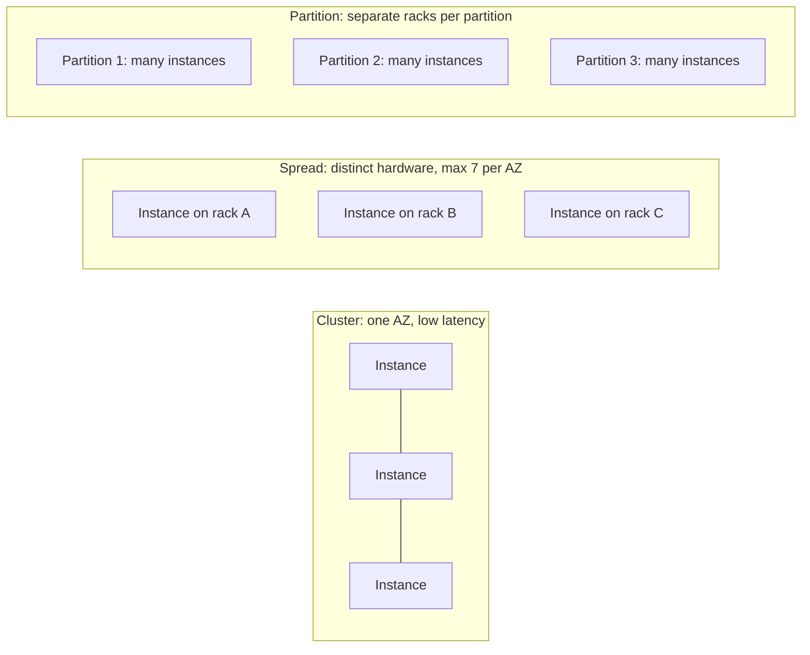
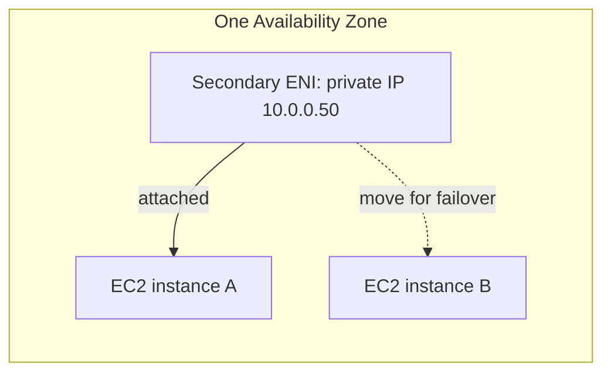

# 06 - EC2 Solutions Architect Associate Level

Related: [[EC2]] (Version C service note) · [[VPC]] · [[Route 53]] · [[ELB]] · [[EBS]] · [[05 - EC2 Fundamentals]]

## Chapter summary
- **Public IP** = reachable on the internet, unique worldwide; **private IP** = only inside a private network, unique only within that network. A stop/start **changes the public IPv4**, the private IPv4 stays.
- **Elastic IP** = a public IPv4 you own until released; attaches to one instance at a time; default **5 per account (per Region)**. The instructor calls it a poor architectural choice: prefer a random public IP + DNS name, or better a load balancer.
- All public IPv4 addresses (in use or not) are billed hourly (about $0.005/h, ~$3.50/month in the lecture): terminate instances and release Elastic IPs.
- **Placement groups**: **Cluster** (one AZ, low latency, ~10 Gbps, high risk), **Spread** (different hardware, max **7 instances per AZ per group**), **Partition** (up to **7 partitions per AZ**, hundreds of instances: Hadoop/Cassandra/Kafka), **Precision time** (accurate clock).
- **ENI** = virtual network card in a VPC, **bound to one AZ**; holds private IPv4s, Elastic IP/public IPv4, security groups, MAC address; can be moved between instances for **failover**.
- **EC2 Hibernate** saves RAM to the **encrypted root EBS volume**, so the OS resumes "as if never stopped" (faster boot, long-running processes kept). Root must be EBS + encrypted + big enough for RAM.

---

## 01 - Private vs Public vs Elastic IP
(src: 06/01-Private vs Public vs Elastic IP)

- IPv4 = four numbers 0-255 separated by dots (about **3.7 billion** public addresses, nearly exhausted). IPv6 = long hex string, more for IoT. The course uses IPv4 only; AWS supports IPv6.

| | Public IP | Private IP |
|---|---|---|
| Reachability | over the internet | only inside the private network |
| Uniqueness | unique across the whole web | unique only inside its network (two companies can reuse the same one) |
| Internet access | direct via public IP | through a NAT device / internet gateway acting as proxy |
| Range | any | only specified private ranges |

- By default an EC2 instance has a **private IP** (internal AWS network) and a **public IP** (internet). You **cannot SSH to the private IP** from outside unless you have a VPN.
- **Elastic IP**:
  - needed when you want a fixed public IP, because stop/start changes the public IP;
  - a public IPv4 you **own until you delete it**; attach to **one instance at a time**;
  - can mask an instance/software failure by quickly remapping it to another instance;
  - **only 5 Elastic IPs per account** (increase can be requested, but rarely needed).
- Instructor's recommendation: avoid Elastic IPs ("often a very poor architectural decision"). Use a random public IP with a **DNS name** (Route 53), or a **load balancer** and no public IP at all (best pattern).

> [!tip] Exam
> Fixed public IP needed -> Elastic IP, but the "better" answers are DNS name (Route 53) or a load balancer. Limit: 5 Elastic IPs per account.

---

## 02 - Private vs Public vs Elastic IP Hands On
(src: 06/02-Private vs Public vs Elastic IP Hands On)

- The instance's private IPv4 appears as its host name; SSH to the **private IP fails** from the internet (you are not on the AWS private network); SSH to the public IP works.
- **Stop then start** (not reboot) gives a **new public IPv4**; the old IP no longer works; the private IP is unchanged.
- **Elastic IP**: allocated from Amazon's IPv4 pool; associate it to an instance (or network interface) and its private IP. The instance's public IPv4 then equals the Elastic IP and **survives stop/start**.
- Pricing note: any public IPv4 (in use or not, Elastic or not) costs about **$0.005/hour (~$3.50/month)**; the instructor states a free tier of **750 hours/month** of public IPv4 for new accounts.
- After the demo: **disassociate** the Elastic IP, then **release** it, then terminate the instance (instance gets a new random public IPv4 after release).

[verify] "750 hours per month of free public IPv4 addresses" (free tier).
> [!warning] Correction [note]
> AWS documents that there is a charge for **all** Elastic IP addresses, in use or idle, and for all public IPv4 addresses (Source: [Elastic IP addresses - Amazon EC2 User Guide](https://docs.aws.amazon.com/AWSEC2/latest/UserGuide/elastic-ip-addresses-eip.html)). The exact free-tier allowance and the current hourly rate were not confirmed on the page fetched (it points to the VPC pricing page). Treat the 750 hours and $0.005 figures as unconfirmed.

### Hands-on steps
1. Try `ssh` to the private IPv4 (fails), then to the public IPv4 (works).
2. Stop and Start the instance (not Reboot); compare the old and new public IPv4.
3. EC2 -> Elastic IPs -> Allocate Elastic IP address -> Actions -> Associate (choose instance and private IP).
4. Check the instance now shows the Elastic IP as public IPv4; stop/start and confirm it does not change; SSH again.
5. Disassociate, then Release the Elastic IP; terminate the instance.

---

## 03 - EC2 Placement Groups
(src: 06/03-EC2 Placement Groups)

- Placement groups let you **influence how instances are placed on AWS hardware** relative to each other (no direct hardware access). Four strategies: **Cluster, Spread, Partition, Precision time**.

| Strategy | Layout | Pros | Cons / limits | Use cases |
|---|---|---|---|---|
| Cluster | same rack/AZ, low-latency hardware | ~**10 Gbps** between instances (enhanced networking), low latency, high throughput | single AZ: if it fails, all instances fail | big data jobs that must finish fast; very low latency / high throughput apps |
| Spread | each instance on different hardware, can span AZs | reduced simultaneous failure risk | **max 7 instances per AZ per group** | critical applications, isolate failures |
| Partition | instances in partitions = different racks, can span AZs in a Region | partition isolated from other partitions' failures; **up to 7 partitions per AZ**; **hundreds of instances**; partition info available via the **metadata service** | partitions are not isolated from failures *within* the partition | partition-aware big data: HDFS, HBase, Cassandra, Kafka |
| Precision time | hardware with direct access to high-precision time sources | clock synced with Amazon Time Sync Service, more accurate than standard NTP, PTP hardware clock, hardware packet timestamping | niche | distributed databases, financial timestamping, event ordering |

> [!info] Diagram
> **Explanation:** Cluster packs instances close together in one AZ for network performance; spread puts each instance on distinct hardware to limit correlated failures; partition groups many instances into partitions where each partition has its own racks, so a rack failure affects only one partition. Simplified comparison, not the AWS images.
> **Reference:** [Placement strategies for your placement groups (Amazon EC2 User Guide)](https://docs.aws.amazon.com/AWSEC2/latest/UserGuide/placement-strategies.html)

> [!tip] Exam
> Cluster = performance (single AZ). Spread = HA for critical apps (7 per AZ). Partition = large distributed, partition-aware (Kafka, Cassandra, Hadoop).

---

## 04 - EC2 Placement Groups - Hands On
(src: 06/04-EC2 Placement Groups - Hands On)

- Console: EC2 -> Network & Security -> **Placement Groups**.
- Spread level options: **rack** (default) or **host** (Outposts only).
- Partition group lets you choose the number of partitions (1 to 7).
- To use one: launch instance -> Advanced details -> **Placement group name**.

### Hands-on steps
1. Create `my-high-performance-group`, strategy **cluster**.
2. Create `my-critical-group`, strategy **spread**, spread level rack.
3. Create `my-distributed-group`, strategy **partition**, e.g. 4 partitions.
4. Launch instances -> Advanced details -> select the placement group (bottom of the page).

---

## 05 - Elastic Network Interfaces (ENI) - Overview
(src: 06/05-Elastic Network Interfaces (ENI) - Overview)

- ENI = **logical component in a VPC representing a virtual network card**; gives EC2 network access (also used outside EC2, later in the course).
- Attributes:
  - one **primary private IPv4** and one or more **secondary private IPv4**;
  - one **Elastic IP per private IPv4**, and/or one or more **public IPv4**;
  - one or more **security groups**;
  - a **MAC address**.
- Primary ENI = eth0; extra ENI = eth1, etc.
- ENIs can be created **independently** and attached/moved on the fly between instances for **failover** (moves the private IP).
- **Bound to a specific AZ.**

> [!info] Diagram
> **Explanation:** A secondary network interface carries a private IP with it. Detaching it from instance A and attaching it to instance B (same AZ) redirects traffic to B, a quick network failover. The IP shown is illustrative.
> **Reference:** [Elastic network interfaces (Amazon EC2 User Guide)](https://docs.aws.amazon.com/AWSEC2/latest/UserGuide/using-eni.html)

> [!tip] Exam
> ENI = virtual NIC, AZ-bound, movable between instances for failover; carries private IPs, Elastic IPs, security groups, MAC.

---

## 06 - Elastic Network Interfaces (ENI) - Hands On
(src: 06/06-Elastic Network Interfaces (ENI) - Hands On)

- Each instance launched gets one ENI (public IPv4, private IPv4, private DNS) shown under Networking and under Network & Security -> **Network Interfaces** (status `in-use`).
- A manually created ENI has status `available` until attached; it adds a **secondary private IPv4**.
- Moving it between instances = quick failover; may need **force detach**.
- On termination: ENIs created **with the instance are deleted automatically**; the **manually created ENI stays** (it costs nothing; delete it yourself).

### Hands-on steps
1. Launch two instances (Amazon Linux 2, t2.micro, existing security group).
2. Inspect Networking -> network interfaces on each; open Network Interfaces in the left menu.
3. Create network interface: description `demo ENI`, subnet in the same AZ as the instances, auto-assign private IPv4, pick a security group.
4. Actions -> Attach -> choose instance 1; verify two interfaces.
5. Detach (Force detach if needed) -> Attach to instance 2; verify the move.
6. Terminate both instances; observe only the manual ENI remains; delete it.

---

## 07 - ENI - Extra Reading
(src: 06/07-ENI - Extra Reading)

> No transcript available for this lecture ("[No transcript available for this lecture]").

---

## 08 - EC2 Hibernate
(src: 06/08-EC2 Hibernate)

- Normal **stop**: EBS data kept; **terminate**: root volume deleted if configured (other volumes kept unless set to delete). On start the OS boots, User Data runs, the app starts and caches warm up (slow).
- **Hibernate**: the **in-memory (RAM) state is preserved**. RAM is written to a file on the **root EBS volume**; the OS is frozen, not restarted. On start the RAM is reloaded, as if the instance never stopped.
- Use cases: long-running processes, saving RAM state, fast boot for services with slow initialization.
- Requirements and limits (instructor: "limits can change, not tested on limits"):
  - many instance families supported; **RAM size < 150 GB**;
  - **not for bare metal** instances;
  - Linux and Windows, among other OSes;
  - **root volume must be EBS, encrypted, and large enough to hold the RAM**;
  - available for **On-Demand, Reserved and Spot** instances;
  - hibernation **no more than 60 days**.

[verify] "Available for On-Demand, Reserved and Spot" and "RAM must be less than 150 GB" (for all OSes), "no more than 60 days".
> [!warning] Correction [note]
> AWS documents hibernation for **On-Demand and Spot Instances**, enabled **only at launch** (not on an existing instance); Linux RAM must be **< 150 GiB**, **Windows RAM <= 16 GiB**; root volume must be EBS (gp2/gp3/io1/io2) and encrypted; Spot requests must be **persistent**; bare metal not supported. Source: [Prerequisites for EC2 instance hibernation](https://docs.aws.amazon.com/AWSEC2/latest/UserGuide/hibernating-prerequisites.html). The 60-day maximum is not on that page: unconfirmed.

> [!tip] Exam
> Hibernate = RAM dumped to encrypted root EBS; fast resume, keeps in-memory state. Root volume must be EBS, encrypted, big enough for RAM.

---

## 09 - EC2 Hibernate - Hands On
(src: 06/09-EC2 Hibernate - Hands On)

- Launch wizard -> Advanced details -> **Stop - Hibernate behavior = Enable**. A warning says the root volume must have enough space for RAM and must be encrypted.
- Proof: `uptime` shows time since last OS restart. After Instance state -> **Hibernate instance** and a start, uptime **keeps counting** (not reset to 0), because the OS never really stopped.
- Demo sizing: t2.micro has 1 GB RAM; 8 GB root volume is enough.

[verify] The lecture uses Amazon Linux 2 and a t2.micro.
> [!warning] Correction [note]
> AWS states Amazon Linux 2 reached end of support on 30 June 2026 and recommends Amazon Linux 2023 (AL2023). Source: [Amazon Linux 2 FAQs](https://aws.amazon.com/amazon-linux-2/faqs/).

### Hands-on steps
1. Launch instance (Amazon Linux 2, t2.micro, existing security group `launch-wizard-1`).
2. Advanced details -> Stop-Hibernate behavior -> Enable.
3. Storage -> Advanced: **encrypt** the root EBS volume (default `aws/ebs` key); 8 GB is enough for 1 GB RAM.
4. Launch; connect with EC2 Instance Connect; run `uptime` (about 1 minute).
5. Disconnect; Instance state -> **Hibernate instance**; wait for `stopped`; Start.
6. Reconnect and run `uptime`: it continues from the earlier value (2 to 3 minutes) rather than 0.
7. Terminate the instance.

---

## Not covered in this chapter's lectures
- Lecture 07 (ENI - Extra Reading) has no transcript.
