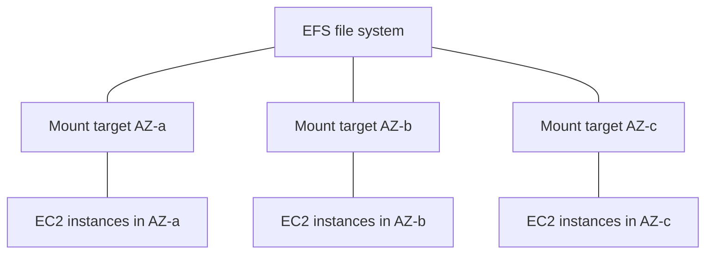

# 07 - EC2 Instance Storage

Related: [[EBS]] · [[EFS]] · [[EC2]] (AMI and Instance Store) · [[KMS, CloudHSM & ACM]] · [[06 - EC2 Solutions Architect Associate Level]]

## Chapter summary
- **EBS** = network drive, one AZ, persistent after termination; billed on **provisioned** size/IOPS; mounted on one instance at a time (except **io1/io2 Multi-Attach**, up to **16 instances**, same AZ).
- **Delete on termination**: ticked by default for the **root volume**, not for extra volumes. Disable it to keep the root volume (exam scenario).
- **Snapshots** back up a volume, copy across AZ/Region (this is how you move a volume to another AZ); features: **Archive tier (up to 75% cheaper, 24-72 h restore)**, **Recycle Bin (1 day to 1 year)**, **Fast Snapshot Restore (costly)**.
- **AMI** = pre-packaged instance (OS, software); region-specific, copyable across regions; faster boot; sources: public, own, Marketplace.
- **Instance Store** = physical disk on the host: very high IOPS, **ephemeral** (lost on stop/terminate/hardware failure).
- **Volume types**: gp2/gp3 (general SSD), io1/io2 Block Express (provisioned IOPS SSD), st1 (throughput HDD), sc1 (cold HDD). Only gp2/gp3/io1/io2 can be boot volumes.
- **Encryption**: KMS, AES-256, minimal latency impact; unencrypted volume -> snapshot -> encrypted copy -> new encrypted volume.
- **EFS** = managed NFS, multi-AZ, Linux only, pay per use, ~3x gp2 price; **EBS = one AZ; EFS = many instances across AZs**.

---

## 01 - EBS Overview
(src: 07/01-EBS Overview)

- **EBS (Elastic Block Store)** = a **network drive** attachable to running instances; data persists after the instance is terminated (re-attach to a new instance). Think "network USB stick".
- At the CCP/this level, a volume mounts to **one instance at a time**; one instance can have **many** volumes. Volumes can exist **unattached** and be attached on demand.
- **Bound to an AZ**: a volume in us-east-1a cannot attach to an instance in us-east-1b (use a snapshot to move it).
- Uses the network, so there may be a bit of latency; can be detached/attached quickly -> handy for failover.
- **Provisioned capacity**: choose GB and IOPS in advance, billed for what you provision; can increase over time.
- **Delete on termination** attribute (shown when launching an instance):
  - **root volume: enabled by default** (deleted with the instance);
  - **additional EBS volumes: disabled by default** (kept);
  - disable it on the root volume to preserve data after termination.

> [!tip] Exam
> Root volume deleted on terminate by default, other attached volumes kept. EBS = AZ-locked network drive.

---

## 02 - EBS Hands On
(src: 07/02-EBS Hands On)

- Instance -> Storage tab shows the root device and block devices (8 GB). The volume appears in EC2 -> **Volumes**.
- A new volume must be in the **same AZ** as the instance (shown under Networking). A volume in another AZ cannot be attached.
- Using the new block device in the OS needs formatting/mounting (out of scope).
- The block device table shows **Delete on termination: yes** for root, **no** for the second volume; after terminating the instance the root volume disappears and the extra volume remains.

### Hands-on steps
1. Instance -> Storage: view the 8 GB root volume; click it to open Volumes.
2. Create volume: gp2, 2 GB, same AZ as the instance (e.g. eu-west-1b).
3. Actions -> Attach volume -> select the instance; refresh Storage tab (two block devices).
4. Create a second 2 GB gp2 volume in a different AZ: the instance is not offered for attach.
5. Delete that volume; scroll the block devices table to the right to see Delete on termination (yes / no).
6. Terminate the instance; observe the root volume deleted and the 2 GB volume left over.

---

## 03 - EBS Snapshots
(src: 07/03-EBS Snapshots)

- **Snapshot** = backup of an EBS volume at a point in time. Detaching the volume is not required but **recommended**.
- Can be **copied across AZs and Regions**; restoring a snapshot in another AZ is how you move a volume between AZs.

| Feature | What it does |
|---|---|
| **Snapshot Archive** | move to an archive tier, **up to 75% cheaper**; restore takes **24 to 72 hours** |
| **Recycle Bin** | deleted snapshots go to the bin instead of being gone; recover after accidental deletion; retention **1 day to 1 year** |
| **Fast Snapshot Restore (FSR)** | forces full initialization so there is **no latency on first use**; useful for big snapshots; **costs a lot** |

> [!tip] Exam
> Move an EBS volume across AZ/Region = snapshot + restore/copy. Recycle Bin = accidental deletion; Archive = cheaper but slow restore; FSR = fast but expensive.

[verify] "Archive restore takes 24 to 72 hours" and "Recycle Bin retention 1 day to 1 year".
> [!warning] Correction [note]
> AWS confirms the archive tier gives **up to 75% lower storage cost** for snapshots kept **90 days or longer** and rarely accessed (archiving converts an incremental snapshot to a full one). Source: [Archive Amazon EBS snapshots](https://docs.aws.amazon.com/ebs/latest/userguide/snapshot-archive.html). The 24-72 hour restore time was not stated on the pages fetched; unconfirmed. Recycle Bin also covers volumes and EBS-backed AMIs (Source: [Recycle Bin](https://docs.aws.amazon.com/ebs/latest/userguide/recycle-bin.html)); the 1 day to 1 year range was not on that page, unconfirmed.

---

## 04 - EBS Snapshots - Hands On
(src: 07/04-EBS Snapshots - Hands On)

- Snapshots page lists snapshots; **Copy snapshot** to another Region (useful for **disaster recovery**).
- **Create volume from snapshot**: pick size/type, target AZ can differ (e.g. eu-west-1b), optionally encrypt and tag.
- **Recycle Bin**: a retention rule can protect **EBS snapshots and AMIs**; options here: apply to all resources, retain **1 day**, rule lock **unlocked** (so you can delete the rule).
- Snapshot **storage tier** Standard -> Archive via "Archive snapshot" (restore 24-72 h).
- After deleting a snapshot it appears in Recycle Bin -> **Recover** returns it to Snapshots.

### Hands-on steps
1. Volume -> Actions -> Create snapshot (description `DemoSnapshots`).
2. Snapshots menu: check status Completed; Copy snapshot (do not run) to see destination Regions.
3. Actions -> Create volume from snapshot, choose a different AZ.
4. Recycle Bin -> Create retention rule `DemoRetentionRule`: EBS Snapshots, all resources, 1 day, unlocked.
5. Look at the snapshot's Storage tier (Archive option only to show it); delete the snapshot.
6. Recycle Bin -> Resources -> select the snapshot -> Recover.

---

## 05 - AMI Overview
(src: 07/05-AMI Overview)

- **AMI = Amazon Machine Image**, a customization of an EC2 instance: OS, software configuration, monitoring tools. Pre-packaged software gives **faster boot and configuration time**.
- Built **for a region**; can be **copied across regions**.
- Sources: **public AMI** (AWS-provided, e.g. Amazon Linux 2), **your own AMI** (build and maintain yourself, can be automated), **AWS Marketplace AMI** (made, and possibly sold, by others; you can also sell AMIs).
- Process: launch instance in AZ A -> customize -> **stop** (data integrity) -> create AMI (**EBS snapshots created behind the scenes**) -> launch instances from it, also in another AZ.

[verify] Amazon Linux 2 used as the standard public AMI.
> [!warning] Correction [note]
> AWS states Amazon Linux 2 reached end of support on 30 June 2026 and recommends Amazon Linux 2023. Source: [Amazon Linux 2 FAQs](https://aws.amazon.com/amazon-linux-2/faqs/).

---

## 06 - AMI Hands On
(src: 07/06-AMI Hands On)

- First instance: User Data installs `httpd` (first lines) and, in the last line, creates the index file; for the AMI demo the **last (index) lines are left out** so only Apache is installed.
- "Running" does not mean the User Data script has finished: wait 1-2 minutes (early browsing gives connection refused).
- Create AMI: Actions -> **Image and templates -> Create image** (`demo image`); status `pending` then `available` under AMIs.
- Launch from AMI: **My AMIs -> Owned by me**. The new instance's User Data only writes the index file (no `httpd` install), so it **boots much faster**.
- Real-world: AMI can include security software and prerequisites that take minutes to install.

### Hands-on steps
1. Launch Amazon Linux 2, t2.micro, existing security group; User Data = install script minus the final index line; launch.
2. Wait ~2 minutes; open `http://<public IPv4>` to see the Apache test page.
3. Instance -> Actions -> Image and templates -> Create image (`demo image`); wait until available under AMIs.
4. Launch instance from AMI (My AMIs -> Owned by me); User Data = only the line writing the "Hello World" index.
5. Open its public IP: Hello World appears quickly.
6. Terminate both instances.

---

## 07 - EC2 Instance Store
(src: 07/07-EC2 Instance Store)

- EBS is network-attached with limited performance. **Instance Store** = disk physically attached to the host server: **better I/O and throughput**.
- **Ephemeral**: data is **lost if the instance is stopped or terminated**, and if the underlying hardware fails. Not for durable storage.
- Good for **buffer, cache, scratch data, temporary content**. Long-term data belongs on EBS.
- You are responsible for **backup and replication**.
- Illustration (no need to memorize): I3 instances reach about **3.3 million random read IOPS and 1.4 million write IOPS**, vs **32,000 IOPS** for a gp2 EBS volume.

| | EBS | Instance Store |
|---|---|---|
| Attachment | network | physical host |
| Persistence | survives instance stop/terminate (per settings) | lost on stop/terminate/host failure |
| Performance | good | very high IOPS |
| Use | durable data | cache, buffer, scratch |

> [!tip] Exam
> "Very high performance hardware-attached volume" = **EC2 Instance Store**. Ephemeral: not for long-term data.

---

## 08 - EBS Volume Types
(src: 07/08-EBS Volume Types)

- Six types in four groups. Define a volume by **size, throughput, IOPS**. Only **gp2, gp3, io1, io2 can be boot volumes**.

| Type | Class | Key numbers | Use cases |
|---|---|---|---|
| **gp3** | General Purpose SSD | baseline **3,000 IOPS** and **125 MB/s**; up to **80,000 IOPS** and **2,000 MB/s**, IOPS and throughput set **independently** of size | boot volumes, virtual desktops, dev/test, medium DBs, transactional |
| **gp2** | General Purpose SSD | small volumes burst to 3,000 IOPS; **IOPS tied to size: 3 IOPS per GB**, max **16,000 IOPS** (reached at ~5,300 GB) | same as gp3 |
| **io1** | Provisioned IOPS SSD | max **64,000 IOPS on Nitro**, **32,000** on others; IOPS:size ratio about **50:1**, independent from size | critical business apps, sustained IOPS, DB workloads |
| **io2 Block Express** | Provisioned IOPS SSD | sub-millisecond latency, **256,000 IOPS**, **1,000 IOPS per GB** max ratio; supports **Multi-Attach** | >80,000 IOPS, mission-critical, low-latency |
| **st1** | Throughput Optimized HDD | up to 16 TB, max **500 MB/s**, **500 IOPS**; cannot be boot | big data, data warehousing, log processing |
| **sc1** | Cold HDD | up to 16 TB, max **250 MB/s**, **250 IOPS**; cannot be boot | archive, infrequent access, lowest cost |

- Exam-level summary: GP SSD vs Provisioned IOPS SSD (databases) vs st1/sc1 (high throughput / lowest cost). To exceed **32,000 IOPS** you need **EC2 Nitro with io1 or io2**. The instructor says exact numbers need not be memorized.

[verify] Numbers (gp3 80,000 IOPS / 2,000 MB/s; io1 64,000; io2 BE 256,000; st1 500; sc1 250; 16 TB sizes).
> [!warning] Correction [note]
> Confirmed by AWS: gp3 80,000 IOPS / 2,000 MiB/s; gp2 16,000 IOPS; io1 64,000 IOPS; io2 Block Express 256,000 IOPS (up to 4,000 MiB/s); st1 500 IOPS / 500 MiB/s; sc1 250 / 250; st1/sc1 not bootable. Updated sizes: gp3 and io2 Block Express up to **64 TiB**; gp2 and io1 up to 16 TiB; st1/sc1 125 GiB-16 TiB. Source: [Amazon EBS volume types](https://docs.aws.amazon.com/ebs/latest/userguide/ebs-volume-types.html).

> [!tip] Exam
> Database / sustained IOPS -> io1/io2. General boot/dev -> gp2/gp3. Big data throughput -> st1. Cheapest cold -> sc1. >32,000 IOPS needs Nitro + io1/io2.

---

## 09 - EBS Multi-Attach
(src: 07/09-EBS Multi-Attach)

- Attach the **same EBS volume to multiple EC2 instances in the same AZ**; each has full read/write.
- **Only io1 / io2** volumes.
- Up to **16 EC2 instances** per volume (know this number).
- Use cases: higher availability for **clustered Linux applications** (e.g. Teradata), or applications that manage **concurrent write operations**.
- Requires a **cluster-aware file system** (not XFS or EXT4).
- Cannot cross AZs.

[verify] "Up to 16 EC2 instances" (instructor does not mention Nitro).
> [!warning] Correction [note]
> AWS: up to 16 **Nitro-based** instances in the same AZ; Linux supports io1 and io2, Windows supports io2 only; cannot be a boot volume or enabled at instance launch. Source: [Attach an EBS volume to multiple instances using Multi-Attach](https://docs.aws.amazon.com/ebs/latest/userguide/ebs-volumes-multi.html).

> [!tip] Exam
> Multi-Attach = io1/io2, same AZ, max 16 instances, cluster-aware file system.

---

## 10 - EBS Encryption
(src: 07/10-EBS Encryption)

- An encrypted volume gives: data at rest encrypted, **data in flight between instance and volume encrypted**, **snapshots encrypted**, **volumes created from those snapshots encrypted**. Handled transparently by EC2/EBS.
- **Minimal latency impact**; uses **KMS keys (AES-256)**. Use it.
- **Encrypt an unencrypted volume**: create snapshot -> **copy the snapshot with encryption enabled** (choose KMS key) -> create volume from the encrypted snapshot (encrypted) -> attach to the original instance.
- A snapshot of an unencrypted volume is unencrypted. **Shortcut**: when creating a volume from an unencrypted snapshot you can enable encryption on the fly and pick a key.

> [!tip] Exam
> Encrypting an existing unencrypted EBS volume: snapshot -> encrypted copy -> new volume. Related: [[KMS, CloudHSM & ACM]].

> [!info] Source check
> AWS confirms you cannot directly encrypt an existing volume or snapshot; use snapshot then encrypted copy / new encrypted volume (Source: [Amazon EBS encryption](https://docs.aws.amazon.com/ebs/latest/userguide/ebs-encryption.html)).

### Hands-on steps
1. Create a 1 GB volume with encryption **unchecked**; note "Not encrypted".
2. Create a snapshot from it (not encrypted).
3. Snapshots -> Actions -> Copy snapshot -> enable **Encryption**, choose KMS key.
4. From the encrypted snapshot: Actions -> Create volume from snapshot (encryption shows enabled; volume lists as encrypted).
5. Shortcut: Create volume from the **unencrypted** snapshot and enable encryption/select key in the dialog.
6. Delete the snapshots (type "delete") and the volumes.

---

## 11 - Amazon EFS
(src: 07/11-Amazon EFS)

- **EFS = Elastic File System**: managed **NFS** (network file system) mountable on **many EC2 instances across AZs**. Highly available, scalable, **expensive (about 3x gp2)**, **pay per use** (no capacity planning).
- Access control via a **security group**; uses **NFS** protocol; **Linux only (POSIX)**, not Windows; encryption at rest with **KMS**.
- Use cases: content management, web serving, data sharing, WordPress.
- Scale: thousands of concurrent NFS clients, **10 GB/s+** throughput, grows to **petabyte** scale automatically.

> [!info] Diagram
> **Explanation:** A Regional EFS file system exposes one mount target per AZ in the VPC (NFS endpoint). EC2 instances in each AZ mount the same file system through the mount target in their own AZ and share the same data. The lecture shows this as instances in several AZs connected to one file system, protected by a security group.
> **Reference:** [How Amazon EFS works (Amazon EFS User Guide)](https://docs.aws.amazon.com/efs/latest/ug/how-it-works.html)

**Performance mode** (set at creation)
- **General Purpose** (default): latency-sensitive (web server, CMS).
- **Max I/O**: higher latency, higher throughput, highly parallel (big data, media processing).

**Throughput mode**
- **Bursting**: scales with storage size, e.g. 1 TB = 50 MB/s plus bursts up to 100 MB/s.
- **Provisioned**: set throughput independent of size (e.g. 1 GB/s for 1 TB of storage).
- **Elastic**: auto-scales with workload, up to **3 GB/s read and 1 GB/s write**; best for unpredictable workloads.

**Storage classes / tiers** (lifecycle policy moves files after N days, e.g. 60 days without access)
- **Standard** (frequently accessed), **EFS-IA** (lower storage price, retrieval cost), **Archive** (rarely accessed, few times a year, cheapest).

**Availability**: **Multi-AZ (Regional)** for production; **One Zone** (single AZ, backups on, supports One Zone-IA) for dev/test. Right classes give **up to 90% cost savings**.

[verify] "Max I/O" as a current option, and "Elastic up to 3 GB/s read and 1 GB/s write".
> [!warning] Correction [note]
> AWS now calls Max I/O a **previous generation** mode, not supported for One Zone or Elastic throughput, and recommends **General Purpose** for all file systems. Elastic limits are higher: for Regional file systems **20-60 GiBps read and 1-5 GiBps write** per file system (region dependent). Bursting baseline is 50 KiB/s per GiB stored, burst up to 100 MiB/s per TiB, consistent with the lecture. Source: [Amazon EFS performance specifications](https://docs.aws.amazon.com/efs/latest/ug/performance.html).

> [!tip] Exam
> EFS = shared, multi-AZ, Linux-only NFS; use lifecycle policies (IA/Archive) to cut cost; Elastic throughput for unpredictable workloads.

---

## 12 - Amazon EFS - Hands On
(src: 07/12-Amazon EFS - Hands On)

- Create file system: **Customize** shows the options.
  - **Regional** (multi-AZ, high availability/durability, use in production) vs **One Zone** (cheaper; dev only, unavailable if the AZ fails).
  - **Automatic backups** enabled (recommended).
  - **Lifecycle management**: e.g. 30 days -> Infrequent Access, 90 days -> Archive, on first access -> back to Standard.
  - **Encryption** enabled.
  - **Throughput modes** (console groups Elastic and Provisioned under "Enhanced"): **Elastic** (recommended; scales 0 to 100s MB/s, pay for use), **Provisioned** (e.g. 100 MB/s, pay in advance), **Bursting** (scales with storage). Performance mode: General Purpose or Max I/O; with Elastic, only General Purpose. Recommended: Enhanced + General Purpose + Elastic.
- Network: choose VPC, **mount targets** (one per AZ/subnet for Regional), and a **security group** per mount target.
- EC2 console can now add the file system directly (Advanced -> File systems -> Add shared file system, mount point `/mnt/efs/fs1`): it **auto-creates and attaches security groups and writes User Data to mount**. The auto-created rule allows **NFS on port 2049** with the instance's security group as source.
- Result: file written in instance A (AZ a) is visible in instance B (AZ b). You only pay for stored data (6 KB at creation).

### Hands-on steps
1. EFS -> Create file system -> Customize: Regional, backups on, lifecycle (30 d IA / 90 d Archive / on first access to Standard), encryption on, Elastic throughput, General Purpose.
2. Network: default VPC; mount target per AZ with the default subnets; security group = new `EFS Demo SG` (created beforehand in EC2 with no inbound rules). Skip file system policy; Create.
3. Launch `Instance A` (Amazon Linux 2, t2.micro, no key pair, EC2 Instance Connect) in subnet eu-west-1a; Advanced -> File systems -> Add shared file system (EFS, mount `/mnt/efs/fs1`).
4. Launch `Instance B` the same way in eu-west-1b with the same file system.
5. In EFS -> Network, see the auto-created `efs-sg-1` / `efs-sg-2`; in EC2 -> Security groups, see inbound NFS 2049.
6. Connect to both with EC2 Instance Connect; `ls /mnt/efs/fs1/`.
7. On A: `sudo su`, `echo "hello world" > /mnt/efs/fs1/hello.txt`; on B: `ls` and `cat hello.txt`.
8. Clean up: terminate instances, delete the file system (type its ID), delete extra security groups.

[verify] Amazon Linux 2 and t2.micro used for the demo.
> [!warning] Correction [note]
> AWS states Amazon Linux 2 reached end of support on 30 June 2026 and recommends Amazon Linux 2023. Source: [Amazon Linux 2 FAQs](https://aws.amazon.com/amazon-linux-2/faqs/).

---

## 13 - EFS vs EBS
(src: 07/13-EFS vs EBS)

| | EBS | EFS |
|---|---|---|
| Attach | **one instance at a time** (exception: io1/io2 Multi-Attach) | **hundreds of instances** across AZs via mount targets |
| Scope | **locked to an AZ** | multi-AZ file system |
| OS | any | **Linux only** (POSIX) |
| IOPS | gp2: grows with size; gp3 / io1: set independently | - |
| Move across AZ | **snapshot -> restore in other AZ** | not needed |
| Backups | use I/O: avoid running during heavy traffic | - |
| Root volume | **terminated by default** with the instance (can disable) | - |
| Price | lower | **higher**, but storage tiers cut cost |
| Example | boot / DB disks | WordPress, shared content |

- **Instance Store** is physically attached: if you lose the instance you lose the storage.

> [!tip] Exam
> Shared storage for many instances across AZs on Linux = EFS; single-AZ block volume = EBS; ultra-fast ephemeral = Instance Store.

---

## 14 - EBS & EFS - Section Cleanup
(src: 07/14-EBS & EFS - Section Cleanup)

- Clean up to avoid charges: delete the **EFS file system** (type ID), **terminate instances**, delete **available volumes**, delete all **snapshots**, then delete extra **security groups** (keep `default`); security groups can only be deleted after the instances using them are gone (retry).

### Hands-on steps
1. EFS -> file system -> Delete (paste ID).
2. Terminate running instances.
3. Delete all available EBS volumes.
4. Delete all snapshots.
5. Delete extra security groups (not `default`); wait for instances to terminate before the last one.

---

## Not covered in this chapter's lectures
- All 14 lectures have transcripts; none missing.
