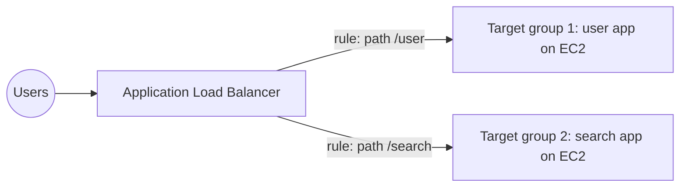
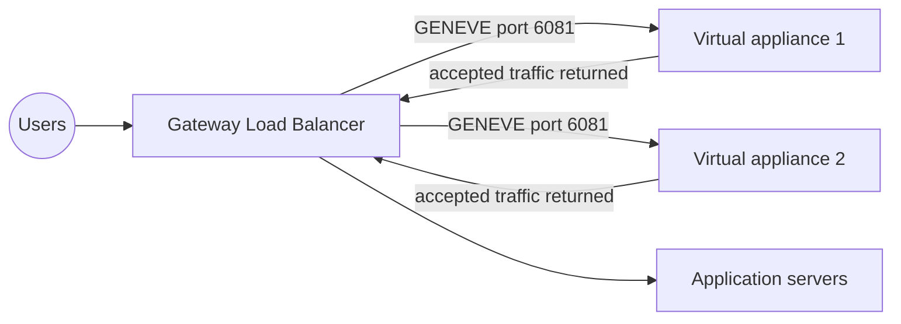
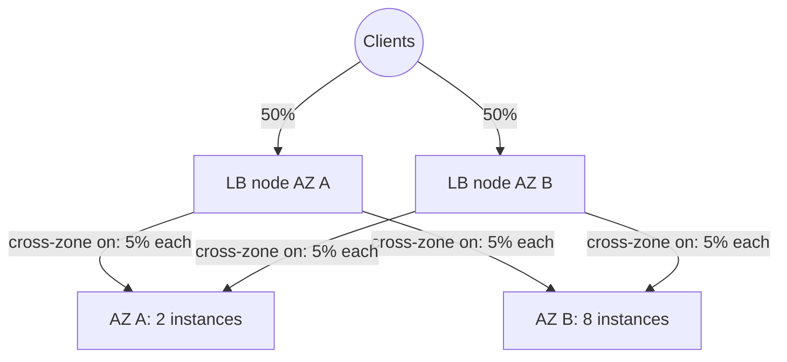
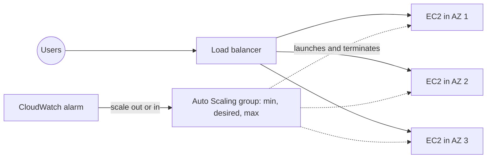

# 08 - High Availability and Scalability - ELB & ASG

Related: [[ELB]] · [[ASG]] (Version C service notes) · [[EC2]] · [[CloudWatch]] · [[KMS, CloudHSM & ACM]] · [[Route 53]] · [[VPC]]

## Chapter summary
- **Vertical scaling** = bigger instance (scale up/down; common for non-distributed systems such as RDS/ElastiCache). **Horizontal scaling** = more instances (scale out/in; elasticity). **High availability** = same app in **at least 2 AZs** to survive a data center loss.
- **ELB** is a managed load balancer: single endpoint, health checks, SSL termination, stickiness, multi-AZ, public/private separation. Four types: **CLB** (2009, v1, deprecated), **ALB** (2016, L7), **NLB** (2017, L4), **GWLB** (2020, L3).
- **ALB**: HTTP/HTTPS/WebSocket, routes by path, host, query string, headers to **target groups** (EC2, ECS tasks, Lambda, private IPs); client IP arrives in `X-Forwarded-For`.
- **NLB**: TCP/UDP/TLS, millions of requests/second, ultra low latency, **one static IP per AZ** (Elastic IP possible). **GWLB**: transparent gateway + load balancer for third-party appliances, **GENEVE on port 6081**.
- **Sticky sessions** (cookies, application-based or duration-based), **cross-zone load balancing** (ALB on by default, NLB/GWLB off and paid), **SNI** for multiple certificates (ALB/NLB only), **connection draining / deregistration delay** (default 300 s, 0-3600 s).
- **ASG**: min / desired / max capacity, built from a **launch template**, spans multiple AZs, replaces unhealthy instances, integrates with ELB target groups; the ASG itself is free, you pay for the resources.
- **Scaling policies**: target tracking, simple/step (CloudWatch alarms), scheduled, predictive; default **cooldown 300 s**; use a pre-baked AMI to scale faster.

---

## 01 - High Availability and Scalability
(src: 08/01-High Availability and Scalability)

- **Scalability** = the system handles a greater load by adapting. Two kinds: vertical and horizontal (elasticity). Scalability is related to, but different from, high availability. Call-center analogy used throughout.
- **Vertical scalability**: increase instance size (junior operator -> senior operator). EC2 example: t2.micro -> t2.large. Typical for **non-distributed systems such as databases** (RDS, ElastiCache scale by changing instance type). Limited by hardware.
- **Horizontal scalability**: increase the number of instances (more operators). Implies a distributed system; common for web/modern apps; easy on cloud (EC2). Not every application can be distributed.
- **High availability** (usually together with horizontal scaling, not always): run in **at least 2 data centers / AZs** to survive loss of one. Can be **passive** (RDS Multi-AZ) or **active** (horizontal scaling across AZs).

| Term | EC2 / AWS meaning |
|---|---|
| Vertical scaling | change instance size; smallest in the lecture t2.nano (0.5 GB RAM, 1 vCPU), biggest u-12tb1.metal (12.3 TB RAM, 450 vCPUs) |
| Horizontal scaling | **scale out** (add instances) / **scale in** (remove instances) - ASG, load balancers |
| High availability | same app across multiple AZs - ASG multi-AZ, load balancer multi-AZ |

> [!tip] Exam
> Exam questions use these terms to trick you: scale up/down = vertical, scale out/in = horizontal, multi-AZ = high availability.

---

## 02 - Elastic Load Balancing (ELB) Overview
(src: 08/02-Elastic Load Balancing (ELB) Overview)

- A load balancer forwards traffic to multiple downstream EC2 instances/servers; users only see one endpoint.
- Why: single point of access, seamless handling of downstream failures (health checks), **SSL termination (HTTPS)**, **stickiness with cookies**, high availability across zones, separate public from private traffic.
- ELB is **managed**: AWS handles upgrades, maintenance, high availability; you get a few configuration knobs. Cheaper and far easier than running your own. Integrates with EC2, ASG, ECS, ACM, CloudWatch, Route 53, WAF, Global Accelerator.
- **Health checks**: defined by protocol, port and route (example HTTP, port 4567, `/health`). A non-OK response (usually HTTP **200** expected) marks the instance **unhealthy** and traffic is not sent to it.

| Type | Year | Generation | Protocols |
|---|---|---|---|
| Classic (CLB) | 2009 | v1, old | HTTP, HTTPS, TCP, SSL (secure TCP); shown as deprecated in the console |
| Application (ALB) | 2016 | v2 | HTTP, HTTPS, WebSocket |
| Network (NLB) | 2017 | v2 | TCP, TLS (secure TCP), UDP |
| Gateway (GWLB) | 2020 | v2 | Layer 3, IP protocol |

- Load balancers can be **internal (private)** or **external (public)**.
- **Security group pattern**: load balancer SG allows HTTP/HTTPS (80/443) from `0.0.0.0/0`; EC2 SG allows HTTP (80) with **source = the load balancer's security group** (not an IP range), so instances accept traffic only from the load balancer.

> [!tip] Exam
> EC2 security group should reference the load balancer's security group as source.

[verify] "The Classic Load Balancer is going away / will be retired; AWS does not want you to use it."
> [!warning] Correction [note]
> AWS documentation still describes the Classic Load Balancer as the **previous generation** and recommends migrating to a current generation load balancer; no retirement is stated on that page. Source: [What is a Classic Load Balancer? (ELB User Guide)](https://docs.aws.amazon.com/elasticloadbalancing/latest/classic/introduction.html).

---

## 03 - Application Load Balancer (ALB)
(src: 08/03-Application Load Balancer (ALB))

- **Layer 7** (HTTP) load balancer: routes to multiple HTTP applications grouped in **target groups**; supports **HTTP/2, WebSockets** and **redirects** (e.g. HTTP -> HTTPS at the load balancer).
- **Routing rules** based on: **URL path** (`/users`, `/posts`), **hostname** (`one.example.com`), **query string and headers** (`?id=123&order=false`).
- Great for **microservices and container-based apps**; has **port mapping** to a dynamic port on ECS instances. One ALB can front many applications (a CLB would need one load balancer per application).
- **Target groups** can be: **EC2 instances** (can be managed by an ASG), **ECS tasks**, **Lambda functions**, **private IP addresses** (including on-premises servers). **Health checks are done at the target group level.** An ALB can route to multiple target groups.
- Example: query string `?Platform=Mobile` -> target group 1 (EC2), `?Platform=Desktop` -> target group 2 (on-premises IPs).
- ALB gets a **fixed host name** (DNS). The ALB terminates the connection, so servers see the **load balancer's private IP**; the real client IP is in the **`X-Forwarded-For`** header, port in `X-Forwarded-Port`, protocol in `X-Forwarded-Proto`.

> [!info] Diagram
> **Explanation:** One internet-facing ALB receives all requests; listener rules inspect the request (here the URL path) and forward to the matching target group. Each target group has its own targets and health checks, so two independent microservices share one load balancer. This matches the lecture's /user and /search example.
> **Reference:** [Target groups for your Application Load Balancers (ELB User Guide)](https://docs.aws.amazon.com/elasticloadbalancing/latest/application/load-balancer-target-groups.html)

> [!tip] Exam
> ALB = HTTP/HTTPS/WebSocket, path/host/query/header routing, microservices and containers; client IP in X-Forwarded-For.

---

## 04 - Application Load Balancer (ALB) - Hands On - Part 1
(src: 08/04-Application Load Balancer (ALB) - Hands On - Part 1)

- Two EC2 instances (Amazon Linux 2, t2.micro, no key pair, `launch-wizard-1` SG, User Data web server) show two separate "Hello World" pages; goal: one URL for both.
- Console load balancer types: **ALB** (HTTP/HTTPS), **NLB** (TCP/UDP/TLS, ultra high performance: millions of requests/second, ultra low latency), **GWLB** (security: intrusion detection, firewalls, traffic analysis). The CLB is not demonstrated.
- ALB settings: internet-facing, IPv4, all AZs; its own SG allowing HTTP from anywhere; listener HTTP:80 -> target group (type instances, HTTP:80, HTTP/1 default, default health check).
- Result: the load balancer DNS name shows Hello World and **alternates between the two instances**; target group shows both **healthy**. Stopping one instance makes it **unhealthy** (after ~30 s) and traffic goes only to the other; restarting passes initial -> healthy and both serve again.

[verify] Amazon Linux 2 is used as the AMI for the demo instances.
> [!warning] Correction [note]
> AWS states Amazon Linux 2 reached end of support on 30 June 2026 and recommends Amazon Linux 2023. Source: [Amazon Linux 2 FAQs](https://aws.amazon.com/amazon-linux-2/faqs/).

### Hands-on steps
1. EC2 -> Launch instances: 2 instances, name `My First Instance`, Amazon Linux 2, t2.micro, proceed without key pair, existing SG `launch-wizard-1`, paste the User Data script; rename the second to `My Second Instance`.
2. Open each public IPv4 in a browser to confirm Hello World.
3. Load Balancers -> Create -> **Application Load Balancer**: name `DemoALB`, internet-facing, IPv4, select all AZs.
4. Create a new SG `demo-sg-load-balancer` (inbound HTTP from anywhere); attach it and remove the default SG.
5. Listener HTTP:80 -> Create target group: type Instances, name `demo-tg-alb`, HTTP:80, register both instances ("include as pending below") -> create; select it in the listener.
6. Create load balancer; wait for **Provisioning -> Active**; open the DNS name and refresh repeatedly.
7. In the target group -> Targets, check health; stop one instance, wait ~30 s, refresh; start it again and wait for healthy.

---

## 05 - Application Load Balancer (ALB) - Hands On - Part 2
(src: 08/05-Application Load Balancer (ALB) - Hands On - Part 2)

- **Network security**: initially instances are reachable both directly (public IP) and via the ALB. Change the instance SG HTTP rule from a CIDR to **source = the load balancer's security group**: direct access now **times out**, access via the ALB still works.
- **Listener rules**: default rule forwards everything to the target group. Add a rule with **conditions** and an **action**:
  - Conditions: **host header**, **path**, **HTTP request method**, **source IP**, **query string**, **HTTP header** (multiple conditions allowed).
  - Actions: **forward** to one or more target groups, **redirect** (URI parts or full URL, HTTP/HTTPS, status code), or **fixed response** (e.g. 404 with custom text).
  - **Priority**: lower number wins, **1 to 50,000**; if several rules match, the highest priority (lowest number) applies. Lecture mentions about 100 rules per listener (see rules limits in the console).
- Demo rule: path `/error` -> fixed response 404 `not found, custom error`, priority 5; browsing `<ALB-DNS>/error` returns it.

> [!tip] Exam
> Fixed response, redirect and forward are the three ALB rule actions; priorities 1-50,000.

### Hands-on steps
1. EC2 -> Security Groups -> `launch-wizard-1` -> Edit inbound: delete the HTTP rule, add HTTP with source = SG of the load balancer, save.
2. Test: direct instance IP times out; ALB DNS still works.
3. Load balancer -> Listeners -> HTTP:80 -> add rule `DemoRule`: condition Path `/error`; action Return fixed response, 404, text/plain, message; priority 5.
4. Browse `<ALB-DNS>/error` to see the response.

---

## 06 - Network Load Balancer (NLB)
(src: 08/06-Network Load Balancer (NLB))

- **Layer 4**: TCP and UDP traffic. When the exam mentions **UDP (or TCP)** think NLB.
- **Very high performance**: millions of requests per second, ultra low latency.
- **One static IP per AZ**, and an **Elastic IP can be assigned per AZ**: use it when the application must be reachable via a fixed set of IPs.
- Works like ALB with target groups. Targets: **EC2 instances**, **private IP addresses** (EC2 or on-premises servers). An **NLB can sit in front of an ALB** (fixed IPs from NLB plus HTTP rules from ALB).
- **Health checks** support **TCP, HTTP and HTTPS**.

> [!tip] Exam
> Extreme performance, TCP/UDP, or static/Elastic IPs -> Network Load Balancer.

---

## 07 - Network Load Balancer (NLB) - Hands On
(src: 08/07-Network Load Balancer (NLB) - Hands On)

- NLB settings: internet-facing, IPv4, all AZs; **each enabled AZ gets a fixed IPv4 (or an Elastic IP)**. A security group on the NLB is recommended (a newer option).
- Listener protocols: **TCP, TCP_UDP, TLS, UDP**. Demo: TCP:80 -> target group of type instances, TCP:80, **health check HTTP** (healthy threshold 2, timeout 2 s, interval 5 s).
- First test fails: targets **unhealthy** because the instance SG only allows HTTP from the ALB's SG; fix by also allowing HTTP from the **NLB's SG**, after which targets turn healthy and the page alternates between the two instances.
- Cleanup: delete the NLB (avoid cost), optionally its target group and security groups.

### Hands-on steps
1. Load Balancers -> Create -> Network Load Balancer: `DemoNLB`, internet-facing, IPv4, VPC, all AZs.
2. Create SG `demo-sg-nlb` (inbound HTTP from anywhere); attach and remove the default SG.
3. Listener TCP:80; create target group: instances, `demo-tg-nlb`, TCP:80, health check HTTP, advanced thresholds (2 / 2 s / 5 s); register both instances.
4. Create the NLB and wait until Active; browse the DNS name (initially fails).
5. Check target group health (unhealthy); edit the instance SG to add HTTP from `demo-sg-nlb`.
6. Wait for healthy; refresh to see both instances respond.
7. Delete the NLB (and optionally target group/SGs).

---

## 08 - Gateway Load Balancer (GWLB)
(src: 08/08-Gateway Load Balancer (GWLB))

- Used to **deploy, scale and manage a fleet of third-party network virtual appliances**: firewalls, intrusion detection/prevention systems (IDPS), deep packet inspection, payload modification at the network level.
- Flow: route tables in the VPC are updated so user traffic first goes to the GWLB, which spreads it across a **target group of appliances**; appliances analyze and either **drop** or return it to the GWLB, which forwards it to the application. The application sees it transparently.
- Two functions: a **transparent network gateway** (single entry/exit for all VPC traffic) and a **load balancer** (distributes across the virtual appliances).
- Operates at **Layer 3 (IP packets)**. Uses the **GENEVE protocol on port 6081**.
- Targets: **EC2 instances** (registered by instance ID) or **private IP addresses** (e.g. appliances in your own data center).
- The instructor skips a hands-on; only the high-level diagram is expected for the exam.

> [!info] Diagram
> **Explanation:** Traffic is steered by route tables to the GWLB, which sends each flow to one of the third-party appliances over GENEVE (port 6081). Appliances inspect and either drop the traffic or send it back; the GWLB then forwards allowed traffic to the application. AWS describes the GWLB as a single entry and exit point that also load balances. The simplified drawing leaves out Gateway Load Balancer endpoints and subnets that AWS uses across VPC boundaries.
> **Reference:** [What is a Gateway Load Balancer? (ELB User Guide)](https://docs.aws.amazon.com/elasticloadbalancing/latest/gateway/introduction.html)

> [!tip] Exam
> Third-party firewalls/IDPS appliances, Layer 3, GENEVE 6081 -> Gateway Load Balancer.

---

## 09 - Elastic Load Balancer - Sticky Sessions
(src: 08/09-Elastic Load Balancer - Sticky Sessions)

- **Stickiness / session affinity**: the same client always reaches the same backend instance, so session data (e.g. login) is not lost. Works for **CLB, ALB and NLB**.
- Implemented with a **cookie with an expiration date**; when it expires the client may go to another instance.
- Downside: can create **imbalanced load** across instances.

| Cookie type | Generated by | Name |
|---|---|---|
| **Application-based (custom)** | the target / your app; any custom attributes; name specified per target group | must **not** be `AWSALB`, `AWSALBAPP` or `AWSALBTG` (reserved) |
| **Application-based (ALB-generated)** | the load balancer | `AWSALBAPP` |
| **Duration-based** | the load balancer; expiry set by duration | `AWSALB` (ALB), `AWSELB` (CLB) |

- Instructor: no need to memorize cookie names, only that there are application-based and duration-based cookies (relevant again with CloudFront).
- Demo: target group -> Actions -> Edit attributes -> **Stickiness** on; choose load balancer generated cookie or application-based cookie (requires app cookie name, e.g. `MYCUSTOMCOOKIEAPP`); duration **1 second to 7 days**, default **1 day**. In the browser Network tab, the response sets a cookie and later requests send it back, so the same instance answers.

> [!tip] Exam
> Sticky sessions = cookie-based affinity; trade-off is uneven load.

### Hands-on steps
1. Open the ALB DNS in a tab; refresh to see traffic spread over 3 instances.
2. Target group -> Actions -> Edit attributes -> Stickiness -> turn on -> type: Load balancer generated cookie, keep duration 1 day -> Save.
3. Open browser developer tools -> Network; refresh repeatedly: same instance answers; inspect response/request Cookies.
4. Edit attributes again to turn stickiness off.

---

## 10 - Elastic Load Balancer - Cross Zone Load Balancing
(src: 08/10-Elastic Load Balancer - Cross Zone Load Balancing)

- Example: AZ A with 2 instances, AZ B with 8 instances; the client sends **50% of traffic to each AZ's load balancer node**.
  - **Cross-zone ON**: each node distributes across **all 10 instances**, so each gets **10%**.
  - **Cross-zone OFF**: each node sends only to instances in its own AZ: **25% each** for the 2 in AZ A, **6.25% each** for the 8 in AZ B (the lecture states half and half; the AWS reference confirms 6.25%).

| Load balancer | Default | Inter-AZ data charge |
|---|---|---|
| **ALB** | **Enabled** (always on at LB level; can be disabled **per target group**) | **No charge** |
| **NLB** | Disabled | **Charged** if enabled |
| **GWLB** | Disabled | **Charged** if enabled |
| **CLB** | Disabled | No charge if enabled |

- Demo: NLB/GWLB -> Attributes -> edit cross-zone load balancing (warns of regional charges). ALB -> attribute shows on/always on; target group attributes -> cross-zone can **inherit from load balancer, force on, or force off**.
- The Classic LB is not demoed (retiring per the instructor). Delete the load balancers when done.

> [!info] Diagram
> **Explanation:** Each AZ's load balancer node receives 50% of client traffic. With cross-zone load balancing ON, a node splits its share over all 10 registered targets (so 10% per instance in total). With it OFF, a node only uses targets in its own AZ (25% for each instance in AZ A, 6.25% for each in AZ B).
> **Reference:** [How Elastic Load Balancing works - Cross-zone load balancing (ELB User Guide)](https://docs.aws.amazon.com/elasticloadbalancing/latest/userguide/how-elastic-load-balancing-works.html)

[verify] "Classic Load Balancer: cross-zone disabled by default, no inter-AZ charge."
> [!warning] Correction [note]
> AWS says the CLB default depends on how it is created: **disabled** via API/CLI, but **selected by default** in the console. ALB (on at load balancer level, target-group override) and NLB/GWLB (disabled by default) match the lecture. The inter-AZ charge statements were not confirmed on the page fetched. Source: [How Elastic Load Balancing works (ELB User Guide)](https://docs.aws.amazon.com/elasticloadbalancing/latest/userguide/how-elastic-load-balancing-works.html).

> [!tip] Exam
> ALB: cross-zone on by default, no inter-AZ charge. NLB/GWLB: off by default, paid if enabled.

---

## 11 - Elastic Load Balancer - SSL Certificates
(src: 08/11-Elastic Load Balancer - SSL Certificates)

- An SSL/TLS certificate gives **in-flight encryption** between client and load balancer. **SSL** = Secure Sockets Layer; **TLS** = Transport Layer Security, the newer version (mainly used today, but commonly still called SSL).
- **Public certificates** are issued by Certificate Authorities (Comodo, Symantec, GoDaddy, GlobalSign, Digicert, Let's Encrypt...). Certificates have an **expiration date** and must be renewed.
- **SSL termination**: clients connect over HTTPS to the load balancer; the load balancer decrypts and can talk to EC2 over **HTTP** inside the private VPC.
- The load balancer uses an **X.509 certificate** (SSL/TLS server certificate), managed in **AWS Certificate Manager (ACM)**; you can also upload your own certificates.
- On an **HTTPS listener** you must specify a **default certificate**, can add an optional list of certs for multiple domains, and can set a **security policy** (to support legacy SSL/TLS versions).
- **SNI (Server Name Indication)**: lets one server load **multiple certificates** and serve multiple websites. The client states the target hostname in the **initial SSL handshake**, so the server picks the right certificate (and the ALB rules route to the right target group). Newer protocol; not all clients support it.
  - Works with **ALB, NLB and CloudFront**; **not** with the **CLB**.

| Load balancer | Certificates supported |
|---|---|
| CLB | **One** certificate only; multiple hostnames require multiple CLBs |
| ALB (v2) | **Multiple listeners and multiple certificates, using SNI** |
| NLB (v2) | **Multiple listeners and multiple certificates, using SNI** |

> [!tip] Exam
> Multiple SSL certificates / multiple domains on one load balancer -> ALB or NLB with SNI (never CLB).

---

## 12 - Elastic Load Balancer - SSL Certificates - Hands On
(src: 08/12-Elastic Load Balancer - SSL Certificates - Hands On)

- ALB: add listener with protocol **HTTPS (port 443)** -> forward to a target group; set an **SSL security policy** (default is fine; older policies for backward compatibility); certificate source: **ACM**, **IAM** (not recommended), or **import** (paste private key, certificate body and chain, which imports into ACM).
- NLB: add a **TLS** listener -> forward to a target group; same security policy and certificate choices, plus **ALPN** (application-layer protocol negotiation, an advanced TLS setting not covered).
- No certificate exists in the demo, so nothing is completed.

### Hands-on steps
1. ALB -> Listeners -> Add listener -> HTTPS:443 -> forward to target group.
2. Choose security policy; choose certificate from ACM / IAM / Import.
3. NLB -> Listeners -> Add listener -> TLS -> forward to target group; security policy; certificate; ALPN optional.

---

## 13 - Elastic Load Balancer - Connection Draining
(src: 08/13-Elastic Load Balancer - Connection Draining)

- Name: **Connection Draining** on the **CLB**; **Deregistration Delay** on **ALB and NLB**.
- Purpose: give instances time to complete **in-flight / active requests** while being **deregistered or marked unhealthy**. During draining the ELB **stops sending new requests** to that instance (new users go to the others).
- Parameter: **1 to 3,600 seconds**, **default 300 seconds (5 min)**; **0 disables draining**.
- Short requests (< 1 s) -> use a low value (e.g. 30 s) so the instance drains fast. Long requests (uploads, long-lived) -> use a high value, at the cost of the instance taking longer to go away.

> [!tip] Exam
> Connection draining (CLB) = deregistration delay (ALB/NLB); default 300 s, 0 = off.

[verify] "Range is 1 to 3,600 seconds" (lecture) while the demo for ALB/NLB can set 0.
> [!warning] Correction [note]
> AWS documents the ALB target group attribute `deregistration_delay.timeout_seconds` with a range of **0-3600 seconds**, default **300**. Source: [Target groups for your Application Load Balancers](https://docs.aws.amazon.com/elasticloadbalancing/latest/application/load-balancer-target-groups.html).

---

## 14 - Auto Scaling Groups (ASG) Overview
(src: 08/14-Auto Scaling Groups (ASG) Overview)

- Goal: **scale out** (add EC2 instances) when load increases, **scale in** (remove) when it decreases; keep a **minimum and maximum** number of instances.
- Superpowers: instances join the **load balancer** automatically; **unhealthy instances are terminated and replaced**. The ASG is **free**; you pay for the underlying resources (EC2, etc.).
- **Capacity settings**: **minimum**, **desired**, **maximum** (example min 2, desired 4, max 7). Raising desired capacity (up to max) scales out.
- ELB + ASG: ELB distributes traffic to all ASG instances; the **ELB health check can be passed to the ASG**, which terminates instances the ELB marks unhealthy; scaled-out instances automatically receive traffic.
- **Launch template** (replaces deprecated **launch configurations**) defines how instances launch: AMI, instance type, EC2 User Data, EBS volumes, security groups, SSH key pair, IAM roles, network/subnet info, load balancer info. The ASG also has min/max/initial capacity and **scaling policies**.
- **CloudWatch alarms** drive scaling: a metric (e.g. average CPU across the ASG, or any custom metric) triggers an alarm -> scale-out or scale-in policy.

> [!info] Diagram
> **Explanation:** The load balancer spreads user traffic over the instances of the Auto Scaling group; the ASG places instances across AZs, replaces unhealthy ones, and changes their number between min and max when a CloudWatch alarm (or other policy) triggers. Simplified from the lecture and AWS docs.
> **Reference:** [Auto Scaling benefits for application architecture (EC2 Auto Scaling User Guide)](https://docs.aws.amazon.com/autoscaling/ec2/userguide/auto-scaling-benefits.html)

[verify] "Launch configurations are deprecated."
> [!warning] Correction [note]
> Confirmed and stricter than the lecture: accounts created on or after **1 October 2024** cannot create new launch configurations by any method; AWS recommends launch templates. Source: [Auto Scaling launch configurations](https://docs.aws.amazon.com/autoscaling/ec2/userguide/launch-configurations.html).

> [!tip] Exam
> ASG = min/desired/max, free, uses a launch template, replaces unhealthy instances, integrates with ELB and CloudWatch alarms.

---

## 15 - Auto Scaling Groups Hands On
(src: 08/15-Auto Scaling Groups Hands On)

- Prerequisite: terminate all running instances; reuse the target group from the ALB lab.
- **Launch template**: Amazon Linux 2 (x86, free tier), t2.micro, key pair, existing SG `launch-wizard-1`, 8 GB gp2, User Data web server script. **Subnets are not part of the launch template** (set on the ASG).
- ASG settings: VPC + multiple AZs, **AZ distribution = balanced best effort** (spread across 3 AZs); attach to existing load balancer **target group** (`demo-tg-alb`); health checks: **EC2 + ELB** enabled so the ASG terminates unhealthy instances; desired/min/max = 1; no scaling policy yet; no instance maintenance policy.
- Activity history shows **launching a new instance** to move from capacity 0 to 1; the instance auto-registers in the target group (initially unhealthy while bootstrapping, then healthy), and the ALB serves Hello World.
- If an instance never becomes healthy it is terminated and replaced repeatedly: usually a **security group or User Data problem**.
- Manual scaling: edit ASG, set desired 2 (and raise max to 2) -> second instance launched and registered, ALB alternates two IPs. Set desired back to 1 -> ASG terminates one instance and deregisters it from the target group.

[verify] Launch template uses Amazon Linux 2.
> [!warning] Correction [note]
> See the Amazon Linux 2 end-of-support note in section 04 (30 June 2026; use Amazon Linux 2023). Source: [Amazon Linux 2 FAQs](https://aws.amazon.com/amazon-linux-2/faqs/).

### Hands-on steps
1. Terminate all EC2 instances.
2. EC2 -> Auto Scaling Groups -> Create: name `Demo ASG`; **Create a launch template** `My demo template`: Amazon Linux 2 x86, t2.micro, key pair, SG `launch-wizard-1`, User Data script; create it.
3. Select the template (version 1) -> Next. Instance type requirements: **reset to launch template** (t2.micro only).
4. Network: VPC, several AZs, distribution Balanced best effort.
5. Integrations: attach to existing load balancer target group `demo-tg-alb`; no VPC Lattice / zonal shift; enable EC2 and ELB health checks.
6. Group size: desired = min = max = 1; no automatic scaling; no maintenance policy; no notifications/tags -> Create.
7. Open the ASG -> Activity tab to watch the instance launch; check target group health; open the ALB DNS.
8. Edit group size: desired 2, max 2 -> verify second instance and ALB alternation; then desired 1 and watch termination.

---

## 16 - Auto Scaling Groups - Scaling Policies
(src: 08/16-Auto Scaling Groups - Scaling Policies)

| Policy | How it works |
|---|---|
| **Target tracking** (dynamic) | pick a metric and target value (e.g. average CPU **40%**); ASG scales out/in to stay near it; simplest |
| **Simple / step scaling** (dynamic) | **CloudWatch alarms** trigger adding or removing capacity units; step scaling uses different step sizes per alarm severity |
| **Scheduled** | known usage pattern (e.g. every Friday 5 PM raise minimum capacity to 10) |
| **Predictive** | continuously forecasts load from history (ML) and **schedules scaling ahead of time**; good for cyclical patterns |

- Good metrics: **average CPU utilization** across instances; **RequestCountPerTarget** (from the ALB; e.g. optimal 1,000 requests per target, example value 3 with 3 requests per instance); **average network in/out** if network-bound; or any **custom CloudWatch metric**.
- **Scaling cooldown**: after a scaling activity the ASG enters a cooldown, **default 300 seconds (5 min)**, during which it does **not launch or terminate** additional instances, so metrics stabilize.
- Tips: use a **ready-to-use (pre-baked) AMI** so instances are in service faster and the cooldown can be shortened; enable **detailed monitoring** for metrics every 1 minute.

[verify] "After any scaling activity there is a default 300 s cooldown during which the ASG does not launch or terminate instances."
> [!warning] Correction [note]
> AWS says cooldown applies to **simple scaling policies**; target tracking and step scaling can scale out immediately (they use an instance warmup instead), and unhealthy instances are replaced without waiting. Default cooldown is 300 s. AWS recommends target tracking over simple scaling. Source: [Scaling cooldowns for Amazon EC2 Auto Scaling](https://docs.aws.amazon.com/autoscaling/ec2/userguide/ec2-auto-scaling-scaling-cooldowns.html).

> [!tip] Exam
> Know the four policy types; cooldown default 300 s; pre-baked AMI shortens warm-up; RequestCountPerTarget is an ALB-based scaling metric.

---

## 17 - Auto Scaling Groups - Scaling Policies Hands On
(src: 08/17-Auto Scaling Groups - Scaling Policies Hands On)

- ASG -> **Automatic scaling** has three categories: dynamic scaling policies, predictive scaling policies, scheduled actions.
- **Scheduled actions**: set desired/min/max, recurrence (once, every week/hour, schedule), start and end time; for known events (e.g. big promotion next Saturday).
- **Predictive scaling**: ML-driven forecast from past usage; choose a metric (CPU, network in/out, ALB request count, custom) and target (e.g. 50% CPU). Not demoed since it needs about a week of data.
- **Dynamic scaling** options: target tracking, step scaling, simple scaling.
  - Simple: name + existing **CloudWatch alarm**; action add/remove/set capacity units (e.g. add 2, or 10% of the group, with minimum increment).
  - Step: alarm value ranges map to different steps (very high -> add 10, high -> add 1).
  - **Target tracking** (demo): average CPU utilization, target **40**; it **creates the CloudWatch alarms automatically**.
- Demo: max capacity raised to 3; connect via EC2 Instance Connect, install `stress` (commands from a search for Amazon Linux 2) and run `stress -c 4` to push CPU to 100%. Activity history shows the alarm triggered and capacity going **1 -> 2 (-> 3)**.
- CloudWatch -> Alarms shows two alarms created by the policy: **AlarmHigh** (scale out: CPU above 40% for 3 data points within 3 minutes) and **AlarmLow** (scale in: CPU below a lower threshold for **15 data points**; the exact threshold is garbled in the transcript). After the load ends (instances rebooted), scale-in happens within about 15 minutes, 3 -> 2 -> 1.
- Cleanup: delete the scaling policy.

> [!tip] Exam
> Target tracking auto-creates the high/low CloudWatch alarms; scale-in is slower (15 data points) than scale-out (3 data points).

### Hands-on steps
1. ASG -> Automatic scaling -> Scheduled actions / Predictive scaling policies: inspect options (nothing created).
2. Create dynamic scaling policy -> type Target tracking, name `target tracking policy`, metric Average CPU utilization, target value 40 -> Create.
3. Edit ASG: set max capacity to 3 (greater than min/desired).
4. EC2 Instance Connect to the instance; install `stress` and run `stress -c 4`.
5. Watch ASG Monitoring and Activity history: capacity grows as CPU stays high.
6. CloudWatch -> Alarms: view AlarmHigh and AlarmLow created by the policy.
7. Stop the load (reboot the instances) and watch scale-in; delete the scaling policy for cleanup.

---

## Not covered in this chapter's lectures
- No lecture of this chapter lacks a transcript (all 17 have content). The Classic Load Balancer is only mentioned, not demonstrated; lecture 08 (GWLB) has no hands-on by design.
