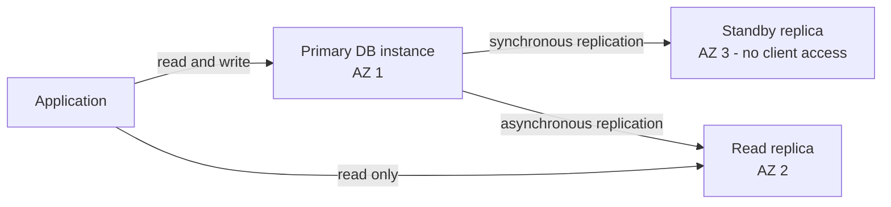
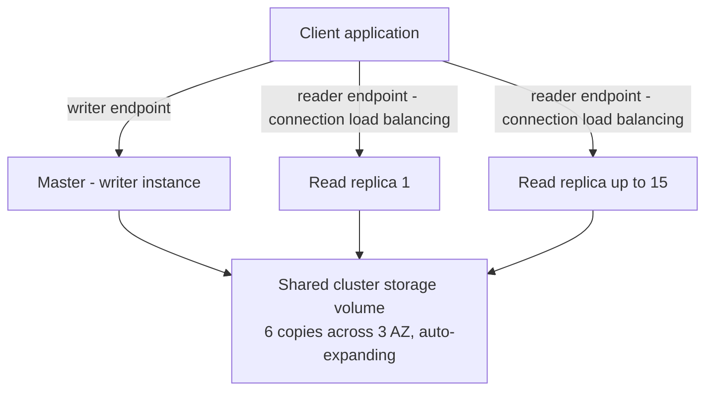
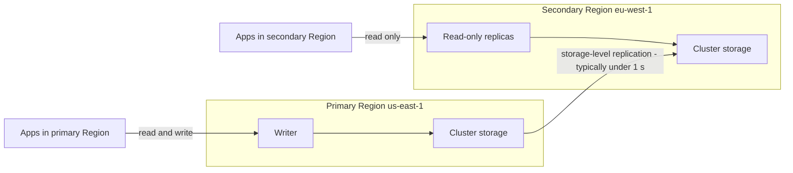

# 09 - RDS, Aurora & ElastiCache

Related: [[RDS & Aurora]] (Version C service note) · [[ElastiCache]] · [[IAM]] · [[KMS, CloudHSM & ACM]] · [[Parameter Store & Secrets Manager]] · [[Lambda]] · [[Other Databases & Choosing a DB]] · [[Migration Services]] · [[Disaster Recovery & Backup]] · [[VPC]]

## Chapter summary
- **RDS = managed relational (SQL) DB**: engines PostgreSQL, MySQL, MariaDB, Oracle, SQL Server, IBM DB2, Aurora. AWS handles provisioning, OS patching, continuous backups + Point-in-Time Restore, monitoring, maintenance windows, scaling. **No SSH** (except RDS Custom). Storage is EBS-backed.
- **Read Replicas = scale reads** (up to 15, same AZ / cross-AZ / cross-Region, **async**, eventually consistent, SELECT only). **Multi-AZ = disaster recovery** (**sync** standby, one DNS name, automatic failover, standby not readable). Single-AZ to Multi-AZ is a **zero-downtime** modify (snapshot -> restore -> sync).
- Replication traffic is **free in the same Region** (cross-AZ), **charged cross-Region**.
- **Aurora**: AWS proprietary, MySQL/PostgreSQL compatible, 6 copies across 3 AZ, storage 10 GB -> 256 TB auto-grow, up to 15 replicas, failover < 30 s, **writer endpoint + reader endpoint**, replica auto-scaling, custom endpoints, Serverless, **Global Database** (< 1 s replication, RTO < 1 min), ML integration, Babelfish, backtrack, cloning.
- **Backups**: automated 1-35 days (0 = off on RDS; cannot be disabled on Aurora), transaction logs every 5 min; manual snapshots kept forever; restores always create a **new** DB; encrypt an unencrypted DB via snapshot -> encrypted restore.
- **Security**: KMS at rest (set at creation), TLS in flight, IAM auth, security groups, audit logs -> CloudWatch Logs.
- **RDS Proxy**: pools connections, up to 66% faster failover, enforces IAM auth (credentials in Secrets Manager), never public, ideal for Lambda.
- **ElastiCache** (Redis / Memcached): in-memory cache to offload DBs and make apps stateless; needs application code changes; patterns: Lazy Loading, Write Through, session store with TTL; **Redis Sorted Sets = gaming leaderboard**.

---

## 01 - Amazon RDS Overview
(src: 09/01-Amazon RDS Overview)

- **RDS** = Relational Database Service, managed DB service for SQL. Supported engines (know them for the exam): **PostgreSQL, MySQL, MariaDB, Oracle, Microsoft SQL Server, IBM DB2, Aurora**.
- Why RDS instead of a DB on EC2: automated provisioning, OS patching, continuous backups with **Point in Time Restore**, monitoring dashboards, read replicas, Multi-AZ (DR), maintenance windows, vertical scaling (bigger instance type) and horizontal scaling (read replicas), EBS-backed storage.
- Limitation: **you cannot SSH** into RDS instances (managed service, no access to the underlying EC2).

### RDS Storage Auto Scaling
- Set initial storage (e.g. 20 GB); RDS detects low free space and **scales storage automatically** without downtime - no manual operation.
- You must set a **Maximum Storage Threshold**.
- Triggers when: free storage **< 10%** of allocated, low-storage condition lasts **> 5 minutes**, and **6 hours** have passed since the last modification.
- Good for unpredictable workloads; supports **all RDS engines**.

[verify] "6 hours have passed since the last modification."
> [!warning] Correction [note]
> AWS documentation lists the conditions as: free space <= 10% of allocated storage, low-storage condition lasting at least 5 minutes, and storage optimization completed from the previous modification with **fewer than four storage modifications in the past 24 hours** (no fixed 6-hour wait is stated). Source: [Managing capacity automatically with Amazon RDS storage autoscaling](https://docs.aws.amazon.com/AmazonRDS/latest/UserGuide/USER_PIOPS.Autoscaling.html).

> [!tip] Exam
> Unpredictable storage growth on RDS -> enable **RDS Storage Auto Scaling** with a maximum storage threshold.

---

## 02 - RDS Read Replicas vs Multi AZ
(src: 09/02-RDS Read Replicas vs Multi AZ)

### Read Replicas (scale reads)
- Up to **15 Read Replicas**; placement: **same AZ, cross-AZ, or cross-Region**.
- **Asynchronous** replication -> reads are **eventually consistent** (a read may return old data).
- A replica can be **promoted** to its own standalone DB (leaves replication, has its own lifecycle).
- The application must **update its connection string** to use the replicas.
- Replicas are for **SELECT (read) only** - no INSERT / UPDATE / DELETE.
- Use case: run **reporting / analytics** on a replica so the production DB is unaffected.

### Network cost
- Normally data between AZs costs money, but **managed-service exception**: RDS Read Replica in the **same Region** (different AZ) = **free** replication traffic.
- **Cross-Region** Read Replica = **replication fee** applies.

### Multi-AZ (disaster recovery)
- Master in AZ A, **synchronous** replication to a **standby** in AZ B; a change must be on the standby to be accepted.
- Application uses **one DNS name**; **automatic failover** to the standby on AZ loss, network loss, instance or storage failure; no manual intervention in apps (apps just need to retry connecting).
- Raises availability; **not for scaling** - the standby cannot be read or written.
- **Read Replicas can be set up as Multi-AZ** (common exam question).

### Single-AZ -> Multi-AZ
- **Zero downtime**: just **Modify** the DB and enable Multi-AZ.
- Behind the scenes: snapshot of main DB -> restored into a new standby -> synchronization established.

| | Read Replica | Multi-AZ |
|---|---|---|
| Purpose | scale reads | disaster recovery / high availability |
| Replication | asynchronous (eventual consistency) | synchronous |
| Readable | yes (SELECT only) | no (standby only) |
| Max | 15 | one standby (as taught) |
| Location | same AZ, cross-AZ, cross-Region | another AZ in same Region |
| Failover | manual promotion | automatic via one DNS name |

> [!info] Diagram
> **Explanation:** The primary takes reads and writes. It copies changes synchronously to a Multi-AZ standby (high availability, not readable) and asynchronously to a read replica (scales reads, read-only). A read replica can itself sit alongside a Multi-AZ setup.
> **Reference:** [Working with DB instance read replicas - Read replicas in a Multi-AZ deployment (Amazon RDS User Guide)](https://docs.aws.amazon.com/AmazonRDS/latest/UserGuide/USER_ReadRepl.html)

> [!tip] Exam
> Read Replicas = scale reads, async. Multi-AZ = DR, sync, one DNS name, auto failover. Same-Region replica traffic is free, cross-Region is paid. Single-AZ -> Multi-AZ needs no downtime.

---

## 03 - Amazon RDS Hands On
(src: 09/03-Amazon RDS Hands On)

- Console: Aurora and RDS -> Databases -> Create database; **Full configuration** vs **Easy create**.
- Engines offered: Aurora (MySQL / PostgreSQL compatible), MySQL, PostgreSQL, others. Demo uses **MySQL** with default engine version.
- Templates: **Production** (unlocks **Multi-AZ DB instance** = 2 instances, or **Multi-AZ DB cluster** = 3 instances), **Dev/Test**, **Free tier** (only Single-AZ DB instance).
- Credentials: self-managed password, or **managed by AWS Secrets Manager** (most secure, but costs extra). Authentication: password only, or add **IAM** database authentication.
- Instance class: free-tier class (e.g. db.t4g.micro / db.t3.micro); storage 20 GB; **storage autoscaling** option (e.g. up to 1000 GB) under additional storage configuration.
- Connectivity: default VPC, public access = yes (to connect from laptop), new VPC security group `demo-rds`, **port 3306** (MySQL). No RDS Proxy. Monitoring: standard insights; enhanced monitoring and log export available. Initial database name `mydb`. Free Tier is available for 12 months for these instance types.
- Security group inbound rule: **TCP 3306 from my IP** only; if you cannot connect, check (1) public access enabled, (2) security group allows your IP.
- Connected with a SQL client (SQL Electron); created a table and inserted a row (SQL itself is **out of scope for the exam**).
- Console features shown: create **read replica** (and choose Multi-AZ for it), **monitoring** (CPU utilization, database connection count), **snapshots** (restore, restore to point in time, migrate/copy snapshot to another Region).

[verify] "Free Tier is available for 12 months for these instance types."
> [!warning] Correction [note]
> Not confirmed for the RDS free tier in the pages fetched; for recently created accounts AWS describes a Free account plan with credits (see [Choosing a plan - AWS Billing](https://docs.aws.amazon.com/awsaccountbilling/latest/aboutv2/free-tier-plans.html), cited in the Chapter 05 note). Treat the 12-month claim as unconfirmed.

### Hands-on steps
1. RDS console -> Databases -> Create database -> Full configuration -> MySQL -> Free tier template.
2. Set master username, self-managed password (password authentication), db.t4g/t3.micro, 20 GB, optional storage autoscaling.
3. Connectivity: default VPC, public access Yes, new security group `demo-rds`, port 3306; initial DB name `mydb`; Create database.
4. Open the DB details: note the endpoint, port 3306 and the security group inbound rule (add your IP / anywhere IPv4 if needed).
5. Connect with a SQL client (type MySQL, endpoint, port 3306, user `admin`, initial DB `mydb`) -> Test -> Connect.
6. Explore Actions: create read replica (cancel), Monitoring tab, snapshots.
7. Cleanup: Modify -> disable **deletion protection** -> Apply immediately -> Delete (skip final snapshot, confirm).

---

## 04 - RDS Custom for Oracle and Microsoft SQL Server
(src: 09/04-RDS Custom for Oracle and Microsoft SQL Server)

- **RDS Custom** is only for **Oracle and Microsoft SQL Server**: keeps automated setup, operations and scaling, but gives **access to the OS and database customization**.
- You can configure internal settings, install patches, enable native features, and **SSH or SSM Session Manager** into the underlying EC2 instance.
- Best practice: **deactivate Automation Mode** while customizing (so RDS does not interfere) and **take a DB snapshot first** (you may break things).
- RDS = everything managed, no OS access. RDS Custom = full admin access to OS and DB.

> [!tip] Exam
> Need OS-level access / custom patches on Oracle or SQL Server while still on RDS -> **RDS Custom**.

---

## 05 - Amazon Aurora
(src: 09/05-Amazon Aurora)

- **Aurora** = AWS proprietary (not open source), **compatible with PostgreSQL and MySQL** (use their drivers). Cloud-optimized: **5x** performance of MySQL on RDS, **3x** of PostgreSQL on RDS.
- **Storage auto-grows from 10 GB up to 256 TB** (no disk monitoring needed).
- Up to **15 read replicas**, replication faster than MySQL (replica lag typically **< 10 ms**); **failover is near-instant** (< 30 seconds on average); highly available by default.
- Costs about **20% more** than RDS, but more efficient at scale.

[verify] "About 20% more than RDS."
> [!warning] Correction [note]
> Not confirmed: no AWS source for this percentage was fetched; pricing varies by engine, instance class and storage configuration (Aurora Standard vs I/O-Optimized). See [Amazon Aurora pricing](https://aws.amazon.com/rds/aurora/pricing/). Treat as an unconfirmed rule of thumb.

### High availability and storage design
- Data is stored as **6 copies across 3 AZ**; needs **4 of 6** for writes and **3 of 6** for reads; **self-healing** with peer-to-peer replication; striped across **hundreds of volumes**. This is a **shared logical storage volume** that replicates, self-heals and auto-expands.
- **One master** takes writes; failover to a replica in < 30 s on average. Up to **15 read replicas** serve reads; any can become the master. Supports **cross-Region replication**.

### Cluster endpoints
- **Writer endpoint**: DNS name always pointing to the current master (follows failovers).
- **Reader endpoint**: connection-level **load balancing** across all read replicas (balancing is per connection, not per statement).
- Replicas support **auto-scaling** (1 to 15) - the reader endpoint hides the changing replica list.

> [!info] Diagram
> **Explanation:** All instances share one logical cluster volume replicated across three AZ. Only the master writes; clients reach it through the writer endpoint, and reach the replicas through the reader endpoint, which load balances connections. Replicas can scale automatically and be promoted if the master fails.
> **Reference:** [Amazon Aurora storage (Amazon Aurora User Guide)](https://docs.aws.amazon.com/AmazonRDS/latest/AuroraUserGuide/Aurora.Overview.StorageReliability.html)

- Other features: automatic failover, backup and recovery, isolation and security, compliance, push-button scaling, **automated patching with zero downtime**, advanced monitoring, routine maintenance, and **Backtrack** (restore to any point in time without relying on backups, e.g. "yesterday 4 PM" then "5 PM").

> [!tip] Exam
> Remember: **writer endpoint, reader endpoint, replica auto-scaling, shared auto-expanding storage, 6 copies / 3 AZ**.

---

## 06 - Amazon Aurora - Hands On
(src: 09/06-Amazon Aurora - Hands On)

- Warning: creating Aurora **costs money**; following along is optional.
- Options seen: Aurora **MySQL- or PostgreSQL-compatible**; version selector with filters (Global Database, Parallel Query, Serverless v2); default version in lecture 3.04.1.
- **Cluster storage configuration**: **Aurora Standard** (cost-effective, moderate I/O) vs **Aurora I/O-Optimized** (high read/write I/O).
- Instance class: memory optimized, burstable (db.t3.medium used); **Serverless v2** (when version supports it) -> choose **min and max ACU** (Aurora Capacity Units) instead of an instance type.
- Availability: create an **Aurora Replica / reader in a different AZ** (more cost, better availability, fast failover).
- Network: IPv4 (or dual-stack), default VPC, public access yes, new security group, **port 3306** for MySQL. Extras: **local write forwarding** (writes sent to a replica are forwarded to the writer), **IAM** or **Kerberos** authentication, enhanced monitoring, initial DB `mydb`, **backup retention 1 day**, encryption, backtrack, log exports, deletion protection, monthly cost estimate.
- Result: a **regional cluster** with one writer and one reader in different AZ; **cluster has a writer endpoint and a reader endpoint**; each instance also has its own **instance endpoint**. Apps should use the **cluster endpoints**.
- Cluster actions: add readers, **cross-Region read replica**, restore to point in time, **replica auto-scaling policy** (target metric: average CPU utilization or average connections, e.g. target 60%; min 1 to max 15 replicas; scaling period), **Add AWS Region** (Global Database; needs a supporting version and a large-enough instance class).
- Cleanup order: delete reader instance, then writer instance (type "delete me"), then delete the cluster.

### Hands-on steps
1. RDS -> Create database -> Standard create -> Aurora (MySQL compatible); keep default version.
2. Template Production; cluster identifier `database-2`; user `admin` + password.
3. Choose Aurora Standard (or I/O-Optimized), instance db.t3.medium (or Serverless v2 with min/max ACU).
4. Create an Aurora Replica in another AZ; default VPC; public access yes; new security group.
5. Review additional configuration (port 3306, IAM auth, initial DB `mydb`, backup retention 1 day, deletion protection) -> Create.
6. Open the cluster: note writer and reader endpoints; inspect Actions: add reader, cross-Region replica, auto-scaling policy, add Region.
7. Cleanup: delete reader, delete writer, then the cluster.

---

## 07 - Amazon Aurora - Advanced Concepts
(src: 09/07-Amazon Aurora - Advanced Concepts)

- **Replica auto-scaling**: when read load raises CPU, new Aurora replicas are added and the **reader endpoint automatically extends** to cover them.
- **Custom endpoints**: define a **subset of instances** (e.g. the bigger db.r5.2xlarge replicas) as an endpoint, e.g. for **analytical queries**. After defining custom endpoints the generic reader endpoint is generally **no longer used**; create custom endpoints per workload.
- **Aurora Serverless**: automated instantiation and auto-scaling by actual usage; for **infrequent, intermittent or unpredictable** workloads; no capacity planning; **pay per second**. Clients talk to an Aurora-managed **proxy fleet** that fronts instances created on demand.
- **Aurora Global Database** (recommended over cross-Region read replicas for DR):
  - **1 primary Region** (reads + writes), up to **10 secondary read-only Regions**, up to **16 read replicas per secondary Region**;
  - cross-Region replication lag **< 1 second**;
  - **RTO < 1 minute** when promoting another Region;
  - helps global low-latency reads and Region-outage DR (e.g. primary us-east-1, secondary eu-west-1 promoted to read-write on failure).
- **Aurora Machine Learning**: ML predictions through the **SQL interface**, integrated with **SageMaker** (any ML model) and **Amazon Comprehend** (sentiment analysis); no ML experience needed. Use cases: fraud detection, ads targeting, sentiment analysis, product recommendations. Flow: app runs a SQL query -> Aurora sends data (e.g. user profile, history) to the ML service -> prediction returns via Aurora.
- **Babelfish for Aurora PostgreSQL**: lets Aurora PostgreSQL understand **T-SQL** (Microsoft SQL Server dialect), so SQL Server applications work with **little to no code change using the same SQL Server driver**. The data migration itself uses **AWS SCT and DMS** (covered later).

> [!info] Diagram
> **Explanation:** Writes go only to the primary Region's cluster. Aurora replicates at the storage layer to read-only secondary clusters in other Regions (typically under a second), giving low-latency local reads. If the primary Region fails, a secondary can be promoted to read-write.
> **Reference:** [Using Amazon Aurora Global Database (Amazon Aurora User Guide)](https://docs.aws.amazon.com/AmazonRDS/latest/AuroraUserGuide/aurora-global-database.html)

> [!tip] Exam
> "Replicate across Regions in **< 1 second**" or cross-Region DR with RTO < 1 min -> **Aurora Global Database**. SQL Server app moving to Aurora with minimal changes -> **Babelfish**. Unpredictable / intermittent load -> **Aurora Serverless**.

---

## 08 - RDS & Aurora - Backup and Monitoring
(src: 09/08-RDS & Aurora - Backup and Monitoring)

### RDS backups
- **Automated backups**: daily full backup in the backup window + **transaction logs every 5 minutes** -> restore to any point in time **up to 5 minutes ago**. Retention **1 to 35 days**; **0 disables** automated backups.
- **Manual DB snapshots**: user-triggered, **retained as long as you want** (automated backups expire).
- **Cost trick**: for a DB used e.g. only 2 hours per month, a stopped DB still bills storage - instead **snapshot, delete the DB, and restore the snapshot** when needed (snapshot storage is cheaper).

### Aurora backups
- Automated backups **1-35 days, cannot be disabled**; point-in-time recovery within that window; manual snapshots kept as long as you want.

### Restore options
- Restoring an automated backup or manual snapshot always **creates a new database**.
- **RDS MySQL from S3**: back up the on-premises DB, put the file in S3, restore to a new RDS MySQL instance.
- **Aurora MySQL from S3**: back up on-premises DB with **Percona XtraBackup**, upload to S3, restore into a new Aurora MySQL cluster.

### Aurora Database Cloning
- Creates a new Aurora cluster from an existing one (e.g. production -> staging); **faster than snapshot and restore**.
- Uses **copy-on-write**: the clone initially **shares the same data volume**; new storage is allocated and data copied only when either side updates data. Fast, cost-effective, no impact on production.

| | RDS | Aurora |
|---|---|---|
| Automated backup retention | 1-35 days, 0 = disabled | 1-35 days, cannot be disabled |
| Point-in-time restore | yes (to 5 min ago) | yes |
| Manual snapshots | kept until deleted | kept until deleted |
| Import from S3 | MySQL backup file | Percona XtraBackup file (MySQL) |
| Cloning | no | yes (copy-on-write) |

> [!tip] Exam
> Quick staging copy of Aurora prod -> **cloning**. Rarely used DB -> snapshot + delete + restore. Aurora MySQL import from S3 needs **Percona XtraBackup**.

---

## 09 - RDS Security
(src: 09/09-RDS Security)

- **At rest**: encrypt master and replicas with **KMS**; defined **at first launch**. If the master is not encrypted, **read replicas cannot be encrypted**. To encrypt an existing unencrypted DB: **snapshot -> restore as encrypted**.
- **In flight**: TLS enabled by default; clients must use the **AWS TLS root certificates**.
- **Authentication**: username/password, or **IAM roles** (e.g. EC2 instance role authenticates directly).
- **Network**: **security groups** control ports, IPs and other security groups.
- **No SSH** except **RDS Custom**.
- **Audit logs**: show queries over time but are kept only briefly; send to **CloudWatch Logs** for long retention.

> [!tip] Exam
> Encrypt an unencrypted RDS DB -> snapshot, copy/restore as encrypted. Unencrypted master = unencrypted replicas.

---

## 10 - RDS Proxy
(src: 09/10-RDS Proxy)

- **RDS Proxy** = fully managed database proxy that **pools and shares DB connections**: apps connect to the proxy, which multiplexes into fewer connections to the DB. Reduces CPU/RAM stress, open connections and timeouts.
- **Serverless, auto-scaling, highly available (multi-AZ)**.
- Reduces **failover time by up to 66%** (RDS and Aurora): the proxy handles failover to the standby.
- Supports **MySQL, PostgreSQL, MariaDB, Microsoft SQL Server, Aurora MySQL and PostgreSQL**; **no application code change** (just point to the proxy endpoint).
- Can **enforce IAM authentication**, with credentials securely stored in **AWS Secrets Manager**.
- **Never publicly accessible** - only reachable from inside the VPC.
- Classic fit: **Lambda functions** that multiply and disappear quickly would otherwise open many connections and cause timeouts; the proxy pools them (revisited in the Lambda chapter).

> [!tip] Exam
> Many connections / Lambda overloading RDS, faster failover, or enforcing IAM authentication to the DB -> **RDS Proxy**.

---

## 11 - ElastiCache Overview
(src: 09/11-ElastiCache Overview)

- **ElastiCache** = managed **Redis or Memcached** (in-memory, high performance, low latency). Reduces load on databases for **read-intensive** workloads and helps make apps **stateless**. AWS handles OS maintenance, patching, optimization, setup, configuration, monitoring, failure recovery and backups.
- Requires **heavy application code changes** (query the cache before/after the DB) - not a toggle.
- **DB cache architecture**: app checks the cache -> **cache hit** returns data (saves a DB trip); **cache miss** -> read from DB, then write to the cache so the next query hits. Needs a **cache invalidation strategy** to keep data current (the hard part).
- **User session store**: app writes session data to ElastiCache; if the user is routed to another app instance it reads the session from the cache and stays logged in -> stateless apps.

| | Redis | Memcached |
|---|---|---|
| Multi-AZ + auto-failover | yes | no |
| Read replicas (scale reads, HA) | yes | no replication |
| Durability | **AOF persistence** | none (lose cache on failure) |
| Backup and restore | yes (open-source Redis) | only the serverless version |
| Data structures | **sets and sorted sets** (leaderboards) | simple |
| Architecture | node replicated to another node | multi-node **sharding** (partitioned data), **multi-threaded** |

- The instructor notes the exam rarely asks Redis vs Memcached; the description is a simplification and the serverless offerings differ.

> [!tip] Exam
> Offload a read-heavy DB or share session state across instances -> **ElastiCache**. Needs HA / persistence / backup -> **Redis**; simple multi-threaded sharded cache -> Memcached.

---

## 12 - ElastiCache Hands On
(src: 09/12-ElastiCache Hands On)

- Console options: engines **Valkey** (recommended Redis replacement), Redis OSS, **Memcached**; deployment **serverless** or **node-based cluster** (used in demo); restore from backup; **Easy create** (production / dev-test / demo) or custom.
- **Cluster mode disabled** = one shard, one primary and **up to 5 read replicas**; **cluster mode enabled** = multiple shards across servers.
- Location: AWS Cloud (or on premises with **AWS Outposts**). **Multi-AZ** and **auto-failover** options (Multi-AZ off in demo to save cost).
- Settings: engine version, port, parameter groups, node type (t2/t3/t4g micro), number of replicas (0 in demo), **subnet group** (which subnets the cache can run in), AZ placement.
- Security: **encryption at rest** (needs a key), **encryption in transit** (then access control via **Redis AUTH** token or **user group ACL**), **security groups**.
- Also: backups, maintenance window for minor upgrades, **slow logs / engine logs to CloudWatch Logs**, tags. Apps use the **primary endpoint** (writes) or **reader endpoint** (reads). The lecture does not show connecting (requires code). Console looks much like RDS.

### Hands-on steps
1. ElastiCache -> Create -> Redis OSS (or Valkey) -> node-based cluster -> configure everything.
2. Cluster mode disabled, name `DemoCluster`, AWS Cloud, Multi-AZ off, auto-failover left enabled.
3. Node type micro, replicas 0, create subnet group `my-first-subnet-group`.
4. Encryption at rest optional; disable encryption in transit; no backup; Create.
5. Open the cluster to inspect endpoints, nodes, metrics, logs, network security.
6. Cleanup: Actions -> Delete (no backup) -> type the cluster name.

---

## 13 - ElastiCache for Solution Architects
(src: 09/13-ElastiCache for Solution Architects)

### Security
- **IAM authentication supported for Redis only**; otherwise username/password. IAM policies on ElastiCache apply only to **AWS API-level** security.
- **Redis AUTH**: password/token set at cluster creation, on top of security groups. Supports **SSL in-flight encryption**.
- **Memcached** supports **SASL-based authentication** (just remember the name).

### Loading strategies
- **Lazy Loading**: cache data on read after a miss; data can become **stale**.
- **Write Through**: add/update the cache whenever the DB is written; **no stale data**.
- **Session store**: keep sessions in the cache and expire them with **TTL**.
- Quote: "only two hard things in computer science: cache invalidation and naming things."

### Redis use case: gaming leaderboard
- **Redis Sorted Sets** guarantee **uniqueness and element ordering**; each added element is ranked in real time -> real-time leaderboard shared by all clients without custom application code.

> [!tip] Exam
> **Gaming leaderboard = Redis Sorted Sets**. Lazy Loading = possible stale data; Write Through = always fresh. IAM auth = Redis only.

---

## 14 - List of Ports to be familiar with
(src: 09/14-List of Ports to be familiar with)

> No transcript available for this lecture (raw file contains only a placeholder). [screen action] likely a reference list or slide of ports; the instructor's transcript gives none. Only 3306 (MySQL) appears in the RDS and Aurora hands-on lectures.

---

## Not covered in this chapter's lectures
- Lecture 14 (List of Ports to be familiar with) has no transcript.
