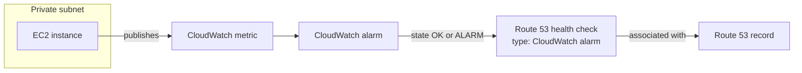
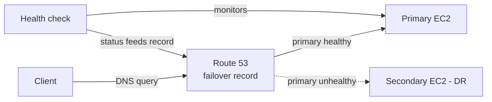
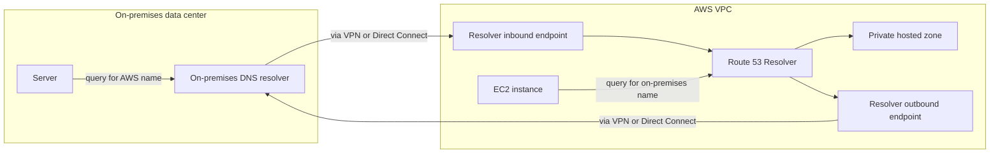

# 10 - Route 53

Related: [[Route 53]] (Version C service note) · [[EC2]] · [[ELB]] · [[CloudWatch]] · [[CloudFront & Global Accelerator]] · [[VPC]] · [[VPC Connectivity]] · [[Cost Management & Billing]]

## Chapter summary
- **DNS** translates hostnames into IPs through a hierarchy: Root DNS (ICANN) -> TLD (`.com`, IANA) -> second-level domain name server (e.g. Route 53) -> answer, cached by the local DNS server.
- **Route 53** = highly available, scalable, fully managed, **authoritative** DNS (you control the records) **and** domain registrar, with health checking; "53" = the DNS port.
- **Records** hold: name, type, value, routing policy, TTL. Must-know types: **A** (IPv4), **AAAA** (IPv6), **CNAME** (hostname -> hostname, **not at the zone apex**), **NS** (name servers of the hosted zone). **Hosted zones** are public or private (VPC-only); cost $0.50/month each.
- **TTL** = how long resolvers/clients cache an answer; high TTL = less traffic/cost but stale answers; low TTL = more queries/cost but fast changes. Mandatory on every record **except Alias**.
- **Alias vs CNAME**: Alias works at the zone apex, is free for AWS targets, has native health check (Evaluate Target Health), is type A/AAAA, TTL set automatically; **cannot target an EC2 DNS name**.
- **Routing policies** (DNS answers only; Route 53 never carries the traffic): Simple, Weighted, Latency, Failover, Geolocation, Geoproximity (needs Traffic Flow, uses bias), IP-based, Multi-Value.
- **Health checks**: endpoint, calculated (up to 255 children), or CloudWatch alarm (for **private** resources); required for Failover primary, optional for others, not for Simple.
- Registrar and DNS service are separate: a domain bought at a third party can use Route 53 by creating a public hosted zone and pointing the registrar's NS records to the 4 Route 53 name servers.
- **Resolver endpoints** give hybrid DNS: **inbound** (on-premises -> AWS) and **outbound** (AWS -> on-premises), over VPN or Direct Connect.

---

## 01 - What is a DNS?
(src: 10/01-What is a DNS -)

- **DNS (Domain Name System)** translates human-friendly hostnames into target server IPs; the backbone of the internet. Hierarchical naming: `.com` -> `example.com` -> `www.example.com` / `api.example.com`.
- Terminology:
  - **Domain registrar**: where you register names (Route 53, GoDaddy...).
  - **DNS records**: A, AAAA, CNAME, NS...
  - **Zone file**: contains the DNS records.
  - **Name servers**: servers that resolve DNS queries.
  - **TLD**: `.com`, `.us`, `.in`, `.gov`, `.org`. **Second-level domain**: `amazon.com`, `google.com`.
- Anatomy of `http://api.www.example.com.`: trailing dot = **root**; `.com` = TLD; `example.com` = second-level domain; `www.example.com` = subdomain; `api.www.example.com` = **FQDN**; `http` = protocol; the whole thing = URL.
- **Resolution flow** (example: `example.com` -> public IP 9.10.11.12 on an EC2 instance):
  1. Browser asks the **local DNS server** (assigned by company or ISP).
  2. Unknown -> local DNS asks the **Root DNS server** (ICANN); it replies with an NS record for `.com`.
  3. Local DNS asks the **TLD (.com) server** (IANA); it replies with the NS record/IP of the `example.com` name server.
  4. Local DNS asks the **second-level domain DNS server** (managed by the registrar, e.g. Route 53); it returns the **A record** 9.10.11.12.
  5. Local DNS **caches** the answer and returns it to the browser, which connects to the web server.

---

## 02 - Route 53 Overview
(src: 10/02-Route 53 Overview)

- Route 53: **highly available, scalable, fully managed, authoritative DNS** (the customer can update records). Also a **domain registrar**, and can **check the health of resources**.
- The instructor states it is the **only AWS service with a 100% availability SLA**. "53" refers to the traditional DNS port.
- Example: client asks for `example.com`; the record in the Route 53 **hosted zone** answers with the EC2 public IP (e.g. 54.22.33.44) and the client connects directly.
- Each record contains: **domain/subdomain name**, **record type**, **value**, **routing policy** (how Route 53 responds to queries), **TTL** (cache duration at resolvers).
- Supported types: must-know **A, AAAA, CNAME, NS**; advanced types exist but are not needed for the exam.

| Type | Maps | Notes |
|---|---|---|
| **A** | hostname -> IPv4 | e.g. `example.com` -> 1.2.3.4 |
| **AAAA** | hostname -> IPv6 | same idea as A |
| **CNAME** | hostname -> another hostname | target can itself be A/AAAA; **cannot be created for the zone apex** (no CNAME for `example.com`, but OK for `www.example.com`) |
| **NS** | name servers of the hosted zone | DNS names/IPs of servers that answer queries for the zone; control how traffic is routed to the domain |

- **Hosted zones** = container of records defining how to route traffic to a domain and its subdomains. Two types:

| | Public hosted zone | Private hosted zone |
|---|---|---|
| Answers | queries from the public internet | queries from **within your VPC(s)** only |
| Example | `application1.mypublicdomain.com` | `application1.company.internal`, `webapp.example.internal`, `database.example.internal` |
| Use | public records | identify private resources with private names (e.g. `api.example.internal` -> 10.0.0.10) |

- Both work the same way; only who can query differs.
- **Cost**: **$0.50 per month per hosted zone**; registering a domain costs a **minimum of about $12 per year**. The section is not free.

> [!tip] Exam
> Know A, AAAA, CNAME, NS. CNAME cannot be used at the zone apex. Private hosted zone = resolution only inside your VPC.

[verify] "$12 per year minimum for a domain" and "$0.50 per month per hosted zone".
> [!warning] Correction [note]
> The $0.50/month hosted zone price is confirmed (first 25 zones; $0.10/month for additional zones). Domain registration price varies by TLD, so $12/year is only indicative. Source: [Amazon Route 53 pricing](https://aws.amazon.com/route53/pricing/).

[verify] "Route 53 is the only service in AWS with a 100% availability SLA."
> [!warning] Correction [note]
> Unconfirmed as a claim about all AWS services. The Route 53 SLA page lists service credits when monthly uptime is below 100% (10% credit between 99.99% and below 100%), which is consistent with a 100% target. Source: [Amazon Route 53 SLA](https://aws.amazon.com/route53/sla/).

---

## 03 - Route 53 - Registering a domain
(src: 10/03-Route 53 - Registering a domain)

- Registering a domain costs money (about $12-13 per year in the lecture); skip the hands-on if you do not want to pay.
- Options at checkout: duration (e.g. 1 year), **auto-renew** (leave on if you keep the domain, otherwise someone else can buy it when it lapses; off if only for the course), contact info (admin/tech can equal registrant), and **privacy protection** (hides your personal details and avoids spam).
- Registration can take a few minutes to a few hours.
- After registration a **hosted zone** is created containing an **NS** record (use the AWS DNS, i.e. Route 53) and an **SOA** record. Route 53 is now the source of truth for the zone's records.

### Hands-on steps
1. Route 53 -> Register domains (new console) -> enter a domain name -> check availability -> add to basket -> proceed to checkout.
2. Choose duration and auto-renew on/off.
3. Review contact information; enable privacy protection.
4. Accept terms and submit (this charges you).
5. Route 53 -> Hosted zones -> open your domain; confirm the NS and SOA records.

---

## 04 - Route 53 - Creating our first records
(src: 10/04-Route 53 - Creating our first records)

- Create a record in the hosted zone: name `test.<yourdomain>`, type **A**, value an IPv4 (random 11.22.33.44 in the demo), TTL **300 seconds**, routing policy **Simple**.
- Browser shows nothing (no server at that IP), so verify with command-line tools:
  - `nslookup <name>` (Windows) or `dig <name>` (Mac/Linux); `dig` also shows the **TTL** and record type in the answer section.
  - Used **CloudShell**; `nslookup`/`dig` not preinstalled: `sudo yum install -y bind-utils`.

### Hands-on steps
1. Hosted zone -> Create record -> name `test`, type A, value `11.22.33.44`, TTL 300, Simple routing -> Create.
2. Open CloudShell; `sudo yum install -y bind-utils`.
3. Run `nslookup test.<domain>` and `dig test.<domain>`; confirm the answer matches the record.

---

## 05 - Route 53 - EC2 Setup
(src: 10/05-Route 53 - EC2 Setup)

- Preparation for the following labs: **three EC2 instances in three regions** (Frankfurt eu-central-1, N. Virginia us-east-1, Singapore ap-southeast-1) plus **one ALB** in Frankfurt.
- Instance settings: Amazon Linux 2, t2.micro, no key pair (EC2 Instance Connect if needed), security group allowing **SSH and HTTP from anywhere**, **User Data** script from the course (Hello World plus the instance's AZ).
- ALB: `DemoRoute53ALB`, application load balancer, internet-facing, IPv4, 3 subnets, security group allowing HTTP, listener 80 -> new target group `demo-tg-route53` (instances) with the Frankfurt instance registered.
- Test each instance by public IP over HTTP (each shows its AZ: eu-central-1b, us-east-1a, ap-southeast-1b) and the ALB by its DNS name. Note the IPs and regions.

[verify] The lab uses Amazon Linux 2.
> [!warning] Correction [note]
> AWS states Amazon Linux 2 reached end of support on 30 June 2026 and recommends Amazon Linux 2023. Source: [Amazon Linux 2 FAQs](https://aws.amazon.com/amazon-linux-2/faqs/).

### Hands-on steps
1. In eu-central-1, us-east-1 and ap-southeast-1: launch an Amazon Linux 2 t2.micro, no key pair, allow HTTP (and SSH in the first), paste the Route 53 User Data script, launch.
2. In Frankfurt: create an Application Load Balancer (internet-facing, IPv4, 3 subnets, SG with HTTP), listener HTTP:80 -> new target group of type instances, register the Frankfurt instance, create.
3. Browse each instance public IP and the ALB DNS name over `http://`; save the IPs and regions in a text file.

---

## 06 - Route 53 - TTL
(src: 10/06-Route 53 - TTL)

- **TTL (Time To Live)**: the answer carries a TTL (e.g. 300 s); clients/resolvers **cache** the result for that period and do **not** query DNS again until it expires.
- Trade-off:

| TTL | Effect |
|---|---|
| **High** (e.g. 24 h) | less traffic on Route 53 (lower cost), but clients may hold **outdated** records for up to 24 h |
| **Low** (e.g. 60 s) | more queries (you pay per query), but records are outdated for less time and changes are quick |

- Change strategy: lower the TTL (e.g. 24 h beforehand), change the record once all clients have the low TTL, then raise the TTL again.
- **TTL is mandatory for every record except Alias records.**
- Demo: record `demo.<domain>` A -> eu-central-1 IP with TTL 120 s. `dig` shows a decreasing number in the answer section (115, then 98...). After editing the record to the Singapore IP, `dig` and the browser still returned the old answer until the cache expired (about 2 minutes), then showed the new IP and a fresh TTL of 120.

> [!tip] Exam
> TTL = caching time at resolvers. Mandatory on all records except Alias. Low TTL = faster changes but more queries/cost.

### Hands-on steps
1. Create `demo.<domain>`, A, value = eu-central-1 instance IP, TTL 120 s (click the minute button twice).
2. Browse the name; run `nslookup`/`dig` in CloudShell and watch the TTL count down on repeated `dig`.
3. Edit the record to the ap-southeast-1 IP; repeat `dig`/refresh: still the old answer until expiry.
4. Wait about a minute; refresh: new IP and TTL back to 120.

---

## 07 - Route 53 CNAME vs Alias
(src: 10/07-Route 53 CNAME vs Alias)

- AWS resources (load balancer, CloudFront...) expose a hostname you may want to map to your own domain (e.g. `myapp.mydomain.com`). Two options:

| | **CNAME** | **Alias** |
|---|---|---|
| Points to | any hostname (`app.mydomain.com` -> `blabla.anything.com`) | **AWS resources only** |
| Zone apex (`mydomain.com`) | **No** (works only for non-root names) | **Yes** |
| Cost | charged per query | **free** for AWS targets |
| Health check | no | **native** (Evaluate Target Health) |
| Record type | CNAME | always **A or AAAA** |
| TTL | you set it | **cannot set; set by Route 53** |
| IP changes | n/a | automatically follows changes of the target (e.g. ALB) |

- Alias is an extension to DNS functionality specific to Route 53.
- **Alias targets**: ELB, CloudFront distributions, API Gateway, Elastic Beanstalk environments, **S3 websites** (not plain buckets), VPC interface endpoints, Global Accelerator, **Route 53 records in the same hosted zone**.
- **Not possible: an alias to an EC2 DNS name.**
- Demo: CNAME `myapp.<domain>` -> ALB DNS works; Alias A record `myalias.<domain>` -> ALB (choose "Alias to Application and Classic Load Balancer", region, load balancer, evaluate target health Yes) works and is free to query. A CNAME at the apex fails with *"CNAME is not permitted at apex of this zone"*; an **Alias A record at the apex** pointing to the ALB works.

> [!tip] Exam
> Zone apex (naked domain) -> Alias, never CNAME. Alias = free, native health check, A/AAAA only, AWS targets only (not EC2 DNS names).

### Hands-on steps
1. Create `myapp.<domain>`, type CNAME, value = ALB DNS name; browse it.
2. Create `myalias.<domain>`, type A, Alias on, target Application/Classic Load Balancer, region, select the ALB, Evaluate target health Yes.
3. Try a CNAME with empty name (apex) -> rejected.
4. Create an Alias A record with empty name pointing to the same ALB; browse the bare domain.

---

## 08 - Routing Policy - Simple
(src: 10/08-Routing Policy - Simple)

- A **routing policy** helps Route 53 respond to DNS queries. It is **not** traffic routing like a load balancer: DNS only answers queries; traffic never flows through it, clients then connect to the endpoint.
- Policies: **Simple, Weighted, Failover, Latency, Geolocation, Multi-Value Answer, Geoproximity** (plus IP-based, covered later).
- **Simple**: route to a single resource typically; a record can hold **multiple values**, in which case **the client picks one at random**.
- With an **Alias** record plus Simple policy, only **one AWS resource** can be the target.
- **Cannot be associated with health checks.**
- Demo: `simple.<domain>` A, TTL 20 s -> one IP; edit to two IPs: `dig` returns both and the browser lands randomly on one (client-side choice).

> [!tip] Exam
> Simple = one or more values, random client choice, no health checks.

### Hands-on steps
1. Create `simple.<domain>`, A, value = ap-southeast-1 IP, TTL 20 s, routing policy Simple.
2. Browse and `dig` (reinstall `bind-utils` if CloudShell restarted).
3. Edit the record: add the us-east-1 IP as a second value; after the TTL expires `dig` shows two answers; refresh the browser to see either region.

---

## 09 - Routing Policy - Weighted
(src: 10/09-Routing Policy - Weighted)

- **Weighted**: control the percentage of requests going to each resource through relative **weights** (e.g. 70 / 20 / 10).
- Traffic share = record weight / **sum of all weights** (weights do not have to sum to 100).
- Records must have the **same name and type**; can be associated with **health checks**.
- Use cases: load balancing across regions, testing a new application version with a small share of traffic, gradually shifting weight.
- **Weight 0** stops traffic to that resource; if **all records have weight 0, all are returned with equal weight**.
- Demo: `weighted.<domain>`, A, TTL 3 s (not realistic), three records with weights **10** (ap-southeast-1, record ID `southeast`), **70** (us-east-1, `us-east`), **20** (eu-central-1, `eu`). Each record has one value (unlike Simple, which has multiple values in one record). Most answers came from us-east-1, occasionally others.

> [!tip] Exam
> Weighted = percentage split by weights; weight 0 = no traffic; each record needs a unique record ID, same name/type.

### Hands-on steps
1. Create `weighted.<domain>`, A, value = southeast IP, routing Weighted, weight 10, TTL 3 s, record ID `southeast`; use "Add another record" for the next two.
2. Add the same name with us-east-1 IP, weight 70, ID `us-east`, TTL 3 s.
3. Add the same name with eu-central-1 IP, weight 20, ID `eu`, TTL 3 s; create.
4. Refresh the browser every few seconds and run `dig` repeatedly to observe the split.

---

## 10 - Routing Policy - Latency
(src: 10/10-Routing Policy - Latency)

- **Latency-based**: redirect to the resource with the **lowest latency** (closest in network terms); useful when latency is the main concern.
- Latency is measured between users and the **AWS region** of the record (e.g. a German user may go to US if latency is lowest there).
- Can be combined with **health checks**.
- You must **specify the AWS region** for each record (an IP address alone does not tell Route 53 where the resource is).
- Demo: three `latency.<domain>` records (ap-southeast-1, us-east-1, eu-central-1), region set per record, record IDs named by region. From Europe -> eu-central-1; via VPN in Canada -> us-east-1; via VPN in Hong Kong -> ap-southeast-1. CloudShell (in eu-central-1) always got the Frankfurt IP.

> [!tip] Exam
> Latency routing = lowest latency to the AWS region, region must be declared per record.

### Hands-on steps
1. Create `latency.<domain>`, A, value = ap-southeast-1 IP, routing Latency, region ap-southeast-1, record ID `ap-southeast-1`.
2. Add the same name for us-east-1 (region us-east-1) and eu-central-1 (region eu-central-1).
3. Test from your location, then with a VPN in other countries (browser cache clears when location changes); use `dig` in CloudShell.

---

## 11 - Route 53 - Health Checks
(src: 10/11-Route 53 - Health Checks)

- Health checks monitor mainly **public** resources (private ones via CloudWatch alarm, see below). Typical use: multi-region setup with Latency records; health checks tied to records give **automated DNS failover** (do not send users to a region that is down).
- **Three types**:
  1. **Endpoint** health check (application, server, or other AWS resource; public endpoint).
  2. **Calculated** health check (monitors other health checks).
  3. **CloudWatch alarm** health check (for private resources).
- Health checks publish their own metrics, viewable in CloudWatch.

**Endpoint health checks**
- Health checkers from **all around the world** (the instructor says about 15) send requests to the endpoint path you set.
- Healthy if the endpoint answers **2xx or 3xx** (or the code defined).
- You set a **threshold** and an **interval**: **30 seconds** (standard) or **10 seconds** (**fast**, higher cost).
- Protocols: **HTTP, HTTPS, TCP**.
- Route 53 considers the endpoint healthy if **more than 18%** of health checkers report healthy; you can choose which **locations** are used.
- **Text matching**: for text-based responses, checkers can search the **first 5,120 bytes** of the response for a string.
- **Network**: you must **allow inbound requests from the Route 53 health checker IP ranges** (published by AWS) in your firewall/security group.

**Calculated health checks**
- Combine results of several child health checks into one parent using **OR, AND, NOT**; monitor up to **255 child health checks**; you specify how many must pass.
- Use case: perform maintenance on a site without making all health checks fail.

**Private resources**
- Health checkers live on the public internet, outside your VPC, so they **cannot reach private endpoints** (private VPC, on-premises).
- Solution: create a **CloudWatch metric** and **CloudWatch alarm**, then attach the alarm to a Route 53 health check; when the alarm goes into ALARM state, the health check turns unhealthy.

> [!info] Diagram
> **Explanation:** Route 53 health checkers cannot reach a private EC2 instance, so a CloudWatch metric/alarm monitors it instead. The Route 53 health check follows the alarm data stream (OK = healthy, ALARM = unhealthy) and is attached to a record for DNS failover. This is the lecture's design; the doc confirms the OK/ALARM behavior.
> **Reference:** [How Amazon Route 53 determines whether a health check is healthy (Route 53 Developer Guide)](https://docs.aws.amazon.com/Route53/latest/DeveloperGuide/dns-failover-determining-health-of-endpoints.html)

> [!tip] Exam
> Private resource health check = CloudWatch alarm health check. Allow Route 53 health checker IPs. Calculated health check = AND/OR/NOT of up to 255 children. Healthy if more than 18% of checkers say healthy; 10 s = fast (costlier), 30 s = standard; string match within first 5,120 bytes.

[verify] "About 15 global health checkers."
> [!warning] Correction [note]
> The number of health checkers is not stated on the AWS page fetched, so this is unconfirmed. Confirmed on the page: healthy if more than 18% of checkers report healthy; intervals of 10 or 30 seconds; HTTP/HTTPS need a 2xx/3xx response; string must be within the first 5,120 bytes; calculated health check monitors up to 255 children. Source: [How Amazon Route 53 determines whether a health check is healthy](https://docs.aws.amazon.com/Route53/latest/DeveloperGuide/dns-failover-determining-health-of-endpoints.html).

---

## 12 - Route 53 - Health Checks Hands On
(src: 10/12-Route 53 - Health Checks Hands On)

- Created three endpoint health checks (us-east-1, ap-southeast-1, eu-central-1) by **IP address**, port 80, path `/` (in real apps often `/health`).
- Advanced options seen: standard 30 s vs fast 10 s (costlier), failure threshold (how many failures before unhealthy), **string matching** (first 5,120 bytes), latency graph, **invert health check status**, disable, **customize health checker regions** (kept recommended), and optional notification via alarm (SNS).
- Test: removing the HTTP rule from the Singapore security group made that health check **unhealthy**; "view last failed check" showed a **connection timeout** (a firewall/security group symptom). The other two stayed healthy.
- **Calculated health check**: choose child health checks and the rule (e.g. healthy when all/at least N are healthy); it reported unhealthy because one child was unhealthy.
- **CloudWatch alarm health check**: pick the alarm's region and the alarm (not created here: no alarm available); this links a private resource to Route 53.

### Hands-on steps
1. Route 53 -> Health checks -> Create: name per region, monitor an **endpoint**, IP address, port 80, path `/`; keep defaults (standard interval, recommended regions, no alarm). Repeat for the other two instances.
2. Remove the inbound HTTP rule from the Singapore instance security group; wait, then check health status and **View last failed check** (timeout).
3. Create a **calculated health check** over the three checks (healthy when all are healthy).
4. Note: the CloudWatch-alarm type needs an existing alarm (not created in this lecture).

---

## 13 - Routing Policy - Failover
(src: 10/13-Routing Policy - Failover)

- **Failover** (active-passive): a **primary** and a **secondary (disaster recovery)** record. The primary **must** be associated with a **health check**; if unhealthy, Route 53 answers with the secondary. The secondary may optionally have a health check.
- **Only one primary and one secondary.**
- Demo: `failover.<domain>`, A, TTL 60 s; primary = eu-central-1 IP with health check `eu-central-1`, ID `E`; secondary = us-east-1 IP (health check optional), ID `US`. Blocking port 80 on the Frankfurt instance turned its health check unhealthy (monitoring tab shows percentage of healthy checkers falling to 0), then the name resolved to us-east-1. Restoring the HTTP rule fails back to the primary.

> [!info] Diagram
> **Explanation:** The primary record is tied to a health check. While healthy, Route 53 answers DNS queries with the primary; when it turns unhealthy, answers switch to the secondary (dotted line). The client then connects to whichever IP it received; traffic does not pass through Route 53.
> **Reference:** [Active-active and active-passive failover (Route 53 Developer Guide)](https://docs.aws.amazon.com/Route53/latest/DeveloperGuide/dns-failover-types.html)

> [!tip] Exam
> Failover = active-passive, health check on primary is mandatory, one primary + one secondary.

### Hands-on steps
1. Create `failover.<domain>`, A, value = eu-central-1 IP, routing Failover, TTL 60 s, type **Primary**, associate health check `eu-central-1`, record ID `E`.
2. Add a second record, same name, value = us-east-1 IP, Failover, **Secondary**, optional health check, ID `US`.
3. Browse the name (answers from eu-central-1).
4. Remove the inbound HTTP rule on the Frankfurt instance SG; wait for the health check to turn unhealthy; refresh (answers from us-east-1).
5. Re-add the HTTP rule to fail back.

---

## 14 - Routing Policy - Geolocation
(src: 10/14-Routing Policy - Geolocation)

- **Geolocation**: based on **where the user is located**: continent, country, or even US state; the **most precise** location match is selected.
- Create a **Default** record for users that match nothing.
- Use cases: **website localization**, restricting content distribution, load balancing.
- Can be associated with **health checks**.
- Example: Germany -> German-language app IP, France -> French version, anywhere else -> default (English).
- Demo: `geo.<domain>` records: location **Asia** -> ap-southeast-1, **United States** -> us-east-1, **Default** -> eu-central-1. From Europe -> default; VPN India -> Asia instance (initially timed out because the HTTP rule had been removed: a timeout points to security groups); US -> us-east-1; Mexico -> default.

> [!tip] Exam
> Geolocation = user's location (not latency). Always add a Default record.

### Hands-on steps
1. Create `geo.<domain>`, A, Asia instance IP, routing Geolocation, location Asia, record ID e.g. `Asia`.
2. Add a record for us-east-1 IP with location United States, ID `US`.
3. Add a record for eu-central-1 IP with location **Default**, ID `Default EU`.
4. Test from different countries with a VPN; re-add the HTTP rule on the Singapore SG if it times out.

---

## 15 - Routing Policy - Geoproximity
(src: 10/15-Routing Policy - Geoproximity)

- **Geoproximity**: route traffic based on the geographic location of **users and resources**, with the ability to **shift more traffic to resources using a bias**.
- Bias: **increase (positive)** to expand a resource's geographic area and attract more traffic; **decrease (negative)** to shrink it.
- Resources: **AWS resources** (specify the AWS region) or **non-AWS resources** such as an on-premises data center (specify **latitude and longitude**).
- You must use **Route 53 Traffic Flow (advanced)** to use bias.
- Example: us-west-1 and us-east-1, both bias 0 -> the US is split by a line down the middle. Give us-east-1 a **bias of +50** and the dividing line moves left, so more users (and traffic) go to us-east-1.

> [!tip] Exam
> Geoproximity = shift traffic between regions by changing the bias; needs Traffic Flow. Do not confuse with Geolocation (fixed country/continent mapping).

[verify] "You must use Route 53 Traffic Flow to use the bias."
> [!warning] Correction [note]
> Partly confirmed: AWS says the geoproximity maps are available only with Traffic Flow. Added detail (not in the lecture): bias range is **1 to 99** (positive) and **-1 to -99** (negative). Source: [Geoproximity routing (Route 53 Developer Guide)](https://docs.aws.amazon.com/Route53/latest/DeveloperGuide/routing-policy-geoproximity.html).

---

## 16 - Routing Policy - IP-based
(src: 10/16-Routing Policy - IP-based)

- **IP-based routing**: you define a list of **CIDRs** for your clients and Route 53 maps each CIDR block (a "location") to a record value.
- Use cases: **optimize performance** and **reduce network cost** when you know client IP ranges ahead of time (e.g. a specific ISP's CIDR routed to a specific endpoint).
- Example: location 1 (CIDR starting 203...) -> 1.2.3.4; location 2 (CIDR starting 200...) -> 5.6.7.8 (public IPs of two EC2 instances). A client whose IP falls in location 1 receives 1.2.3.4.

> [!tip] Exam
> IP-based = routing by client IP/CIDR ranges.

---

## 17 - Routing Policy - Multi Value
(src: 10/17-Routing Policy - Multi Value)

- **Multi-Value Answer**: route to multiple resources; Route 53 returns **multiple values**; can be associated with **health checks**, and only **healthy** records are returned.
- Returns **up to 8 healthy records** per query. It is **client-side load balancing**, **not a substitute for an ELB**.
- Versus Simple with multiple values: Simple has no health checks, so an unhealthy IP may be returned; Multi-Value only returns healthy ones.
- Demo: `multi.<domain>`, three A records (us-east-1 `US`, ap-southeast-1 `Asia`, eu-central-1 `EU`), TTL 60 s, each with its health check. `dig` returned 3 IPs; inverting the eu-central-1 health check status made `dig` return only 2 (revert afterwards).

> [!tip] Exam
> Multi-Value = client-side load balancing with health checks, up to 8 healthy records; Simple multi-value has no health checks.

[verify] "Up to eight healthy records."
> [!warning] Correction [note]
> Confirmed. Also: a record without a health check is always considered healthy; if all records are unhealthy Route 53 returns up to eight unhealthy records. Source: [Multivalue answer routing (Route 53 Developer Guide)](https://docs.aws.amazon.com/Route53/latest/DeveloperGuide/routing-policy-multivalue.html).

### Hands-on steps
1. Create `multi.<domain>`, A, us-east-1 IP, routing Multivalue answer, health check us-east-1, ID `US`, TTL 60 s.
2. Add the same name for ap-southeast-1 (ID `Asia`) and eu-central-1 (ID `EU`), each with its own health check.
3. In CloudShell run `dig multi.<domain>`: three answers.
4. Edit the eu-central-1 health check -> **Invert health status** (makes it unhealthy); `dig` again: two answers. Untick invert to restore.

---

## 18 - 3rd Party Domains & Route 53
(src: 10/18-3rd Party Domains & Route 53)

- **Domain registrar** and **DNS service** are different things (although registrars usually bundle DNS). You can buy a domain at any registrar (GoDaddy etc.), paying annual charges.
- Valid combinations: domain registered at Amazon but DNS hosted elsewhere, or **domain registered at a third party (e.g. GoDaddy) while Route 53 manages the DNS records**.
- To use Route 53 for a third-party domain:
  1. Create a **public hosted zone** in Route 53 for the domain.
  2. Copy the **4 name servers** from the hosted zone details.
  3. At the registrar, set **custom name servers** (the NS records) to those Route 53 name servers.

> [!tip] Exam
> Third-party registrar + Route 53 DNS = public hosted zone + update the NS records at the registrar.

---

## 19 - Route 53 Resolvers & Hybrid DNS
(src: 10/19-Route 53 Resolvers & Hybrid DNS)

- By default the **Route 53 Resolver** answers DNS queries for local domain names of EC2 instances, records in **private hosted zones**, and records in public name servers.
- **Hybrid DNS**: resolve the DNS of your own (on-premises) network and vice versa. Requires connectivity first (**VPN or Direct Connect**) and **Resolver endpoints**:
  - **Inbound endpoint**: lets on-premises DNS resolvers resolve names of AWS resources (e.g. private hosted zone records). The on-premises resolver forwards the query to the inbound endpoint, which hands it to the Route 53 Resolver.
  - **Outbound endpoint**: the Route 53 Resolver forwards queries for on-premises names (e.g. `web.onpremise.private`) to the on-premises DNS resolvers.

> [!info] Diagram
> **Explanation:** Top path: an on-premises server's query for an AWS name goes to the on-premises resolver, over the private link to the inbound endpoint, then to the Route 53 Resolver and the private hosted zone. Bottom path: an EC2 query for an on-premises name goes to the Route 53 Resolver, out through the outbound endpoint to the on-premises resolver. Combines the lecture's two diagrams.
> **Reference:** [Resolving DNS queries between VPCs and your network (Route 53 Developer Guide)](https://docs.aws.amazon.com/Route53/latest/DeveloperGuide/resolver-overview-DSN-queries-to-vpc.html)

> [!tip] Exam
> Hybrid DNS both ways = Resolver **inbound** (on-premises -> AWS) and **outbound** (AWS -> on-premises) endpoints.

[verify] The lecture calls this the "Route 53 Resolver".
> [!warning] Correction [note]
> The current AWS documentation page refers to it as "VPC Resolver" (formerly Route 53 Resolver) and describes inbound and outbound endpoints as above. Naming only; the concept is unchanged. Source: [Resolving DNS queries between VPCs and your network](https://docs.aws.amazon.com/Route53/latest/DeveloperGuide/resolver-overview-DSN-queries-to-vpc.html). The old name may still appear on the exam.

---

## 20 - Route 53 - Section Cleanup
(src: 10/20-Route 53 - Section Cleanup)

- The registered domain stays in your account; renewal about **$12 per year** (more for pricier domains).
- A hosted zone costs **$0.50 per month**; delete it by first **emptying all its records** (the number of records does not matter for cost).
- Delete the EC2 instances in all three regions and the ALB plus its target group in Frankfurt to avoid charges.

### Hands-on steps
1. Hosted zone: delete the records you created (keep NS and SOA), then delete the hosted zone.
2. Frankfurt: delete the load balancer and its target group; terminate the instance.
3. Repeat the instance termination in us-east-1 and ap-southeast-1.

---

## Not covered in this chapter's lectures
- All 20 lectures have transcripts; none are placeholders.
