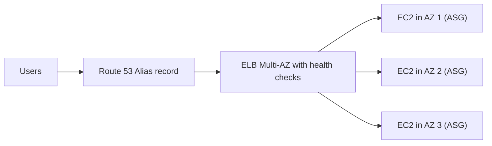
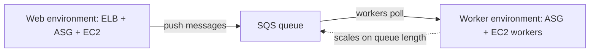

# 11 - Classic Solutions Architecture Discussions

Related: [[Classic Solution Architectures]] (Version C) · [[Elastic Beanstalk]] · [[ELB]] · [[ASG]] · [[Route 53]] · [[ElastiCache]] · [[RDS & Aurora]] · [[EBS]] · [[EFS]] · [[EC2]] · [[CloudFormation]]

## Chapter summary
- Pure solution-architecture chapter: iterative case studies showing how EC2, ELB, ASG, Route 53, ElastiCache, RDS, EBS/EFS fit together. Instructor: be 100% comfortable with it for the exam.
- Stateless scaling path: single EC2 + Elastic IP -> vertical scaling (downtime) -> multiple EC2 + EIPs -> Route 53 A record (TTL problem) -> **ELB + Alias record + health checks** -> **ASG** -> **Multi-AZ** -> Reserved Instances for the minimum capacity.
- Stateful web tier: fix lost shopping carts with **ELB stickiness**, **client cookies** (< 4 KB, validate them), or a **server session ID stored in ElastiCache/DynamoDB** (most common and secure).
- Scale reads with **RDS Read Replicas (up to 15)** or **lazy-loading cache** in ElastiCache; survive AZ failure with Multi-AZ on ELB, ASG, RDS and ElastiCache (Redis).
- Security groups chained: ALB open to the world on 80/443 -> EC2 only from ALB SG -> ElastiCache/RDS only from EC2 SG.
- **EBS** is per-instance/per-AZ; **EFS** (NFS via ENIs in each AZ) is shared by all instances; EBS is cheaper than EFS.
- Fast instantiation: **Golden AMI** + **User Data** (hybrid), restore **RDS/EBS from snapshots**.
- **Elastic Beanstalk**: developer-centric PaaS over EC2/ASG/ELB/RDS; free itself, pay for resources; web tier vs worker tier (SQS); single-instance (dev) vs high-availability (prod).

---

## 01 - Solutions Architecture Discussions Overview
(src: 11/01-Solutions Architecture Discussions Overview)

- Section shows how technologies combine, using increasingly complex cases: whatisthetime.com, myclothes.com, mywordpress.com, instantiating applications quickly, Beanstalk.

---

## 02 - WhatIsTheTime.com
(src: 11/02-WhatsTheTime.com)

Stateless app, no database; start small, accept downtime initially, then scale vertically and horizontally.

**Evolution of the architecture**
1. **t2.micro + Elastic IP** (public EC2). The EIP keeps a static IP across restarts.
2. **Vertical scaling**: stop instance, change type (e.g. M5 large), start. Same IP thanks to EIP, but **downtime** during the change.
3. **Horizontal scaling**: more instances, each with its own EIP; users must know every IP - hard to manage.
4. **Route 53 A record** (e.g. api.whatisthetime.com, TTL 1 hour) instead of EIPs. Only **5 Elastic IPs per region per account by default**. Problem: with a 1-hour TTL, clients keep resolving to a removed instance -> perceived outage. [verify]
   > [!warning] Correction [note]
   > The 5 EIP default quota is confirmed; it is a Service Quotas default that can be increased. Source: [Elastic IP addresses - quota (Amazon EC2 User Guide)](https://docs.aws.amazon.com/AWSEC2/latest/UserGuide/elastic-ip-addresses-eip.html). Note also that AWS now charges for all public IPv4 addresses (same page).
5. **Load balancer + private EC2 instances** (same AZ at first): ELB public, instances private; SG rule referencing the ELB SG. DNS uses an **Alias record** (not A record, because the ELB's IPs change). **Health checks** stop traffic to bad instances, so instances can be added/removed without downtime.
6. **Auto Scaling group** manages the private instances: scale on demand (in/out), no manual add/remove.
7. **Multi-AZ**: ELB and ASG span AZ 1-3 (e.g. 2/2/1 instances). If an AZ fails, the others serve traffic.
8. **Cost**: Reserve (Reserved Instances/Savings Plans) the **minimum ASG capacity** (always running); use On-Demand (or Spot, if interruption is acceptable) for burst instances.

> [!info] Diagram
> **Explanation:** Users resolve the domain through a Route 53 Alias record to a Multi-AZ load balancer, which health-checks and spreads requests across private EC2 instances managed by an Auto Scaling group in several AZs. Losing one AZ leaves the other two serving traffic.
> **Reference:** [What is Elastic Load Balancing? (Elastic Load Balancing User Guide)](https://docs.aws.amazon.com/elasticloadbalancing/latest/userguide/what-is-load-balancing.html). Generic ELB + multi-AZ target pattern; the instructor's specific cases are from the lecture and were not verified on this page.

> [!tip] Exam
> Public vs private IP placement; EIP vs Route 53 vs ELB; **A record cannot be used with an ELB, use Alias**; ELB health checks; ASG for elasticity; Multi-AZ for survival of an AZ failure; reserve the baseline, On-Demand/Spot for the rest; SG referencing (EC2 accepts only from ELB SG).

---

## 03 - MyClothes.com
(src: 11/03-MyClothes.com)

Stateful web app (shopping cart, hundreds of users). Goal: web tier as **stateless** as possible; user addresses in a database.

**Keeping the shopping cart (options)**
| Option | How | Pros / cons |
|---|---|---|
| ELB **stickiness / session affinity** | same user always goes to same instance | works, but cart lost if that instance terminates |
| **User cookies** | cart content sent by the client in every request | instances stay stateless; HTTP requests get heavier; **security risk** (tampering) so instances must **validate** cookies; cookies **< 4 KB** |
| **Server session** (session ID in cookie, data in **ElastiCache**) | any instance looks up the cart by session ID | sub-millisecond; more secure (server is source of truth); very common. **DynamoDB** is an alternative session store |

- **User data (address, name)**: store in **RDS** (long-term, durable); every instance can reach it.
- **Scaling reads**:
  - RDS **Read Replicas** - up to **15** - read from replicas, writes to the master.
  - **Lazy loading / cache-aside** with ElastiCache: check cache; on miss read RDS and write to cache; other instances then get cache hits. Reduces RDS CPU/traffic and improves performance, but needs cache maintenance in the application.
- **Survive disasters**: Route 53 is already highly available; make ELB, ASG and RDS **Multi-AZ** (RDS standby takes over); **ElastiCache Multi-AZ if Redis**.
- **Security groups**: ALB - HTTP/HTTPS from anywhere; EC2 - only from ALB SG; ElastiCache - only from EC2 SG; RDS - only from EC2 SG.
- Result is a classic **three-tier** architecture (client / web tier / database tier); costs more, but the trade-offs are explicit (Multi-AZ and read scaling cost extra).

> [!tip] Exam
> Stickiness = ELB feature; cookies = stateless but small/untrusted; session ID + ElastiCache (or DynamoDB) = secure and common; RDS Read Replicas or ElastiCache to scale reads; Multi-AZ for DR; chain security groups.

---

## 04 - MyWordPress.com
(src: 11/04-MyWordPress.com)

Stateful, fully scalable WordPress (MySQL for content; pictures uploaded must be reachable from all instances).

- **Database**: RDS MySQL Multi-AZ, or **Aurora MySQL** for less operations, Multi-AZ, read replicas, even global databases; easier to operate/scale (instructor's preference, not mandatory).
- **Image storage problem with EBS**: one instance + one EBS volume works. With several instances in different AZs, each has its own EBS volume, so an image uploaded through one instance is **not visible from another**.
- **Solution: EFS** - network file system (NFS) with **ENIs in each AZ**; all instances mount the same shared storage regardless of AZ or instance count.
- **Cost trade-off**: **EBS is cheaper than EFS**, but EFS gives the shared multi-AZ access needed here.

> [!tip] Exam
> Single instance -> EBS; many instances / multi-AZ shared files -> EFS (NFS). Aurora = fewer operations than RDS.

---

## 05 - Instantiating applications quickly
(src: 11/05-Instantiating applications quickly)

- Installing and configuring everything on launch is slow; use cloud features to speed up.
- **EC2**:
  - **Golden AMI**: install apps and OS dependencies beforehand, create an AMI, launch future instances from it - fastest start.
  - **User Data bootstrapping**: slow if used for installs; use it for **dynamic configuration** (e.g. DB URL/password).
  - **Hybrid**: Golden AMI + User Data (this is also how Elastic Beanstalk works).
- **RDS**: restore from a **snapshot** - schema and data ready (much faster than big inserts).
- **EBS**: restore from a **snapshot** - already formatted and containing data.

> [!tip] Exam
> Speed-up toolbox: Golden AMI, User Data, RDS snapshot restore, EBS snapshot restore.

---

## 06 - Beanstalk Overview
(src: 11/06-Beanstalk Overview)

- Common pattern repeats (ELB + ASG multi-AZ + RDS + ElastiCache). Developers want to just run code in many languages/environments with one way of deploying.
- **Elastic Beanstalk** = managed, developer-centric view that reuses EC2, ASG, ELB, RDS etc. Handles capacity provisioning, load balancer config, scaling, health monitoring, instance configuration; you manage only the code (full config control still possible).
- **Beanstalk itself is free**; you pay for the underlying resources (instances, ASG, ELB...).
- **Components**: *application* (collection of environments, versions, configurations); *application version* (iteration of code v1, v2...); *environment* (resources running **one application version at a time**; can update v1 -> v2); environments such as dev/test/prod.
- **Process**: create application -> upload version -> launch environment -> manage lifecycle -> upload new version and deploy.
- **Supported platforms**: Go, Java SE, Java with Tomcat, .NET Core on Linux, .NET on Windows Server, Node.js, PHP, Python, Ruby, Packer builder, single Docker container, multi-container Docker, pre-configured Docker.
- **Environment tiers**:
  - **Web server tier**: ELB -> ASG -> EC2 web servers.
  - **Worker tier**: no direct clients; **SQS queue**, EC2 workers pull messages; **scales on number of SQS messages**. A web environment can push messages to the worker environment's queue.
- **Deployment modes**: **Single instance** (dev; one EC2 with Elastic IP, optional RDS) vs **High availability with load balancer** (prod; ELB + ASG multi-AZ + Multi-AZ RDS).

> [!info] Diagram
> **Explanation:** In a worker tier, no client talks to the instances directly. Messages go into an SQS queue and a daemon on each worker EC2 instance reads and forwards them to the application; the ASG scales with the number of messages. A web environment can feed that queue.
> **Reference:** [Elastic Beanstalk worker environments (AWS Elastic Beanstalk Developer Guide)](https://docs.aws.amazon.com/elasticbeanstalk/latest/dg/concepts-worker.html). The page confirms the SQS daemon/ASG design; "scales on number of SQS messages" is from the lecture.

> [!tip] Exam
> Beanstalk = PaaS reusing EC2/ASG/ELB/RDS, free service, pay for resources. Know web vs worker tier and single-instance vs HA modes.

---

## 07 - Beanstalk Hands On
(src: 11/07-Beanstalk Hands On)

- Environment choice: **web server environment** (websites) vs **worker environment** (process tasks from a queue). Platform used: managed Node.js with default options and the **sample application**.
- Presets: **single instance** (free tier eligible), **high availability** (load balancer), or custom. Single instance used.
- Two IAM roles needed: **service role** (`AWS Elastic Beanstalk service role`, for the Beanstalk environment) and **EC2 instance profile** (Beanstalk Compute role). Both created from pre-filled defaults.
- Behind the scenes Beanstalk uses **CloudFormation** (events, stack, template visible in Application Composer): created an ASG, launch configuration, security groups, an **Elastic IP**, wait condition/handle. A t3.micro instance with public IP was managed by an ASG of one. [verify]
  > [!warning] Correction [note]
  > Launch configurations are outdated: EC2 Auto Scaling no longer supports launch configurations for new accounts since October 1, 2024, and Beanstalk environments should use **launch templates**. Source: [Migrating your Elastic Beanstalk environment to launch templates (Elastic Beanstalk Developer Guide)](https://docs.aws.amazon.com/elasticbeanstalk/latest/dg/environments-cfg-autoscaling-launch-templates.html). The console may show launch templates instead of what the instructor saw.
- Environment pages: **Events**, **Health**, **Logs**, **Monitoring**, **Alarms**, **Managed updates**, **Configuration**; upload/deploy a new version from the console. Several environments (e.g. My Application Dev / Prod) can exist in one application.
- **Beanstalk vs CloudFormation**: Beanstalk is centered on code and environments; CloudFormation deploys arbitrary infrastructure stacks.
- Clean up: Actions -> Delete application (unless you continue to other Beanstalk lectures).

### Hands-on steps
1. Elastic Beanstalk console -> Create application -> **Web server environment**; application name `My Application`.
2. Environment name `My Application Dev` (domain name auto-generated); platform Node.js (managed, defaults); application code = **Sample application**.
3. Preset = **Single instance**; Next.
4. Service access: create the **service role** (`AWS Elastic Beanstalk service role`) then refresh and select it; create the **EC2 instance profile** (Beanstalk Compute), refresh and select it.
5. Skip optional steps (networking etc.) via skip to review; **Submit**.
6. Watch **Events**; open CloudFormation console to see the Beanstalk stack, resources and the template in Application Composer.
7. In EC2 console verify the instance (public IP), the Elastic IP and the Auto Scaling group.
8. When health is OK, open the environment domain name: "Congratulations, you are now running Elastic Beanstalk".
9. Explore Health / Logs / Monitoring / Alarms / Managed updates / Configuration tabs.
10. Cleanup: Actions -> Delete application.

---

Not covered: all lectures in this chapter have a transcript.
