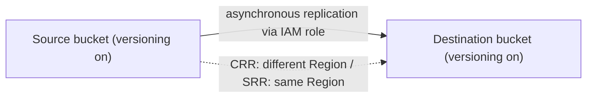

# 12 - Amazon S3 Introduction

Related: [[S3]] (Version C service note) · [[S3 Security & Encryption]] · [[IAM]] · [[CloudFront & Global Accelerator]] · [[EC2]]

## Chapter summary
- **S3 = infinitely scaling object storage**; buckets are created in a **region**, objects have a **key** (full path = prefix + object name); no real directories.
- **Max object size 50 TB**; uploads **> 5 GB must use multi-part upload**; object tags up to **10**; metadata and version ID also attached.
- Bucket naming: new **account regional namespace** (AWS adds account ID/region suffix) vs the older **global namespace** (globally unique).
- Security: **IAM policies** (user-based), **bucket policies** (JSON, resource-based, cross-account, public access), ACLs (disabled by default), **Block Public Access** (overrides policy); encryption. Access allowed if IAM **or** resource policy allows **and** no explicit deny.
- **Static website hosting** needs public reads; 403 Forbidden = bucket not public.
- **Versioning** (bucket-level): protects against deletes (delete marker) and enables rollback; unversioned objects have version `null`; suspending versioning does not delete versions.
- **Replication** (CRR / SRR): async, needs versioning on both buckets, IAM role; only new objects; Batch Replication for existing; delete markers optional; version-ID deletes never replicated; no chaining.
- **Storage classes**: Standard, Standard-IA, One Zone-IA, Glacier Instant / Flexible / Deep Archive, Intelligent-Tiering, plus **Express One Zone**; durability 11 nines everywhere, availability and cost differ; **Lifecycle rules** automate transitions.

---

## 01 - S3 Overview
(src: 12/01-S3 Overview)

- S3 is a main AWS building block, advertised as **infinitely scaling storage**; many websites and AWS services depend on it.
- **Use cases**: backup and storage, disaster recovery (copy to another region), archive, hybrid cloud storage, hosting applications and media, **data lake / big data analytics**, software delivery, **static websites**. Examples given: NASDAQ stores 7 years of data in S3 Glacier; Sysco runs analytics on S3 data.
- **Buckets**: containers ("directories") for objects, **defined at region level**; the console shows buckets of all regions in one list.
- **Bucket naming**:
  - Historically the name had to be **globally unique** (across all regions and accounts).
  - New **account regional namespace**: you pick a name, AWS appends a suffix (account ID + region) so it is unique to you; the same name can be reused across regions/accounts.
  - Rules: no uppercase, no underscore, not an IP address, start with a lowercase letter or number, must not start with `xn--`, must not end with `-s3alias`.
- **Objects**: have a **key = full path** (e.g. `my_folder1/another_folder/my_file.txt`); key = **prefix** (`my_folder1/another_folder/`) + **object name** (`my_file.txt`). S3 has no directory concept; the console only simulates folders.
- **Object value**: body content, **max object size 50 TB**; if **> 5 GB use multi-part upload** (e.g. a 5 TB file = at least 1,000 parts of 5 GB). Also **metadata** (system or user key/value pairs), **tags** (Unicode key/value, **up to 10**, useful for security and lifecycle) and **version ID** if versioning is enabled.

> [!info] Source check
> The 50 TB limit and the account regional namespace naming (`<name>-<accountId>-<region>-an` suffix) are consistent with AWS docs: [S3 objects overview](https://docs.aws.amazon.com/AmazonS3/latest/userguide/UsingObjects.html) and [General purpose bucket naming rules](https://docs.aws.amazon.com/AmazonS3/latest/userguide/bucketnamingrules.html). The docs also list more reserved prefixes/suffixes (e.g. `sthree-`, `amzn-s3-demo-`, `--x-s3`) and a 3-63 character length; the instructor lists only some of them.

> [!tip] Exam
> S3 buckets are regional but names are (by default) global; key = prefix + object name; max object 50 TB, multi-part upload recommended/required above 5 GB; tags max 10.

---

## 02 - S3 Hands On
(src: 12/02-S3 Hands On)

- Create-bucket options: region (e.g. eu-west-1), **bucket type General purpose** (default/common) vs **Directory** (low-latency use cases), **namespace** Global vs Account Regional, Object Ownership (**ACLs disabled**, recommended), **Block all public access** (left on), **Versioning disabled**, tags none, default encryption **SSE-S3** with **Bucket Key** enabled.
- With the global namespace, a name like `test` already exists (error); you must keep trying new names. With the account regional namespace any name works because the suffix makes it unique.
- Bucket list shows buckets from all regions; searchable.
- Uploaded `coffee.jpg` (~100 KB). Object page shows properties and **Object URL**.
  - **Open** works (uses a **pre-signed URL** containing the signer's credentials/signature).
  - Plain **Object URL gives AccessDenied** because the object is not public.
- Folders: "create folder" (e.g. `images`) and upload inside it; deleting a folder deletes everything inside (type `permanently delete`).

### Hands-on steps
1. S3 console -> Create bucket; choose region, General purpose, namespace (global or account regional), keep ACLs disabled, Block Public Access on, versioning off, SSE-S3 + Bucket Key.
2. Create bucket; open it; Upload -> add `coffee.jpg` from the course `s3` code folder.
3. Open the object; click **Open** (works, pre-signed URL) and then try the Object URL (AccessDenied).
4. Create folder `images`; upload `beach.jpg` inside.
5. Delete the folder (type `permanently delete`).

---

## 03 - S3 Security: Bucket Policy
(src: 12/03-S3 Security- Bucket Policy)

- **Security layers**:
  - **User-based**: IAM policies define which API calls an IAM user may make.
  - **Resource-based**: **S3 bucket policies** (bucket-wide rules; allow other accounts = **cross-account**; make a bucket public); **Object ACL** (finer grain, can be disabled); **Bucket ACL** (rare, can be disabled).
  - **Encryption** with keys.
- **An IAM principal can access an object if** IAM permissions allow it **or** the resource policy allows it, **and** there is **no explicit deny**.
- **Bucket policy** = JSON with: **Resource** (buckets/objects; `bucket/*` means every object), **Effect** (Allow/Deny), **Action** (set of APIs, e.g. `s3:GetObject`), **Principal** (account/user; `*` = anyone). Example: Allow `GetObject` for `*` on all objects = public read.
- Uses: public access, **force encryption at upload**, **cross-account access**.
- **Access patterns**:
  | Who | Mechanism |
  |---|---|
  | Public website visitor | bucket policy allowing public read |
  | IAM user in same account | IAM policy |
  | EC2 instance | **IAM role** (instance role) with S3 permissions (not IAM user keys) |
  | Another AWS account | **bucket policy** granting cross-account access |
- **Block Public Access** settings: extra safety layer to prevent data leaks; even a public bucket policy will not make the bucket public while they are enabled. Can be set at **bucket or account level**; leave on if buckets should never be public.

> [!tip] Exam
> Cross-account access -> bucket policy. EC2 -> IAM role. Public access needs **both** Block Public Access off and a public bucket policy.

---

## 04 - S3 Security: Bucket Policy Hands On
(src: 12/04-S3 Security- Bucket Policy Hands On)

- Goal: make `coffee.jpg` reachable by its public Object URL.
- Policy generator ("AWS Policy Generator") builds the JSON; ARN must be `<bucket-arn>/*` because `GetObject` applies to objects (after the slash).
- Disabling Block Public Access is a dangerous action; only do it when you really want a public bucket.

### Hands-on steps
1. Bucket -> **Permissions** -> Block public access -> Edit -> untick **Block all public access** -> confirm.
2. Scroll to **Bucket policy** -> Edit; (optionally view the policy examples in the docs).
3. Open the **AWS Policy Generator**: type S3 Bucket Policy, Effect **Allow**, Principal `*`, Action `GetObject`, Resource = bucket ARN (copied from the bucket page) + `/*`; Add statement -> Generate policy.
4. Paste the JSON into the bucket policy editor (remove stray space) -> Save.
5. Open the object's Object URL: the image is now visible publicly.

---

## 05 - S3 Website Overview
(src: 12/05-S3 Website Overview)

- S3 can host **static websites** reachable on the internet. The website URL depends on the region; two formats exist that differ only by a dash vs a dot before the region (not necessary to memorize).
- Bucket holds HTML and images; the website setting must be enabled.
- **Requires public reads**; a **403 Forbidden** after enabling website hosting means the bucket is not public -> attach a public bucket policy.

> [!tip] Exam
> 403 Forbidden on an S3 website = missing public read (bucket policy / Block Public Access).

---

## 06 - S3 Website Hands On
(src: 12/06-S3 Website Hands On)

### Hands-on steps
1. Upload `beach.jpg` to the bucket (two images now).
2. Bucket -> **Properties** -> bottom -> **Static website hosting** -> Edit -> enable, host a static website, **index document** `index.html` (warning: content must be publicly readable) -> Save.
3. Upload `index.html` to the bucket.
4. Properties -> Static website hosting now shows the **bucket website endpoint**; open it: the page displays "I love coffee. Hello world!" and the coffee image (works thanks to the public bucket policy); `beach.jpg` is also reachable.

---

## 07 - S3 Versioning
(src: 12/07-S3 Versioning)

- Enabled at the **bucket level**. Re-uploading the same key creates version 2, 3, and so on.
- **Best practice**: protects against unintended deletes (a delete adds a **delete marker**, so previous versions can be restored) and allows easy **rollback**.
- Notes: files uploaded **before** versioning is enabled get version ID **`null`**; **suspending versioning does not delete previous versions** (safe operation).

> [!tip] Exam
> Delete of a versioned object = delete marker; suspend != delete versions; pre-existing objects have `null` version.

---

## 08 - S3 Versioning - Hands On
(src: 12/08-S3 Versioning - Hands On)

- Overwriting `index.html` after enabling versioning creates a new version ID; the older upload keeps version ID `null`. `beach.jpg` and `coffee.jpg` stay `null`.
- **Delete a specific version ID = permanent delete** (destructive, cannot be undone) -> rollback to the previous page content.
- **Delete without "Show versions" = adds a delete marker**; the object appears gone (404 Not Found, hard refresh needed) but older versions remain. **Deleting the delete marker** (permanently) restores the object.

### Hands-on steps
1. Bucket -> Properties -> **Bucket Versioning** -> Edit -> Enable.
2. Edit local `index.html` ("I really love coffee") and upload it again (same key).
3. Refresh the website: new content shown. Toggle **Show versions** in the object list to see version IDs (`null` for the old files).
4. To roll back: with Show versions on, select the newest `index.html` version -> Delete -> type `permanently delete`; the website returns to "I love coffee".
5. With Show versions off, delete `coffee.jpg` (type `delete`): a **delete marker** is created; the site returns 404 for the image.
6. Show versions -> select the delete marker -> permanently delete it; the image is restored.

---

## 09 - S3 Replication
(src: 12/09-S3 Replication)

- **CRR** = Cross-Region Replication (different regions); **SRR** = Same-Region Replication.
- **Asynchronous** replication between a source and a target bucket; buckets can be in **different AWS accounts**.
- Requirements: **versioning enabled on source and destination**; S3 needs **IAM permissions** (role) to read from the source and write to the destination.
- **Use cases**: CRR - compliance, lower latency access, cross-account replication; SRR - aggregate logs across buckets, live replication between production and test accounts.

> [!info] Diagram
> **Explanation:** A replication rule on the source bucket asynchronously copies new objects to the destination bucket, assuming an IAM role that lets S3 read the source and write the target. The destination can be in another Region (CRR), the same Region (SRR) and/or another account; both buckets need versioning.
> **Reference:** [Replicating objects within and across Regions (Amazon S3 User Guide)](https://docs.aws.amazon.com/AmazonS3/latest/userguide/replication.html)

> [!tip] Exam
> Replication needs **versioning on both buckets** + IAM role. CRR = compliance/latency; SRR = log aggregation / prod-test sync.

---

## 10 - S3 Replication Notes
(src: 12/10-S3 Replication Notes)

- After enabling replication **only new objects** are replicated. For **existing objects** (and objects that failed replication) use **S3 Batch Replication**.
- **Delete markers**: replication from source to target is an **optional** setting. Deletes **with a version ID are not replicated** (permanent deletes), to avoid malicious deletes.
- **No chaining**: bucket 1 -> bucket 2 and bucket 2 -> bucket 3 does **not** replicate bucket 1's objects to bucket 3.

> [!info] Source check
> AWS docs confirm live replication does not copy pre-existing objects (use S3 Batch Replication) and that Batch Replication also covers previously failed objects: [Replicating objects within and across Regions](https://docs.aws.amazon.com/AmazonS3/latest/userguide/replication.html). Chaining and delete-marker details were not confirmed on that page.

> [!tip] Exam
> Existing objects -> Batch Replication; version-ID deletes not replicated; delete markers optional; no chaining.

---

## 11 - S3 Replication - Hands On
(src: 12/11-S3 Replication - Hands On)

- Origin bucket (e.g. eu-west-1) and replica bucket (e.g. us-east-1 = CRR; same region would be SRR); **versioning enabled on both**.
- Rule scope can be all objects; destination in this or another account; a **new IAM role** can be created by the console.
- Prompt "replicate existing objects?" - answered **No** (existing objects need a Batch Operation, separate from the replication feature).
- After uploading a new file, replication took ~5-10 seconds; the **version ID is identical** in origin and replica (version IDs are replicated).
- **Delete marker replication** option is off by default; once enabled, a delete in the origin (creating a delete marker) appears in the replica after a short wait.
- **Permanently deleting a specific version** in the origin is **not replicated** (only delete markers are).

### Hands-on steps
1. Create origin bucket (e.g. `s3-stephane-bucket-origin-v2`, eu-west-1) with **versioning**; create replica bucket (e.g. `s3-stephane-bucket-replica-v2`, us-east-1 or same region) with **versioning**.
2. Upload `beach.jpg` to the origin (before the rule: it will not replicate).
3. Origin bucket -> **Management** -> Replication rules -> Create rule: name `DemoReplicationRule`, enabled, scope all objects, destination = replica bucket name (region auto-detected), **create new IAM role**, Save.
4. Answer **No** to replicating existing objects.
5. Upload `coffee.jpg` to the origin; show versions; refresh the replica bucket after a few seconds: the object and the same version ID appear.
6. Upload `beach.jpg` again (new version) to see it replicate.
7. Management -> edit rule -> enable **Delete marker replication** -> Save.
8. Delete `coffee.jpg` in the origin (creates a delete marker); refresh the replica to see the delete marker replicated.
9. Delete a specific version ID in the origin (permanent delete): it is **not** replicated.

---

## 12 - S3 Storage Classes Overview
(src: 12/12-S3 Storage Classes Overview)

- Choose class at upload, change it manually, or automate with **Lifecycle configurations**.
- **Durability**: **11 nines (99.999999999%)**, same for all classes (store 10 million objects, lose one on average every 10,000 years).
- **Availability** depends on class (S3 Standard 99.99% = about 53 minutes/year of errors).

| Class | Availability | Min storage duration | Retrieval / cost notes | Use cases |
|---|---|---|---|---|
| **Standard (General Purpose)** | 99.99% | none | low latency, high throughput; survives 2 concurrent facility failures | big data analytics, mobile and gaming apps, content distribution |
| **Standard-IA** | 99.9% | (not stated) | lower storage cost than Standard, **retrieval fee**; rapid access when needed | DR, backups |
| **One Zone-IA** | 99.5% | (not stated) | single AZ; data **lost if AZ destroyed**; high durability only within the AZ | secondary backup copies, re-creatable data |
| **Glacier Instant Retrieval** | (not stated) | **90 days** | **milliseconds** retrieval; pay storage + retrieval | archive accessed about once a quarter |
| **Glacier Flexible Retrieval** (formerly S3 Glacier) | (not stated) | **90 days** | **Expedited 1-5 min**, **Standard 3-5 h**, **Bulk 5-12 h (free)** | archive, backup |
| **Glacier Deep Archive** | (not stated) | **180 days** | **Standard 12 h**, **Bulk 48 h**; lowest cost | long-term storage |
| **Intelligent-Tiering** | (not stated) | none | small monthly **monitoring + auto-tiering fee**, **no retrieval charges** | unknown/changing access patterns |

- **Intelligent-Tiering tiers**: Frequent Access (automatic, default); Infrequent Access (automatic, not accessed 30 days); **Archive Instant Access** (automatic, 90 days); **Archive Access** (optional, configurable 90 to 700+ days); **Deep Archive Access** (optional, 180 to 700+ days).
- Instructor: do not memorize the full comparison/pricing charts, but understand them (11 nines everywhere; fewer AZs = lower availability).

[verify] Glacier Instant Retrieval / Flexible Retrieval / Deep Archive retrieval times and minimum durations are quoted from the lecture only.
> [!warning] Correction [note]
> Unconfirmed: the AWS storage-classes page summary fetched ([Amazon S3 storage classes](https://aws.amazon.com/s3/storage-classes/)) confirms 11 nines durability, millisecond access for Instant Retrieval, free bulk retrieval for Flexible Retrieval and 12-48 hour retrieval for Deep Archive, but did not return the exact per-class availability %, minimum durations or minute/hour figures. Check the page's comparison table before relying on them.

> [!tip] Exam
> Know each class's purpose: Standard (frequent), IA (infrequent, rapid), One Zone-IA (re-creatable, single AZ), Glacier IR (ms, 90 days), Flexible (min-hours), Deep Archive (12-48 h, 180 days, cheapest), Intelligent-Tiering (unknown patterns, no retrieval fee).

---

## 13 - S3 Storage Classes Hands On
(src: 12/13-S3 Storage Classes Hands On)

- Upload options show every class with AZ count, minimum storage duration, minimum billable object size and monitoring/auto-tiering fees.
- Classes listed: Standard (default), Intelligent-Tiering, Standard-IA, One Zone-IA, Glacier Instant Retrieval, Glacier Flexible Retrieval, Glacier Deep Archive, and **Reduced Redundancy** (deprecated; not covered).
- A storage class can be **edited after upload** (Properties -> storage class), e.g. Standard-IA -> One Zone-IA -> Glacier Instant Retrieval / Intelligent-Tiering.
- **Lifecycle rules** (bucket -> Management): transition current versions between classes automatically, e.g. Standard-IA after 30 days, Intelligent-Tiering after 60 days, Glacier Flexible Retrieval after 180 days.

### Hands-on steps
1. Create a bucket (e.g. `s3-storage-classes-demos-2022`, any region).
2. Upload `coffee.jpg`; expand **Properties** -> Storage class and review the options; choose **Standard-IA** and upload.
3. Object -> Properties -> Storage class -> Edit: change to **One Zone-IA** (then optionally Glacier Instant Retrieval / Intelligent-Tiering); Save.
4. Bucket -> **Management** -> Create lifecycle rule `DemoRule`, apply to all objects, "move current versions between storage classes": Standard-IA at 30 days, Intelligent-Tiering at 60 days, Glacier Flexible Retrieval at 180 days; review transitions.

---

## 14 - S3 Express One Zone
(src: 12/14-S3 Express One Zone)

- High-performance **single-AZ** storage class; objects live in a **directory bucket** (special bucket type) in **one AZ you choose**.
- Performance: **hundreds of thousands of requests/second**, **single-digit millisecond** latency; **about 10x the performance of S3 Standard** and **about 50% lower cost**. [verify]
  > [!warning] Correction [note]
  > AWS now states S3 Express One Zone delivers data access speed **up to 10x faster** and **request costs up to 80% lower** than S3 Standard (the 50% figure refers to an earlier pricing). Source: [Amazon S3 Express One Zone (aws.amazon.com)](https://aws.amazon.com/s3/storage-classes/express-one-zone/) and [Amazon S3 storage classes](https://aws.amazon.com/s3/storage-classes/). Prices change; verify current pricing.
- Good durability but **lower availability** (one AZ instead of three); an AZ problem directly affects you.
- Benefit: **co-locate storage and compute in the same AZ** to cut latency and possibly networking cost.
- Use cases: latency-sensitive and data-intensive apps, **AI/ML training**, financial modeling, media processing, HPC. Integrates with **SageMaker Model Training, Athena, EMR, Glue**.

> [!tip] Exam
> Express One Zone = directory bucket, single AZ, ultra-low latency; pick it for latency-sensitive, co-located compute workloads.

---

Not covered: all lectures in this chapter have a transcript.
