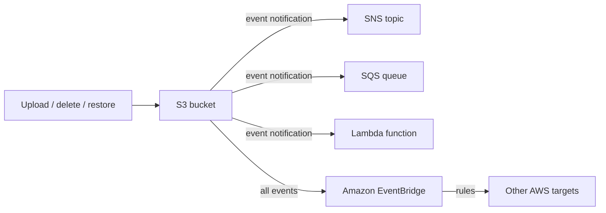

# 13 - Advanced Amazon S3

Related: [[S3]] (Version C service note) · [[S3 Security & Encryption]] · [[CloudFront & Global Accelerator]] · [[SQS]] · [[SNS]] · [[EventBridge]] · [[Lambda]]

## Chapter summary
- **Lifecycle rules** automate **transition actions** (move between storage classes) and **expiration actions** (delete objects, old versions, incomplete multipart uploads); scope by prefix or tags.
- **S3 Analytics** recommends transition timing for **Standard -> Standard IA only** (not One-Zone IA or Glacier); daily CSV report, data after 24-48 hours.
- **Requester Pays**: the requester (must be authenticated, not anonymous) pays the download/network cost; the owner still pays storage.
- **Event Notifications** go to **SNS, SQS, Lambda** (via resource access policies, not IAM roles) or to **EventBridge** (all events, advanced filtering, 18+ targets, archive/replay).
- **Baseline performance**: 100-200 ms first byte; **3,500 PUT/COPY/POST/DELETE and 5,500 GET/HEAD per second per prefix**.
- **Speed-ups**: multipart upload (>100 MB recommended, >5 GB required), Transfer Acceleration (edge location + private AWS network), Byte-Range Fetches (parallel or partial GETs).
- **Batch Operations**: bulk action on a list of objects (S3 Inventory + Athena to build the list); classic use = encrypt all unencrypted objects.
- **Storage Lens**: org-wide storage analytics and dashboards; free vs advanced (paid) metrics; default dashboard cannot be deleted.

---

## 01 - S3 Lifecycle Rules (with S3 Analytics)
(src: 13/01-S3 Lifecycle Rules (with S3 Analytics))

- Objects can move between storage classes manually or automatically via **lifecycle rules**. Transitions are allowed along the class "waterfall" (Standard -> Standard IA -> Intelligent-Tiering -> One-Zone IA -> Glacier Flexible Retrieval -> Glacier Deep Archive). Infrequent access -> Standard IA; archival -> Glacier tiers / Deep Archive.
- A rule is made of:
  - **Transition actions** - e.g. move to Standard IA 60 days after creation; move to Glacier after 6 months.
  - **Expiration actions** - e.g. delete access logs after 365 days; delete old object versions (versioning enabled); delete **incomplete multipart uploads** (e.g. older than 2 weeks).
- Rules can apply to the whole bucket or to a **prefix**, and can be filtered by **object tags** (e.g. only department = finance).

**Exam scenarios**

| Scenario | Design |
|---|---|
| Profile photos on EC2: thumbnails re-creatable and needed only 60 days; source images must be immediately retrievable for 60 days, then user can wait up to 6 hours | Source images in **Standard**, lifecycle transition to **Glacier** after 60 days. Thumbnails in **One-Zone IA** (re-creatable), lifecycle **expire after 60 days**. Use a **prefix** to separate source vs thumbnails. |
| Deleted objects recoverable immediately for 30 days, then within 48 hours up to 365 days | Enable **versioning** (delete marker hides the object); lifecycle rule moves **non-current versions** to **Standard IA**, then to **Glacier Deep Archive**. |

- **S3 Analytics** (storage class analysis) helps pick the optimal number of days: recommendations for **Standard and Standard IA only (not One-Zone IA or Glacier)**. Produces a **CSV report updated daily**; takes **24 to 48 hours** before data appears. Good first step to build or improve lifecycle rules.

> [!tip] Exam
> Transition = change class; expiration = delete. S3 Analytics works for Standard -> Standard IA only. Versioned buckets: use non-current-version transitions/expiration.

---

## 02 - S3 Lifecycle Rules - Hands On
(src: 13/02-S3 Lifecycle Rules - Hands On)

- Five rule actions exist: move **current** versions between classes; move **non-current** versions between classes; **expire current** versions; **permanently delete non-current** versions; delete **expired object delete markers / incomplete multipart uploads**.
- Current version = the most recent, displayed to the user; non-current = overwritten by a newer one.
- Example current-version timeline: Standard IA at 30 days -> Intelligent-Tiering at 60 -> Glacier Instant Retrieval at 90 -> Glacier Flexible Retrieval at 180 -> Deep Archive at 365. Any number of transitions is allowed.
- Example non-current: Glacier Flexible after 90 days; expire current and permanently delete non-current after 700 days.
- The console shows a **timeline** of what will happen to current and non-current versions.

### Hands-on steps
1. Bucket -> **Management** -> Create lifecycle rule; name `demo rule`; apply to all objects in the bucket; acknowledge the warning.
2. Tick the rule actions: transition current versions, transition non-current versions, expire current versions, permanently delete non-current versions.
3. Add transitions with days (30 / 60 / 90 / 180 / 365 for current; 90 for non-current) and expiration (700 days) [screen action: exact fields].
4. Review the timeline, then create the rule; it runs in the background.

---

## 03 - S3 Requester Pays
(src: 13/03-S3 Requester Pays)

- Normally the **bucket owner pays** storage and data-transfer costs.
- With **Requester Pays**, the **requester pays the networking/download cost**; the owner still pays storage.
- Useful for sharing large datasets with other accounts.
- The requester **must be authenticated in AWS (not anonymous)** so AWS can bill them.

> [!tip] Exam
> Requester Pays = requester pays the download cost, must be authenticated; storage stays with the owner.

---

## 04 - S3 Event Notifications
(src: 13/04-S3 Event Notifications)

- Events: object created, removed, restored, replication, etc. Filter by name (e.g. suffix `.jpeg`). Use case: generate thumbnails on image upload. Create as many events as desired.
- Destinations: **SNS topic, SQS queue, Lambda function**. Delivery is typically **within seconds**, sometimes a minute or longer.
- Permissions: **no IAM roles**; use **resource access policies**: SNS resource access policy, SQS resource access policy, Lambda resource policy - letting S3 publish/invoke (similar to a bucket policy).
- **EventBridge integration**: all events from the bucket go to EventBridge; rules can send to **18+ AWS services**. Extras: advanced filtering (metadata, object size, name), multiple destinations at once (e.g. Step Functions, Kinesis Data Streams, Firehose), **archive and replay**, more reliable delivery.

> [!info] Diagram
> **Explanation:** S3 publishes bucket events to SNS, SQS or Lambda (each needing a resource policy that lets S3 send/invoke), or sends all events to EventBridge where rules fan them out to many other targets.
> **Reference:** [Amazon S3 Event Notifications (Amazon S3 User Guide)](https://docs.aws.amazon.com/AmazonS3/latest/userguide/EventNotifications.html)

> [!tip] Exam
> Targets: SNS, SQS, Lambda (resource policies) plus EventBridge. Access is granted by resource policy, not IAM role.

---

## 05 - S3 Event Notifications - Hands On
(src: 13/05-S3 Event Notifications - Hands On)

- Bucket **Properties -> Event notifications** offers two options: create an event notification, or enable the **Amazon EventBridge** integration (send all events).
- Destinations offered: Lambda, SNS, SQS. Event types are granular (object create, removal, restore, etc.).
- Saving fails with an "unable to validate destination" error until the SQS access policy allows S3 to send messages. Once fixed, S3 sends a **test event** to the queue.
- After uploading an object, the SQS message shows `eventName` = `ObjectCreated:Put` and the object key.

### Hands-on steps
1. Create a bucket (e.g. in eu-west-1).
2. Properties -> Event notifications -> Create: name `DemoEventNotification`, no prefix/suffix, event type **All object create events**, destination **SQS queue**.
3. In SQS, create a queue `DemoS3Notification`.
4. Back in S3, selecting the queue and saving fails -> edit the queue **access policy**: Policy Generator -> SQS Queue Policy, effect Allow, principal anyone (very permissive, demo only), action SendMessage, resource = queue ARN, add statement, generate and paste.
5. Save the notification (succeeds). In SQS **Send and receive messages -> Poll** to see and delete the S3 test message.
6. Upload an image to the bucket, poll SQS again, inspect the message (`ObjectCreated:Put`, key), delete it.

---

## 06 - S3 Performance
(src: 13/06-S3 Performance)

- Scales automatically; **100-200 ms** latency to first byte.
- Per **prefix** (path between bucket and file name): **3,500 PUT/COPY/POST/DELETE** and **5,500 GET/HEAD** requests per second. No limit on the number of prefixes. Spreading reads evenly over 4 prefixes -> ~22,000 GET/HEAD per second.

| Technique | Purpose | Details |
|---|---|---|
| **Multipart upload** | Faster uploads | Recommended for files **>100 MB**, **required >5 GB**; parts uploaded in parallel and reassembled by S3 |
| **Transfer Acceleration** | Faster upload/download over distance | Send to nearest **edge location** (200+), which forwards over the private AWS network to the target-region bucket; compatible with multipart upload |
| **Byte-Range Fetches** | Faster downloads / partial reads | Parallel GETs of byte ranges; retry only a failed range; fetch only a header (e.g. first 50 bytes) |

- Example: file in USA -> edge in USA over public internet (short) -> private AWS network -> bucket in Australia.
- Instructor also mentions KMS limits: see [[S3 Security & Encryption]] (chapter 14 / 01) for the KMS request quota.

> [!tip] Exam
> 3,500 write / 5,500 read per second per prefix. Multipart upload for big files; Transfer Acceleration for long distance; Byte-Range Fetches for parallel or partial reads.

---

## 07 - S3 Batch Operations
(src: 13/07-S3 Batch Operations)

- Perform **bulk operations on existing objects with a single request**: modify metadata/properties, copy between buckets, **encrypt all unencrypted objects** (exam-relevant), modify ACLs/tags, restore many objects from Glacier, invoke a **Lambda** function per object.
- A job = list of objects + action + optional parameters.
- Why not script it: built-in **retries, progress tracking, completion notifications, reports**.
- Build the object list with **S3 Inventory**, filter with **Athena**, then pass to Batch Operations.

> [!tip] Exam
> Find unencrypted objects with S3 Inventory (+ Athena), then encrypt them all with S3 Batch Operations.

---

## 08 - S3 Storage Lens
(src: 13/08-S3 Storage Lens)

- Analyze and optimize storage across an **entire AWS Organization**: find anomalies, cost efficiencies, apply protection best practices. Aggregate by organization, account, region, bucket, or prefix; **30-day** usage/activity view as described by the instructor. Metrics can be exported to S3 in **CSV or Parquet**.
- **Default dashboard**: pre-configured, multi-region and multi-account, shows free and advanced trends; **cannot be deleted, can be disabled**. Custom dashboards are possible.
- Metric categories:
  - **Summary** (storage bytes, object counts) - find fastest-growing / unused buckets and prefixes.
  - **Cost optimization** (non-current version storage bytes, incomplete multipart upload bytes).
  - **Data protection** (versioning-enabled, MFA delete, SSE-KMS, cross-region replication rule counts).
  - **Access management** (Object Ownership settings).
  - **Event** (buckets with event notifications), **Performance** (Transfer Acceleration enabled).
  - **Activity** (all/GET/PUT requests, bytes downloaded) and **HTTP status codes** (200 OK, 403 Forbidden...).

| | Free metrics | Advanced metrics and recommendations (paid) |
|---|---|---|
| Availability | All customers automatically | Additional charge |
| Content | ~28 usage metrics | + activity, advanced cost optimization, advanced data protection, status codes |
| Retention for queries | **14 days** | **15 months** |
| CloudWatch publishing | no | yes, no extra CloudWatch charge for access (per lecture) |
| Prefix-level metrics | no | yes |

[verify] Free metrics "around 28 usage metrics".
> [!warning] Correction [note]
> The current docs do not give a count; the free tier is described as summary, cost optimization, data protection, access management, performance and event metrics (14-day query window, 15 months for advanced confirmed). The exact "28" is unconfirmed. Source: [Understanding Amazon S3 Storage Lens](https://docs.aws.amazon.com/AmazonS3/latest/userguide/storage_lens_basics_metrics_recommendations.html)

> [!tip] Exam
> Storage Lens = org-wide visibility. Know free vs paid, that the default dashboard spans accounts/regions, and that it can show e.g. how many objects are encrypted.

---

## Not covered
- All lectures in this chapter have transcripts.
