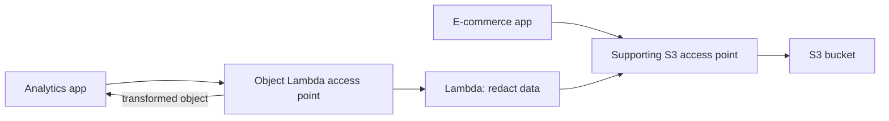

# 14 - Amazon S3 Security

Related: [[S3 Security & Encryption]] (Version C service note) · [[S3]] · [[KMS, CloudHSM & ACM]] · [[IAM]] · [[Lambda]] · [[VPC]] · [[CloudTrail & Config]]

## Chapter summary
- **Encryption at rest**: SSE-S3 (default), SSE-KMS, DSSE-KMS (dual layer), SSE-C (customer-provided key, HTTPS only, CLI only), client-side encryption.
- **SSE-KMS** adds key control and **CloudTrail auditing**, but every upload/download calls KMS APIs and counts against **KMS request quotas** (throttling risk at high throughput).
- **Encryption in transit** = HTTPS; enforce with a bucket policy denying `aws:SecureTransport = false`. Bucket policies are evaluated before default encryption.
- **CORS**: browser mechanism; the *cross-origin* bucket must return `Access-Control-Allow-Origin` (configured in the bucket's CORS JSON).
- **MFA Delete**: needed to permanently delete a version or suspend versioning; requires versioning; only the **root** can enable it, and only via **CLI**.
- **Access logs** go to a separate bucket in the same region; never log into the monitored bucket (infinite loop).
- **Pre-signed URLs**: temporary GET/PUT access with the creator's permissions (console max 12 h, CLI max 168 h).
- **Glacier Vault Lock / S3 Object Lock** = WORM; Object Lock modes: Compliance (strict) vs Governance; plus Legal Hold.
- **Access Points** simplify per-team access; **Object Lambda** transforms objects on retrieval via Lambda.

---

## 01 - S3 Encryption
(src: 14/01-S3 Encryption)

| Method | Keys | Details |
|---|---|---|
| **SSE-S3** | Owned/managed by AWS; you never see the key | **AES-256**; header `x-amz-server-side-encryption: AES256`; **enabled by default** for new buckets and objects |
| **SSE-KMS** | KMS keys you control | Header `x-amz-server-side-encryption: aws:kms` (and the KMS key); user control of keys; **audit key use in CloudTrail**; reading needs access to the object **and** the KMS key |
| **DSSE-KMS** | KMS + S3 managed keys | **Dual-layer** server-side encryption (object encrypted twice); right answer when an exam question requires multi-layer encryption; header value `aws:kms:dsse` (spoken as "AWS KMS-DSSE") |
| **SSE-C** | Customer-provided key, managed outside AWS | Server-side; key sent with each request, **never stored by S3** (discarded after use); **HTTPS mandatory**, key passed in HTTP headers; must provide the key again to read |
| **Client-side** | Client key outside AWS | Client encrypts before upload (e.g. client-side encryption library) and decrypts after download; client fully manages keys and cycle |

- **SSE-KMS limitation**: uploads call `GenerateDataKey`, downloads call `Decrypt`; each counts toward **KMS API quotas**, "between 5,000 and 30,000 requests per second depending on region", increasable via Service Quotas. Very high-throughput buckets may be throttled - exam topic.

[verify] KMS quota "between 5,000 and 30,000 requests per second based on region".
> [!warning] Correction [note]
> The KMS docs now list shared symmetric cryptographic-operation quotas of 10,000/s (default), 20,000/s in several regions (e.g. us-east-2, eu-central-1, ap-southeast-1) and 100,000/s in us-east-1, us-west-2 and eu-west-1; all are adjustable. The docs' S3 example cites combined SSE-KMS uploads/downloads of 5,500, 10,000 or 50,000/s depending on region. The principle (SSE-KMS counts against KMS quotas) still holds. Source: [AWS KMS request quotas](https://docs.aws.amazon.com/kms/latest/developerguide/requests-per-second.html)

- **Encryption in transit** (SSL/TLS): S3 has an HTTP endpoint (not encrypted) and an HTTPS endpoint (encrypted). HTTPS is recommended, **mandatory for SSE-C**; most clients use HTTPS by default.
- **Force HTTPS** with a bucket policy: Deny `s3:GetObject` when condition `aws:SecureTransport` is `false`.

> [!tip] Exam
> SSE-S3 = AWS-managed AES-256 (default). SSE-KMS = KMS key + CloudTrail audit, watch KMS quotas. DSSE-KMS = two layers. SSE-C = your key, HTTPS only. Client-side = you encrypt. In transit = HTTPS / `aws:SecureTransport`.

---

## 02 - About DSSE-KMS
(src: 14/02-About DSSE-KMS)

- No transcript available for this lecture. (See DSSE-KMS in 14/01 and 14/03.)

---

## 03 - S3 Encryption - Hands On
(src: 14/03-S3 Encryption - Hands On)

- Bucket creation requires a default encryption choice: **SSE-S3**, **SSE-KMS** or **DSSE-KMS**.
- Editing the encryption of an existing object **creates a new version** (versioning enabled in demo).
- KMS key choice: enter a key ARN or choose from your keys; the **AWS managed key `aws/s3`** is free; your own KMS key **costs money monthly**. DSSE-KMS = two layers of KMS ("just a stronger KMS").
- **Bucket key** option appears with SSE-KMS (default enabled): **reduces cost by making fewer KMS API calls**; irrelevant for SSE-S3.
- **SSE-C cannot be enabled from the console, CLI only**; client-side encryption needs no AWS setting.

[verify] "SSE-C ... only from the CLI, not from the console" and that SSE-C is usable like any other method.
> [!warning] Correction [note]
> AWS docs state that since April 2026 SSE-C is **disabled by default** for new general purpose buckets (and existing buckets in accounts with no SSE-C objects); you must explicitly enable it with `PutBucketEncryption` if needed. Source: [Default S3 SSE-C encryption setting FAQ](https://docs.aws.amazon.com/AmazonS3/latest/userguide/default-s3-c-encryption-setting-faq.md) (found via search result; page content not fetched in full, treat details as per that FAQ).

### Hands-on steps
1. Create bucket `demo-encryption-...`, enable versioning, default encryption **SSE-S3**, create.
2. Upload an image; open the object -> **Server-side encryption settings** shows SSE-S3.
3. Object -> Edit server-side encryption -> override bucket default with **SSE-KMS**, choose from KMS keys -> `aws/s3`; save. Versions tab now shows two versions; current one is SSE-KMS.
4. On upload you can also override under Properties -> server-side encryption (SSE-S3 / SSE-KMS / DSSE-KMS).
5. Bucket -> Default encryption -> Edit to change the default (bucket key option shown for SSE-KMS).

---

## 04 - S3 Default Encryption
(src: 14/04-S3 Default Encryption)

- All buckets now have **default encryption SSE-S3** applied to new objects; can be changed (e.g. SSE-KMS).
- You can **force** encryption with a bucket policy that denies `PutObject` without the right header, e.g. deny if the header is not `aws:kms`, or deny if no SSE-C algorithm header.
- **Bucket policies are evaluated before default encryption settings.**

---

## 05 - S3 CORS
(src: 14/05-S3 CORS)

- **Origin** = scheme (protocol) + host (domain) + port (e.g. `https://www.example.com`, implied port 443). **Same origin** = same scheme, host and port; `www.example.com` vs `other.example.com` are different origins.
- CORS = **web-browser** security mechanism allowing/denying requests to other origins. The cross-origin server must respond with **`Access-Control-Allow-Origin`** headers.
- Flow: browser loads page from origin A; page references an image on origin B; browser sends a **preflight request** (`OPTIONS`) to B stating its origin; B replies with allowed origin and methods (e.g. GET, PUT, DELETE); if OK, browser makes the real request.
- On S3: if a client makes a cross-origin request to your bucket, enable the correct CORS headers; allow a specific origin or `*` (all origins). Example: static site bucket A references an image in static-website bucket B, so **bucket B** needs the CORS configuration.

> [!tip] Exam
> CORS question: images/assets in one S3 bucket requested from a page on another origin -> configure CORS on the bucket being requested (the cross-origin one).

---

## 06 - S3 CORS Hands On
(src: 14/06-S3 CORS Hands On)

- Demo: `index.html` fetches an `extra-page.html`; works when both are in the same bucket (same origin).
- Second bucket (different region, e.g. Canada) set up as a public static website; `index.html` changed to fetch the extra page from the other bucket -> browser dev-tools console shows "cross-origin request blocked ... Access-Control-Allow-Origin header missing".
- Fix: in the other bucket's **Permissions -> CORS** JSON set `AllowedOrigins` to the first bucket's website URL (`http://...` with **no trailing slash**) and allowed method GET. Response headers then show `Access-Control-Allow-Origin` and `Access-Control-Allow-Methods: GET`.

### Hands-on steps
1. Uncomment the CORS demo block in `index.html`; upload `index.html` and `extra-page.html` to the first (website-enabled) bucket; open the website endpoint - extra page loads (same origin).
2. Create a second bucket (other region), unblock public access, enable static website hosting (index document `index.html`), add a public-read bucket policy (swap the bucket ARN), upload `extra-page.html`, check its public URL.
3. Delete `extra-page.html` from the first bucket; edit `index.html` to fetch the full URL of the extra page in the second bucket; re-upload `index.html`.
4. Open the first site with browser developer tools: console shows the CORS block.
5. On the second bucket -> Permissions -> CORS -> paste JSON with `AllowedOrigins` = first bucket website URL (no trailing slash) [screen action: JSON contents not read out].
6. Refresh: extra page loads; check Network tab response headers.

---

## 07 - S3 MFA Delete
(src: 14/07-S3 MFA Delete)

- Forces a code from an MFA device (e.g. Google Authenticator app or hardware device).
- **MFA required for**: permanently deleting an object version; suspending versioning.
- **Not required for**: enabling versioning; listing deleted versions.
- **Requires versioning enabled**; only the **bucket owner (root account)** can enable/disable MFA Delete.

> [!tip] Exam
> MFA Delete protects against permanent version deletion and versioning suspension; versioning must be on; root only.

---

## 08 - S3 MFA Delete Hands On
(src: 14/08-S3 MFA Delete Hands On)

- MFA Delete **cannot be changed in the console UI**, only via **AWS CLI**, using the **root** account with an MFA device already set up.
- With MFA Delete enabled: uploading works, deleting adds a delete marker (works), but **permanently deleting a version fails**; to do so, disable MFA Delete via CLI first.
- Instructor warns: using root access keys is not recommended except for this; **delete/deactivate the root access keys afterwards** and never share them.

### Hands-on steps
1. Create a bucket in eu-west-1 with versioning enabled.
2. Check Properties -> Bucket versioning: MFA delete is disabled and not editable in the UI.
3. As root: Security credentials -> confirm virtual MFA device assigned (note its ARN); create root access keys.
4. `aws configure --profile <root-mfa-profile>` with the keys and region eu-west-1; test with `aws s3 ls --profile ...`.
5. Run the CLI versioning command from the course script `s3advanced.mfadelete.sh` with versioning Status=Enabled, MFA delete=enabled, bucket name, MFA device ARN and current code (retry if the code expired) [screen action].
6. Refresh bucket versioning: MFA delete enabled. Upload a file, delete it (delete marker created), then try to permanently delete a version -> error.
7. Re-run the command with `MFADelete=Disabled` and a fresh code; permanent delete now works.
8. Deactivate and delete the root access keys.

---

## 09 - S3 Access Logs
(src: 14/09-S3 Access Logs)

- Log **all requests** to a bucket (from any account, authorized or denied) as files in **another S3 bucket**; analyze with tools such as **Athena**.
- The target logging bucket must be in the **same AWS region**.
- **Never set the logging bucket = the monitored bucket**: creates an infinite logging loop, exponential growth and a large bill.

---

## 10 - S3 Access Logs - Hands On
(src: 14/10-S3 Access Logs - Hands On)

- Enabling server access logging updates the **target bucket policy** to let the S3 logging service write.
- Options: destination bucket, optional prefix (e.g. `logs/`), log object key format (default or event-time based).
- Logs take **a couple of hours** to appear; entries show API call, result, requester, bucket, time.

### Hands-on steps
1. Create a logging bucket.
2. In another bucket: Properties -> **Server access logging** -> Edit -> enable; choose the logging bucket as destination (same region), keep default key format; save.
3. Generate activity (open/upload objects).
4. Check the logging bucket's permissions: policy updated automatically.
5. After a couple of hours, open the log objects.

---

## 11 - S3 Pre-signed URLs
(src: 14/11-S3 Pre-signed URLs)

- Generate via **console, CLI or SDK**; the URL has an **expiration**: console up to **12 hours**, CLI up to **168 hours**.
- Recipient **inherits the permissions of the generating user** for GET (download) or PUT (upload).
- Use cases: give a non-AWS user temporary access to one private file; let only logged-in users download a premium video; ever-changing user lists via dynamically generated URLs; temporary upload to a precise location while keeping the bucket private.

[verify] CLI limit "168 hours".
> [!warning] Correction [note]
> Docs confirm console max 12 hours and AWS CLI max 7 days (604,800 s = 168 h). Source: [Sharing objects with presigned URLs](https://docs.aws.amazon.com/AmazonS3/latest/userguide/ShareObjectPreSignedURL.html)

---

## 12 - S3 Pre-signed URLs - Hands On
(src: 14/12-S3 Pre-signed URLs - Hands On)

- A private object's plain Object URL gives Access Denied, but the console **Open** button works because it uses a pre-signed URL with your credentials.
- Console: Object actions -> **Share with a pre-signed URL**; anyone with the URL can access until it expires, even if bucket/object are private.

### Hands-on steps
1. Select a private object; try its Object URL (access denied).
2. Object actions -> Share with a pre-signed URL -> validity 5 minutes -> Create.
3. Share/open the URL; it works until expiry.

---

## 13 - Glacier Vault Lock & S3 Object Lock
(src: 14/13-Glacier Vault Lock & S3 Object Lock)

- **Glacier Vault Lock**: **WORM** (Write Once Read Many). Create a **Vault Lock Policy**, then **lock** it; afterwards it cannot be changed or deleted by anyone (even admin or AWS). Objects can never be deleted. For compliance and data retention.
- **S3 Object Lock**: WORM per **object version**, **requires versioning**; blocks deletion for a set time.

| | Compliance mode | Governance mode |
|---|---|---|
| Overwrite/delete by users | Not possible, **including root** | Most users cannot |
| Retention mode/period changes | Mode cannot be changed, **period cannot be shortened** | Users with special IAM permissions can change retention or delete |
| Use | Strictest | More flexible |

- Both modes need a **retention period** (can be extended).
- **Legal Hold**: protects an object **indefinitely**, **independent of retention mode/period**; set/removed by users with IAM permission **`s3:PutObjectLegalHold`**.

> [!tip] Exam
> Vault Lock = policy-level WORM on Glacier, irreversible. Object Lock = per-object-version WORM: Compliance (no one, incl. root) vs Governance (privileged IAM can bypass); Legal Hold ignores retention and needs `s3:PutObjectLegalHold`.

---

## 14 - S3 Access Points
(src: 14/14-S3 Access Points)

- Problem: one bucket with finance and sales data and many groups -> a huge, unmanageable bucket policy.
- Solution: **access points**, each with its **own access point policy** (like a bucket policy), e.g. finance AP -> read/write on finance prefix; sales AP -> read/write on sales prefix; analytics AP -> read-only on both. The bucket policy stays simple; security is managed at scale.
- Each access point has its **own DNS name**; network origin can be **Internet** or **VPC** (private).
- VPC origin: needs a **VPC endpoint** to reach the access point; the **VPC endpoint policy** must allow access to the target bucket and the access point. Security layers: VPC endpoint policy, access point policy, bucket policy.

---

## 15 - S3 Object Lambda
(src: 14/15-S3 Object Lambda)

- Modify an object **just before it is returned** to the caller, without duplicating buckets. Requires **S3 Access Points** plus a **Lambda function** and an **S3 Object Lambda Access Point**.
- Example: one bucket owned by an e-commerce app (original objects). Analytics app uses an Object Lambda access point whose Lambda **redacts** data; marketing app uses another whose Lambda **enriches** data from a customer loyalty database.
- Use cases: redact **PII** for analytics / non-prod; convert **XML to JSON**; resize/watermark images on the fly (per-user watermark).

> [!info] Diagram
> **Explanation:** The analytics app calls the Object Lambda access point; S3 invokes the Lambda function, which reads the original object through the supporting access point from the single bucket and returns a redacted version. The e-commerce app still reads originals directly.
> **Reference:** [Transforming objects with S3 Object Lambda (Amazon S3 User Guide)](https://docs.aws.amazon.com/AmazonS3/latest/userguide/transforming-objects.html)

[verify] S3 Object Lambda as a feature to use.
> [!warning] Correction [note]
> As of November 7, 2025, S3 Object Lambda is available only to existing customers and select APN partners (not open to new customers). Source: [Transforming objects with S3 Object Lambda](https://docs.aws.amazon.com/AmazonS3/latest/userguide/transforming-objects.html)

---

## Not covered
- Lecture 02 (About DSSE-KMS) has no transcript.
