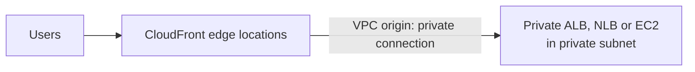
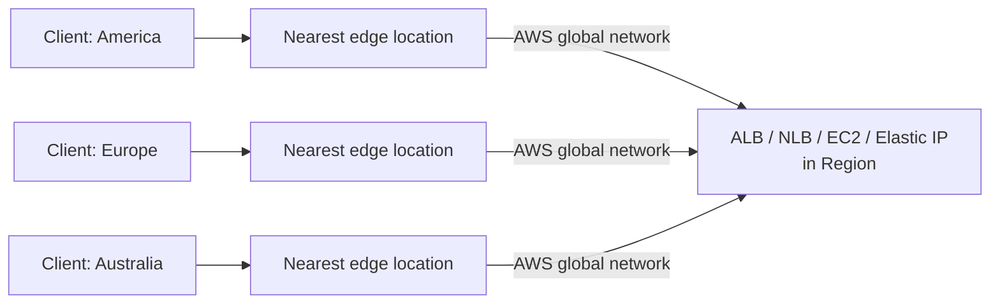

# 15 - CloudFront & Global Accelerator

Related: [[CloudFront & Global Accelerator]] (Version C service note) · [[S3]] · [[ELB]] · [[EC2]] · [[Route 53]]

## Chapter summary
- **CloudFront = CDN**: caches content at edge locations (hundreds of points of presence) for lower latency; "CDN" in the exam = CloudFront. Also gives DDoS protection (with Shield and WAF).
- **Origins**: S3 bucket (secured with **Origin Access Control, OAC**; can also upload via CloudFront), **VPC origin** (private ALB / NLB / EC2 in private subnets), or any **custom HTTP origin** (S3 static website, public ALB, any public HTTP backend).
- **CloudFront vs S3 Cross-Region Replication**: CloudFront = global edge network, cached (about a day), best for static content everywhere; S3 CRR = per-region setup, near real-time, no caching, read-only, best for dynamic content needed at low latency in a few regions.
- **VPC origins** are the new, most secure way to reach private backends; the old way = public ALB/EC2 with a security group allowing CloudFront public IPs.
- **Geo restriction**: allow list or block list of countries (third-party GeoIP database), e.g. for copyright law.
- **Cache invalidation**: forces a full or partial cache refresh before TTL expires (`/*`, `/images/*`, `/index.html`).
- **Global Accelerator**: **2 static anycast IPs**, traffic enters the nearest edge location then rides the AWS private network to your app; TCP/UDP, no caching, health checks and fast regional failover.
- **CloudFront vs Global Accelerator**: CloudFront = caching, HTTP content (static and dynamic); Global Accelerator = proxying, TCP/UDP, non-HTTP (gaming, IoT, VoIP), static global IPs, deterministic failover.

---

## 01 - CloudFront Overview
(src: 15/01-CloudFront Overview)

- **CloudFront = Content Delivery Network (CDN)**: improves **read performance** by caching content at edge locations worldwide; users get lower latency.
- Made of hundreds of **points of presence** (edge locations and edge caches). Worldwide distribution also gives **DDoS protection**, together with **AWS Shield** and **Web Application Firewall** (security chapter).
- Example: S3 website in Australia, user in America -> request goes to the US edge location, which fetches from Australia and caches; the next US user is served from the edge. Same for a user in China via a Chinese point of presence.

**Origins**
| Origin | Notes |
|---|---|
| Amazon S3 bucket | distribute and cache files; can also upload files into S3 through CloudFront; access secured with **Origin Access Control (OAC)** |
| VPC origin | applications in **private subnets**: private ALB, private NLB or private EC2 instances |
| Custom origin (HTTP) | S3 website (bucket must first be enabled as a static website), public ALB, any public HTTP backend |

**How it works**
1. Client sends an HTTP request to the edge location.
2. If not in the edge cache, the edge fetches it from the origin.
3. The result is stored in the local cache; the next request for the same content at that edge is served without going to the origin.

- With S3 as origin, the edge reaches the bucket over the **private AWS network**; the bucket is secured using OAC and a modified **S3 bucket policy**.

**CloudFront vs S3 Cross-Region Replication**
| | CloudFront | S3 Cross-Region Replication |
|---|---|---|
| Network | Global edge network, about **216 points of presence** | Set up per region you want |
| Freshness | Files cached (TTL, maybe a day) | Updated in **near real time**, no caching |
| Access | Cached delivery | **Read-only** replicas |
| Best for | **Static content** available everywhere | **Dynamic content** needing low latency in a few regions |

[verify] "About 216 points of presence" (number stated by the instructor and likely to change over time; unconfirmed, no official page checked).

> [!tip] Exam
> CDN = CloudFront. S3 origin secured with OAC. CloudFront = caching at the edge (global); S3 CRR = full bucket copy to chosen regions.

---

## 02 - CloudFront with S3 - Hands On
(src: 15/02-CloudFront with S3 - Hands On)

- Goal: make **private** S3 objects reachable through CloudFront without making them public. Directly, the object URL gives access denied; the console "open" uses a pre-signed URL.
- The new console asks you to choose a **plan**: **Free** plan (monthly request allowance, always-on DNS protection, geographic traffic blocking, global CDN, DNS, free TLS certificates) is enough for the demo; higher plans add things like edge key-value store, advanced DDoS protection, uptime SLA, WordPress protection; **Pay as you go** bills by traffic, extra for some features.
- Origin type options: Amazon S3, Elastic Load Balancer, API Gateway, Elemental MediaPackage, other; **VPC origin** (private EC2 / ALB) is shown as only available in the **Business** plan.
- Choosing S3 with "allow private S3 bucket access to CloudFront" and recommended origin/cache settings makes the platform **add a bucket policy** granting the CloudFront distribution access (OAC).
- Result: the distribution domain returns access denied at `/` (no default object), but `/coffee.jpg`, `/beach.jpeg` and `/index.html` load; the second load of an image is almost instant because it is **cached**.

[verify] Plan names, free-plan features and which plan offers VPC origins / geo blocking are UI details stated by the instructor that may have changed; unconfirmed.

### Hands-on steps
1. Create an S3 bucket (default settings) and upload three files: `beach`, `coffee`, `index.html`.
2. Show that the object URL is denied and the console "open" uses a pre-signed URL (image still not public).
3. CloudFront console -> Create distribution -> choose the **Free** plan, give a name.
4. Origin type: Amazon S3 -> browse to the bucket -> allow private bucket access to CloudFront -> recommended origin settings and cache settings.
5. Skip WAF; make sure the Free plan is selected; review -> Create distribution.
6. S3 -> bucket Permissions -> confirm the new bucket policy for CloudFront (two policies appear because of an earlier test distribution).
7. Open the distribution domain name; add `/coffee.jpg`, `/beach.jpeg`, `/index.html`; reload to see caching.

---

## 03 - CloudFront - ALB/EC2 as an Origin
(src: 15/03-CloudFront - ALB-EC2 as an Origin)

**Newer, better way: VPC origins**
- Deliver content from apps in **private subnets**; nothing exposed to the internet. Supports private **ALB, NLB and EC2**.
- Flow: users -> CloudFront edge locations -> **VPC origin** -> private ALB / NLB / EC2. You choose what to expose through CloudFront; one of the most secure setups.

> [!info] Diagram
> **Explanation:** Users reach CloudFront edge locations; CloudFront connects to the backend through a VPC origin over a private, secure connection, so the ALB, NLB or EC2 instance stays in a private subnet and CloudFront is the single point of entry.
> **Reference:** [Restrict access with VPC origins (Amazon CloudFront Developer Guide)](https://docs.aws.amazon.com/AmazonCloudFront/latest/DeveloperGuide/private-content-vpc-origins.html)

**Older way: public network (before VPC origins)**
- **EC2 as origin**: instance must be **public**; its security group must allow the **public IPs of all CloudFront edge locations** (list published by AWS).
- **ALB as origin**: ALB must be **public** and its security group must allow CloudFront public IPs; EC2 instances behind it can stay private (ALB-to-EC2 via security groups).
- Drawbacks: tedious to find and maintain the IP list; if someone changes the security group, the instance or ALB may become reachable by more than just CloudFront.

> [!tip] Exam
> Private ALB/NLB/EC2 behind CloudFront = **VPC origin**. Old pattern = public origin with security group allowing CloudFront IPs.

---

## 04 - CloudFront - Geo Restriction
(src: 15/04-CloudFront - Geo Restriction)

- Restrict access to a distribution by the **country** of the user: **allow list** (approved countries) or **block list** (banned countries).
- Country is determined with a **third-party Geo-IP database** matching the user's IP.
- Use case: **copyright laws** / controlling access to content.
- In the demo, the Free plan did not offer the option, so a **Pay as you go** distribution was used: Security -> CloudFront geographic restrictions -> Edit -> allow or block list -> select countries -> Save. The instructor expects the free plan to get this option later.

[verify] "Geo restriction needs a paid / pay-as-you-go plan; free plan lists geo blocking but did not expose it." Unconfirmed UI detail (the plan listing itself mentions geographic traffic blocking under Free).

> [!tip] Exam
> Geo restriction = allow list / block list of countries, based on a Geo-IP database.

### Hands-on steps
1. Open the distribution -> Security -> CloudFront geographic restrictions -> Edit.
2. Choose allow list or block list, select countries (demo blocks two), Save changes.

---

## 05 - CloudFront - Cache Invalidation
(src: 15/05-CloudFront - Cache Invalidation)

- If you update the origin, edge locations keep serving cached content until the **TTL expires**. To serve new content immediately, run a **CloudFront invalidation** (full or partial cache refresh that bypasses the TTL).
- You pass **paths**: `*` (all files) or a specific path such as `/images/*`, `/index.html`.
- Example: two edge locations cache `index.html` and images (TTL 1 day) from an S3 origin. After you change files in S3, invalidate `/index.html` and `/images/*`; CloudFront tells the edge locations to remove them from cache; the next request makes the edge fetch the new version from the origin.

> [!tip] Exam
> Updated origin but users still see old content -> invalidate the CloudFront cache (`/*` or specific paths).

---

## 06 - AWS Global Accelerator - Overview
(src: 15/06-AWS Global Accelerator - Overview)

**Problem**: global users reaching an app deployed in one region (example: public ALB in India) go over the **public internet** - many router hops, more latency, less reliable. Goal: enter the AWS network as early as possible.

**Unicast vs Anycast IP**
- **Unicast**: one server = one IP address (client goes to that server).
- **Anycast**: **all servers hold the same IP**; the client is routed to the **nearest** one.

**How Global Accelerator works**
- Uses **Anycast IP**: **2 Anycast IPs** are created for your application (global).
- Client traffic goes to the **closest edge location**, then travels over the **private AWS global network** to your application (more stable, lower latency).
- Gives **two static IPs** for your app worldwide; the app can be one ALB in one region or multiple regions.

> [!info] Diagram
> **Explanation:** Clients use the accelerator's two static anycast IPs; each is routed to the closest edge location, and from there traffic goes over the AWS global network to the endpoint in the Region, instead of crossing many hops on the public internet.
> **Reference:** [What is AWS Global Accelerator? (AWS Global Accelerator Developer Guide)](https://docs.aws.amazon.com/global-accelerator/latest/dg/what-is-global-accelerator.html)

**Features**
- Works with **Elastic IP, EC2 instances, ALB, NLB**; public or private.
- Consistent performance: intelligent routing to the lowest-latency edge, fast **regional failover**.
- No client caching issues: the two Anycast IPs never change.
- **Health checks**: if an endpoint in a region fails, automated failover in **less than 1 minute** to a healthy one; good for disaster recovery.
- Security: only **2 external IPs** to whitelist; **DDoS protection via AWS Shield**.

[verify] "Failover in less than one minute" (instructor's figure; not confirmed on the page fetched, which only says the service reacts to health changes).

**Global Accelerator vs CloudFront**
| | CloudFront | Global Accelerator |
|---|---|---|
| Network | AWS global network, edge locations | same |
| DDoS | Shield integration | Shield integration |
| Content | **Cacheable** (images, video) and **dynamic** (API acceleration, dynamic site delivery); served from the edge | **TCP or UDP** for a wide range of apps; packets **proxied** from the edge to the app in one or more regions; **no caching** |
| Good fit | web content delivery | **non-HTTP** (gaming, IoT, VoIP), HTTP needing **static global IPs**, **deterministic fast regional failover** |

> [!tip] Exam
> Static anycast IPs / non-HTTP (TCP/UDP) / fast regional failover -> Global Accelerator. Caching content at the edge -> CloudFront.

---

## 07 - AWS Global Accelerator - Hands On
(src: 15/07-AWS Global Accelerator - Hands On)

- Needs infrastructure in two regions to be useful. Global Accelerator is a **global** service (console shows "Global"; no region choice).
- Settings seen: accelerator type **Standard**; routing **IPv4**; listener **TCP port 80**; **client affinity** none (or by source IP); **endpoint groups** per region; endpoint types: ALB, NLB, EC2 instance, Elastic IP; **weight** to split traffic among endpoints; port overrides and health checks configurable.
- Health check settings used: HTTP, path `/`, port 80, interval 10 s, threshold 2 (about 20 s to become healthy). Health checks first showed unhealthy until the accelerator finished **provisioning (Deployed)**.
- Result: the accelerator exposes **two static IPs**; opening either goes to the closest region (EU-West-1 from the instructor's location; US-East-1 when using a VPN in the US).
- Cleanup: **disable** the accelerator first, then delete it; terminate the EC2 instances in both regions.

### Hands-on steps
1. Global Accelerator -> Create accelerator: name `Demo`, type Standard, IPv4.
2. Listener: TCP, port 80, client affinity none.
3. Add endpoint groups for two regions (US-East-1 and EU-West-1); remove the mistaken US-West-1 group.
4. Launch one EC2 instance in each region (Amazon Linux, t3.micro, no key pair, SG allowing HTTP from the internet, user data printing "Hello World from ... in <region>").
5. Add each instance as an endpoint of its region's endpoint group (weight left default) and save.
6. Configure health checks for both endpoint groups (HTTP, `/`, port 80, 10 s, threshold 2); wait until provisioning is deployed and endpoints are healthy.
7. Open the two static IPs in a browser; use a VPN to see traffic go to a different region.
8. Disable then delete the accelerator; terminate both instances.

---

Not covered: none; all lectures in this chapter have transcripts.
