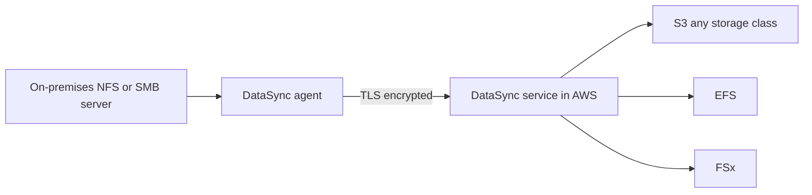

# 16 - AWS Storage Extras

Related: [[Snow Family]] · [[FSx]] · [[Storage Gateway]] · [[Data Transfer]] · [[Storage Options Compared]] · [[S3]] · [[EFS]] · [[EBS]]

## Chapter summary
- **Snowball Edge** = physical device for **offline data migration** (when transfer over the network takes about a week or more) and **edge computing** (EC2 / Lambda on the device). Two flavors: Storage Optimized (210 TB) and Compute Optimized (28 TB).
- **Snowball cannot import directly into Glacier**: import into S3, then an **S3 lifecycle policy** moves objects to Glacier.
- **FSx** = managed third-party file systems: **Windows File Server** (SMB, NTFS, AD), **Lustre** (HPC / ML, S3 integration, scratch vs persistent), **NetApp ONTAP** (NFS/SMB/iSCSI, broad OS compatibility), **OpenZFS** (NFS, up to 1 million IOPS).
- **Storage Gateway** = hybrid bridge between on-premises and AWS: **S3 File Gateway**, **Volume Gateway** (cached / stored), **Tape Gateway** (virtual tape library).
- **Transfer Family** = FTP, FTPS, SFTP interface in front of **S3 or EFS**.
- **DataSync** = **scheduled** (not continuous) sync of large data on-premises/other cloud <-> AWS or AWS <-> AWS; **preserves metadata and permissions**; needs an **agent** for on-premises NFS/SMB sources.
- Know which storage service fits which requirement (comparison table at the end).

---

## 01 - AWS Snow Family Overview
(src: 16/01-AWS Snow Family Overview)

- **Snowball Edge**: highly secure, portable device to **collect and process data at the edge** and **migrate data in and out of AWS**; suited to petabyte-scale migrations.
- Two device types:
  | Device | Storage | Purpose |
  |---|---|---|
  | Edge Storage Optimized | **210 TB** | data migration / storage |
  | Edge Compute Optimized | **28 TB** | edge computing |
- **Why not the network**: 100 TB over a 1 Gbps connection takes about **12 days**. Limited connectivity or bandwidth, high network cost, shared bandwidth or an unstable link -> use Snowball. **Rule of thumb: if it takes over a week to transfer over the network, use a Snowball device.**
- **Migration flow**: order device -> it is shipped to you -> load data -> ship back -> AWS imports into S3 (export from S3 is also possible).
- **Edge computing**: process data where it is created, with no or limited internet (truck, ship, mining station). Devices can run **EC2 instances or Lambda functions**; use cases: preprocess data, machine learning at the edge, transcode media.
- Snowball is for **data migration and edge computing**.

[verify] Instructor treats Snow Family devices as orderable (Storage Optimized 210 TB, Compute Optimized 28 TB; Snowcone and Snowmobile are mentioned in lecture 10).
> [!warning] Correction [note]
> AWS states Snowball Edge is no longer available to new customers: AWS will no longer offer any Snow Family devices for new customers to order; existing customers are not affected. AWS suggests DataSync, AWS Data Transfer Terminal or partner solutions for transfer, and Outposts for edge computing. Source: [AWS Snowball Edge availability change](https://docs.aws.amazon.com/snowball/latest/developer-guide/snowball-edge-availability-change.html). Snow Family is still described in exam material, so keep the concepts. Device capacities quoted by the instructor were not confirmed.

> [!tip] Exam
> Offline petabyte migration or limited bandwidth -> Snowball. Edge computing without connectivity -> Snowball Edge Compute Optimized.

---

## 02 - AWS Snow Family Hands On
(src: 16/02-AWS Snow Family Hands On)

- Console walkthrough of ordering a device (no device ordered). Options seen:
  - Job type: **import into Amazon S3**, **export from Amazon S3**, or **local compute and storage only**.
  - Devices: Storage Optimized (210 TB) or Compute Optimized; many older devices have been **discontinued**.
  - Pricing option: on-demand per-day pricing; target S3 bucket(s) for the transfer.
  - Security: encryption and a **service role** (service-linked role) allowing the device to write to your S3 buckets.
  - Shipping address, shipping speed (**1-day or 2-day**), notifications for job status; then job summary.
- You receive the device, load data, and send it back with the included shipping label.

### Hands-on steps
1. Snow Family console -> Create job: job name, job type (import from S3).
2. Choose device (Storage Optimized 210 TB or Compute Optimized).
3. Choose pricing option, S3 bucket(s), features, security (encryption, service role).
4. Enter shipping address and speed, set notifications, review summary. (Do not actually order.)

---

## 03 - Architecture: Snowball into Glacier
(src: 16/03-Architecture- Snowball into Glacier)

- Snowball **cannot import data directly into Glacier**.
- Solution: Snowball imports into **Amazon S3**, then an **S3 lifecycle policy** transitions objects to **Glacier**.

> [!tip] Exam
> Snowball -> S3 -> lifecycle policy -> Glacier.

---

## 04 - Amazon FSx
(src: 16/04-Amazon FSx)

- **FSx** = fully managed **third-party high-performance file systems** on AWS (like RDS for file systems). Four to know: **Windows File Server, Lustre, NetApp ONTAP, OpenZFS**.

### FSx for Windows File Server
- Fully managed Windows file share: **SMB** protocol and **Windows NTFS**; **Microsoft Active Directory** integration, ACLs, user quotas.
- Can also be **mounted on Linux EC2 instances**.
- **Microsoft DFS (Distributed File System)** can group it with an existing on-premises Windows file server.
- Scale: tens of GB/s, millions of IOPS, hundreds of PB.
- Storage: **SSD** (latency-sensitive: databases, media processing, analytics) or **HDD** (cheaper, broad workloads: home directories, CMS).
- Reachable from on-premises over a private connection; **Multi-AZ** for high availability; **daily backups to S3**.

### FSx for Lustre
- **Lustre = Linux + cluster**: distributed file system for large-scale computing; keywords **machine learning, HPC** (video processing, financial modeling, electronic design automation).
- Scale: hundreds of GB/s, millions of IOPS, **sub-millisecond latency**.
- Storage: **SSD** (low latency, IOPS-intensive, small random files) or **HDD** (throughput-intensive, large sequential files); SSD costs more.
- **Seamless S3 integration**: read S3 as a file system and write results back to S3.
- Accessible from on-premises via VPN or Direct Connect.
- **Deployment options**:
  | | Scratch | Persistent |
  |---|---|---|
  | Use | temporary storage, short-term processing, cost optimization | long-term storage, sensitive data |
  | Replication | **none** - data lost if the underlying server fails | replicated **within the same AZ**; failed server replaced within minutes |
  | Performance | high burst: **6x** persistent, e.g. **200 MBps per TB** | lower |
  - Lustre lives in a **single AZ**; an optional S3 bucket can act as the data repository.

> [!info] Source check
> Scratch file systems' burst of up to six times a 200 MBps per TiB baseline, no replication, and persistent replication within the same AZ are consistent with [Deployment and storage class options for FSx for Lustre](https://docs.aws.amazon.com/fsx/latest/LustreGuide/using-fsx-lustre.html). That page also lists newer storage classes (Intelligent-Tiering) not covered in the lecture.

### FSx for NetApp ONTAP
- Managed NetApp ONTAP; protocols **NFS, SMB, iSCSI**. Use to move workloads already on ONTAP or an on-premises NAS to AWS.
- Compatible with Linux, Windows, macOS, VMware Cloud on AWS, WorkSpaces, AppStream, EC2, ECS, EKS.
- Storage **shrinks/grows automatically**; snapshots, replication, low cost, **compression, data de-duplication**, **point-in-time instantaneous cloning** (handy for testing/staging).

### FSx for OpenZFS
- Managed OpenZFS; **NFS only** (multiple versions). Use to move workloads running on ZFS to AWS.
- Compatible with Linux, Mac, Windows; up to **1 million IOPS** at **< 0.5 ms** latency; snapshots, compression, low cost; **no data de-duplication**; point-in-time instantaneous cloning.

| FSx type | Protocols / key facts |
|---|---|
| Windows File Server | SMB, NTFS, AD, Linux mountable, DFS, Multi-AZ |
| Lustre | HPC / ML, S3 integration, scratch vs persistent, single AZ |
| NetApp ONTAP | NFS + SMB + iSCSI, broad OS support, dedup, cloning, auto-scaling |
| OpenZFS | NFS only, 1M IOPS, cloning, no dedup |

> [!tip] Exam
> Windows shares + AD -> FSx for Windows. HPC / ML with S3 -> FSx for Lustre. Move NetApp / NAS workloads, multi-protocol -> ONTAP. Move ZFS workloads, NFS -> OpenZFS.

---

## 05 - Amazon FSx - Hands On
(src: 16/05-Amazon FSx - Hands On)

- Console tour of "Create file system" with the four exam-relevant options (later additions are not covered unless they appear on the exam).
  - **Lustre**: deployment/storage type, throughput, VPC placement, encryption; just know **persistent vs scratch**.
  - **Windows File Server** (SMB): **Multi-AZ** or **Single-AZ** (single is fine for dev); SSD or HDD; throughput capacity depends on storage capacity; VPC; **Windows authentication** via AWS Managed Microsoft AD or self-managed AD; encryption; auditing, access, backup and maintenance options.
  - **NetApp ONTAP**: Multi-AZ or Single-AZ, storage type and capacity, storage efficiency (deduplication, compression, compaction); works with Linux, Windows, macOS; quick create vs standard create.
  - **OpenZFS**: ZFS on AWS, compatible with Linux, Windows, macOS.
- Exam focus: know the differences between the four options (see lecture 04).

### Hands-on steps
1. FSx console -> Create file system; review the four file system types.
2. Open each type's options (Lustre deployment type, Windows Multi-AZ / AD, ONTAP storage efficiency); do not create anything.

---

## 06 - Storage Gateway Overview
(src: 16/06-Storage Gateway Overview)

- **Hybrid cloud** = part of the infrastructure on AWS, part on-premises (long migrations, security/compliance, using cloud only for elastic workloads). S3 uses a proprietary object API (unlike NFS-based EFS), so exposing S3 on-premises needs a bridge: **AWS Storage Gateway**.
- AWS-native storage types: **block** (EBS, EC2 instance store), **file** (EFS, FSx), **object** (S3, Glacier).
- Use cases: disaster recovery / backup and restore, cloud migration, extending on-premises storage (cold data in cloud, warm on-premises), or keeping most data in AWS with an **on-premises cache** for low-latency file access.
- The gateway must run in your data center (VM) - or on EC2 (see hands-on).

| Gateway | Protocol | Backed by | Notes |
|---|---|---|---|
| **S3 File Gateway** | **NFS or SMB** (translated to HTTPS to S3) | S3 (Standard, Standard-IA, One Zone-IA, Intelligent-Tiering; **not Glacier directly**) | most **recently used data cached** locally; **IAM role per gateway**; SMB -> **Active Directory** authentication; lifecycle policy can move objects to Glacier |
| **Volume Gateway** | **iSCSI** block storage | S3, with **EBS snapshots** | **Cached volumes**: low-latency access to recent data, primary data in S3. **Stored volumes**: whole dataset on-premises, **scheduled/async backup** to S3; snapshots can be restored as EBS volumes |
| **Tape Gateway** | **iSCSI VTL** | S3 and **Glacier / Glacier Deep Archive** | virtual tape library for existing tape-based backup software from leading vendors |

- Summary architecture: Storage Gateway VM on-premises <-> Storage Gateway service <-> AWS (S3 for File Gateway; S3 -> EBS volume restore for Volume Gateway; S3 tape library -> Glacier / Deep Archive for Tape Gateway).

[verify] Lecture 10 also lists an "FSx File Gateway", and lecture 07 says it is greyed out and "going away".
> [!warning] Correction [note]
> The AWS Storage Gateway user guide still lists file-based gateways as "S3 File Gateway and FSx File Gateway" (page fetched: [What is Tape Gateway?](https://docs.aws.amazon.com/storagegateway/latest/tgw/WhatIsStorageGateway.html)), so the retirement claim is unconfirmed. Treat S3 File, Volume and Tape as the exam-relevant gateways.

> [!tip] Exam
> On-premises NFS/SMB over S3 -> S3 File Gateway. On-premises block volumes backed up to AWS -> Volume Gateway (cached vs stored). Physical tape replacement -> Tape Gateway.

---

## 07 - Storage Gateway Hands On
(src: 16/07-Storage Gateway Hands On)

- Create gateway: name (`Demo Gateway`) and type. Types shown: **Amazon S3 File Gateway** (NFS/SMB, local caching), FSx File Gateway (greyed out), **Tape Gateway**, **Volume Gateway**.
- **Hosting platforms**: VMware, Microsoft Hyper-V, Linux KVM (on-premises, data lives closer to your servers) or **Amazon EC2** (cache and gateway run in your AWS account).
- Tape Gateway: tape archive via iSCSI VTL, tapes stored in S3 / Glacier.
- Volume Gateway: **Cached volume** (primary data in S3, frequently used data cached locally) vs **Stored volume** (entire dataset local, asynchronously synced to S3).

### Hands-on steps
1. Storage Gateway console -> Create gateway: name `Demo Gateway`.
2. Compare gateway types (S3 File, Tape, Volume) and their platform options (VMware, Hyper-V, KVM, EC2). Nothing is created.

---

## 08 - AWS Transfer Family
(src: 16/08-AWS Transfer Family)

- Send data in and out of **S3 or EFS** using **FTP** instead of the S3 API or EFS network file system.
- Protocols: **FTP** (unencrypted), **FTPS** (FTP over SSL, encrypted), **SFTP** (secure FTP, encrypted). FTPS and SFTP are encrypted in flight.
- Fully managed, scalable, reliable, **highly available** infrastructure.
- **Pricing**: per **provisioned endpoint per hour** + per **GB transferred** in and out.
- Users: store and manage credentials in the service, or integrate **Microsoft Active Directory, LDAP, Okta, Amazon Cognito or custom** authentication.
- Use cases: sharing files, public datasets, CRM, ERP.
- Architecture: users connect to the service endpoint (optionally with your own hostname via **Route 53**); the service assumes an **IAM role** to read/write S3 or EFS; external identity provider can authenticate users.

> [!tip] Exam
> FTP/FTPS/SFTP into S3 or EFS -> Transfer Family.

---

## 09 - DataSync - Overview
(src: 16/09-DataSync - Overview)

- **DataSync** moves **large amounts of data** to/from on-premises or other clouds into AWS (and between AWS services). Appears often in the exam.
- Sources: on-premises or other cloud via **NFS, SMB, HDFS** and other protocols -> **needs an agent** running on-premises/other cloud. **AWS-to-AWS transfers need no agent.**
- Destinations: **S3 (any storage class, even Glacier)**, **EFS**, **FSx**. Can sync both ways.
- **Not continuous**: **scheduled** tasks (**hourly, daily, weekly**), so there is a lag.
- **Preserves file permissions and metadata** (NFS POSIX, SMB permissions) - the option to pick when the exam asks to keep metadata.
- One agent task can use up to **10 Gbps**; set a **bandwidth limit** if you do not want to saturate the network.

> [!info] Diagram
> **Explanation:** The DataSync agent installed on-premises reads from the NFS/SMB storage and sends data encrypted (TLS) to the DataSync service, which copies it to S3, EFS or FSx. The same service also copies between AWS storage services without an agent, and the lecture notes it can sync back to on-premises.
> **Reference:** [How AWS DataSync works (AWS DataSync User Guide)](https://docs.aws.amazon.com/datasync/latest/userguide/how-datasync-works.html) - confirms agent for on-premises, TLS, no agent between AWS services in the same account, recurring transfers via scheduling.

[verify] "One agent task can use up to 10 Gbps" (instructor's figure; not found on the page fetched).

> [!tip] Exam
> Scheduled sync preserving metadata/permissions -> DataSync. On-premises NFS/SMB source requires the agent.

---

## 10 - All AWS Storage Options Compared
(src: 16/10-All AWS Storage Options Compared)

| Need | Service |
|---|---|
| Object storage (specific API, great for AWS) | **S3**; archive with **S3 Glacier** |
| Block storage attached to one EC2 instance at a time (Multi-Attach for io1/io2) | **EBS** (gp3, io2, ...) |
| Very high IOPS physical, non-network storage | **EC2 Instance Store** |
| Linux network file system (POSIX), multi-AZ | **EFS** |
| Windows file server (SMB) | **FSx for Windows File Server** |
| HPC Linux file system (Lustre client) | **FSx for Lustre** |
| Highest OS compatibility network file system | **FSx for NetApp ONTAP** |
| Managed ZFS file system | **FSx for OpenZFS** |
| Bridge on-premises <-> AWS | **Storage Gateway** (S3 / FSx File Gateway, Volume Gateway, Tape Gateway) |
| FTP / FTPS / SFTP in front of S3 or EFS | **Transfer Family** |
| Scheduled sync on-premises -> AWS or AWS -> AWS | **DataSync** |
| Too much data for the network, move physically | **Snowcone, Snowball or Snowmobile** (Snowcone has a **DataSync agent bundled**) |

- Databases can store data too, but suit specific workloads (indexing, querying); covered in a later database section.

[verify] Snowcone and Snowmobile are named as orderable options.
> [!warning] Correction [note]
> See the Snow Family availability note in lecture 01: AWS no longer offers Snow Family devices to new customers. Source: [AWS Snowball Edge availability change](https://docs.aws.amazon.com/snowball/latest/developer-guide/snowball-edge-availability-change.html). Snowmobile specifically was not checked.

> [!tip] Exam
> Pick the storage service from the requirement keywords: protocol (SMB / NFS / iSCSI / FTP), workload (HPC, tape backup, hybrid), and size/bandwidth (offline Snow devices).

---

Not covered: none; all lectures in this chapter have transcripts.
