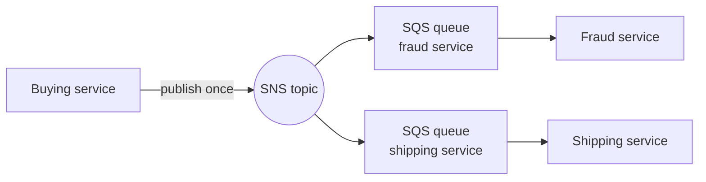
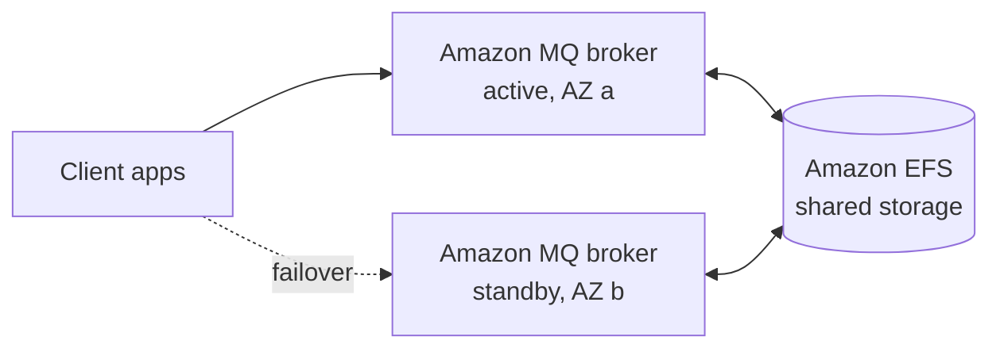

# 17 - Decoupling Applications - SQS, SNS, Kinesis, Amazon MQ

Related: [[SQS]] · [[SNS]] · [[Kinesis & Firehose]] · [[Amazon MQ & Messaging Comparison]] · [[ASG]] · [[Lambda]] · [[S3]] · [[CloudWatch]] · [[EFS]] · [[AWS CLI & CloudShell]]

## Chapter summary
- **Synchronous** (app to app directly) breaks under sudden spikes; **asynchronous / event-based** puts middleware between services so each side scales independently: **SQS** (queue), **SNS** (pub/sub), **Kinesis** (real-time streaming).
- **SQS Standard**: producers `SendMessage`, consumers **poll** (up to 10 messages), process, then **delete**. Unlimited throughput, retention **4 days default / 14 days max**, <10 ms latency, **at-least-once** delivery, **best-effort ordering**.
- **Visibility timeout** default **30 s** (0 s - 12 h); use `ChangeMessageVisibility` for more time. **Long polling** 1-20 s (`WaitTimeSeconds`) cuts API calls and latency.
- **SQS FIFO**: ordering per **message group ID**, dedup via deduplication ID (5-minute window), **300 msg/s** (3,000 with batching), name ends in `.fifo`.
- **SQS + ASG**: scale on the CloudWatch metric `ApproximateNumberOfMessages`; SQS as a **buffer in front of database writes** is a classic exam pattern.
- **SNS** = pub/sub; many subscribers get every message (unless a **filter policy** applies). **SNS + SQS fan-out** = one publish, many queues; SNS FIFO topics add ordering/dedup.
- **Kinesis Data Streams** = real-time, retention up to **365 days**, replay, shards (1 MB/s in, 2 MB/s out each), provisioned vs on-demand. **Amazon Data Firehose** = **near real-time** loader into S3 / Redshift / OpenSearch / third parties / HTTP, with buffer, no storage, no replay.
- **Amazon MQ** = managed **RabbitMQ / ActiveMQ** for lift-and-shift apps using open protocols (MQTT, AMQP, STOMP, Openwire, WSS); less scalable than SQS/SNS; HA via **multi-AZ active/standby + EFS**.

---

## 01 - Introduction to Messaging
(src: 17/01-Introduction to Messaging)

- Two integration patterns between applications:
  - **Synchronous**: services connect directly (buying service calls shipping service).
  - **Asynchronous / event based**: a middleware (queue or other) sits between them; the producer drops an event, the consumer fetches it later.
- Problem with synchronous: a sudden spike (e.g. 1,000 videos to encode instead of the usual 10) overwhelms the downstream service and causes outages. Decouple and let the decoupling layer scale.
- Three options: **SQS** (queue model), **SNS** (pub/sub model), **Kinesis** (real-time streaming, big data). All scale well and let services scale independently.

> [!tip] Exam
> Sudden spikes / unpredictable load / "decouple" -> think SQS, SNS or Kinesis.

---

## 02 - Amazon SQS - Standard Queues Overview
(src: 17/02-Amazon SQS - Standard Queues Overview)

**Concepts**
- A queue holds messages. **Producers** send, **consumers** poll. The queue is a buffer decoupling both sides. Many producers and many consumers are possible.
- Oldest AWS service (10+ years), fully managed; "application decoupling" in the exam = SQS.

| Attribute | Standard queue |
|---|---|
| Throughput | **Unlimited**, unlimited messages in queue |
| Retention | **4 days default, 14 days max** (message lost if not consumed and deleted in time) |
| Latency | **< 10 ms** on publish and receive |
| Message size | "< 1,024 KB" per message (see correction) |
| Delivery | **At least once** (duplicates possible) |
| Ordering | **Best effort** (out of order possible) |

[verify] The lecture says messages must be smaller than 1,024 KB (and the next lecture shows 256 KB as the console max).
> [!warning] Correction [note]
> AWS documents the SQS maximum message size as 1,048,576 bytes (1 MiB); larger payloads can use the SQS Extended Client Library (payload stored in S3, up to 2 GB). Source: [Amazon SQS message quotas](https://docs.aws.amazon.com/AWSSimpleQueueService/latest/SQSDeveloperGuide/quotas-messages.html). The 256 KB figure seen in the course console is the older limit.

**Producing**
- Producers use the SDK and the **`SendMessage`** API. The message is persisted until a consumer reads **and deletes** it. Example: order id, customer id, address as message body/attributes.

**Consuming**
- Consumers are **your code**: EC2, on-premises servers, or Lambda.
- Consumer polls and may receive **up to 10 messages per call**, processes them (e.g. insert into RDS), then calls **`DeleteMessage`** so no other consumer sees them.
- Multiple consumers process in parallel; an unprocessed message is received by another consumer, which explains **at-least-once** and **best-effort ordering**.
- Scale throughput by adding consumers (horizontal scaling).

**SQS + ASG**
- Consumers in an ASG; CloudWatch metric **`ApproximateNumberOfMessages`** (queue length) drives a CloudWatch alarm that increases ASG capacity. Very common exam integration.

**Decoupling application tiers (video example)**
- Front end puts "process this video" requests into SQS; a back-end ASG (e.g. GPU instances) pulls, processes and writes to S3. Each tier scales and is sized independently.

**Security**
- In flight: HTTPS API. At rest: **KMS** keys. Client-side encryption possible but the client does it itself (not built in).
- Access control: **IAM policies** for the SQS API, plus **SQS access policies** (like S3 bucket policies) for **cross-account access** and to let other services (**SNS, S3 events**) write to a queue.

> [!tip] Exam
> SQS standard: unlimited throughput, 4 d default / 14 d max retention, at-least-once, best-effort ordering. Scale consumers with an ASG on queue length. Use an access policy so SNS / S3 can write to the queue.

---

## 03 - SQS - Standard Queue Hands On
(src: 17/03-SQS - Standard Queue Hands On)

- Queue types in console: **Standard** and **FIFO**. Settings seen: visibility timeout, delivery delay, receive wait time, retention (4 days), max message size (256 KB in the console at recording time).
- Encryption: enabled by default with **SSE-SQS** (an SQS-managed key, like SSE-S3); alternative is **KMS** (default AWS key `alias/aws/sqs`, optional data key reuse period, e.g. 5 minutes, to limit KMS calls); or disabled.
- Access policy is a JSON **resource policy** (same style as an S3 bucket policy); builder asks who may send and who may receive.
- Redrive / dead-letter queue are covered later (not set up here).
- Message metadata: message ID, body hash, sender, **receive count**, size, optional attributes (attributes out of scope for the exam).
- Demo: a message not deleted within 30 s reappears (receive count rises to 2, then 3). Deleting it tells SQS it was processed.
- **Purge** deletes all messages (handy in development, not for production). Monitoring tab shows messages and **approximate age of oldest message** (another metric to scale an ASG on).

[verify] Console max message size 256 KB (see correction in lecture 02: now 1 MiB).

### Hands-on steps
1. SQS console -> Create queue -> type **Standard**, name `Demo Queue`; keep defaults (retention 4 days, SSE-SQS encryption, basic access policy).
2. Open the queue -> **Send and receive messages** -> body `hello world!` -> Send.
3. **Poll for messages** -> open message details (ID, receive count, body).
4. Wait past 30 s and poll again (receive count increases); select the message -> **Delete**.
5. Send several messages (`hello world 2`, `3`) and poll to receive many at once; delete them.
6. Optional: Purge queue; inspect Monitoring, Access policy, Encryption and Dead-letter redrive tabs.

---

## 04 - SQS - Message Visibility Timeout
(src: 17/04-SQS - Message Visibility Timeout)

- After a consumer receives a message (`ReceiveMessage`), it becomes **invisible to other consumers** for the **visibility timeout** (**default 30 seconds**). If not deleted within it, the message returns to the queue and is received again (possibly processed **twice**).
- If a consumer needs more time, call **`ChangeMessageVisibility`** to extend the window for that message.
- Tuning:
  - too **high** (hours) and the consumer crashes -> long wait before the message reappears;
  - too **low** (seconds) -> duplicate processing if the consumer is slow.
  - Set something reasonable and extend with the API when needed.
- Configurable range: **0 seconds (not recommended) to 12 hours**.
- Demo with two receive windows: consumer 1 polls and sees the message; consumer 2 does not until 30 s pass, then it gets it (receive count 2).

> [!tip] Exam
> Default visibility timeout = 30 s; `ChangeMessageVisibility` to extend; scenarios on duplicate processing are likely.

### Hands-on steps
1. Open two "Send and receive messages" windows on the same queue.
2. Send `hello world`, poll in window 1 (message appears), poll in window 2 (nothing, still within the 30 s).
3. Stop without deleting; after the timeout poll in window 2 (message appears, receive count 2); delete it.
4. Queue -> Edit -> visibility timeout shows the configurable range.

---

## 05 - SQS - Long Polling
(src: 17/05-SQS - Long Polling)

- **Long polling**: when the queue is empty, the consumer **waits** for a message to arrive instead of returning immediately.
- Benefits: **fewer API calls** and **lower latency** (message delivered as soon as it arrives).
- Wait time **1 to 20 seconds**; **20 s preferred**. Enable at **queue level** or per call with the **`WaitTimeSeconds`** parameter.
- Prefer long polling over short polling.

> [!tip] Exam
> Long polling = 1-20 s, `WaitTimeSeconds`, fewer API calls, lower latency.

---

## 06 - SQS - FIFO Queues
(src: 17/06-SQS - FIFO Queues)

- **FIFO** = first in, first out; messages are read in the order sent (standard queues give no such guarantee).
- Throughput: **300 msg/s without batching, 3,000 msg/s with batching**.
- **Exactly-once send**: provide a **deduplication ID**; the same ID within **5 minutes** is dropped (also **content-based deduplication** option).
- Ordering guarantee is **per message group ID**; every message sent to a FIFO queue needs a message group ID.
- Queue name **must end in `.fifo`**.

[verify] "300 / 3,000 messages per second" presented as the FIFO throughput.
> [!warning] Correction [note]
> AWS confirms 300 TPS per API action (3,000 messages/s with batching of 10) for non-high-throughput mode, and also offers **high throughput mode** for FIFO queues with much higher region-dependent limits (e.g. up to 70,000 TPS in us-east-1). Source: [Amazon SQS message quotas](https://docs.aws.amazon.com/AWSSimpleQueueService/latest/SQSDeveloperGuide/quotas-messages.html).

> [!tip] Exam
> Need ordering and/or no duplicates -> FIFO (message group ID for order, dedup ID for exactly once).

### Hands-on steps
1. Create queue -> type **FIFO**, name `DemoQueue.fifo` (suffix mandatory); note the extra **content-based deduplication** setting; keep other defaults.
2. Send and receive messages -> send `Hello World 1` to `4` with message group ID `demo` and deduplication IDs `1` to `4`.
3. Poll for 4 messages; verify the order is 1, 2, 3, 4 (the UI list may display them reversed, [screen action]); delete them.

---

## 07 - SQS + Auto Scaling Group
(src: 17/07-SQS + Auto Scaling Group)

**Scaling consumers**
- EC2 instances in an ASG poll the queue. CloudWatch metric **`ApproximateNumberOfMessages`** (queue length) -> alarm (e.g. above 1,000 = lagging) -> ASG scaling action. Works both up and down.

**Pattern: SQS as a buffer for database writes**
- Big sale / marketing campaign: direct writes to RDS / Aurora (OLTP) or DynamoDB (NoSQL) can fail under overload, losing customer transactions.
- Instead the front-end app **enqueues** each transaction into SQS (effectively unlimited, durable). A second **ASG dequeues** and writes to the database; the message is **deleted only after a successful insert**.
- Works only if the client **does not need immediate confirmation** that the DB write happened.
- Same idea decouples application tiers (front-end web app -> SQS -> back-end processing).

> [!tip] Exam
> Decoupling, sudden spike load, timeouts, or "don't lose transactions" -> SQS buffer (with ASG on queue length). Very common in the exam.

---

## 08 - Amazon SNS
(src: 17/08-Amazon Simple Notification Service (AWS SNS))

- Direct integration (one service calling email, fraud, shipping, SQS...) is cumbersome. **Pub/Sub**: the producer publishes **once** to an **SNS topic**; every **subscriber** gets every message (unless a filter policy is used).
- Limits quoted (can change; **not tested on limits**): about **12.5 million subscriptions per topic** (lecture also says "12,000,000+"), **100,000 topics** per account (can be raised).
- **Subscriber types**: email, SMS and mobile notifications, HTTP(S) endpoints, **SQS**, **Lambda**, **Amazon Data Firehose** (to S3, Redshift...).
- **SNS receives events from many AWS services**: CloudWatch alarms, ASG notifications, CloudFormation state changes, Budgets, S3 events, DMS, Lambda, DynamoDB, RDS events, etc.
- Publishing: create topic -> create subscriptions -> **topic publish via SDK**. For mobile apps use **direct publish**: create a platform application and **platform endpoint** (Google GCM, Apple APNS, Amazon ADM).
- Security mirrors SQS: HTTPS in flight, **KMS** at rest, optional client-side encryption, **IAM policies**, and **SNS access policies** for cross-account access and to let services (e.g. S3 events) write to a topic.

> [!tip] Exam
> One message to many receivers = SNS pub/sub. Topic access policy for cross-account / S3 events.

---

## 09 - SNS and SQS - Fan Out Pattern
(src: 17/09-SNS and SQS - Fan Out Pattern)

**Fan-out**: publish once to an SNS topic, subscribe many SQS queues. Sending separately to each queue risks failures mid-way and does not scale to new queues.
- Fully decoupled, **no data loss** (SQS gives persistence, delayed processing, retries); add queues later without changing the producer.
- The **SQS access policy must allow the SNS topic** to write to the queue.
- **Cross-region delivery** works (topic in one region, queues in another) if permissions allow.

> [!info] Diagram
> **Explanation:** The buying service publishes one message to the SNS topic. SNS pushes a copy to each subscribed SQS queue; each downstream service reads at its own pace from its own queue.
> **Reference:** [Fanout Amazon SNS notifications to Amazon SQS queues (Amazon SNS Developer Guide)](https://docs.aws.amazon.com/sns/latest/dg/sns-sqs-as-subscriber.html) (found via search; page content not fetched in full).

**Use cases**
- **S3 events to multiple queues**: S3 allows only **one event rule per combination of event type + prefix** (e.g. object created + `images/`). Send the event to an SNS topic and fan out to many SQS queues, Lambda, email, etc.
- **SNS -> Amazon Data Firehose -> S3** (or any Firehose destination) to persist topic messages.

**SNS FIFO topics**
- Ordering by **message group ID**, deduplication via dedup ID or content-based dedup; throughput equals SQS FIFO. Lecture: subscribers can only be SQS FIFO queues (also "SQS standard and FIFO" mentioned in the same lecture). Use when you need fan-out + ordering + dedup.

[verify] "Only an SQS FIFO queue can subscribe to a FIFO topic" (and the lecture contradicts itself on standard queues).
> [!warning] Correction [note]
> A search result summarizing AWS material states that since 2023 SNS FIFO topics can also deliver to SQS **standard** queues. This was not confirmed on a fetched AWS page (the fetched page, [Message ordering and deduplication strategies using Amazon SNS FIFO topics](https://docs.aws.amazon.com/sns/latest/dg/sns-fifo-topics.html), only describes SQS FIFO integration). Treat as unconfirmed.

**Message filtering**
- A **JSON filter policy** on a subscription limits which messages it receives. **No policy = receives everything** (default).
- Example: orders with `State: Placed` go to a "placed" SQS queue; `Canceled` to a canceled queue **and** an email subscription; `Declined` to another queue; one queue with no policy gets all.

> [!tip] Exam
> Fan-out = SNS topic + SQS queues. S3 one-rule limitation -> fan-out via SNS. FIFO fan-out = SNS FIFO + SQS FIFO. Filter policy = JSON per subscription.

---

## 10 - SNS - Hands On
(src: 17/10-SNS - Hands On)

- Topic types: **Standard** (best-effort ordering, at-least-once, highest throughput; subscribers: SQS, Lambda, HTTP(S), SMS, email, mobile) and **FIFO** (strict ordering, exactly-once, up to **300 publishes/s**, name must end in `.fifo`, only SQS subscribers per the lecture).
- Topic settings: encryption, **access policy** (who may publish; needed e.g. for an S3 bucket to write to the topic).
- Subscription protocols to remember: **Kinesis Data Firehose, SQS, Lambda, Email, Email-JSON, HTTP, HTTPS, SMS**.
- An email subscription stays **pending confirmation** until the recipient clicks the confirmation link.
- Subscription filter policy is optional.
- For SQS fan-out you would subscribe several queues instead of email.

### Hands-on steps
1. SNS console -> Create topic -> **Standard**, name `MyFirstTopic`; default access policy (basic).
2. Create subscription -> protocol **Email** -> endpoint a (temporary) mailbox address.
3. Open the confirmation email and confirm; refresh to see status **Confirmed**.
4. Publish message `hello world` to the topic; check the inbox for the AWS notification.
5. Clean up: delete the subscription, then delete the topic (type `delete me`).

---

## 11 - Amazon Kinesis Data Streams
(src: 17/11-Amazon Kinesis Data Streams)

- Collects and stores **real-time** streaming data (exam keyword: **real-time**), e.g. clickstreams, IoT devices (connected bicycle), metrics and logs.
- **Producers**: your applications/SDK, or the **Kinesis Agent** on servers (logs/metrics). **Consumers**: your code, **Lambda**, **Amazon Data Firehose**, **Managed Service for Apache Flink** (analytics).
- Features:
  - retention **up to 365 days**; data can be **replayed**; **cannot be deleted** (only expires);
  - record size up to **10 MB** (typical use: many small records);
  - ordering is kept for records with the **same partition key/ID**;
  - **KMS** at rest, **HTTPS** in flight;
  - **KPL** (Kinesis Producer Library) for optimized high-throughput producers, **KCL** (Kinesis Client Library) for optimized consumers.

| Capacity mode | How it works | Pricing |
|---|---|---|
| **Provisioned** | You choose the number of **shards**; each shard = **1 MB/s or 1,000 records/s in**, **2 MB/s out**; scale shards manually and monitor. Example: 10,000 records/s or 10 MB/s needs 10 shards | per shard-hour |
| **On-demand** | No capacity management; default about **4 MB/s or 4,000 records/s in**; auto-scales from observed throughput of the **past 30 days** | per stream-hour + data in/out |

[verify] On-demand default of 4 MB/s and the maximums stated in the next lecture (200 MB/s write, 400 MB/s read per consumer with enhanced fan-out).
> [!warning] Correction [note]
> AWS documents new on-demand streams as starting at 4 MB/s write and 8 MB/s read; in us-east-1, us-west-2 and eu-west-1 on-demand streams scale to **10 GB/s write / 20 GB/s read**, while other Regions scale to 200 MB/s write / 400 MB/s read. Max record payload is 10 MiB and retention maximum is 8,760 hours (365 days), consistent with the lecture. Source: [Kinesis Data Streams quotas and limits](https://docs.aws.amazon.com/streams/latest/dev/service-sizes-and-limits.html).

> [!tip] Exam
> Real-time -> Kinesis Data Streams. Provisioned = shards (1 MB/s in, 2 MB/s out each); on-demand = auto scale. Retention up to 365 days with replay. Same partition key = same shard = ordered.

---

## 12 - Amazon Kinesis Data Streams - Hands On
(src: 17/12-Amazon Kinesis Data Streams - Hands On)

- Console shows three options: Data Streams, Data Firehose, Data Analytics. Pricing shown: **$0.05 per shard-hour** plus PUT costs; **no free tier** in either mode. A shard estimator tool helps size provisioned streams (record size, records/s, consumers).
- On-demand shown with max **200 MB/s and 200,000 records/s** write and **400 MB/s per consumer** read with **enhanced fan-out** (see correction in lecture 11).
- Recommended producers: **Kinesis Agent**, **SDK** (low level), **KPL** (high level, better API). Consumers: Data Analytics, Data Firehose, KCL, Lambda.
- Stream config lets you change shard count, add tags and enable **enhanced fan-out** consumers.
- CLI work done in **CloudShell** (free; inherits your IAM credentials and region): low-level API is used, so you must pass the **shard ID** yourself (KCL handles that automatically).
  - `put-record` with stream name, **partition key** (same key = same shard), data, and `--cli-binary-format raw-in-base64-out` (CLI v2; v1 uses different commands). Returns shard ID and sequence number.
  - `describe-stream` -> shard ID; `get-shard-iterator` with `TRIM_HORIZON` (read from the beginning; the alternative reads only newer records) -> `get-records` with that iterator.
  - Returned data is **base64-encoded**; response contains `NextShardIterator` to continue where you stopped. This is **shared (classic) consumption**, not enhanced fan-out.
- Keep the stream for the Firehose lab; **delete it afterwards or it costs money hourly**.

### Hands-on steps
1. Kinesis -> Data streams -> Create data stream `DemoStream`, mode **Provisioned**, **1 shard** (cheapest).
2. Review Applications (producers/consumers), Monitoring, Configuration tabs.
3. Open **CloudShell**; check `aws --version` (v2).
4. Send records: `aws kinesis put-record --stream-name DemoStream --partition-key user1 --data "user signup" --cli-binary-format raw-in-base64-out` (repeat with user login / logout).
5. `aws kinesis describe-stream --stream-name DemoStream` -> note the shard ID.
6. `aws kinesis get-shard-iterator --stream-name DemoStream --shard-id <id> --shard-iterator-type TRIM_HORIZON`.
7. `aws kinesis get-records --shard-iterator <iterator>`; decode the base64 `Data` to see the text.
8. Keep the stream for the next lecture.

---

## 13 - Amazon Data Firehose
(src: 17/13-Amazon Data Firehose)

- **Amazon Data Firehose** (formerly **Kinesis Data Firehose**) loads streaming data from sources into destinations. Fully managed, **serverless**, **auto scaling**, pay for what you use.
- **Sources**: your apps (SDK), **Kinesis Agent**, **Kinesis Data Streams**, **CloudWatch Logs / Events**, **AWS IoT**.
- Optional **Lambda** transformation (e.g. CSV to JSON) -> **buffer** (by size and/or time; flushed in batches) -> destination. Optionally back up all or only failed records to an **S3** bucket.
- **Destinations**:
  - AWS: **S3, Redshift, OpenSearch Service**;
  - third-party partners: Datadog, Splunk, New Relic, MongoDB;
  - **custom HTTP endpoint**.
- Formats: CSV, JSON, Parquet, Avro, text, binary; built-in conversion to **Parquet / ORC**; compression **gzip / snappy**; other conversions via Lambda.
- Because of the buffer (can be disabled but usually used) it is **near real-time** - exam keyword.

| | Kinesis Data Streams | Amazon Data Firehose |
|---|---|---|
| Purpose | collect streaming data | load streaming data into destinations |
| Code | write your own producers/consumers | fully managed, no custom consumer |
| Latency | **real-time** | **near real-time** |
| Capacity | provisioned (shards) or on-demand | automatic scaling |
| Storage | up to 365 days | **no storage** |
| Replay | **yes** | **no** |

> [!tip] Exam
> Near real-time load into S3 / Redshift / OpenSearch = Data Firehose. Real-time with replay and custom consumers = Data Streams.

---

## 14 - Amazon Data Firehose - Hands On
(src: 17/14-Amazon Data Firehose - Hands On)

- Console diagram: sources (Kinesis Data Stream, Direct PUT via agents / CloudWatch / IoT Core / EventBridge / SDK) -> optional Lambda transform -> destinations (**S3, OpenSearch, Redshift** to remember; many third parties; custom HTTP endpoint).
- "Transform and convert records" is optional: Lambda can transform, filter, uncompress, convert; **record format conversion to Parquet / ORC** exists (deeper detail belongs to the data analytics exam).
- Destination settings: S3 bucket, dynamic partitioning (off), prefix and error-output prefix (optional).
- **Buffer hints**: size (default **5 MB** in the demo, can be up to 128 MB for efficiency, small for speed) and **interval** (60 s minimum, up to 900 s; flush occurs when either the size or the interval is reached).
- Compression options: GZIP, Snappy, Zip, Hadoop-compatible Snappy; optional encryption.
- Firehose auto-creates an **IAM role** with permissions to write to S3 and read from the data stream. Error logs go to CloudWatch Logs.
- **Only data sent after the delivery stream is active** flows through; earlier stream records are not sent.
- Result: after the 60 s buffer, one object appeared in S3 (partitioned by date) containing all three records.
- Clean up: delete the delivery stream, then the Kinesis data stream (costs per hour).

### Hands-on steps
1. Kinesis -> Delivery streams -> Create: source **Kinesis Data Streams** (`DemoStream`), destination **Amazon S3**.
2. Leave Lambda transform and record format conversion off; choose an existing S3 bucket; no dynamic partitioning or prefixes.
3. Buffer size 1 MB, buffer interval **60 seconds**; compression/encryption off (optional); let it create the IAM role; Create.
4. In CloudShell, send new records again with `put-record` (user signup, login, logout).
5. Wait over 60 s; refresh the S3 bucket; open the object to see the records.
6. Delete the delivery stream, then delete `DemoStream`.

---

## 15 - SQS vs SNS vs Kinesis
(src: 17/15-SQS vs SNS vs Kinesis)

| | **SQS** | **SNS** | **Kinesis Data Streams** |
|---|---|---|---|
| Model | queue; consumers **pull** | **pub/sub**; push to many subscribers (each gets a copy) | streaming; **standard** consumers pull, **enhanced fan-out** pushes |
| After processing | consumer must **delete** | not persistent: undelivered data can be lost | data **persisted**, **replay** possible |
| Consumers | many workers share the work | up to **12.5 million** subscribers per topic; 100k+ topics | **2 MB/s per shard** (shared); enhanced fan-out **2 MB/s per shard per consumer** |
| Throughput | no provisioning, scales to hundreds of thousands of msgs fast | no provisioning | provisioned shards or on-demand |
| Ordering | only with **FIFO** queues | FIFO topics (combine with SQS FIFO fan-out) | **per shard** |
| Extras | per-message **delay** (e.g. 30 s) | fan-out with SQS | real-time big data, analytics, ETL; retention **1 to 365 days** |

- Combine SNS and SQS via the fan-out pattern (including SNS FIFO + SQS FIFO).

> [!tip] Exam
> SQS = pull + delete, no replay. SNS = push to many, not persistent. Kinesis = ordered per shard, replay, retention up to 365 days, enhanced fan-out for many consumers.

---

## 16 - Amazon MQ
(src: 17/16-Amazon MQ)

- SQS and SNS are **cloud-native** with proprietary AWS APIs. On-premises apps often use **open protocols**: **MQTT, AMQP, STOMP, Openwire, WSS**. To migrate without re-engineering, use **Amazon MQ**.
- Amazon MQ = **managed message broker** for **RabbitMQ** and **ActiveMQ**.
- Trade-offs: does **not scale as much** as SQS/SNS; runs on servers (so servers can fail) -> run **Multi-AZ with failover** for HA.
- A single broker provides **both queue** (like SQS) and **topic** (like SNS) features.
- HA design: one broker **active** in one AZ, one **standby** in another; both use **Amazon EFS** as backend storage (mountable across AZs), so on failover the standby sees the same data.

> [!info] Diagram
> **Explanation:** Two brokers in different AZs form a redundant pair. Only one is active; both mount the same EFS file system, so when the active broker fails the standby takes over with the same message data.
> **Reference:** [Deployment options for Amazon MQ for ActiveMQ brokers](https://docs.aws.amazon.com/amazon-mq/latest/developer-guide/amazon-mq-broker-architecture.html)

> [!tip] Exam
> Migrating an on-prem app that uses MQTT / AMQP / STOMP / Openwire / WSS -> Amazon MQ. Cloud-native new build -> SQS/SNS. HA = multi-AZ active/standby with EFS.

---

## Not covered in this chapter's lectures
- All 16 lectures have transcripts; no gaps.
- Dead-letter queues / redrive are mentioned but not covered in this chapter.
