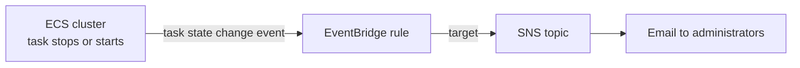

# 18 - Containers on AWS

Related: [[Containers (ECS, ECR, EKS)]] (Version C service note) · [[ELB]] · [[ASG]] · [[EFS]] · [[EBS]] · [[FSx]] · [[S3]] · [[EventBridge]] · [[SQS]] · [[IAM]] · [[Parameter Store & Secrets Manager]] · [[CloudFormation]]

## Chapter summary
- **Docker** packages apps into containers that run the same anywhere; keywords: **microservices**, lift-and-shift to the cloud. Images live in a registry: **Docker Hub** (public) or **Amazon ECR** (private, plus the ECR Public Gallery).
- Containers share the host OS (lighter, less isolated than VMs, so more containers per server); EC2 instances are VMs on a hypervisor.
- **ECS** = AWS's own container platform. Launch types: **EC2** (you provision and maintain instances running the **ECS agent**) or **Fargate** (serverless, you only define **task definitions**; the exam favors Fargate).
- Two IAM concepts to keep apart: **EC2 instance profile** (EC2 launch type only, used by the ECS agent) vs **ECS task role** (EC2 and Fargate, one role per task, set in the task definition).
- Load balancing: **ALB** fits most cases; **NLB** only for very high throughput/performance or with **PrivateLink**; Classic LB not recommended and cannot be linked to Fargate. Persistent storage: **EFS** (works with EC2 and Fargate, multi-AZ shared) or an S3 bucket mounted as a file system.
- **ECS Service Auto Scaling** uses **Application Auto Scaling** (CPU, memory, ALB request count per target; target tracking / step / scheduled). Task scaling is not the same as scaling the EC2 cluster; use an **ECS Cluster Capacity Provider** (paired with an ASG) rather than plain ASG scaling for the EC2 launch type.
- ECS integrates with **EventBridge** (S3 events or schedules launching tasks; task state-change events) and **SQS** (queue-driven scaling).
- **ECR** = store Docker images; backed by S3, IAM-protected, vulnerability scanning, versioning, tags, lifecycle.
- **EKS** = managed **Kubernetes** (open source, cloud agnostic). Nodes: managed node groups, self-managed nodes, or Fargate. "Pods" = Kubernetes term. Storage via **CSI** drivers.

---

## 01 - Docker Introduction
(src: 18/01-Docker Introduction)

- Docker = software development platform to deploy apps as **containers**; standardized, run the same on any OS/machine, predictable behavior, any language/OS/technology.
- Use cases: **microservices architecture**, lift-and-shift of apps from on-premises to cloud, any time you want to run containers.
- A server (e.g. EC2) runs the Docker agent/daemon; many containers (Java, Node.js, MySQL...) can run, including multiple copies of the same one.
- **Image storage**: **Docker Hub** (public; base images such as Ubuntu, MySQL) or **Amazon ECR** (Elastic Container Registry; private, plus **Amazon ECR Public Gallery**).
- **Docker vs VM**: a VM stack is infrastructure -> host OS -> hypervisor -> guest OS + app (EC2 works this way, instances isolated and not sharing resources). Docker stack is infrastructure -> host OS -> Docker daemon -> lightweight containers that share host resources/networking. Slightly less isolated, but more containers per server.
- **Workflow**: write a **Dockerfile** -> build -> **image** -> **push** to a repository (Docker Hub / ECR) -> **pull** -> run (image becomes a container).
- Docker management on AWS: **Amazon ECS**, **Amazon EKS** (managed Kubernetes), **AWS Fargate** (serverless, works with both ECS and EKS), **Amazon ECR** (image storage).

> [!tip] Exam
> Docker keyword = microservices / lift-and-shift. Storing Docker images on AWS = ECR.

---

## 02 - Amazon ECS
(src: 18/02-Amazon ECS)

**Launch types**
| | EC2 launch type | Fargate launch type |
|---|---|---|
| Infrastructure | you provision/maintain EC2 instances in the cluster | none to manage, serverless (servers exist behind the scenes) |
| Agent | each instance runs the **ECS agent** that registers it to the ECS service/cluster | not applicable |
| How it works | AWS starts/stops containers, placing tasks on your instances | you create a **task definition** with the CPU/RAM needed; AWS runs the tasks |
| Scaling | scale instances and tasks | just **increase the number of tasks** |

> [!tip] Exam
> The exam loves **Fargate**: serverless and much easier to manage than the EC2 launch type.

**IAM roles**
- **EC2 instance profile** (EC2 launch type only): used by the **ECS agent** to call the ECS service (register the instance), CloudWatch Logs (container logs), ECR (pull images), and Secrets Manager / SSM Parameter Store (sensitive data).
- **ECS task role** (EC2 **and** Fargate): one role per task (e.g. task A -> S3, task B -> DynamoDB); defined in the **task definition**.

**Load balancer integrations**
- **ALB** supports most use cases and works with Fargate: good choice.
- **NLB**: only for very high throughput/performance, or combined with **AWS PrivateLink**.
- **Classic LB**: possible but not recommended (no advanced features) and **cannot be linked to Fargate**.

**Data persistence**
- **Amazon EFS** as a task volume: network file system compatible with both EC2 and Fargate launch types; tasks in any AZ share the same data. **Fargate + EFS** = fully serverless combo; use case: persistent multi-AZ shared storage for containers.
- Newer option: mount an **S3 bucket as a file system** on tasks (ECS managed instances and Fargate); changes sync automatically to the bucket. Use case: shared file access to data already in S3.

[verify] Instructor says S3 file system mounting works for "ECS managed instances and Fargate".
> [!warning] Correction [note]
> AWS documents S3 Files for ECS as supported on **Fargate, ECS Managed Instances and Amazon EC2** launch types; a task IAM role and transit encryption are mandatory. Source: [Configuring S3 Files for Amazon ECS](https://docs.aws.amazon.com/AmazonECS/latest/developerguide/s3files-volumes.html).

---

## 03 - Creating ECS Cluster (Hands On)
(src: 18/03-Creating ECS Cluster - Hands On)

- Cluster creation offers three infrastructure options: **Fargate only** (serverless); **Fargate and Managed Instances** (AWS also manages EC2 instances behind the scenes; needs an instance profile `ecsInstanceRole` and an infrastructure role; instance selection by ECS default or custom vCPU/memory/allowed instance types); **Fargate and Self-managed instances** (the old way: you create the ASG, choose AMI and instance type). AWS is moving users away from self-managed instances.
- Self-managed settings in the demo: new ASG, On-Demand, **t3.micro**, default EC2 instance role, max 2, no SSH, min root EBS **30 GB**. The cluster auto-created an ASG (named like `Infra-ECS-Cluster`, capacity 0, min 0, max 5) spanning three AZs, created through CloudFormation.
- **Capacity providers** in the cluster: **FARGATE**, **FARGATE_SPOT** (Fargate tasks in Spot mode), and an **ASG provider** (EC2 instances through the ASG, managed scaling).
- Setting ASG desired capacity to 1 launched an instance that registered itself as a **container instance**, showing its available capacity (1024 CPU units, 982 memory) until tasks consume it.

[verify] Capacity options described as Fargate / Managed Instances / self-managed EC2.
> [!warning] Correction [note]
> AWS currently lists three ECS infrastructure types: **ECS Managed Instances**, **Serverless (Fargate)** and **Amazon EC2 instances** (you manage them directly). Source: [Architect your solution for Amazon ECS](https://docs.aws.amazon.com/AmazonECS/latest/developerguide/ecs-configuration.html). Consistent with the lecture; Managed Instances is newer than much of the course.

### Hands-on steps
1. ECS console -> Clusters -> Create cluster; name `DemoCluster`.
2. Infrastructure: pick Fargate only, Fargate + Managed Instances (create instance profile and infrastructure roles), or Fargate + self-managed (new ASG, On-Demand, t3.micro, max 2, 30 GB root volume).
3. Create; watch the ASG appear in EC2 -> Auto Scaling Groups.
4. Open the cluster -> Infrastructure: see FARGATE, FARGATE_SPOT and the ASG capacity provider.
5. Edit the ASG desired capacity to 1; wait until the instance appears under Container instances with 0 tasks.

---

## 04 - Creating ECS Service (Hands On)
(src: 18/04-Creating ECS Service - Hands On)

- Order: first a **task definition**, then a **service**.
- **Task definition** (`nginxdemos-hello`, Docker Hub image `nginxdemos/hello`): infrastructure Fargate; Linux; task size 0.5 vCPU / 1 GB (Fargate can go up to 16 vCPU and large memory); **task role** (IAM role for API calls to AWS; none here but important when containers use AWS) vs **task execution role** (default; auto-created by ECS); container port mapping 80 -> 80; optional resource limits, env variables, logging; Fargate **ephemeral storage** default 21 GB. Each save creates a new **revision/version**.
- **Service**: choose task definition family + revision; compute via capacity provider strategy (Fargate), platform version latest; deployment configuration **replica** with desired task count (1); AZ rebalancing feature; networking: subnets, **new security group allowing HTTP from anywhere**, public IP on; load balancing: new **ALB** (`DemoALBForECS`, listener 80) and new target group (`nginxdemosTG`, port 80); service auto scaling left off.
- Result: service active, 1 task running; target group registers the container's **private IP**; ALB DNS shows the nginx page with the server address equal to that IP. Task page shows config, private IP, logs; service **Events** tab shows start, target registration, steady state.
- **Scale out**: update service desired tasks to 3; Fargate provisions the resources, tasks go pending -> activating -> running; refreshing shows different IPs as the ALB spreads the load.
- **Scale back** to save cost: desired tasks 0 on the service, and desired capacity 0 on the ASG.

### Hands-on steps
1. ECS -> Task definitions -> Create new: name `nginxdemos-hello`; Fargate, Linux, 0.5 vCPU / 1 GB; no task role; default execution role; container name + image `nginxdemos/hello`; port 80; defaults for the rest; Create.
2. Clusters -> DemoCluster -> Services -> Create: select family and latest revision; Fargate capacity provider; replica, 1 task.
3. Networking: new security group with HTTP from anywhere; public IP on.
4. Load balancing: create ALB `DemoALBForECS`, listener 80, new target group `nginxdemosTG` port 80; skip VPC Lattice, service auto scaling and volumes; Create.
5. Open service -> target group -> ALB -> copy the DNS name -> browse (nginx page); also try `/test`.
6. Update service -> desired tasks 3; refresh the page to see IP change.
7. Update service -> desired tasks 0; ASG desired capacity 0.

---

## 05 - Amazon ECS - Auto Scaling
(src: 18/05-Amazon ECS - Auto Scaling)

- Service tasks can be scaled manually or automatically with **AWS Application Auto Scaling**.
- Metrics (instructor: "only these three to remember"): **ECS service CPU utilization**, **ECS service memory utilization**, **ALB request count per target**.
- Policy types: **Target tracking**, **Step scaling**, **Scheduled scaling** (predictable changes).
- Scaling the **service (tasks)** is not the same as scaling the **EC2 cluster** (EC2 launch type). With **Fargate** no EC2 scaling is needed, so service auto scaling is much simpler; the exam pushes Fargate.
- Scaling EC2 instances for the EC2 launch type:
  1. **ASG scaling** (e.g. on CPU utilization).
  2. **ECS Cluster Capacity Provider** (newer, smarter): paired with an ASG, automatically scales it when RAM/CPU are lacking to place new tasks. **Prefer this** over plain ASG scaling.
- Flow: CPU rises -> CloudWatch metric -> CloudWatch alarm -> Application Auto Scaling raises the service's desired count -> new task; on EC2 launch type the Capacity Provider can scale the instances.

> [!tip] Exam
> ECS service scaling metrics: CPU, memory, ALB request count per target. EC2 launch type: use Cluster Capacity Provider rather than plain ASG scaling. Fargate = simplest.

[verify] "Only these three metrics" for ECS service auto scaling.
> [!warning] Correction [note]
> AWS documents additional scaling approaches beyond the three predefined metrics: **predictive scaling** and scaling on an **SQS queue backlog per task** custom metric (and other CloudWatch metrics). The three metrics remain the standard predefined ones for exam purposes. Source: [Automatically scale your Amazon ECS service](https://docs.aws.amazon.com/AmazonECS/latest/developerguide/service-auto-scaling.html).

---

## 06 - Amazon ECS - Solutions Architectures
(src: 18/06-Amazon ECS - Solutions Architectures)

1. **S3 -> EventBridge -> ECS task**: users upload objects to S3; S3 sends events to EventBridge; a rule runs an ECS (Fargate) task; the task, with an **ECS task role**, reads the object, processes it and writes results to **DynamoDB**. Fully serverless object processing in a container.
2. **EventBridge schedule -> ECS task**: a rule triggered e.g. **every 1 hour** runs a Fargate task that does batch processing on S3 files (task role with S3 access). Serverless.
3. **SQS queue + ECS service**: service tasks poll messages from an SQS queue; **ECS Service Auto Scaling** adds tasks as queue depth grows.
4. **EventBridge intercepts ECS events**: e.g. **ECS Task State Change** with state "stopped" and the stopped reason, which can notify an **SNS** topic (emails to admins). EventBridge lets you follow container lifecycle.

> [!info] Diagram
> **Explanation:** ECS publishes task state-change events (e.g. a task stopped, with the stopped reason) to EventBridge. A rule matches the event and invokes a target; here an SNS topic which emails administrators. Other supported targets include Lambda, SQS and Kinesis Data Streams.
> **Reference:** [Automate responses to Amazon ECS errors using EventBridge (Amazon ECS Developer Guide)](https://docs.aws.amazon.com/AmazonECS/latest/developerguide/cloudwatch_event_stream.html)

---

## 07 - Amazon ECS - Clean Up (Hands On)
(src: 18/07-Amazon ECS - Clean Up - Hands On)

- Deleting the **service** (after setting tasks to 0) triggers **CloudFormation** to delete its stack: ECS service, ALB listener, ALB, security group, target groups. Takes time.
- Then delete the **cluster**: CloudFormation removes the capacity provider, ASG, cluster and launch templates.
- **Task definitions** cost nothing; may stay, or be **deregistered**.

### Hands-on steps
1. Service -> update desired tasks to 0 -> Delete service (type `delete`); wait for the stack deletion.
2. Delete cluster `DemoCluster`.
3. Optional: task definition -> Actions -> Deregister.

---

## 08 - Amazon ECR
(src: 18/08-Amazon ECR)

- **ECR = Elastic Container Registry**: store and manage Docker images on AWS.
- **Private** repository (your account(s)) or **public** repository (**Amazon ECR Public Gallery**).
- Fully integrated with ECS; images are stored **behind the scenes in S3**.
- Access fully controlled by **IAM**: e.g. attach an IAM role to the EC2 instance so it can pull images; ECR permission errors -> check policies.
- Features: **image vulnerability scanning**, **versioning**, **image tags**, **image lifecycle**.

> [!tip] Exam
> "Storing Docker images" = ECR.

---

## 09 - Amazon EKS - Overview
(src: 18/09-Amazon EKS - Overview)

- **EKS = Elastic Kubernetes Service**: launch and manage **Kubernetes** clusters on AWS. Kubernetes = **open-source** system for automated deployment, scaling and management of containerized (usually Docker) apps; alternative to ECS (similar goal, different API). Kubernetes is **cloud agnostic** (Azure, Google Cloud...), so EKS eases migration between clouds.
- Use cases: company already runs Kubernetes on-premises or in another cloud, or wants the Kubernetes API with AWS managing the cluster.
- Launch modes: **EC2** (worker nodes) or **Fargate** (serverless containers).
- Architecture: VPC with 3 AZs, public and private subnets; **EKS worker nodes** (EC2) run **EKS Pods** (similar to ECS tasks; "pods" = Kubernetes); nodes can be in an ASG; expose services with a **private or public load balancer**.

**Node types**
| Type | Who manages | Notes |
|---|---|---|
| **Managed node groups** | AWS creates/manages nodes (EC2) in an ASG managed by EKS | On-Demand and Spot |
| **Self-managed nodes** | you create nodes, register them to the cluster, run them in an ASG | can use the prebuilt **EKS Optimized AMI** or your own AMI; On-Demand and Spot |
| **Fargate** | no nodes, no maintenance | just run containers |

- **Data volumes**: specify a **StorageClass** manifest on the cluster; uses a **CSI (Container Storage Interface)** compliant driver. Supported: **EBS**, **EFS** (the only one that works with **Fargate**), **FSx for Lustre**, **FSx for NetApp ONTAP**.

> [!tip] Exam
> Kubernetes / pods / "already using Kubernetes" / cloud-agnostic = EKS. EFS is the storage class compatible with EKS on Fargate.

[verify] "EFS is the only storage class that works with Fargate" on EKS.
> [!warning] Correction [note]
> Unconfirmed. The EKS storage page lists CSI drivers for EBS, S3, S3 Files, EFS, FSx and File Cache but does not state which work on Fargate. Source for the driver list: [Use application data storage for your cluster (Amazon EKS)](https://docs.aws.amazon.com/eks/latest/userguide/storage.html). For the exam, keep the lecture's rule (EFS for Fargate).

---

## 10 - Amazon EKS - Hands On
(src: 18/10-Amazon EKS - Hands On)

Demo only; instructor says do not follow along as it costs money.

- Create cluster: **quick** or **custom** configuration. **EKS Auto Mode** (new): when a new pod does not fit on existing nodes, EKS creates a node automatically; node pools **general purpose** and **system**.
- Needs a **cluster IAM role** (recommended role created; extra managed policies for Auto Mode: block storage, cluster, compute, load balancing and networking) and a **node IAM role** (`AmazonEKSAutoNodeRole`) so nodes can register.
- Other settings: Kubernetes version, standard support, cluster access (admin for your principal), optional zonal shift (disabled), networking (VPC, three public subnets, security groups, IPv4, endpoint access public and private), observability (CloudWatch metrics, optional Prometheus, control plane logs), **add-ons** (DNS, SageMaker, EFS..., community and marketplace).
- After creation: **Resources** tab shows Kubernetes objects (pods, replica sets, deployments, stateful sets); **Compute** tab shows nodes (a `c6g.large` created by Auto Mode - pricey) plus **node groups** and **Fargate profiles**.
- Managed **node group** demo (`DemoNodeGroup`): needs a node role (`NodeGroupRoleEKS`, four policies auto-added); optional launch template; AMI type, capacity, instance types, disk size, min/max, warm pool, node repair; networking. It creates its own ASG (two `t3.medium` nodes appeared).
- Fargate profile defines how pods launch on Fargate.
- Add-ons: **EBS CSI driver** and **EFS CSI driver** allow EBS volumes / EFS file systems in the cluster.
- Cleanup: delete node groups first, then the cluster.

### Hands-on steps
1. EKS console -> Create cluster -> Custom configuration; enable EKS Auto Mode; name `DemoEKSCluster`.
2. Create the recommended cluster role (attach the Auto Mode managed policies) and the node role `AmazonEKSAutoNodeRole`.
3. Networking: select VPC and three subnets; access public and private; review; Create.
4. Explore Resources and Compute tabs.
5. Compute -> Add node group: `DemoNodeGroup`, create node role, settings, networking, Create (an ASG is created).
6. Add-ons -> install EBS CSI / EFS CSI driver (shown, not done).
7. Delete node groups, then the cluster (done offline).

---

## Not covered in this chapter's lectures
- All ten lectures have transcripts; none missing.
