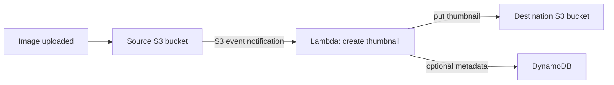
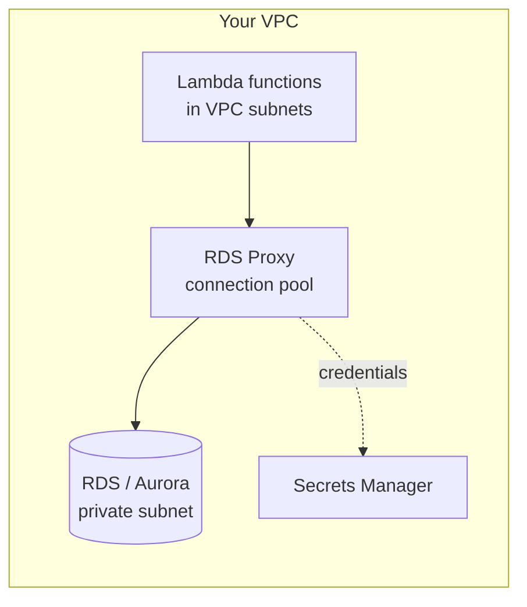
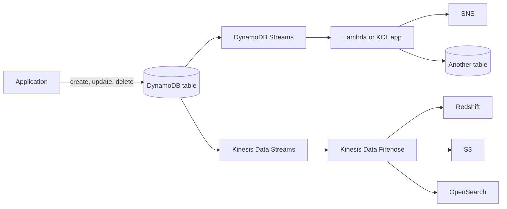
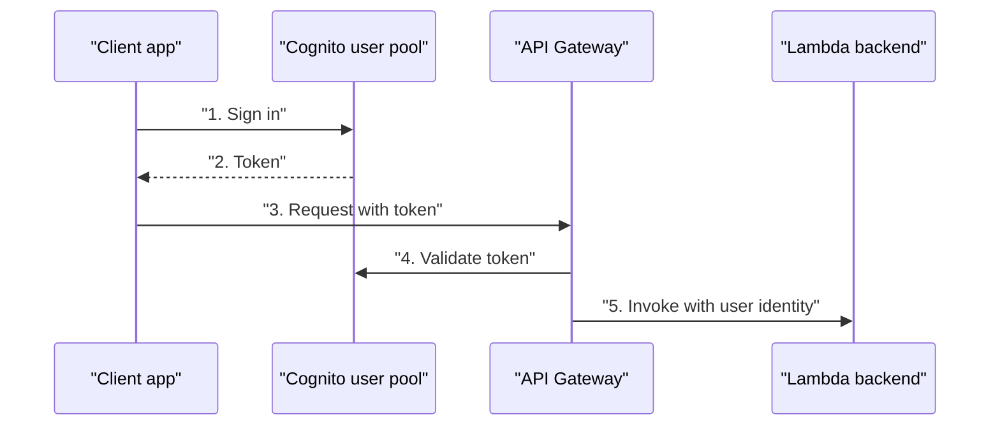

# 19 - Serverless Overviews

Related: [[Lambda]] · [[DynamoDB]] · [[API Gateway, Step Functions & Cognito]] · [[RDS & Aurora]] · [[CloudFront & Global Accelerator]] · [[Serverless Solution Architectures]] · [[IAM]] · [[VPC]]

## Chapter summary
- **Serverless** = you do not manage or provision servers (servers still exist). Started as FaaS (Lambda); now covers any managed service: S3, DynamoDB, Cognito, API Gateway, SNS, SQS, Kinesis Data Firehose, Aurora Serverless, Step Functions, Fargate. The exam tests serverless heavily.
- **Lambda**: virtual functions, on demand, auto-scaling, billed per request + duration; **max 15 min**, **128 MB-10 GB RAM** (more RAM = more CPU and network), **/tmp up to 10 GB**, **env vars 4 KB**, **zip 50 MB / 250 MB unzipped**, **1000 concurrent executions** per region (soft limit).
- **Concurrency**: reserved concurrency (per-function cap) protects other functions; throttling = **429** on sync, automatic retries (up to 6 h) then DLQ on async; **provisioned concurrency** and **SnapStart** remove cold starts.
- **Edge functions**: CloudFront Functions (JavaScript, viewer request/response only, sub-millisecond) vs Lambda@Edge (Node.js/Python, all four events, seconds).
- **Lambda in a VPC** needs VPC ID, subnets, security group; use **RDS Proxy** to pool DB connections; RDS can invoke Lambda (PostgreSQL, Aurora MySQL) but RDS event notifications carry no data events.
- **DynamoDB**: serverless NoSQL, single-digit ms, items max 400 KB, provisioned (RCU/WCU, auto scaling) vs on-demand; DAX (microsecond cache), Streams / Kinesis, Global Tables (active-active), TTL, PITR (35 days), S3 export/import.
- **API Gateway**: serverless REST/WebSocket front door (auth, throttling, API keys, stages, caching); endpoint types Edge-optimized (default), Regional, Private; integrates with Lambda, HTTP, AWS services.
- **Step Functions** = serverless visual workflow orchestration; **Cognito** = user pools (sign-in, tokens) + identity pools (temporary AWS credentials).

---

## 01 - About the Serverless Section
(src: 19/01-About the Serverless Section)

- No transcript available for this lecture.

---

## 02 - Serverless Introduction
(src: 19/02-Serverless Introduction)

- Serverless: developers deploy code (originally functions = **FaaS**) without managing servers. Now it means "anything remotely managed" with no provisioning: databases, messaging, storage.
- Pioneered by **AWS Lambda**; the serverless stack on AWS: Lambda, DynamoDB, Cognito, API Gateway, S3, plus SNS, SQS, **Kinesis Data Firehose**, **Aurora Serverless**, **Step Functions**, **Fargate**.
- Reference architecture: users get static content from **S3 (+ CloudFront)**, log in with **Cognito**, call a REST API on **API Gateway**, which invokes **Lambda**, which reads/writes **DynamoDB**.

> [!tip] Exam
> Serverless does not mean no servers; it means you do not provision or see them. The exam tests serverless knowledge heavily.

---

## 03 - Lambda Overview
(src: 19/03-Lambda Overview)

- **EC2 vs Lambda**: EC2 = provisioned virtual servers running continuously, scaled by adding/removing servers (ASG). Lambda = virtual **functions**, no servers to manage, **limited by time (up to 15 minutes)**, **run on demand** (billed only while running), **automated scaling**.
- **Benefits**: simple pricing, many integrations, many languages, easy CloudWatch monitoring, up to **10 GB RAM per function**; **raising RAM also improves CPU and network quality**.
- **Pricing**: pay per **number of requests** and **compute time (duration, per millisecond)**.
  - Free tier: **1 million requests** and **400,000 GB-seconds** per month.
  - After free tier: **$0.20 per extra 1 million requests**; **$1 for 600,000 GB-seconds** (as stated by the instructor).
  - 400,000 GB-s = 400,000 s at 1 GB RAM; 8x more seconds at 128 MB.
- **Languages**: Node.js (JavaScript), Python, Java, C# (.NET Core), PowerShell, Ruby; others via the **custom runtime API** (e.g. Rust, Go). Most important: Node.js and Python.
- **Container images**: Lambda supports container images that implement the **Lambda Runtime API**. For the exam, running Docker images is **preferred on ECS or Fargate**, not Lambda.
- **Integrations** (main ones): API Gateway (REST API invokes Lambda), Kinesis (on-the-fly data transformation), DynamoDB (triggers), S3 (event on file creation), CloudFront (Lambda@Edge), CloudWatch Events / EventBridge (react to infra events, e.g. CodePipeline state change), CloudWatch Logs (stream logs), SNS (notifications), SQS (process queue messages), Cognito (react to events such as user login).
- **Example 1 - serverless thumbnail creation**: image uploaded to S3 -> S3 event notification triggers Lambda -> Lambda creates the thumbnail, writes it to another (or the same) S3 bucket, and optionally stores metadata (name, size, creation date) in DynamoDB.
- **Example 2 - serverless CRON**: a **CloudWatch Events / EventBridge rule** fires on a schedule (e.g. every hour) and triggers a Lambda function; no EC2 instance sits idle waiting for cron.

> [!info] Diagram
> **Explanation:** An object created in the source bucket triggers the Lambda function through an S3 event notification. The function writes a resized version to another bucket (the lecture also stores image metadata in DynamoDB; that part is from the lecture, not the AWS tutorial). Using a separate destination bucket avoids a recursive invocation loop.
> **Reference:** [Tutorial: Using an Amazon S3 trigger to create thumbnail images (AWS Lambda Developer Guide)](https://docs.aws.amazon.com/lambda/latest/dg/with-s3-tutorial.html)

> [!tip] Exam
> Lambda = short, on-demand, auto-scaling, pay per request + duration. Event-driven patterns: S3 upload -> Lambda; EventBridge schedule -> Lambda (serverless cron).

[verify] "$1 for 600,000 GB-seconds" and the free tier figures.
> [!warning] Correction [note]
> The Lambda pricing page lists x86 compute at **$0.0000166667 per GB-second** (about $1 per 60,000 GB-s, not 600,000) and **$0.20 per million requests**; the free tier of **1 million requests and 400,000 GB-seconds per month** is confirmed. Memory is configurable 128-10,240 MB in 1 MB steps. Source: [AWS Lambda Pricing](https://aws.amazon.com/lambda/pricing/).

---

## 04 - Lambda Hands-On
(src: 19/04-Lambda Hands-On)

- The console "begin" intro page animates how Lambda works: functions in several languages, responding to events (streaming analytics, mobile/IoT backend, S3 photo uploads); clicking more events shows Lambda **scaling out** without servers. Cost grows with invocations, but the free tier is generous.
- Each function has an **execution role** (like an EC2 role, but for Lambda). The basic role grants **write access to CloudWatch Logs** only; to reach S3 etc., add permissions to that IAM role.
- The **handler** is the code invoked with the event (input JSON) and context. Test events are saved JSON inputs; a failing input shows an error in the result and in logs.
- **Monitoring**: invocation metrics via CloudWatch (take time to populate); **View CloudWatch Logs** for log streams and errors (debug from logs).
- **Configuration tab**: memory, ephemeral storage, timeout (fail after N seconds), execution role, permissions (role summary), **triggers** (AWS and partner event sources; S3 needs bucket + event types).

### Hands-on steps
1. Lambda console -> open the `/begin` intro page; run the Node.js example and click through "Lambda responds to events" [screen action].
2. Create function -> use blueprint **Hello world** (Python), name `HelloWorld`, create a new role with basic Lambda permissions.
3. Review the generated handler code; click **Test** -> create test event `HelloWorld event` (key1/key2/key3) -> result returns `value1`.
4. Temporarily remove a key to trigger an error, then restore it.
5. Monitor tab -> **View CloudWatch Logs** -> open the log stream to see output and the earlier error.
6. Configuration -> General (memory, ephemeral storage, timeout, role), Permissions (role summary), Triggers (Add trigger shows event sources).

---

## 05 - Lambda Limits
(src: 19/05-Lambda Limits)

Limits are **per region**; the exam likes them.

| Area | Limit |
|---|---|
| Memory | **128 MB to 10 GB** (instructor: 64 MB increments); more memory = more vCPU |
| Max execution time | **900 s = 15 min** |
| Environment variables | **4 KB** |
| `/tmp` storage (ephemeral) | up to **10 GB** (for big files) |
| Concurrent executions | **1000** per region (can be increased via support request; use reserved concurrency early) |
| Deployment package (zip) | **50 MB compressed, 250 MB uncompressed**; bigger files -> use `/tmp` |

> [!tip] Exam
> "30 GB RAM", "30 minutes of execution" or "a 3 GB file" in the question means Lambda is NOT the right choice.

[verify] "Memory in 64 MB increments."
> [!warning] Correction [note]
> AWS documents memory of 128-10,240 MB in **1 MB increments**; the other limits (15 min, 4 KB env vars, 50 MB zip / 250 MB unzipped, `/tmp` up to 10,240 MB, 1,000 concurrent executions default, soft limit) are confirmed. New accounts can start with reduced concurrency and memory quotas that AWS raises with usage. Source: [Lambda quotas](https://docs.aws.amazon.com/lambda/latest/dg/gettingstarted-limits.html).

---

## 06 - Lambda Concurrency
(src: 19/06-Lambda Concurrency)

- More invocations = more **concurrent executions**; up to **1000** per account/region (soft limit, raise via support ticket).
- **Reserved concurrency** is set **per function** (e.g. max 50). Invocations above it are **throttled**:
  - **Synchronous** invocation -> **throttle error 429**.
  - **Asynchronous** invocation -> automatic **retries, then DLQ**.
- **Why set it**: the concurrency limit is shared by **all functions in the account**. Example: a promotion floods an ALB -> Lambda function, which consumes all 1000 executions; the API Gateway-backed function and SDK/CLI-invoked function are then throttled.
- **Async invocations** (e.g. S3 event notifications): if no concurrency is available, Lambda returns the event to the **internal event queue** (for 429 and 500-series errors) and retries for **up to 6 hours**, with backoff growing **exponentially from 1 second up to 5 minutes**.
- **Cold start**: a new instance loads code and runs initialization code **outside the handler** (dependencies, SDK clients, DB connections). The first request to a new instance has higher latency (e.g. 3 s).
- **Provisioned concurrency**: allocate concurrency **in advance** so cold starts never happen; manage it with **Application Auto Scaling** (scheduled or target tracking).
- VPC cold starts were dramatically reduced by an AWS improvement announced late 2019, so VPC functions now have minimal cold-start impact.
- The instructor points to two slide diagrams on reserved vs provisioned concurrency to study on your own.

| | Reserved concurrency | Provisioned concurrency |
|---|---|---|
| Purpose | cap (and guarantee) a function's share of the account limit | pre-warm instances, avoid cold start |
| Cost | none | **extra cost** |

> [!tip] Exam
> Sync throttle = 429; async = retry up to 6 h then DLQ. One runaway function can starve others unless you set reserved concurrency. Cold start fix = provisioned concurrency.

---

## 07 - Lambda Concurrency - Hands On
(src: 19/07-Lambda Concurrency - Hands On)

- Configuration -> **Concurrency**: the account has **unreserved account concurrency of 1000**, shared by all functions.
- Reserving e.g. **20** for a function leaves **980** unreserved for the others.
- Reserving **0** means the function is **always throttled**; Test then fails with "calling the Invoke API action failed because we have exceeded the rate". Useful for testing throttle handling. Revert to unreserved or a specific value to fix.
- **Provisioned concurrency configuration**: set on an **alias or a published version** (not `$LATEST`). It has a cost, so pick a sensible number; the instructor does not enable it.

### Hands-on steps
1. Function -> Configuration -> Concurrency -> Edit -> reserve 20 (account unreserved becomes 980).
2. Reserve 0 -> Test -> observe the throttle error.
3. Switch back to unreserved account concurrency (or a specific value) -> Test works.
4. View **Provisioned concurrency configurations** -> Add configuration (needs an alias/version); do not save (costs money).

---

## 08 - Lambda SnapStart
(src: 19/08-Lambda SnapStart)

- Improves function startup/performance **up to 10x at no extra cost** for **Java, Python and .NET** (as stated).
- Without SnapStart: lifecycle = **Init -> Invoke -> Shutdown**, and init can be slow (e.g. Java).
- With SnapStart: when you **publish a new version**, Lambda initializes the function and takes a **snapshot of memory and disk state**; invocations resume from the snapshot and jump straight to Invoke (low latency).

> [!tip] Exam
> SnapStart = pre-initialized snapshot taken at version publish; faster cold starts without paying for provisioned concurrency.

[verify] "No extra cost for Java, Python and .NET."
> [!warning] Correction [note]
> AWS supports SnapStart on Java 11+, Python 3.12+ and .NET 8+, works only on published versions/aliases (not `$LATEST`), and does not support provisioned concurrency, EFS or ephemeral storage above 512 MB. The "no additional cost" statement applies to **Java managed runtimes**; other runtimes incur snapshot caching and restoration charges. Source: [Improving startup performance with Lambda SnapStart](https://docs.aws.amazon.com/lambda/latest/dg/snapstart.html).

---

## 09 - Lambda@Edge & CloudFront Functions
(src: 19/09-Lambda@Edge & CloudFront Functions)

- **Edge functions** = code you attach to **CloudFront** distributions to run logic close to users, before the request reaches the application. No servers, deployed globally, pay for what you use, fully serverless.
- Use cases: website security and privacy, dynamic web apps at the edge, SEO, intelligent routing across origins/data centers, bot mitigation, real-time image transformation, A/B testing, user authentication/authorization, user prioritization, user tracking and analytics.
- **Request flow**: client -> **viewer request** -> CloudFront -> **origin request** -> origin -> **origin response** -> CloudFront -> **viewer response** -> client.
- **CloudFront Functions**: lightweight **JavaScript**; modify **viewer request/response only**; **millions of requests per second**; **sub-millisecond** startup/execution; native CloudFront feature, code managed inside CloudFront.
- **Lambda@Edge**: **Node.js or Python**; scale to **thousands of requests per second**; can change **all four** events (viewer request, origin request, origin response, viewer response); **author in us-east-1** (same region as managing CloudFront), then CloudFront replicates to all locations.

| | CloudFront Functions | Lambda@Edge |
|---|---|---|
| Runtime | JavaScript | Node.js, Python |
| Scale | millions req/s | thousands req/s |
| Triggers | viewer request/response | viewer + origin request/response |
| Max duration | **< 1 ms** | **5-10 s** (as stated) |
| Use cases | cache key normalization, header manipulation, URL rewrites/redirects, request authorization (JWT) | longer logic, adjustable CPU/memory, third-party libraries/SDK, network access to external services, file system and HTTP body access |

> [!tip] Exam
> Simple high-volume header/URL/JWT tweaks at viewer stage = CloudFront Functions. Needs network, SDK, body access or origin events = Lambda@Edge.

[verify] "Lambda@Edge max execution 5 to 10 seconds; scale thousands of requests per second."
> [!warning] Correction [note]
> AWS's comparison table lists Lambda@Edge duration up to **30 seconds** (viewer and origin events) and scale up to **10,000 requests per second per Region**; CloudFront Functions are sub-millisecond, JavaScript, viewer events only. Source: [Differences between CloudFront Functions and Lambda@Edge](https://docs.aws.amazon.com/AmazonCloudFront/latest/DeveloperGuide/edge-functions-choosing.html).

---

## 10 - Lambda in VPC
(src: 19/10-Lambda in VPC)

- **Default**: Lambda runs **outside your VPC** (in an AWS-owned VPC). It can reach public internet APIs and **DynamoDB** (public AWS endpoint), but **not** private resources: RDS, ElastiCache, internal load balancers.
- **Launch in your VPC**: specify **VPC ID, subnets and a security group**; Lambda creates an **ENI** in your subnets and gets private connectivity.
- **Lambda + RDS Proxy**: many short-lived functions opening direct DB connections can exhaust connections and cause timeouts under load. **RDS Proxy** pools and shares connections.
  - Benefits: **scalability** (connection pooling), **availability** (reduces failover time by **66%** and preserves connections, for RDS and Aurora), **security** (enforce IAM authentication at the proxy, credentials in **Secrets Manager**).
  - The proxy is **never publicly accessible**, so the Lambda function **must be in the VPC** to reach it.

> [!info] Diagram
> **Explanation:** Lambda functions attached to the VPC connect to the RDS Proxy instead of the database; the proxy pools and reuses a smaller number of DB connections, and can use Secrets Manager or IAM authentication for credentials. The proxy must be in the same VPC as the database and is not publicly accessible.
> **Reference:** [Amazon RDS Proxy (Amazon RDS User Guide)](https://docs.aws.amazon.com/AmazonRDS/latest/UserGuide/rds-proxy.html)

> [!tip] Exam
> Lambda needs VPC access to reach private RDS / ElastiCache. Many Lambdas + RDS = use RDS Proxy (and put Lambda in the VPC).

[verify] "RDS Proxy reduces failover time by 66%."
> [!warning] Correction [note]
> The RDS Proxy page fetched confirms pooling, preserved connections on failover, IAM authentication and Secrets Manager support, and that the proxy must be in the same VPC and is not publicly accessible, but it does not state the 66% figure. Unconfirmed. Source: [Amazon RDS Proxy](https://docs.aws.amazon.com/AmazonRDS/latest/UserGuide/rds-proxy.html).

---

## 11 - RDS - Invoking Lambda & Event Notifications
(src: 19/11-RDS - Invoking Lambda & Event Notifications)

- **Invoke Lambda from inside the DB**: supported by **RDS for PostgreSQL** and **Aurora MySQL**. Example: a row inserted in a registration table makes the DB invoke Lambda, which sends a welcome email.
  - Configured **from within the database** (connect to it), not from the AWS console.
  - The **RDS instance** is the invoker, so you need **network connectivity** to Lambda (public internet access, NAT gateway, or VPC endpoints) and an **IAM policy** on the DB instance allowing it to invoke the function.
- **RDS event notifications** are different: they report on the **DB instance itself** (created, started, etc.), **not on data** inside the database.
  - Subscribe to events for DB instance, snapshot, parameter group, security group, proxy, custom engine version.
  - **Near real time, delivery up to 5 minutes**; send to **SNS** (then SQS, Lambda...) or intercept in **EventBridge** (many destinations incl. Lambda).

> [!tip] Exam
> Reacting to data changes in the DB = invoke Lambda from the DB. RDS event notifications = infrastructure events only, no data events.

---

## 12 - Amazon DynamoDB
(src: 19/12-Amazon DynamoDB)

- **Fully managed, highly available, replicated across multiple AZs**, **NoSQL** (not relational, but supports transactions), AWS-proprietary and cloud-native.
- Scales to **millions of requests per second, trillions of rows, hundreds of TB**; **single-digit millisecond** performance; integrated with **IAM**; low cost, auto scaling, **no maintenance or patching**, always available.
- **Table classes**: **Standard** (frequently accessed) and **Standard-IA** (infrequently accessed).
- **Basics**: no database to create, you create **tables**. Each table has a **primary key** chosen at creation (**partition key** + optional **sort key**). Items = rows; **attributes** = columns that can be added over time and can be null (schema evolves easily, unlike RDS/Aurora).
- **Max item size 400 KB.** Data types: scalar (String, Number, Binary, Boolean, Null), List, Map, Set.
- Exam: if the **schema must evolve rapidly**, DynamoDB beats RDS/Aurora.

**Capacity modes**

| | Provisioned (default) | On-demand |
|---|---|---|
| How | specify reads/writes per second in advance: **RCU / WCU**; optional **auto scaling** | scales automatically; no RCU/WCU concept |
| Pay | for provisioned RCU/WCU | per read and write actually performed |
| Cost | cheaper for predictable workloads | **more expensive**; good for unpredictable load or sudden spikes |
| Good for | predictable, smoothly changing load, cost saving | 1,000 -> 1 million transactions in under a minute; very few transactions per day |

> [!tip] Exam
> Sudden steep spikes or near-zero traffic -> On-demand. Predictable load -> Provisioned (+ auto scaling).

---

## 13 - Amazon DynamoDB - Hands-On
(src: 19/13-Amazon DynamoDB - Hands-On)

- No "create database" step: you create a table straight away (serverless).
- Primary key = partition key (+ optional sort key). Settings customized to view **read/write capacity** options:
  - **On-demand**: pay for actual reads/writes; instructor says it is **2-3x more expensive** than provisioned.
  - **Provisioned**: capacity set in advance; **auto scaling** on/off for read and write separately. Example: min 1, max 100, **target utilization 70%**; or fixed values (e.g. 1 RCU/1 WCU).
- A **capacity calculator** exists (developer-exam level). With 1 RCU and 1 WCU the console estimated about **$0.71 per month**. **Encryption at rest** enabled.
- Items can each have **different attributes**; not all attributes need to exist in every item (NoSQL vs SQL).

### Hands-on steps
1. DynamoDB -> Create table: name `DemoTable`, partition key `user_id`, no sort key.
2. Customize settings -> compare On-demand vs Provisioned; set provisioned 1 RCU / 1 WCU, auto scaling off.
3. Skip indexes; keep encryption at rest; Create table.
4. Table -> Explore/View items -> Create item: `user_id` = `stephane_123`, add `name`, `favorite_movie`, `favorite_number`.
5. Create a second item `alice_456` with different attributes (`name`, `favorite_movie`, `age`) to show the flexible schema.

---

## 14 - Amazon DynamoDB - Advanced Features
(src: 19/14-Amazon DynamoDB - Advanced Features)

**DynamoDB Accelerator (DAX)**
- Fully managed, highly available, seamless **in-memory cache** for DynamoDB; **microseconds latency** for cached reads; solves read congestion; **no application changes** (compatible with DynamoDB APIs). Cluster of cache nodes in front of the table. **Default TTL 5 minutes** (changeable).
- **DAX vs ElastiCache**: DAX = individual object, query and scan cache for DynamoDB. ElastiCache = good for storing **aggregation / big computation results**. Complementary; for plain DynamoDB caching, use DAX.

**Stream processing** (capture create/update/delete changes): react in real time (e.g. welcome email), real-time analytics, feed derivative tables, cross-region replication, invoke Lambda.

| | DynamoDB Streams | Kinesis Data Streams |
|---|---|---|
| Retention | **24 hours** | up to **1 year** |
| Consumers | limited | many more |
| Processing | Lambda triggers, **DynamoDB Streams Kinesis Adapter** (KCL), EC2 | Lambda, Kinesis Data Analytics, Firehose, Glue streaming ETL |

- Architecture: app writes to table -> Streams (-> Lambda / KCL on EC2 -> SNS, filter/transform into another table, OpenSearch) **or** Kinesis Data Streams (-> Firehose -> Redshift / S3 / OpenSearch).

**Global Tables**: replicated across multiple regions (e.g. us-east-1 and ap-southeast-2) with **two-way, active-active replication**; read and write in any region with low latency. **DynamoDB Streams must be enabled** (it is the replication infrastructure).

**TTL**: automatically delete items after an **expiry timestamp** (epoch time attribute, e.g. `ExpTime`). Use cases: keep only current items, delete data after e.g. 2 years (regulatory), **web session handling** (session kept ~2 hours in DynamoDB, shared by apps).

**Backup / DR**
- **Continuous backups with PITR**: optional, last **35 days**, restore to any point in the window; **restore creates a new table**.
- **On-demand backups**: kept until explicitly deleted; no impact on performance or latency.
- **AWS Backup**: lifecycle policies and cross-region copy; restores also create a new table.

**S3 integration**
- **Export to S3**: requires **PITR**; any point in the last 35 days; no impact on read capacity/performance; formats **DynamoDB JSON** or **ION**. Use for Athena analysis, audit snapshots, ETL before re-import.
- **Import from S3**: **CSV, DynamoDB JSON or ION**; consumes **no write capacity**; creates a **new table**; errors logged to **CloudWatch Logs**.

> [!info] Diagram
> **Explanation:** Item changes in a table can be captured by DynamoDB Streams (short retention, processed by Lambda or a KCL consumer that can notify via SNS or write to another table) or by Kinesis Data Streams (long retention, delivered through Firehose to Redshift, S3 or OpenSearch). This follows the lecture's architecture slide.
> **Reference:** [Change data capture for DynamoDB Streams (Amazon DynamoDB Developer Guide)](https://docs.aws.amazon.com/amazondynamodb/latest/developerguide/Streams.html) (page fetched: confirms the 24-hour stream retention, item-level change capture, Lambda triggers and the Kinesis adapter; the Kinesis/Firehose branches in the diagram follow the lecture and are not shown on that page)

> [!tip] Exam
> Microsecond cache -> DAX. Change stream: DynamoDB Streams (24 h) vs Kinesis (1 yr). Active-active multi-region -> Global Tables (needs Streams). Auto-expire sessions -> TTL. Restore always creates a new table.

[verify] "PITR is available for the last 35 days."
> [!warning] Correction [note]
> PITR provides up to **35 days** of recovery points (default 35); the retention period (`RecoveryPeriodInDays`) can be set anywhere from **1 to 35 days**, and cross-Region restore is supported. Source: [Point-in-time backups for DynamoDB](https://docs.aws.amazon.com/amazondynamodb/latest/developerguide/Point-in-time-recovery.html).

---

## 15 - API Gateway Overview
(src: 19/15-API Gateway Overview)

- Ways for clients to reach Lambda: call it directly (needs IAM permissions), via an **ALB** (HTTP endpoint), or via **API Gateway**: a **serverless** service for **public REST APIs** that proxies requests to backends and adds authentication, usage plans, stages, etc.
- **Features**: no infrastructure to manage; **WebSocket** support (real-time streaming); **API versioning**; **multiple environments** (dev/test/prod); authentication and authorization; **API keys** and **request throttling**; **Swagger / Open API 3.0** import and export; request/response **transformation and validation**; **SDK and API specification generation**; **caching** of API responses.
- **Integrations**:
  - **Lambda**: most common; full serverless REST API.
  - **HTTP**: any HTTP backend (on-premises API, an ALB) to add rate limiting, caching, user authentication, API keys.
  - **AWS service**: expose any AWS API (e.g. start a **Step Functions** workflow, post to **SQS**) to add authentication, public deployment or rate control. Example: clients -> API Gateway -> **Kinesis Data Streams** -> Firehose -> S3, with no AWS credentials given to clients and no servers.
- **Endpoint types**:
  - **Edge-optimized** (**default**): for global clients; requests routed through **CloudFront edge locations**; the API still lives in **one region**.
  - **Regional**: clients in the same region; you can add your own CloudFront distribution for more control.
  - **Private**: accessible only **within your VPC** through **interface VPC endpoints (ENI)**; access defined by a **resource policy**.
- **Security**: IAM roles (internal apps, e.g. on EC2), **Cognito** (external web/mobile users), **custom authorizer** (Lambda function with your own logic). **HTTPS custom domain** via **ACM**: certificate must be in **us-east-1 for Edge-optimized**, or in the API's region for Regional. Create a **CNAME or A-alias record in Route 53** pointing to the API.

| Endpoint type | Reach | Notes |
|---|---|---|
| Edge-optimized (default) | global via CloudFront edge | cert in us-east-1 |
| Regional | same region | cert in the same region |
| Private | VPC only, interface endpoint | resource policy |

> [!tip] Exam
> API Gateway = serverless front door with auth, throttling, API keys, caching, versioning, stages, and direct AWS-service integrations (Kinesis, SQS, Step Functions).

---

## 16 - API Gateway Basics Hands-On
(src: 19/16-API Gateway Basics Hands-On)

- API types in the console: **HTTP API, WebSocket API, REST API** (public or private); the lab uses **REST API**. A REST API can be new, imported from an OpenAPI file, cloned, or from the example API. Endpoint type chosen: **Regional**.
- **Method integration types (five)**: **Lambda function, HTTP, Mock, AWS service, VPC link**. The lab uses **Lambda proxy integration** so the full request is passed to Lambda and the Lambda response is returned as-is.
- **Timeout**: even if Lambda can run 5-15 min, API Gateway's **default timeout is 29 seconds** (can be set lower).
- Creating the method **automatically grants API Gateway permission to invoke the Lambda** via a **resource-based policy** on the function.
- Lambda event from API Gateway includes resource, path, HTTP method, headers, query string parameters, etc. The proxy response needs `statusCode`, `body` and `headers` (e.g. `Content-Type: application/json`).
- Test in the console shows status, body, headers and the **execution log** (useful for debugging).
- Changes must be **deployed to a stage** (e.g. `dev`) to get an **invoke URL**. Unknown paths return "Missing Authentication Token".

### Hands-on steps
1. API Gateway console -> **REST API** -> Build; choose New API `MyFirstAPI`, endpoint type **Regional** -> Create.
2. Create method **GET** (root), integration **Lambda function**, enable **Lambda proxy integration**.
3. In Lambda: create function `api-gateway-route-gets` (Python), paste the course code (returns status 200, JSON body "hello from Lambda"), Deploy, test.
4. Paste the function ARN into the API method; create. Check the function's **Configuration -> Permissions** resource-based policy.
5. Use **Test** on the method: 200, "hello from Lambda". Add `print(event)` to see the event in **CloudWatch Logs**.
6. Create resource `houses` with a GET method backed by a second Lambda function (message changed to "hello from my pretty house"); test.
7. **Deploy API** -> new stage `dev` -> open the invoke URL in the browser; `/dev` and `/dev/houses` return the two responses; `/wrong` returns a missing-authentication-token message.

[verify] "API Gateway default timeout is 29 seconds."
> [!warning] Correction [note]
> The API Gateway quotas page fetched (https://docs.aws.amazon.com/apigateway/latest/developerguide/limits.html) lists the account throttle quota of **10,000 requests per second** (burst 5,000) but did not show the integration timeout; the 29-second default is unconfirmed here.

---

## 17 - Step Functions
(src: 19/17-Step Functions)

- **Step Functions** build **serverless visual workflows** to **orchestrate** (usually) Lambda functions: design a graph and define what happens next on success or failure.
- Built-in features: sequencing, **parallel** execution, conditions, **timeouts**, **error handling**.
- Integrates beyond Lambda: **EC2, ECS tasks, on-premises servers, API Gateway, SQS** and many other AWS services.
- Supports **human approval** steps (workflow pauses; "yes" continues, "no" fails).
- Use cases: order fulfillment, data processing, web applications, any complex workflow best described as a graph.

> [!tip] Exam
> Complex multi-step/branching workflow orchestration (with retries and human approval) = Step Functions.

---

## 18 - Amazon Cognito Overview
(src: 19/18-Amazon Cognito Overview)

- Cognito gives an **identity to users outside your AWS account** (web and mobile app users). Exam keywords: "hundreds of users", "mobile users", "authenticate with SAML". IAM users are for internal AWS access.
- **Cognito User Pools (CUP)**: **serverless user database** for sign-in. Username/email + password, **password reset**, email/phone verification, **MFA**, **social login** (Facebook, Google...). Integrates with **API Gateway** and **Application Load Balancer**.
  - API Gateway: user logs in to the user pool -> gets a **token** -> sends it to API Gateway, which verifies it and passes the user identity to the Lambda backend.
  - ALB: authenticates the user via the user pool, then forwards to the backend with extra headers carrying the user identity. Authentication responsibility moves from backend to the API Gateway/ALB.
- **Cognito Identity Pools (Federated Identities)**: give users **temporary AWS credentials** to access AWS resources **directly** (or through API Gateway). User sources: Cognito User Pools, third-party logins (social, SAML, OpenID Connect).
  - The **IAM policy** applied to the credentials is defined in the identity pool and can be **customized by user ID** (fine-grained control); a **default IAM role** applies to guest or authenticated users without a specific role.
  - Flow: app logs in (user pool / social / SAML / OIDC) -> gets a token -> sends it to the identity pool -> the pool validates the login and issues temporary credentials with a user-specific policy -> app calls S3 / DynamoDB directly.
  - **Row-level security in DynamoDB**: policy condition requires the DynamoDB **leading key** to equal the **Cognito identity ID**, so users only read/write their own items.

> [!info] Diagram
> **Explanation:** The client signs in to the Cognito user pool and receives a token, then calls API Gateway with that token in the Authorization header. API Gateway uses a Cognito user pool authorizer to accept or reject the call, and the backend (Lambda) is invoked only for valid users. The lecture describes the identity being passed to Lambda.
> **Reference:** [Control access to REST APIs using Amazon Cognito user pools as an authorizer (API Gateway Developer Guide)](https://docs.aws.amazon.com/apigateway/latest/developerguide/apigateway-integrate-with-cognito.html)

| | User Pools | Identity Pools |
|---|---|---|
| Purpose | authentication / sign-in, user directory | authorization to AWS resources |
| Output | token (JWT) | temporary AWS credentials |
| Integrates with | API Gateway, ALB | S3, DynamoDB, any AWS service via IAM policy |

> [!tip] Exam
> Web/mobile users + sign-in + API Gateway/ALB = Cognito User Pools. Direct temporary AWS access (S3, DynamoDB), row-level security = Cognito Identity Pools.

---

## Not covered in this chapter's lectures
- Lecture 01 (About the Serverless Section) has no transcript.
