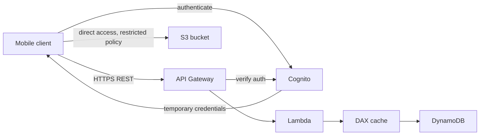
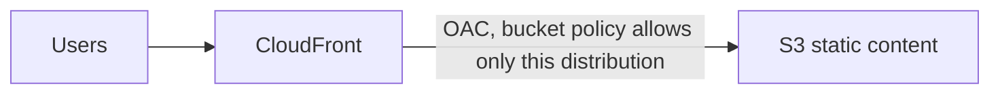

# 20 - Serverless Solution Architecture Discussions

Related: [[Serverless Solution Architectures]] (Version C service note) · [[API Gateway, Step Functions & Cognito]] · [[Lambda]] · [[DynamoDB]] · [[CloudFront & Global Accelerator]] · [[S3]] · [[SQS]] · [[SNS]] · [[Containers (ECS, ECR, EKS)]] · [[ELB]] · [[ASG]] · [[ElastiCache]] · [[RDS & Aurora]] · [[EFS]] · [[Route 53]] · [[Messaging & Mobile Services]]

## Chapter summary
- **Serverless REST API pattern**: client -> **API Gateway** -> **Lambda** -> **DynamoDB**, with **Cognito** for authentication (integrated with API Gateway).
- Give mobile users direct S3 access with **Cognito temporary credentials**; never store AWS user credentials on clients.
- Read-heavy DynamoDB: add **DAX** as a cache (better performance, fewer RCUs, lower cost); static REST responses can also be cached at the **API Gateway** level.
- Global static site: **S3 + CloudFront**, locked down with **Origin Access Control (OAC)** and a bucket policy; dynamic part via API Gateway + Lambda + DynamoDB (+ **DynamoDB Global Tables** for global latency).
- Event flows: **DynamoDB Streams -> Lambda -> SES** (welcome email); **S3 event -> Lambda** (thumbnails); S3 can also notify **SQS** and **SNS**.
- **Microservices** are a design, not necessarily serverless: **synchronous** (API Gateway, load balancers) vs **asynchronous** (SQS, SNS, Kinesis, Lambda triggers, S3); each service may use a different stack.
- **Software update distribution**: put **CloudFront** in front of an existing ELB/ASG/EFS app to cache static files at the edge, with no re-architecture, saving EC2, network and EFS cost.

---

## 01 - Mobile Application: MyTodoList
(src: 20/01-Mobile Application- MyTodoList)

Requirements: REST API over HTTPS, serverless, users interact directly with their own S3 folder, managed serverless authentication, to-dos mostly read (high read throughput, scalable DB).

- **API**: mobile clients -> **API Gateway** -> **Lambda** -> **DynamoDB** (serverless, scales well).
- **Authentication**: client authenticates with **Cognito**; API Gateway verifies the authentication with Cognito.
- **Direct S3 access**: client authenticates to Cognito, Cognito returns **temporary credentials**, client uses them to read/write files in its own space in S3 (restricted policy). **Wrong answer: storing AWS user credentials on mobile clients.** The same pattern can reach DynamoDB, Lambda, etc.
- **Scaling reads**: many RCUs with rarely edited data -> add **DAX** in front of DynamoDB: cached reads, fewer RCUs, better scaling, lower cost.
- Alternative/extra: cache responses at the **API Gateway** level (good when answers rarely change for some routes).
- Nothing is managed by us; pay per usage.

> [!info] Diagram
> **Explanation:** The client signs in with Cognito. API calls go through API Gateway, which checks the user with Cognito, then invokes Lambda; Lambda reads and writes DynamoDB, with DAX caching the reads. Cognito also hands the client temporary AWS credentials so it can reach its own S3 folder directly. The DAX placement follows the lecture; the AWS source below supports the Cognito temporary-credentials part (identity pools sign requests to S3 and DynamoDB).
> **Reference:** [Amazon Cognito identity pools (Amazon Cognito Developer Guide)](https://docs.aws.amazon.com/cognito/latest/developerguide/cognito-identity.html)

> [!tip] Exam
> Mobile/web users needing AWS resources = Cognito temporary credentials, never embedded IAM user keys. Read-heavy DynamoDB = DAX. Cache REST responses = API Gateway cache.

---

## 02 - Serverless Website: MyBlog.com
(src: 20/02-Serverless Website- MyBlog.com)

Requirements: global scale, mostly reads, mostly static files with a small dynamic REST API, caching to save cost/latency, welcome email for new subscribers, thumbnail generation for uploaded photos, all serverless.

- **Static content**: **S3** bucket (regional) exposed globally through **CloudFront** (edge caching).
- **Secure the bucket**: **Origin Access Control (OAC)** + S3 bucket policy allowing only the CloudFront distribution; direct S3 access denied.
- **Dynamic REST API**: HTTPS -> **API Gateway** -> **Lambda** -> **DynamoDB**; **DAX** for read caching. Go global with **DynamoDB Global Tables** to reduce latency worldwide (Aurora Global Database would work but is provisioned, not serverless). No Cognito needed here (public API).
- **Welcome email flow**: enable **DynamoDB Streams** on the users table -> triggers a **Lambda** with an IAM role allowing **Amazon SES** (Simple Email Service) -> sends email via the SDK.
- **Thumbnails**: client uploads to S3 (directly, or via CloudFront/OAC path) -> S3 event triggers **Lambda** -> thumbnail written to an S3 bucket (possibly another). S3 events can also go to **SQS** or **SNS**.

[verify] The lecture says uploading photos through CloudFront to S3 "is called S3 Transfer Acceleration".
> [!warning] Correction [note]
> Unconfirmed. S3 Transfer Acceleration is an S3 feature that uses the CloudFront edge network via a special bucket endpoint; it is a different mechanism from placing your own CloudFront distribution in front of the bucket. No source page was fetched for this, so treat it as unverified and keep the two features distinct.

> [!info] Diagram
> **Explanation:** Users reach static files only via CloudFront. The S3 bucket policy trusts the CloudFront service principal for that one distribution (OAC), so requests straight to S3 are denied. The rest of the lecture architecture (API, streams, SES, thumbnails) is not drawn here because no AWS reference was fetched for it.
> **Reference:** [Restrict access to an Amazon S3 origin (Amazon CloudFront Developer Guide)](https://docs.aws.amazon.com/AmazonCloudFront/latest/DeveloperGuide/private-content-restricting-access-to-s3.html)

---

## 03 - Microservices Architecture
(src: 20/03-MicroServices Architecture)

- Microservices: many services interacting (e.g. via REST); each can use a different architecture. Goals: leaner development lifecycle per service, **independent scaling**, own code repository.
- Example: Service 1 = users -> **ELB** -> **ECS** -> DynamoDB (DNS `service1.example.com` through **Route 53** alias); Service 2 = classic serverless with Lambda, backed by **ElastiCache** (calls Service 1 through the ELB); Service 3 = ELB + **EC2 Auto Scaling** + **RDS** (calls Service 2).
- **Synchronous pattern**: explicit calls between services via **API Gateway** or **load balancers** (HTTPS).
- **Asynchronous pattern**: **SQS, SNS, Kinesis, Lambda triggers, S3** - "put a message, do not care when or whether there is a response".
- **Challenges**: overhead creating each service; server density/utilization; running multiple versions simultaneously; client-side code proliferation to integrate many services.
- Serverless helps: API Gateway and Lambda scale automatically and bill per usage; APIs/environments easy to clone in API Gateway; **client SDK generation via Swagger** integration.
- Takeaway: microservices is a **design**; it solves some problems and adds others.

> [!tip] Exam
> Know sync (API Gateway / ELB) vs async (SQS, SNS, Kinesis, Lambda triggers, S3) microservice communication.

---

## 04 - Software Updates Distribution
(src: 20/04-Software updates distribution)

- Problem: an EC2 app distributes software updates; new releases cause a flood of requests, high network/CPU cost; we do **not** want to re-architect.
- Current state: **ELB + ASG** (e.g. M5 instances) in multi-AZ, update files stored in **EFS**.
- Fix: put **CloudFront** in front. No architecture change; update files are static and never change, so they are **cached at the edge**. CloudFront is serverless and scales; the ASG scales less, saving EC2, network and EFS costs, plus availability gains.
- Lesson: CloudFront is an easy way to make an existing application more scalable and cheaper when the content is mostly static; sometimes the easiest solution is the best.

> [!tip] Exam
> Mostly static content served from EC2 with high cost/load, no re-architecture wanted = add CloudFront.

---

## Not covered in this chapter's lectures
- All four lectures have transcripts; none missing.
