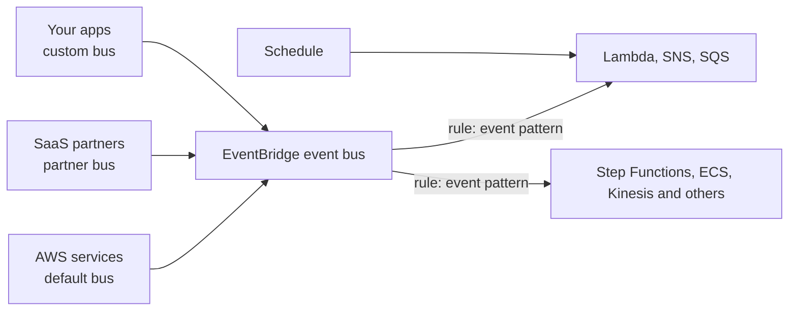

# 24 - Monitoring & Audit - CloudWatch, CloudTrail & Config

Related: [[CloudWatch]] · [[EventBridge]] · [[CloudTrail & Config]] (Version C service notes) · [[EC2]] · [[Kinesis & Firehose]] · [[S3]]

## Chapter summary
- **CloudWatch** = metrics (per service, in namespaces, with dimensions), logs, alarms, dashboards; **CloudTrail** = who called which API; **Config** = resource configuration history and compliance. They are complementary (classic exam question).
- **Metrics**: one namespace per service, up to **30 dimensions** per metric, timestamped; EC2 default = every **5 min**, detailed monitoring = every **1 min**; custom metrics (e.g. memory) possible; streamable to Kinesis Data Firehose or third parties.
- **CloudWatch Logs**: log groups > log streams; retention 1 day to 10 years or never expire; encrypted by default (optional KMS); export to S3 (**CreateExportTask**, up to 12 h, batch) vs **subscription filters** (real time to Kinesis Data Streams, Firehose, Lambda); **Logs Insights** queries historical data only.
- **Unified CloudWatch Agent** (logs + RAM/swap/process/disk metrics, configurable via SSM Parameter Store) replaces the old Logs Agent; needs an **IAM role**; works on-premises too.
- **Alarms**: states OK / INSUFFICIENT_DATA / ALARM; targets = EC2 actions, Auto Scaling, SNS; **Composite Alarms** (AND/OR) reduce noise; test with `set-alarm-state`.
- **EventBridge** (formerly CloudWatch Events): schedule or event-pattern rules; default / partner / custom event buses; archive + replay; schema registry; resource-based policies for cross-account buses.
- **CloudTrail**: enabled by default; 90-day event history; management events logged by default, data events not; Insights detects unusual activity; keep longer in S3 and query with Athena.
- **Config**: per-region, records configuration and evaluates rules (compliance only, does not block); remediation via SSM Automation; notifications via EventBridge/SNS.

---

## 01 - AWS Monitoring - Section Introduction
(src: 24/01-AWS Monitoring - Section Introduction)

- Monitoring (logs, metrics, tracing, audit of who changed what) must be on for every deployed application.

---

## 02 - CloudWatch Metrics
(src: 24/02-CloudWatch Metrics)

- CloudWatch provides metrics for every AWS service. A **metric** is a variable to monitor (EC2 `CPUUtilization`, `NetworkIn`; S3 bucket size).
- Metrics live in **namespaces** (one per service). **Dimensions** are attributes of a metric (instance ID, environment); **up to 30 dimensions per metric**. Metrics are time-based (timestamp required).
- **Dashboards** show many metrics at once. **Custom metrics** extend built-ins, e.g. **memory usage of an EC2 instance** (classic use case).
- **Metric streams**: continuously stream metrics near real time, low latency, to **Kinesis Data Firehose**, then S3 (analyze with Athena), Redshift, or OpenSearch; or directly to third parties (Datadog, Dynatrace, New Relic, Splunk, Sumo Logic). Can stream all namespaces or filter a subset.
- Console tour: metrics are grouped by namespace (ELB, Auto Scaling, EBS, EC2, EFS...); data points are every **5 minutes** unless **detailed monitoring** is enabled (**1 minute**); can change time range, graph type (line, stacked area, number, pie), add to dashboard, download CSV, share.

> [!tip] Exam
> EC2 basic monitoring = 5 min, detailed = 1 min. RAM is not a default EC2 metric: use a custom metric / Unified Agent.

### Hands-on steps
1. CloudWatch -> Metrics -> browse namespaces.
2. EC2 -> per-instance metrics; search e.g. `CPUCreditBalance`.
3. Choose a custom time range (e.g. one month), switch graph type, add to dashboard.

---

## 03 - CloudWatch Logs
(src: 24/03-CloudWatch Logs)

- Store application logs in **log groups** (usually one per application); inside, **log streams** (instances, log files, containers).
- **Retention** per group: never expire, or **1 day to 10 years**. Logs are **encrypted by default**; optional KMS key of your own.
- Log sources: SDK, CloudWatch Logs Agent (old), **Unified Agent**, Elastic Beanstalk, ECS (containers), Lambda, **VPC Flow Logs**, API Gateway, CloudTrail (via filter), Route 53 (DNS queries).
- **CloudWatch Logs Insights**: purpose-built query language; pick time range, get visualization + matching log lines; fields auto-detected; filter, aggregate stats, sort, limit; save queries / add to dashboards; can query **multiple log groups, even across accounts**. It is a **query engine, not real time** (historical data only).

> [!tip] Exam
> Logs Insights = query engine for historical logs, not real time.

**Exporting logs**

| Method | Type | Notes |
|---|---|---|
| Export to **S3** | batch | up to **12 hours** to complete; API `CreateExportTask` |
| **Subscription filter** | real time stream | to Kinesis Data Streams, Kinesis Data Firehose, Lambda (and OpenSearch via Lambda/Firehose); filter chooses which events |

- Subscription filter -> Kinesis Data Streams (good for Firehose, Managed Flink, EC2, Lambda consumers) or -> Firehose -> near real time to S3 / OpenSearch. A Lambda (custom or managed) can write to OpenSearch in real time.
- **Cross-account / cross-region aggregation**: sender account creates a subscription filter -> subscription **destination** (virtual representation of a Kinesis Data Stream in the recipient account); attach a **destination access policy** allowing the sender; create an **IAM role** in the recipient account allowed to put records into the stream and assumable by the sender; then Firehose -> S3.

> [!tip] Exam
> Batch export to S3 (not real time) vs subscription filters (real time) is a common question.

[verify] "The CloudWatch Logs Agent is now sort of deprecated."
> [!warning] Correction [note]
> Confirmed only indirectly: AWS docs describe the unified CloudWatch agent as the way to send both metrics and logs (source: [Working with log groups and log streams](https://docs.aws.amazon.com/AmazonCloudWatch/latest/logs/Working-with-log-groups-and-streams.html)). An explicit deprecation statement was not found on the fetched page; treat as unconfirmed.

---

## 04 - CloudWatch Logs - Hands On
(src: 24/04-CloudWatch Logs - Hands On)

- Log groups created by services have names like `/aws/lambda/...`. A log group can be created manually with a name, retention, log class (**Standard** or **Infrequent Access**), KMS key, and **deletion protection**.
- Log streams (e.g. one per Lambda execution environment) hold timestamped messages.
- **Metric filter**: look for text patterns in log lines and create a metric from them (namespace, metric name, value e.g. 1 per match, optional dimensions). Only **new** log data populates the metric, not historical. Patterns need care (e.g. "START" can false-positive; use "START RequestId").
- A metric from a filter can drive an **alarm** (e.g. > 10 in 5 minutes) = alarm on top of logs.
- Log group actions: edit retention, export to S3, **tail** (real time), subscription filters (OpenSearch, Kinesis, Firehose, Lambda), Logs Insights (query language "Logs Insights QL", saved sample queries: 25 most recent events, exceptions every 5 min, latency statistics in 5-min bins).
- Instructor: for the exam you need not write the queries, just know what Logs Insights does.

### Hands-on steps
1. CloudWatch -> Logs -> Log management -> note service-created groups; optionally Create log group (`demo logs`).
2. Open a Lambda log group (`HelloWorld`), inspect log streams.
3. Create metric filter: pattern, test pattern, name `demo filter Lambda`, namespace `demo namespace`, metric `Countstart Lambda`, value 1.
4. Invoke the Lambda a few times; view the metric (new data only); create an alarm on it.
5. Try Actions -> retention / export to S3 / subscription filters; open Logs Insights, run a saved query.

---

## 05 - CloudWatch Logs - Live Tail - Hands On
(src: 24/05-CloudWatch Logs - Live Tail - Hands On)

- **Live Tail** shows log events in real time as they are posted (debugging); can filter by log group and optionally log stream.
- Pricing: about **1 hour per day free**; stop the session to avoid cost.

### Hands-on steps
1. Create log group `demo log group` and log stream `DemoLogStream`.
2. Start tailing (Live Tail), filter on the group/stream.
3. In the stream: Actions -> create log event `hello world`; it appears in Live Tail.

---

## 06 - CloudWatch Agent & CloudWatch Logs Agent
(src: 24/06-CloudWatch Agent & CloudWatch Logs Agent)

- **By default no logs leave an EC2 instance**; install an agent that pushes log files. The instance needs an **IAM role** allowing it to send to CloudWatch Logs. Works on **on-premises servers** too.

| | CloudWatch Logs Agent (old) | CloudWatch Unified Agent (new) |
|---|---|---|
| Logs to CloudWatch Logs | yes | yes |
| System metrics (RAM, processes...) | no | yes |
| Central config via SSM Parameter Store | no | yes |

- Unified Agent metrics (granular, no need to memorize): CPU (active, guest, idle, system, user, steal), disk (free/used/total, I/O writes/reads/bytes/IOPS), **RAM** (free, inactive, used, total, cached), netstat (TCP/UDP connections, packets, bytes), processes (total, dead, blocked, idle, running, sleeping), **swap** (free, used, %).
- Out of the box EC2 gives high-level CPU, disk, network - **not memory, not swap**.

> [!tip] Exam
> More granular / RAM metrics from EC2 or on-premises = CloudWatch Unified Agent.

---

## 07 - CloudWatch Alarms
(src: 24/07-CloudWatch Alarms)

- Alarms trigger notifications from any metric; options include sampling, percentage, maximum.
- **States**: `OK`, `INSUFFICIENT_DATA`, `ALARM` (threshold breached).
- **Period** = evaluation window; for high-resolution custom metrics: **10 s, 30 s, or multiples of 60 s**.
- **Targets**: EC2 actions (stop, terminate, reboot, **recover**); **Auto Scaling** (scale out/in); **SNS** (then e.g. Lambda).
- **Composite Alarms**: monitor the states of several other alarms (each on one metric) with **AND / OR**; reduces alarm noise (e.g. alert only if CPU high AND network low). Example: Alarm A (CPU) + Alarm B (IOPS) -> composite -> SNS.
- **EC2 instance recovery**: status checks - instance status (VM), system status (underlying hardware), attached EBS status. Alarm on these -> recover instance (moved to another host). Recovered instance keeps **same private, public and Elastic IP, metadata and placement group**; optional SNS alert.
- Alarm can sit on a **Logs metric filter** (e.g. too many "error" -> SNS).
- Test with CLI **`set-alarm-state`** to force an alarm without breaching the threshold.

> [!tip] Exam
> Recovery keeps IPs, metadata and placement group. Composite alarm = combine alarms with AND/OR.

---

## 08 - CloudWatch Alarms Hands On
(src: 24/08-CloudWatch Alarms Hands On)

- Goal: terminate an EC2 instance if CPU stays high. Instance metrics took about 5 minutes to appear.
- Alarm settings: metric `CPUUtilization`, statistic (average, sum, max...), **period 5 minutes** (matches basic monitoring), threshold type **Static** or **Anomaly detection**, e.g. > 95% for **3 out of 3** datapoints (15 min). Actions: notification, Auto Scaling, EC2 action, Systems Manager action.
- New alarm starts in INSUFFICIENT_DATA; forced with `aws cloudwatch set-alarm-state` (alarm name, `--state-value ALARM`, `--state-reason testing`) -> history shows OK -> ALARM and action executed; instance went to shutting-down/terminated.

### Hands-on steps
1. Launch a t2.micro (no need to keep it); wait for metrics.
2. CloudWatch -> Alarms -> Create alarm -> select metric EC2 per-instance `CPUUtilization` for the instance ID.
3. Static, greater than 95, 3 out of 3, 5-min period; action = EC2 -> Terminate; name `terminate EC2 on high CPU`.
4. Run `aws cloudwatch set-alarm-state --alarm-name <name> --state-value ALARM --state-reason testing`.
5. Check alarm history and EC2 console (instance terminating).

---

## 09 - CloudWatch Network Synthetic Monitor
(src: 24/09-CloudWatch Network Synthetic Monitor)

- Detects network issues between your **on-premises data center and AWS** over **Direct Connect** or **Site-to-Site VPN**: packet loss, latency, jitter.
- **No agent**; tests **ICMP or TCP** on IPv4 on-premises traffic; results published to CloudWatch Metrics in real time.

---

## 10 - EventBridge Overview (formerly CloudWatch Events)
(src: 24/10-EventBridge Overview (formerly CloudWatch Events))

- EventBridge was formerly **CloudWatch Events** (exam says EventBridge).
- Uses: **schedule/cron** (e.g. hourly Lambda; "every Monday 8 am"), or **event-pattern rules** reacting to services (e.g. **root user sign-in** -> SNS email).
- Sources: EC2 state changes, CodeBuild failures, S3 events, Trusted Advisor findings, **CloudTrail (any API call)**, schedules. Filter, then EventBridge produces a **JSON event** (instance ID, time, IP...).
- Destinations: Lambda, AWS Batch, ECS task, SQS, SNS, Kinesis Data Streams, Step Functions, CodePipeline, CodeBuild, SSM Automation, EC2 actions (start/stop/reboot).

**Event buses**

| Bus | Source |
|---|---|
| **Default** | AWS services' events |
| **Partner** | SaaS partners (Zendesk, Datadog, Auth0...) |
| **Custom** | your own applications |

- **Archive** events (all or filtered; indefinite or fixed retention) and **replay** them (debug/fix production).
- **Schema Registry**: infers schema of events on the bus; generate code bindings; schemas are versioned.
- **Resource-based policies** on a bus: allow/deny events from other accounts/regions; e.g. central bus in an Organization where other accounts do `PutEvents`.

> [!info] Diagram
> **Explanation:** Events from AWS services, partners and your own applications arrive at an event bus; rules with event patterns filter them and route to one or more targets. Schedules (cron/rate) can invoke targets directly. Simplified from the lecture's overview.
> **Reference:** [What Is Amazon EventBridge? (EventBridge User Guide)](https://docs.aws.amazon.com/eventbridge/latest/userguide/eb-what-is.html)

> [!tip] Exam
> EventBridge = CloudWatch Events; combine with CloudTrail to react to any API call.

---

## 11 - Amazon EventBridge - Hands On
(src: 24/11-Amazon EventBridge - Hands On)

- Console options: rule with event pattern, schedule (old way; now **EventBridge Scheduler**), **Pipes** (source to target with optional filtering and enrichment), Schema registry.
- Event pattern example: service event **EC2 Instance State-change Notification**, filter `state` equals `shutting-down` and `terminated` (values read from the sample events). Target: **SNS topic**; an execution role is auto-created; retry policy and dead-letter queue available.
- Schedules: one-time or recurring; **cron-based** or **rate-based** (e.g. 1 hour), optional flexible time window; targets e.g. ECS task, Firehose, Lambda.
- Other console areas: default vs custom **event buses**, archives/replay, **partner event sources** (e.g. Auth0), **API destinations** (call external HTTP endpoints), schemas / custom registry; rules can be disabled.

### Hands-on steps
1. EventBridge -> Rules -> Create rule with event pattern -> AWS service -> EC2 -> Instance State-change Notification -> states `shutting-down`, `terminated`.
2. Target = SNS topic (demo topic); name `NotifyEC2InstanceShutdownOrTerminated`; create.
3. Schedules -> Create schedule `InvokeLambdaEveryHour`: recurring, rate 1 hour, no flexible window, target Lambda.
4. Browse event buses, archives, partner sources, API destinations, schemas.

---

## 12 - CloudWatch Insights and Operational Visibility
(src: 24/12-CloudWatch Insights and Operational Visibility)

| Insight | Purpose | Notes |
|---|---|---|
| **Container Insights** | metrics + logs from containers: ECS, EKS, Kubernetes on EC2, Fargate | on Kubernetes (EKS / K8s on EC2) uses a **containerized CloudWatch agent** to discover containers |
| **Lambda Insights** | monitoring/troubleshooting for Lambda: CPU time, memory, disk, network, cold starts, worker shutdowns | delivered as a **Lambda layer**; dedicated dashboard |
| **Contributor Insights** | top-N contributors from logs (top talkers, who impacts performance) | works on any AWS logs, e.g. **VPC Flow Logs** (top 10 IPs), DNS logs (URLs with most errors); built-in or custom rules; built on CloudWatch Logs |
| **Application Insights** | automated dashboard of potential problems for an application (EC2 Java/.NET/IIS, databases, linked EBS, RDS, ELB, ASG, Lambda, SQS, DynamoDB, S3, ECS, EKS, SNS, API Gateway) | uses **SageMaker** ML internally; findings go to **EventBridge** and **SSM OpsCenter** |

> [!tip] Exam
> High level only: Container = ECS/EKS/Fargate; Lambda = serverless detail; Contributor = "top N" from logs; Application = automated app dashboard.

---

## 13 - CloudTrail Overview
(src: 24/13-CloudTrail Overview)

- CloudTrail gives **governance, compliance and audit**; **enabled by default**. Records events/API calls from console, SDK, CLI and other AWS services (IAM users, roles). Send to **CloudWatch Logs** or **S3**; a trail can apply to **all regions or one region**.
- Use: "who terminated this EC2 instance?"
- **Event retention: 90 days** in CloudTrail; beyond that log to **S3** and analyze with **Athena**.

**Event types**

| Type | What | Default |
|---|---|---|
| **Management events** | operations on resources (e.g. `IAM AttachRolePolicy`, create subnet, set up logging); split into **Read** (list users/instances) and **Write** (may modify, e.g. delete a DynamoDB table) | logged by default |
| **Data events** | S3 object-level (`GetObject`, `DeleteObject`, `PutObject`), Lambda function execution (`Invoke`); can separate Read/Write | **not logged** (high volume) |
| **Insights events** | unusual activity detected from management events | must be enabled and **paid** |

- **CloudTrail Insights** detects: inaccurate resource provisioning, hitting service limits, bursts of IAM actions, gaps in periodic maintenance. It builds a **baseline** of normal management activity then analyzes write events; anomalies appear in the console, S3, and as **EventBridge** events.

> [!tip] Exam
> Default 90-day history; longer retention = S3 (+ Athena). Data events are off by default; Insights is paid and opt-in.

[verify] "CloudTrail has three kinds of events (management, data, Insights)."
> [!warning] Correction [note]
> AWS documentation now lists four event types: management, data, **network activity**, and Insights; by default trails log management events, not data or Insights events. Source: [CloudTrail concepts](https://docs.aws.amazon.com/awscloudtrail/latest/userguide/cloudtrail-concepts.html).

---

## 14 - CloudTrail Hands On
(src: 24/14-CloudTrail Hands On)

- **Event history** shows the last **90 days of management events**.
- Demo: terminate an EC2 instance; after about 5 minutes the `TerminateInstances` API call appears with event source (EC2), access key used, region, and full event JSON.

### Hands-on steps
1. CloudTrail -> Event history.
2. Terminate a demo EC2 instance.
3. Wait about 5 minutes, refresh, find `TerminateInstances`, open the event details.

---

## 15 - CloudTrail - EventBridge Integration
(src: 24/15-CloudTrail - EventBridge Integration)

- Every API call is logged in CloudTrail **and** appears as an event in EventBridge, so you can build rules on specific API calls and send alerts (SNS).
- Examples: **DynamoDB `DeleteTable`** -> SNS; **IAM `AssumeRole`** -> SNS; **EC2 `AuthorizeSecurityGroupIngress`** (change SG inbound rules) -> SNS.

> [!tip] Exam
> "Alert on a specific API call" = CloudTrail + EventBridge + SNS.

---

## 16 - AWS Config - Overview
(src: 24/16-AWS Config - Overview)

- Config audits and records **compliance and configuration changes** of resources over time. Questions it answers: unrestricted SSH on security groups? public buckets? ALB configuration changed over time?
- **Per-region service**; can **aggregate across regions and accounts**; configuration history stored in **S3**, analyzable with **Athena**.
- **Rules**: AWS managed (**over 75**) or custom (defined with **Lambda**, e.g. EBS disks must be gp2, dev instances must be t2.micro). Triggered **on configuration change** or **periodically** (e.g. every 2 hours).
- Rules are **compliance only - they do not prevent actions** and do not replace IAM.
- Pricing: instructor says **0.003 per configuration item recorded per region** and **0.001 per rule evaluation per region** (spoken as "cents"); can get expensive.
- Per resource: compliance timeline, configuration timeline (when/who changed), link to **CloudTrail** API calls.
- **Remediation** of non-compliant resources via **SSM Automation Documents** (AWS-managed or custom, e.g. `RevokeUnusedIAMUserCredentials` for access keys older than 90 days; a document can invoke Lambda). Remediation can **retry (e.g. up to 5 times)**.
- **Notifications**: EventBridge (e.g. SG becomes non-compliant); or Config -> **SNS** for all changes/compliance (use SNS filtering for a subset; send to admin email, Slack).

[verify] "0.003 cents per configuration item and 0.001 cents per rule evaluation" and "over 75 managed rules".
> [!warning] Correction [note]
> AWS pricing is **$0.003 per continuous configuration item** (US dollars, not cents) and **$0.001 per rule evaluation** (first 100,000), with periodic recording at $0.012 per item. Source: [AWS Config pricing](https://aws.amazon.com/config/pricing/). The "over 75 managed rules" figure is outdated: the AWS managed-rules list page now shows several hundred entries (an agent counted about 825; treat the exact number as approximate). Source: [List of AWS Config Managed Rules](https://docs.aws.amazon.com/config/latest/developerguide/managed-rules-by-aws-config.html).

> [!tip] Exam
> Config = compliance/configuration history, per region, cannot block actions; remediate with SSM Automation.

---

## 17 - AWS Config - Hands On
(src: 24/17-AWS Config - Hands On)

- Setup: record all supported resources (or specific types), optionally **global resources** (IAM users, groups, roles, customer managed policies); Config **service-linked role**; deliver to an **S3 bucket** (optional prefix); optional SNS topic. More resources recorded = more cost.
- Resources view: filter by type (e.g. EC2 security group); **resource timeline** shows configuration changes and related CloudTrail events (`AuthorizeSecurityGroupIngress`, `CreateSecurityGroup`).
- Rules: managed (e.g. `approved-amis-by-id`, needs list of approved AMI IDs) or custom (Lambda). Demo used **restricted-ssh** managed rule: trigger = configuration changes, scope = EC2 security groups, no parameters. Result: some SGs non-compliant (port 22 open from IPv4 anywhere). Deleting that inbound rule re-triggered evaluation and the SG became compliant (visible in timeline).
- **Manage remediation**: manual or automatic; pick SSM automation document, retries and retry seconds, resource ID parameter. (Demo action was not meaningful for the rule.)
- **Aggregators** for multiple accounts; settings can send to SNS; EventBridge rules can filter specific non-compliant events.

### Hands-on steps
1. AWS Config -> Get started -> record all resources, include global resources, create service-linked role, choose S3 bucket, skip SNS -> skip managed rules -> Confirm.
2. Wait for discovery; Resources -> filter EC2 security group; open one -> Resource timeline.
3. Rules -> Add rule -> AWS managed -> `restricted-ssh` (trigger on configuration changes) -> Add.
4. Review compliant/non-compliant SGs; remove the SSH 0.0.0.0/0 inbound rule from a non-compliant SG; re-check timeline.
5. Rule -> Actions -> Manage remediation (explore manual/automatic).
6. Do this lab only if you accept the cost; delete/stop recording afterwards.

---

## 18 - CloudTrail vs CloudWatch vs Config
(src: 24/18-CloudTrail vs CloudWatch vs Config)

| Service | Purpose |
|---|---|
| **CloudWatch** | performance **metrics** (CPU, network), dashboards, events/alerts, **log** aggregation and analysis |
| **CloudTrail** | record **API calls** made in the account by anyone/anything; trails per resource; global service |
| **Config** | record **configuration changes** and evaluate resources against **compliance rules**; timeline of changes and compliance |

**Example: Elastic Load Balancer**
- CloudWatch: incoming connections, error-code percentages, dashboards (even global across LBs).
- Config: track security group rules and configuration/SSL certificate changes; rules such as "must always have an SSL certificate" and "no unencrypted traffic".
- CloudTrail: who made API calls that changed SG rules or removed/changed the certificate.

> [!tip] Exam
> Performance = CloudWatch; who did it (API calls) = CloudTrail; what changed / is it compliant = Config.

---

## Not covered in this chapter's lectures
- All 18 lectures have a transcript; none are missing.
