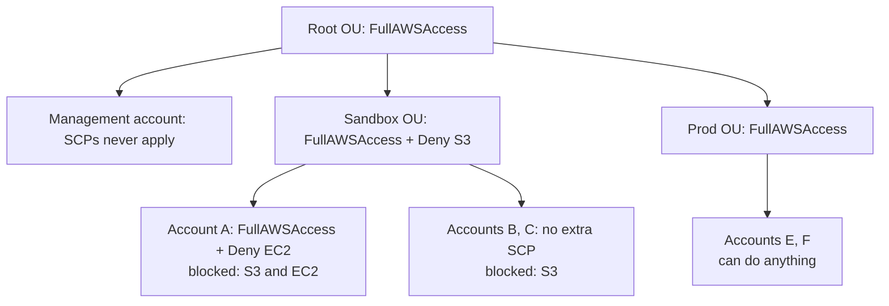
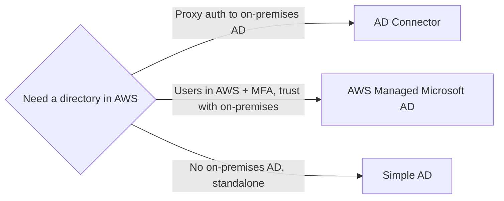

# 25 - IAM Advanced

Related: [[Organizations & Identity Federation]] · [[IAM]] · [[EventBridge]] · [[CloudTrail & Config]] · [[S3]] · [[SNS]]

## Chapter summary
- **AWS Organizations**: global service; management account + member accounts (an account belongs to only one organization); **consolidated billing**, aggregated-usage discounts, shared RI / Savings Plans, API for account creation.
- **SCPs** filter what accounts/OUs can do; they never apply to the **management account**; an explicit allow is needed at every level (root -> OU -> account); explicit deny wins.
- **Tag policies** standardize tag keys/values across the organization; use EventBridge to find non-compliant tags.
- IAM conditions: `aws:SourceIp`, `aws:RequestedRegion`, `ec2:ResourceTag`, `aws:PrincipalTag`, `aws:MultiFactorAuthPresent`, `aws:PrincipalOrgID`.
- Cross-account access: **assuming a role gives up your original permissions; a resource-based policy does not**.
- **Permission boundaries** (users and roles only, not groups) cap maximum permissions. **Evaluation logic**: explicit deny first; then SCP, resource policy, identity policy, boundary, session policy must allow.
- **IAM Identity Center** (successor to AWS SSO): one login for all accounts in the organization, SAML 2.0 apps and EC2 Windows; **permission sets** become IAM roles; supports ABAC.
- **Directory Services**: AWS Managed Microsoft AD, **AD Connector** (proxy to on-premises), **Simple AD** (standalone, no on-premises link).
- **Control Tower**: governed multi-account setup on top of Organizations; **preventive guardrails = SCPs**, **detective guardrails = AWS Config**.

---

## 01 - Organizations - Overview
(src: 25/01-Organizations - Overview)

- Global service to manage **multiple AWS accounts**. The main account is the **management account**; others are **member accounts**. An account can be part of **only one organization**.
- **Benefits**:
  - **Consolidated billing**: one payment method on the management account pays for all.
  - **Aggregated usage pricing** (e.g. EC2, S3 volume discounts across all accounts).
  - **Reserved Instance and Savings Plans discounts are shared** across accounts (unused RI in one account benefits another).
  - **API to automate account creation**.
  - Better security isolation than multiple VPCs in one account (accounts are more separated).
  - Enforce tagging standards for billing; enable **CloudTrail** on all accounts with logs to a central S3 account; send **CloudWatch Logs** to a central logging account; create **cross-account roles** for admin purposes.
- Structure: **root OU** (outermost) containing the management account, with nested **OUs** (e.g. Dev, Prod; HR, Finance under Prod). Layouts: by business unit, by environment (prod/test/dev), by project; can be mixed.
- **Service Control Policies (SCP)**: IAM-style policies applied to OUs or accounts to restrict what users **and roles** can do (including the account's root user).
  - **SCPs do not apply to the management account** (it always has full admin power, so you cannot lock yourself out).
  - SCP is a filter: an action is allowed only if there is an **explicit allow at every level** from the root through each OU to the account; any **explicit deny** blocks it.

> [!info] Diagram
> **Explanation:** Rebuilds the lecture's SCP example. Every level needs an explicit allow (FullAWSAccess); a deny at any level on the path blocks the action below it. Account A inherits Deny S3 from the Sandbox OU plus its own Deny EC2; B and C inherit only Deny S3; the management account is not affected by any SCP. (Lecture also shows OU Workloads/Test: an allow-EC2-only SCP on Test limits account D to EC2.)
> **Reference:** [SCP evaluation - AWS Organizations User Guide](https://docs.aws.amazon.com/organizations/latest/userguide/orgs_manage_policies_scps_evaluation.html)

- SCP examples: **deny list** (allow all, then deny e.g. DynamoDB) or **allow list** (allow only EC2 and CloudWatch, nothing else).

> [!tip] Exam
> SCP never affects the management account. Explicit allow needed at every OU level; explicit deny anywhere wins. Organizations = consolidated billing + shared RI/Savings Plans.

> Confirmed: AWS docs state SCPs don't affect the management account and that an Allow is needed at each level of the path ([SCP evaluation](https://docs.aws.amazon.com/organizations/latest/userguide/orgs_manage_policies_scps_evaluation.html)). Note from the same docs: SCPs only filter; principals still need an IAM policy that grants access.

---

## 02 - Organizations - Hands On
(src: 25/02-Organizations - Hands On)

> No transcript available for this lecture (raw file contains only a placeholder). [screen action] likely an Organizations console demo.

---

## 03 - Organizations - Tag Policies
(src: 25/03-Organizations - Tag Policies)

- Standardize tags across resources in an organization: define **tag keys and allowed values**; ensure consistent tagging, audit tagged resources, categorize resources.
- Good combination with **cost allocation tags** and **attribute-based access control (ABAC)**.
- Can **prevent non-compliant tagging operations** on specified services/resources, but has **no effect on resources that have no tags**.
- Generates a **report** of tagged, untagged and non-compliant resources; use **EventBridge** to monitor non-compliant tags.

> [!tip] Exam
> Keep tags consistent across accounts = Organizations **tag policies**.

---

## 04 - IAM - Advanced Policies
(src: 25/04-IAM - Advanced Policies)

Conditions work in user policies, resource policies (e.g. S3 bucket) and endpoint policies.

| Condition key | What it does | Lecture example |
|---|---|---|
| `aws:SourceIp` | restrict client IP making the API call | Deny `*` when not from two listed CIDRs, so only the company network can use AWS |
| `aws:RequestedRegion` | restrict region of the API call (global condition) | Deny EC2, RDS, DynamoDB in eu-central-1 and eu-west-1; usable in an SCP to allow only specific regions |
| `ec2:ResourceTag` | match tags on the EC2 instance | Allow start/stop only if instance tag `Project = DataAnalytics` |
| `aws:PrincipalTag` | match tags on the user/principal | Same policy also requires user tag Department = data |
| `aws:MultiFactorAuthPresent` | force MFA | User can do anything on EC2 but stop/terminate is denied when MFA is false |
| `aws:PrincipalOrgID` | limit resource policy to accounts in an organization | S3 bucket policy allowing PutObject/GetObject only for principals from the given organization ID |

- **S3 ARNs**: bucket-level actions (`s3:ListBucket`) use the bucket ARN (`arn:aws:s3:::test`); object-level actions (Get/Put/DeleteObject) need `/*` (`arn:aws:s3:::test/*`). Likely exam point.

> [!tip] Exam
> Bucket ARN vs object ARN (`/*`); `aws:PrincipalOrgID` limits resource policies to organization members; `aws:SourceIp` / `aws:RequestedRegion` restrict network and region.

---

## 05 - IAM - Resource-based Policies vs IAM Roles
(src: 25/05-IAM - Resource-based Policies vs IAM Roles)

- Cross-account access to e.g. an S3 bucket: (1) user in Account A **assumes a role** in Account B, or (2) a **resource-based policy** (bucket policy) in Account B allows the Account A user.
- **Assuming a role = you give up your original permissions** and only have the role's. A resource-based policy means the principal **keeps its permissions**.
- Example: a user in Account A must scan a DynamoDB table in Account A **and** write to an S3 bucket in Account B -> use a **resource-based policy** (no role switch).
- Resource-based policies are supported by S3 buckets, SNS topics, SQS queues, Lambda functions, etc.
- **EventBridge targets**:
  - Targets that support resource policies (**Lambda, SNS, SQS, S3, API Gateway**): EventBridge adds a **resource-based policy** on the target.
  - Others (**Kinesis Data Streams, EC2 Auto Scaling, Systems Manager Run Command, ECS task**): EventBridge uses an **IAM role**. Kinesis Data Streams supports resource policies but EventBridge does not use them yet.
  - Check the EventBridge rule configuration to see which applies.

> [!tip] Exam
> Role = lose original permissions; resource-based policy = keep them. EventBridge: resource policy for Lambda/SNS/SQS/S3, IAM role for Kinesis/ASG/SSM Run Command/ECS.

---

## 06 - IAM - Permission Boundaries & Policy Evaluation Logic
(src: 25/06-IAM - Policy Evaluation Logic)

### Permission boundaries
- Supported for **users and roles, not groups**. Advanced feature defining the **maximum permissions** an entity can get.
- Example: boundary allows S3, CloudWatch, EC2; user also has identity policy `iam:CreateUser` -> **effective result: no permissions**, since the policy is outside the boundary.
- Demo: user John with `AdministratorAccess` but boundary `AmazonS3FullAccess` -> he can only use S3.
- Effective permissions = intersection of **identity-based policy**, **permission boundary** (users/roles only) and **Organizations SCP** (applies to every entity in the account).
- Use cases: delegate responsibilities (e.g. creating IAM users) to non-admins within limits; let developers self-assign permissions without privilege escalation (becoming admin); restrict one specific user without an account-wide SCP.

### Hands-on steps
1. IAM -> create user `John` with programmatic access, no permissions at first.
2. Add permissions: attach `AdministratorAccess`.
3. Set permissions boundary (advanced) to `AmazonS3FullAccess`; John can only do S3 [screen action: exact click path not described].

### Policy evaluation logic
Flow evaluated on every action (no need to memorize, must make sense):
1. **Explicit deny** anywhere -> denied.
2. **Organizations SCP**: must allow, else implicit deny.
3. **Resource-based policy**.
4. **Identity-based policy**: allow needed, else implicit deny.
5. **Permission boundary**.
6. **Session policy** (STS; not detailed).
Final decision is allow only if all applicable layers allow and nothing denies.

- Quiz policy: `Deny sqs:*` + `Allow sqs:DeleteQueue`: `sqs:CreateQueue` denied; `sqs:DeleteQueue` **denied** (explicit deny beats allow); `ec2:DescribeInstances` denied (**no explicit allow = implicit deny**).

> [!tip] Exam
> Explicit deny always wins. No allow = implicit deny. Boundaries apply to users/roles, not groups.

---

## 07 - AWS IAM Identity Center
(src: 25/07-AWS IAM Identity Center)

- Successor of **AWS Single Sign-On (SSO)** (same service, renamed). **One login** for all accounts in AWS Organizations, business cloud apps (Salesforce, Box, Microsoft 365, any **SAML 2.0** app) and **EC2 Windows instances**. Exam likely asks: one login to multiple AWS accounts.
- **Identity store**: built-in Identity Center store, or third-party IdP (Active Directory, OneLogin, Okta...). Integrate with AD in the cloud or on premises.
- Login flow: login page -> username/password -> Identity Center portal -> pick account/app (e.g. open the management console) with no further login.
- **Permission sets**: collections of IAM policies assigned to users or groups for specific accounts; each creates a corresponding **IAM role** the user assumes when entering the account.
- Example: Bob and Alice in a Developers group; set up in the management account; permission set "admin" assigned to the dev OU accounts, permission set "read-only" assigned to prod accounts.
- Application assignments: define who can access which applications; URLs, certificates and metadata supported out of the box.
- **Attribute-based access control (ABAC)**: fine-grained permissions from user attributes in the Identity Center store (cost center, title, locale); define permission sets once, change access by changing attributes.

> [!tip] Exam
> Multi-account SSO + SAML apps = IAM Identity Center. Permission sets = IAM roles in target accounts.

---

## 08 - AWS Directory Services
(src: 25/08-AWS Directory Services)

- **Microsoft Active Directory (AD)**: database of objects (users, computers, printers, file shares, security groups) on Windows Server with AD Domain Services; centralized security management; objects in trees, group of trees = **forest**. Machines authenticate against the **domain controller**.
- **AWS Directory Service** offers three flavors:

| Option | What it is | Users managed in | MFA | On-premises link |
|---|---|---|---|---|
| **AWS Managed Microsoft AD** | Your own AD in AWS | AWS (locally) and optionally on-premises | yes | **Two-way trust** with on-premises AD |
| **AD Connector** | Directory gateway/**proxy** to on-premises AD | **only** on-premises | yes | proxies requests |
| **Simple AD** | AD-compatible managed directory, not Microsoft | AWS only (standalone) | not stated | **cannot join** on-premises AD |

- Why: Windows EC2 instances can join the domain and share logins/credentials.
- Exam hints: proxy users to on-premises -> **AD Connector**; manage users in AWS with MFA -> **AWS Managed Microsoft AD**; no on-premises AD, just need AD -> **Simple AD**.
- **Integrating IAM Identity Center with AD**:
  - AD managed by Directory Service: integration out of the box.
  - Self-managed (on-premises) AD: (1) **AWS Managed Microsoft AD + two-way trust** with on-premises, then out-of-box Identity Center integration (better if you also want to manage users in the cloud); or (2) **AD Connector** proxying to on-premises (a bit more latency).

[verify] "Simple AD" is presented as a standard option for a standalone directory.
> [!warning] Correction [note]
> AWS documents that Simple AD will no longer be open to new customers starting July 30, 2026 (existing customers keep full functionality); alternatives are AWS Managed Microsoft AD or AD Connector. Source: [Simple AD availability changes - AWS Directory Service](https://docs.aws.amazon.com/directoryservice/latest/admin-guide/simple-ad-availability-change.html) (from search result summary; confirm on the page). Exam may still mention it.

> [!info] Diagram
> **Explanation:** Decision shortcut from the lecture: AD Connector only forwards requests to your existing on-premises AD; Managed Microsoft AD hosts the directory in AWS and can trust on-premises AD; Simple AD is a standalone Samba-based directory with no on-premises link.
> **Reference:** [Directory services options in AWS - Active Directory Domain Services on AWS](https://docs.aws.amazon.com/whitepapers/latest/active-directory-domain-services/directory-services-options-in-aws.html)

---

## 09 - AWS Directory Services - Hands On
(src: 25/09-AWS Directory Services - Hands On)

- Console tour (no setup). Directory Service console lists: AWS Managed Microsoft AD, Simple AD, AD Connector; the fourth entry, **Amazon Cognito User Pool**, just redirects to Cognito.
- **Managed Microsoft AD editions**: Standard up to **30,000 objects**; Enterprise up to **500,000 objects**.
- **AD Connector sizes**: small up to **500 users**, large up to **5,000 users**. Managed AD supports MFA; Simple AD is standalone; AD Connector is a proxy.
- Setup details are AD-specific and not needed for the exam.

> Confirmed with caveat: AWS sources describe Standard as ~30,000 objects and Enterprise as ~500,000 objects. The AD Connector 500/5,000 figures are described as sizing recommendations for WorkSpaces entitled users, with no enforced user limits ([The Role of the AD Connector with Amazon WorkSpaces](https://docs.aws.amazon.com/whitepapers/latest/best-practices-deploying-amazon-workspaces/ad-connector-role-with-workspaces.html), [AD Connector](https://docs.aws.amazon.com/directoryservice/latest/admin-guide/directory_ad_connector.html)).

### Hands-on steps
1. Console -> Directory Service -> review the options listed above; do not create anything [screen action].

---

## 10 - AWS Control Tower
(src: 25/10-AWS Control Tower)

- Easy setup and governance of a **secure, compliant multi-account environment** based on best practices; uses **AWS Organizations** to create accounts.
- Benefits: automate environment setup in a few clicks; ongoing policy management with **guardrails**; detect violations and remediate automatically; interactive compliance dashboard.
- **Guardrails**:

| Type | Purpose | Implemented with | Example |
|---|---|---|---|
| **Preventive** | stop actions (restrictive) | **SCPs** (Organizations) | allow only us-east-1 and eu-west-2 across all accounts |
| **Detective** | detect non-compliance | **AWS Config** (deployed in member accounts) | find untagged resources; non-compliance triggers **SNS**, which can notify admins or invoke **Lambda** to auto-tag |

> [!tip] Exam
> Control Tower = governed multi-account on top of Organizations. Preventive = SCP, Detective = Config.

---

## Not covered in this chapter's lectures
- Lecture 02 (Organizations - Hands On) has no transcript.
