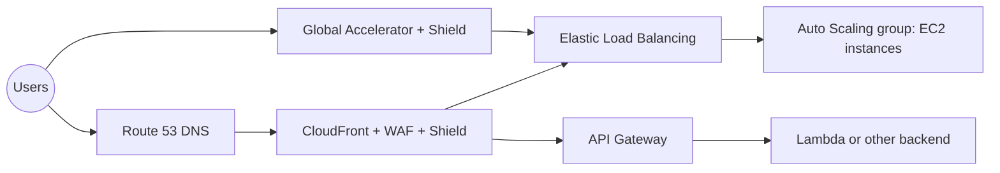
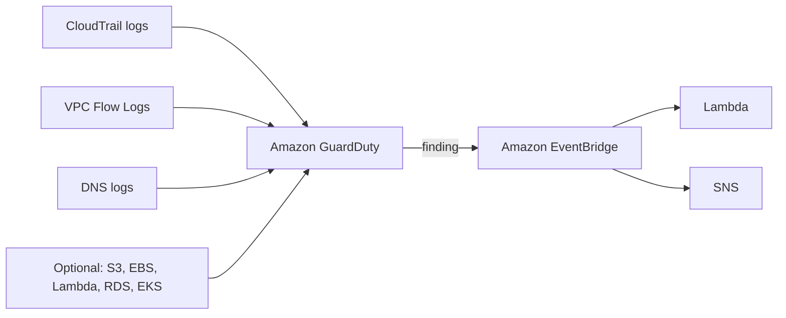

# 26 - Security & Encryption

Related: [[KMS, CloudHSM & ACM]] · [[Parameter Store & Secrets Manager]] · [[WAF, Shield & Firewall Manager]] · [[GuardDuty, Inspector & Macie]] · [[S3 Security & Encryption]] · [[IAM]] · [[CloudTrail & Config]] · [[EventBridge]]

## Chapter summary
- Three encryption models: **in flight** (TLS/SSL, stops man-in-the-middle), **server-side at rest** (server holds the data key), **client-side** (server can never decrypt).
- **KMS** = AWS-managed keys, integrated with IAM and most services; every API call is auditable in **CloudTrail**. Key types: AWS owned (free), AWS managed (`aws/<service>`, free), customer managed ($1/month). Keys are **region-scoped**; **Multi-Region keys** share key ID (`mrk-...`) and key material across regions but are not global.
- **Key policy** controls KMS key access (no key policy = nobody); default policy trusts the whole account's IAM; custom policy is required for **cross-account** use (shared encrypted snapshots/AMIs).
- **Parameter Store** (config + secrets, hierarchy, versions, free standard tier) vs **Secrets Manager** (forced rotation via Lambda, RDS/Aurora integration, multi-region secrets, $0.40/secret/month). "Secrets + RDS rotation" = Secrets Manager.
- **ACM** = free public TLS certs, auto-renewal (DNS validation preferred), attaches to ALB/NLB/CLB, CloudFront, API Gateway; CloudFront certs must be in **us-east-1**.
- **CloudHSM** = dedicated single-tenant hardware, you manage keys; KMS = multi-tenant, AWS manages. Pair them with a KMS custom key store.
- **WAF** = Layer 7 firewall (ALB, API Gateway, CloudFront, AppSync, Cognito; **not NLB**). **Shield Standard** free L3/L4 DDoS; **Shield Advanced** ~$3,000/month. **Firewall Manager** applies WAF/Shield/SG/Network Firewall policies across an Organization.
- DDoS resilience = edge services (CloudFront, Global Accelerator, Route 53) + ELB + Auto Scaling + WAF + hidden backends.
- **GuardDuty** = threat detection (CloudTrail, VPC Flow Logs, DNS logs; crypto-mining finding). **Inspector** = vulnerability scanning (EC2, ECR images, Lambda). **Macie** = PII discovery in S3.

---

## 01 - AWS Security - Section Introduction
(src: 26/01-AWS Security - Section Introduction)

- Security is heavily tested on the exam; this section consolidates encryption, KMS, Parameter Store and the protection services. Practice includes AWS Lambda.

---

## 02 - Encryption 101
(src: 26/02-Encryption 101)

| Type | Where encryption happens | Key points |
|---|---|---|
| **In flight** (TLS/SSL) | encrypt before sending, decrypt after receiving | TLS = newer version of SSL; this is what HTTPS means; only the target server can decrypt; protects against **man-in-the-middle** attacks |
| **Server-side at rest** | server encrypts after receiving, decrypts before sending back | server uses a **data key**; the server must have access to the key (e.g. S3 stores the object encrypted) |
| **Client-side** | client encrypts/decrypts | server **never** decrypts (not trusted); client keeps the data key; encrypted object can go to any store (FTP, S3, EBS...) |

> [!tip] Exam
> Server-side = server handles keys. Client-side = server cannot decrypt the contents. HTTPS = TLS certificate = encryption in flight.

---

## 03 - KMS Overview
(src: 26/03-KMS Overview)

- **KMS** = AWS manages the encryption keys. Integrated with **IAM** for authorization; **every API call using your keys is auditable via CloudTrail** (exam topic). Seamless integration with EBS, S3, RDS, SSM and most services; also usable via CLI/SDK API calls (encrypt a secret, store ciphertext in code or environment variables - never store secrets in plain text).
- Name: "KMS key" (formerly "KMS customer master key"; renamed to avoid confusion with "customer managed keys").

**Key types (cryptographic)**
- **Symmetric**: single key encrypts and decrypts; all AWS-integrated services use symmetric keys; you never see the key, only call the KMS API.
- **Asymmetric**: public key (encrypt) + private key (decrypt) for encrypt/decrypt or **sign/verify**; you can **download the public key** but not the private key (API only). Use case: encryption done outside AWS by users who cannot call the KMS API.

**Key types (ownership) and pricing**

| Type | Cost | Notes |
|---|---|---|
| **AWS owned keys** | free | used with SSE-S3, SSE on DynamoDB etc.; invisible to you |
| **AWS managed keys** | free | named `aws/<service>` (e.g. `aws/rds`, `aws/ebs`, `aws/dynamodb`); usable only from within that service |
| **Customer managed keys** (created or **imported**) | **$1/month** per key | full control, custom key policy |
| API calls | about **$0.03 per 10,000** calls | |

- **Rotation**: AWS managed keys rotate automatically **every 1 year**; customer managed keys: enable automatic rotation (and set the period) plus **on-demand** rotation; **imported** keys: only manual rotation, using an **alias**.

[verify] "Imported KMS keys can only be rotated manually."
> [!warning] Correction [note]
> AWS documents that **on-demand rotation** is supported for symmetric keys with imported (`EXTERNAL` origin) key material; automatic rotation is not. Manual rotation is for asymmetric, HMAC and custom key store keys. The 1-year rotation of AWS managed keys is confirmed (changed from 3 years in May 2022); default customer managed rotation period is 365 days. Source: [Rotate AWS KMS keys](https://docs.aws.amazon.com/kms/latest/developerguide/rotate-keys.html). The $1/month and $0.03 per 10,000 requests are confirmed on [AWS KMS pricing](https://aws.amazon.com/kms/pricing/) (which also lists a 20,000 requests/month free tier).

- **Keys are region-scoped.** Copying an encrypted EBS volume to another region: take a **snapshot** (encrypted with same key) -> copy snapshot to the target region, **re-encrypted with a different KMS key** (AWS does it) -> restore a volume from it using key B. The same KMS key cannot live in two regions.

**KMS key policies**
- Similar to an S3 bucket policy; **if a key has no key policy, nobody can access it**.
- **Default key policy** (created if you do not provide one): allows everyone in the account, so IAM policies alone grant access.
- **Custom key policy**: define which users/roles can use the key and who can administer it; needed for **cross-account access**.

**Cross-account encrypted snapshot copy**
1. Create snapshot encrypted with your **customer managed key** (must be customer managed, to attach a custom policy).
2. Attach a key policy authorizing the target account.
3. Share the encrypted snapshot with the target account.
4. In the target account, create a copy and encrypt it with a different customer managed key there.
5. Create a volume from that snapshot.

> [!tip] Exam
> Auditing key use -> CloudTrail. AWS managed keys auto-rotate yearly. Cross-account sharing needs a customer managed key + custom key policy. A KMS key never leaves its region.

---

## 04 - KMS Hands On w/ CLI
(src: 26/04-KMS Hands On w- CLI)

- **AWS managed keys** (console): e.g. `aws/ebs` key policy allows actions only when the caller account is yours and **via service = EC2**; the SQS key only via SQS. Cryptographic config shows symmetric, origin KMS, encrypt/decrypt.
- **Customer managed keys** page. A **custom key store** is for CloudHSM (out of scope for this lecture).
- Create-key options: symmetric vs asymmetric (encrypt/decrypt or sign/verify); **key origin**: KMS (AWS creates it), external (import), or custom key store (CloudHSM); **regionality**: single-region (default, most common) or multi-region.
- Key admins and key users screens build the key policy; the default policy "enables IAM user permissions" (any principal with IAM permission may use it). Other AWS accounts can be added (e.g. for sharing encrypted EBS snapshots).
- Rotation: enable automatic rotation, period from **90 days up to 2,560 days** (default 1 year); on-demand rotation button; rotation history is listed. These options exist only because the key was created in KMS. Key actions: disable, or **schedule deletion**.
- **CLI demo**: `aws kms encrypt` with `--key-id alias/<alias>` (alias, key ID or ARN all work), `--plaintext fileb://file`, `--query CiphertextBlob --output text`, `--region`; output is **base64**, so base64-decode to get the binary ciphertext (the file you could share). `aws kms decrypt` takes the binary ciphertext; **KMS knows which key to use because the key info is embedded in the ciphertext blob**; query `Plaintext`, base64-decode to recover the text. The SDK abstracts these low-level calls.

> [!tip] Exam
> Rotation period for customer managed keys: 90 to 2,560 days. Decrypt does not need you to name the key. Customer managed key = $1/month.

### Hands-on steps
1. KMS console -> **AWS managed keys**; open `aws/ebs` and `aws/sqs` and read the key policy (via-service condition).
2. **Customer managed keys** -> Create key: symmetric, encrypt and decrypt, key origin KMS, single-region; alias `tutorial`.
3. Skip key administrators/users (keeps the default key policy); finish. Review key policy, cryptographic configuration, rotation settings (enable rotation, set period, on-demand rotation).
4. In a terminal ([screen action] CLI script `kms-demo-cli.sh`): create `ExampleSecretFile.txt` containing a test password.
5. `aws kms encrypt` the file with `alias/tutorial` and region -> base64 output file; decode it to a binary file (different command on Windows).
6. `aws kms decrypt` the binary file -> base64 plaintext; decode it -> original text.
7. Optionally disable or schedule deletion of the key to avoid the $1/month.

---

## 05 - KMS - Multi-Region Keys
(src: 26/05-KMS - Multi-Region Keys)

- **Multi-Region key** = a primary key in one region replicated to others (e.g. us-east-1 -> us-west-2, eu-west-1, ap-southeast-2). **Same key ID (`mrk-...`) and same key material** everywhere, usable **interchangeably**: encrypt in one region, decrypt in another, no re-encryption and no cross-region API calls. Rotation of the primary key is replicated.
- **Not global**: primary + replicas, each **managed independently** (own key policy). AWS does **not** recommend them except for specific use cases, since KMS prefers a key bound to one region.
- Use cases: global **client-side encryption**, client-side encryption on **DynamoDB Global Tables**, **Aurora Global Database**.
- **DynamoDB Global Tables example** (uses the *Amazon DynamoDB Encryption Client*): encrypt only specific **attributes** (e.g. social security number) client-side with the primary multi-region key; other attributes stay unencrypted. DB administrators without access to the KMS key cannot read that attribute. The table replicates to another region, where a client can decrypt locally with the **replica key** through a local KMS call (lower latency). This protects data **even from DB admins**, beyond plain at-rest encryption.
- **Aurora Global** example: same idea using the **AWS Encryption SDK**, encrypting a column (SSN) with the multi-region key; admins cannot read the column without KMS access; replicated region decrypts locally.

> [!tip] Exam
> Multi-Region keys: same key ID + material, but not global; independent policies. Used for client-side encryption of specific attributes with Global Tables / Global Aurora.

---

## 06 - S3 Replication with Encryption
(src: 26/06-S3 Replication with Encryption)

- Replication copies **unencrypted objects** and **SSE-S3** objects by default; **SSE-C** objects can also be replicated.
- **SSE-KMS** objects are **not replicated by default** - you must enable the option, choose the **target KMS key**, adapt the **target key policy**, and give the **IAM role** used by replication permission to **decrypt with the source key and encrypt with the target key**.
- Heavy encrypt/decrypt activity can trigger **KMS throttling errors** -> request a **Service Quota** increase.
- Multi-Region keys can be used with S3 replication, but S3 treats them as **independent keys**: objects are still decrypted and re-encrypted.

> [!tip] Exam
> SSE-KMS replication: explicit opt-in + target KMS key + IAM role with decrypt (source) and encrypt (target).

---

## 07 - Encrypted AMI Sharing Process
(src: 26/07-Encrypted AMI Sharing Process)

Sharing an AMI encrypted with a KMS key from account A to account B:
1. In account A, modify the AMI **launch permissions** to add account B's ID.
2. **Share the KMS key** with account B (via key policy).
3. In account B, create an IAM role/user with permissions for the AMI and the key: **DescribeKey, ReEncrypt, CreateGrant, Decrypt**.
4. Launch the EC2 instance from the AMI. Account B may optionally **re-encrypt the volumes with its own KMS key**.

> [!tip] Exam
> Launch permission on the AMI + share the KMS key + IAM permissions (DescribeKey, ReEncrypt, CreateGrant, Decrypt) in the target account.

---

## 08 - SSM Parameter Store Overview
(src: 26/08-SSM Parameter Store Overview)

- Secure storage for **configuration and secrets**; optionally encrypted with **KMS**. Serverless, scalable, durable, easy SDK, **version tracking**, security via **IAM**, notifications via **EventBridge**, integrated with **CloudFormation** (parameters as stack inputs).
- Plain-text config: access checked via IAM only (e.g. EC2 instance role). Encrypted config: Parameter Store calls KMS, so the app also needs access to the KMS key.
- **Hierarchy**, e.g. `/my-department/my-app/dev/db-url`, `/dev/db-password`, `/prod/db-url`...; lets IAM policies grant access to a whole department, an app, or an app-environment path (e.g. dev Lambda role -> dev path only; prod Lambda role -> prod path).
- Can reference **Secrets Manager** secrets through Parameter Store. **Public parameters** issued by AWS exist (e.g. latest Amazon Linux 2 AMI per region via an API call).

| | Standard | Advanced |
|---|---|---|
| Max parameters | 10,000 | 100,000 |
| Max value size | 4 KB | 8 KB |
| Parameter policies | no | yes |
| Cost | free | $0.05 per advanced parameter per month |
| Shared with other accounts | no | yes |

- **Parameter policies** (advanced only): assign a **TTL / expiration** to force update or deletion of sensitive data; multiple policies at once. Examples: an expiration policy (delete at a timestamp) with an **EventBridge notification 15 days before expiry**; a **no-change notification** if a parameter is not updated for 20 days.

> [!tip] Exam
> Parameter Store = cheap/free config + secrets with KMS, hierarchy and versioning. TTL (parameter policies) = advanced tier.

---

## 09 - SSM Parameter Store Hands On (CLI)
(src: 26/09-SSM Parameter Store Hands On (CLI))

- Parameter types: **String**, **StringList**, **SecureString** (encrypted with KMS; default key `alias/aws/ssm` or your own key, same or other account). String data type: text or `aws:ec2:image` (AMI reference).
- Tier choice in the UI: Standard (up to 10,000 parameters, 4 KB, not shareable) vs Advanced (100,000, 8 KB, shareable).
- Console: parameter details show **version history**; SecureString values are hidden until "show decrypted value", which checks your KMS permission.
- CLI (from CloudShell): `aws ssm get-parameters --names ...` returns SecureString values encrypted; add **`--with-decryption`** to decrypt (needs KMS permission). `aws ssm get-parameters-by-path --path /my-app/dev` returns everything under the path; use **`--recursive`** to include sub-paths (otherwise `/my-app` alone returns nothing); `--with-decryption` works here too.

### Hands-on steps
1. Systems Manager -> Parameter Store -> Create parameter: name `/my-app/dev/db-url`, tier Standard, type String, text value (any example hostname).
2. Create `/my-app/dev/db-password` as **SecureString**, KMS key `alias/aws/ssm` or the `tutorial` key; value `dev-password`.
3. Repeat for `/my-app/prod/db-url` and `/my-app/prod/db-password` (4 parameters total).
4. Open CloudShell: `aws ssm get-parameters --names /my-app/dev/db-url /my-app/dev/db-password`; repeat with `--with-decryption`.
5. `aws ssm get-parameters-by-path --path /my-app/dev`; then `--path /my-app` (empty) and `--path /my-app --recursive`; add `--with-decryption`.

---

## 10 - AWS Secrets Manager - Overview
(src: 26/10-AWS Secrets Manager - Overview)

- Newer service for storing secrets. Difference from Parameter Store: can **force rotation every X days**, and **automate generation of new secrets on rotation** using a **Lambda function** you define.
- Out-of-the-box integration with **RDS** (MySQL, PostgreSQL, SQL Server, Aurora) and other AWS databases: DB credentials are stored and rotated automatically.
- Secrets are encrypted with **KMS**.
- **Multi-region secrets**: replicate a secret to other regions; replicas stay in sync with the primary. Use cases: **promote a replica to standalone** if the primary region fails, multi-region apps, disaster recovery, and RDS cross-region replicas using the corresponding secret.

> [!tip] Exam
> "Secrets" or "RDS/Aurora credential rotation" -> Secrets Manager (not Parameter Store).

| Feature | Parameter Store | Secrets Manager |
|---|---|---|
| Forced rotation + Lambda generation | no | yes |
| RDS/Aurora native integration | no | yes |
| Multi-region replication | no | yes |
| KMS encryption | optional (SecureString) | yes |
| Cost | standard tier free | $0.40/secret/month |

---

## 11 - AWS Secrets Manager - Hands On
(src: 26/11-AWS Secrets Manager - Hands On)

- Purpose: rotate, manage and retrieve secrets through their life cycle; tight integration with MySQL, PostgreSQL, Aurora, RDS etc.
- **Pricing**: 30-day free trial, then **$0.40 per secret per month** and **$0.05 per 10,000 API calls**. To stay free, create a secret and then delete it.
- Secret types: Amazon RDS credentials, DocumentDB, Redshift, other databases, or **other type of secret** (key/value pairs such as `API_KEY` or plaintext JSON editor).
- Steps in the wizard: choose type -> pick **encryption key** (default or your own KMS key) -> name (e.g. `prod/my-secret`) -> optional **resource permissions** (resource policy, similar to an S3 bucket policy, can allow cross-account) -> optional **replicate to regions** (e.g. us-west-2, ap-southeast-1) -> optional **automatic rotation** (needs a rotation Lambda) -> review; sample code to retrieve the secret is shown.
- RDS credential secret: because of the RDS integration, the username/password are used to log into the DB and **when rotated the database is updated automatically**.

[verify] "30-day free trial" for Secrets Manager.
> [!warning] Correction [note]
> The pricing page confirms $0.40 per secret per month and $0.05 per 10,000 API calls. It no longer mentions a 30-day trial; it says new AWS customers get up to $200 in AWS Free Tier credits (6 months) applicable to Secrets Manager. Source: [AWS Secrets Manager pricing](https://aws.amazon.com/secrets-manager/pricing/).

### Hands-on steps
1. Secrets Manager -> Store a new secret -> choose secret type (RDS / other).
2. For "other": enter key/value pairs (or plaintext JSON); keep the default encryption key (or choose yours).
3. Name `prod/my-secret`; review resource permissions; optionally add replica regions; leave rotation disabled.
4. Review the generated retrieval code, then **cancel** (nothing is created) to avoid cost; or create and delete.
5. For an RDS secret, enter DB username/password and select the database ([screen action]).

---

## 12 - AWS Certificate Manager (ACM)
(src: 26/12-AWS Certificate Manager (ACM))

- **ACM** provisions, manages and deploys **TLS certificates** (in-flight encryption for HTTPS). Supports **public and private** certificates; **public certificates are free**; **automatic renewal**.
- Integrations: **ELB (CLB, ALB, NLB)**, **CloudFront**, **API Gateway**.

**Requesting a public certificate**
1. List domain names: FQDN (`corp.example.com`) or wildcard (`*.example.com`); as many as needed.
2. Choose validation: **DNS validation** (create a **CNAME** record; preferred for automated renewal; automatic if you use **Route 53**) or **email validation** (ACM emails the domain's registrar contact addresses).
3. Wait a few hours for validation, then the certificate is issued and **enrolled for automatic renewal**: ACM renews ACM-generated certificates **60 days before expiry**.

- **Imported certificates** (generated outside ACM): **no automatic renewal**; you must import a new one before expiry.
- **Expiry alerts**: ACM sends **daily expiration events starting 45 days before expiry** to **EventBridge** (days configurable) -> Lambda / SNS / SQS. Alternatively the **AWS Config managed rule `acm-certificate-expiration-check`** (configurable days); non-compliance events go to EventBridge -> Lambda/SNS/SQS.
- **ALB integration**: ACM supplies the TLS certificate on the ALB; configure a **redirect rule HTTP -> HTTPS** so users on HTTP are redirected, then HTTPS traffic goes to the Auto Scaling group.
- **API Gateway** endpoint types: **edge-optimized** (global clients via CloudFront edge locations; API stays in one region), **regional** (clients in the same region; you may add your own CloudFront), **private** (VPC only through interface VPC endpoints, access via resource policy). ACM applies to edge-optimized and regional. Create a **custom domain name** in API Gateway:
  - **Edge-optimized**: certificate is attached to the CloudFront distribution, so it must be created in **us-east-1**.
  - **Regional**: certificate must be in the **same region as the API stage**.
  - In both cases, create a **CNAME or alias record in Route 53**.

> [!tip] Exam
> CloudFront / edge-optimized API Gateway certs live in us-east-1; regional API Gateway certs in the API's region. DNS validation for auto-renew. Imported certs do not auto-renew. HTTP to HTTPS redirect is done on the ALB.

---

## 13 - AWS CloudHSM
(src: 26/13-AWS CloudHSM)

- **KMS**: AWS manages the software and has control over the encryption keys. **CloudHSM**: AWS provisions **dedicated encryption hardware (HSM)** and **you manage the keys entirely**; AWS cannot access your HSM.
- HSM is **tamper resistant, FIPS 140-2 Level 3** compliant. Supports symmetric and asymmetric keys (including SSL/TLS keys). **No free tier**. You need the **CloudHSM client software** to connect and to manage keys, users and their permissions; **IAM** only governs creating/reading/updating/deleting the HSM cluster itself (in KMS everything is IAM).
- Redshift integration for DB encryption/key management; good candidate for **SSE-C** on S3 (you manage and store the keys).
- **High availability**: clusters span **multiple AZs** (e.g. two AZs, one replicated from the other; the client can connect to either).
- **KMS custom key store = CloudHSM**: create a CloudHSM cluster, define a KMS custom key store linked to it; KMS encryption for EBS/S3/RDS then uses keys inside your HSM, and KMS API calls are logged in **CloudTrail**.

| | KMS | CloudHSM |
|---|---|---|
| Tenancy | multi-tenant | **single-tenant** |
| Standard | FIPS 140-2 Level 3 (as stated) | FIPS 140-2 Level 3 |
| Key ownership types | AWS owned, AWS managed, customer managed | customer managed only |
| Key types | symmetric, asymmetric, digital signing | symmetric, asymmetric, digital signing + hashing |
| Accessibility | multiple regions (key per region) | deployed in a VPC; shareable across VPCs (VPC sharing) |
| Crypto acceleration | none | SSL/TLS acceleration (at load balancer), Oracle TDE acceleration |
| Access / auth | IAM | own user/permission management (MFA supported) |
| High availability | managed service, always available | multiple HSMs across AZs |
| Audit | CloudTrail, CloudWatch | |
| Free tier | yes | no |

[verify] "CloudHSM is FIPS 140-2 Level 3."
> [!warning] Correction [note]
> The AWS CloudHSM FAQ states CloudHSM provides FIPS 140-2 Level 3 validated HSMs and that **hsm2m.medium** instances are FIPS 140-3 Level 3 certified. Source: [AWS CloudHSM FAQs](https://aws.amazon.com/cloudhsm/faqs/). The lecture's KMS-as-FIPS 140-2 Level 3 claim was not checked.

> [!tip] Exam
> Need to manage your own keys in dedicated single-tenant hardware, or Oracle TDE / SSL acceleration -> CloudHSM. Integrate with KMS via a custom key store.

---

## 14 - Web Application Firewall (WAF)
(src: 26/14-Web Application Firewall (WAF))

- **WAF** protects web apps from common exploits at **Layer 7 (HTTP)**; Layer 4 is TCP/UDP.
- Deploy on: **Application Load Balancer, API Gateway, CloudFront, AppSync GraphQL API, Cognito user pools**. **Not the Network Load Balancer** (Layer 4) - a classic exam trick.
- Define **web ACLs** (web access control lists) with rules:
  - **IP sets** (up to **10,000 IPs** each; use multiple rules for more);
  - HTTP headers, body, URI strings (SQL injection, cross-site scripting);
  - **size constraints** (e.g. max 2 MB);
  - **geo match** (block/allow countries);
  - **rate-based rules** (count requests per IP, DDoS protection, e.g. max 10 requests/second).
- Web ACLs are **regional**, except **CloudFront where they are global**. A **rule group** is a reusable set of rules you add to many web ACLs.
- **Fixed IP + WAF architecture**: NLB cannot host WAF, ALB has no fixed IP -> put **Global Accelerator** in front of the **ALB** (fixed IPs) and attach **WAF to the ALB** (web ACL in the same region as the ALB).

[verify] WAF resource list (ALB, API Gateway, CloudFront, AppSync, Cognito).
> [!warning] Correction [note]
> The current list also includes AWS App Runner service, AWS Verified Access instance, AWS Amplify and Amazon Bedrock AgentCore Gateway; NLB is still not supported (ALB inside Regions only, not on Outposts). For CloudFront, the web ACL is created in us-east-1. Source: [Resources that you can protect with AWS WAF](https://docs.aws.amazon.com/waf/latest/developerguide/how-aws-waf-works-resources.html).

> [!tip] Exam
> WAF = Layer 7, ALB/API Gateway/CloudFront/AppSync/Cognito, never NLB. Fixed IP + WAF = Global Accelerator + ALB + WAF.

---

## 15 - Shield - DDoS Protection
(src: 26/15-Shield - DDoS Protection)

- **DDoS** = distributed denial of service: many requests from many machines overload the infrastructure so real users are not served.
- **Shield Standard**: **free**, enabled for every AWS customer; protects against **SYN/UDP floods, reflection attacks and other Layer 3/4 attacks**.
- **Shield Advanced**: optional, about **$3,000 per month per organization**; protects EC2, ELB, CloudFront, Global Accelerator, Route 53 against more sophisticated attacks; **24/7 access to the AWS DDoS Response Team (DRT)**; **protection from higher fees** caused by the attack (cost protection); **automatic application-layer (L7) DDoS mitigation** that creates, evaluates and deploys **WAF rules**.

[verify] "Around $3,000 per month per organization."
> [!warning] Correction [note]
> AWS confirms $3,000 per month with a 1-year subscription commitment (auto-renewing); the fee is billed per payer account where the payer or at least one linked account is subscribed. Source: [AWS Shield pricing](https://aws.amazon.com/shield/pricing/).

> [!tip] Exam
> Shield Standard = free L3/L4. Shield Advanced = paid, DRT access, cost protection, auto WAF rules for L7.

---

## 16 - Firewall Manager
(src: 26/16-Firewall Manager)

- Manages **firewall rules across all accounts of an AWS Organization** from one place. A **security policy** = common set of rules. Policies are **created at the region level** and applied to all accounts; **new resources are covered automatically** (e.g. a new ALB gets the same WAF rule).
- Policy types: **WAF rules** (ALB, API Gateway, CloudFront), **Shield Advanced** (ALB, CLB, NLB, Elastic IP, CloudFront), **security group** policies (EC2, ALB, ENI in a VPC), **AWS Network Firewall** (VPC level), **Route 53 Resolver DNS Firewall**.
- **WAF vs Shield vs Firewall Manager** (used together): define web ACL rules in **WAF** for one-time/individual protection; use **Firewall Manager** to apply WAF rules across accounts and automate protection of new resources; **Shield Advanced** adds the response team (SRT), advanced reporting and auto-created WAF rules for frequent DDoS targets, and Firewall Manager can deploy Shield Advanced across accounts.

> [!tip] Exam
> Multi-account / Organization-wide firewall policy (WAF, Shield Advanced, SGs, Network Firewall, DNS Firewall) -> Firewall Manager.

---

## 17 - WAF & Shield - Hands On
(src: 26/17-WAF & Shield - Hands On)

- **WAF create protection pack flow** (new console flow; older name: web ACL): describe the app (API, web, or both) -> select resources to protect (CloudFront distributions, Amplify apps, API Gateway/AppSync APIs, load balancers, Cognito user pools, App Runner services; none existed in the demo account) -> choose web ACL resource type (CloudFront = global rule, or regional services) -> initial protections.
- Recommended rules shown: rate limits for GET and for POST/PUT/DELETE, **Amazon IP reputation list**, anonymous IP protection, managed IP DDoS protection, **bot control**. IP allow/block lists and geo restriction need the essentials pack or a custom pack. Custom rule types: IP-based, geo-based (choose countries and block), rate-based, custom. **AWS managed rule groups**: free ones (e.g. PHP application protection against injection and unsafe PHP functions) and **paid** ones (bot control, account takeover prevention, layer 7 DDoS), the latter about **$62-63 per 10 million requests** as shown.
- Name the web ACL (`MyWebACL`), optionally configure logging, create. A protection pack/web ACL is billed **$5 per month**, so the instructor does not create it.
- **Shield**: Standard already included; subscribing to **Advanced costs about $3,000/month**.
- **Firewall Manager**: needs an admin account; a policy costs about **$100/month**; reviewed only at a high level.
- Recap: **WAF** protects applications individually, **Shield** protects against DDoS, **Firewall Manager** manages security policies across accounts.

### Hands-on steps (console tour; nothing is created)
1. WAF & Shield -> WAF -> create protection pack: choose app type (web and API), skip adding resources, select web ACL resource type.
2. Review recommended initial protections, then the build-your-own option: custom rule (e.g. geo block), AWS managed free and paid rule groups.
3. Name it, review logging; **do not create** ($5/month).
4. Shield -> Advanced: view subscription (do not subscribe, ~$3,000/month).
5. Firewall Manager -> getting started: review policy concept (admin account, ~$100/month per policy).

---

## 18 - DDoS Protection Best Practices
(src: 26/18-DDoS Protection Best Practices)

Solution-architecture lecture; the BP1-BP6 labels refer to the AWS DDoS best-practice whitepaper. Example stack: ASG with EC2 behind an ELB, exposed by **Global Accelerator** (fixed IPs) or **CloudFront** (linked to WAF); **Route 53** for DNS; alternative: CloudFront + API Gateway.

> [!info] Diagram
> **Explanation:** Traffic first reaches edge services (Route 53 DNS, CloudFront, Global Accelerator), which are protected by Shield and can host WAF rules, so common DDoS attacks are absorbed at the edge. The load balancer and Auto Scaling group then spread and absorb remaining load, while backends (EC2, Lambda) stay hidden behind CloudFront, API Gateway or ELB. This is a simplified version of the lecture's two example architectures.
> **Reference:** [AWS Best Practices for DDoS Resiliency (AWS Whitepaper)](https://docs.aws.amazon.com/whitepapers/latest/aws-best-practices-ddos-resiliency/aws-best-practices-ddos-resiliency.html). The page fetched confirms the whitepaper and its DDoS-resilient reference architecture; the specific component layout above comes from the lecture.

**Edge mitigation (BP1, BP3)**: CloudFront and Global Accelerator put delivery at the edge and are integrated with **Shield** against common attacks (SYN floods, UDP reflection); Global Accelerator helps when the backend is not compatible with CloudFront; **Route 53** resolves names globally at the edge with DDoS protection.

**Infrastructure layer defense (BP1, BP3, BP6)**: CloudFront, Global Accelerator, Route 53 and ELB absorb traffic before EC2; **Auto Scaling** scales for higher load; **ELB** spreads traffic so each instance gets a manageable share (given the ASG has scaled).

**Application layer defense (BP1, BP2)**: CloudFront serves **static content from edge locations**; **WAF** on CloudFront or ALB filters by request signature, IP, request type; **rate-based rules** automatically block bad IPs; managed rules for IP reputation and anonymous IPs; CloudFront **geo restriction**; **Shield Advanced** auto-creates WAF rules for L7 attacks.

**Reduce attack surface (BP1, BP4, BP6)**: hide backend resources behind CloudFront, API Gateway or ELB (attacker cannot tell Lambda from EC2 or ECS); **security groups and network ACLs** filter by IP; **Elastic IPs can be protected by Shield Advanced**; API Gateway edge-optimized mode is global, or regional + CloudFront for more DDoS control; WAF in front of API Gateway filters HTTP requests; configure **burst limits, header filtering and API keys**.

> [!tip] Exam
> Think in layers: edge (CloudFront / Global Accelerator / Route 53 + Shield) -> ELB + ASG -> WAF -> hide the backend with SGs/NACLs and API Gateway/CloudFront.

---

## 19 - Amazon GuardDuty
(src: 26/19-Amazon GuardDuty)

- **Intelligent threat discovery** for your AWS account using **machine learning, anomaly detection and third-party data**. **One-click** enable, **30-day trial**, **no software to install**.
- **Foundational input data**: **CloudTrail event logs** (unusual API calls, unauthorized deployments; management events such as create VPC subnet, and S3 data events such as get/list/delete object), **VPC Flow Logs** (unusual internet traffic and IPs), **DNS logs** (EC2 instances sending encoded data in DNS queries = compromised).
- **Optional features**: S3 logs, EBS volumes, Lambda network activity, RDS and Aurora login activity, EKS audit logs and runtime monitoring (more over time).
- Findings generate an event in **EventBridge** -> rules trigger **Lambda** automation or **SNS** notifications.
- Has a dedicated finding for **cryptocurrency attacks** (exam hint).

> [!info] Diagram
> **Explanation:** GuardDuty analyzes CloudTrail, VPC Flow Log and DNS log data (plus optional protection features) and publishes each finding as an event to EventBridge. EventBridge rules then route findings to targets such as Lambda for automated remediation or SNS for notifications.
> **Reference:** [Processing GuardDuty findings with Amazon EventBridge (Amazon GuardDuty User Guide)](https://docs.aws.amazon.com/guardduty/latest/ug/guardduty_findings_eventbridge.html)

> [!tip] Exam
> Threat detection / crypto-mining / compromised EC2 via DNS -> GuardDuty. Reacting to findings -> EventBridge.

---

## 20 - Amazon Inspector
(src: 26/20-Amazon Inspector)

- **Automated security assessments**, only for:
  - **EC2 instances**: uses the **SSM agent**; checks **unintended network accessibility** and known OS vulnerabilities, continuously;
  - **Container images pushed to Amazon ECR**: scanned for known vulnerabilities as pushed;
  - **Lambda functions**: scanned for software vulnerabilities in function code and package dependencies as deployed.
- Reports to **AWS Security Hub** and sends findings/events to **EventBridge** for automation.
- **Continuous scanning**, only when needed; uses the **CVE** database for package vulnerabilities (EC2, ECR, Lambda) and checks **network reachability** (EC2 only). When the CVE database is updated, Inspector **re-runs automatically**. Each vulnerability gets a **risk score** for prioritization.

> [!tip] Exam
> Inspector = vulnerabilities in running EC2, ECR images and Lambda (CVE + EC2 network reachability). Not for S3 or general account threats.

---

## 21 - Amazon Macie
(src: 26/21-Amazon Macie)

- Fully managed **data security and data privacy** service using **machine learning and pattern matching** to discover and protect sensitive data, notably **PII** (personally identifiable information).
- Analyzes **S3 buckets only**; notifies via **EventBridge** -> SNS, Lambda, etc. One click to enable; you choose the buckets.

> [!tip] Exam
> Find PII/sensitive data in S3 -> Macie.

---

## Quick comparison: security services in this chapter

| Service | Purpose | Key exam hook |
|---|---|---|
| KMS | managed encryption keys | CloudTrail auditing; key per region; key policy for cross-account |
| CloudHSM | dedicated HSM, you manage keys | single-tenant, FIPS 140-2 L3, SSE-C, Oracle TDE |
| ACM | TLS certificates | free public certs, auto-renew, CloudFront cert in us-east-1 |
| Parameter Store | config + secrets | hierarchy, versions, TTL on advanced tier |
| Secrets Manager | secrets with rotation | Lambda rotation, RDS integration, multi-region |
| WAF | L7 web filtering | ALB/API GW/CloudFront; not NLB |
| Shield | DDoS | Standard free, Advanced ~$3,000/month |
| Firewall Manager | org-wide firewall policy | Organizations + new resources auto-covered |
| GuardDuty | threat detection | CloudTrail/Flow/DNS logs; crypto attacks |
| Inspector | vulnerability scan | EC2, ECR, Lambda |
| Macie | PII in S3 | S3 only |

---

## Not covered in this chapter's lectures
- All 21 lectures have a transcript; none are placeholders.
