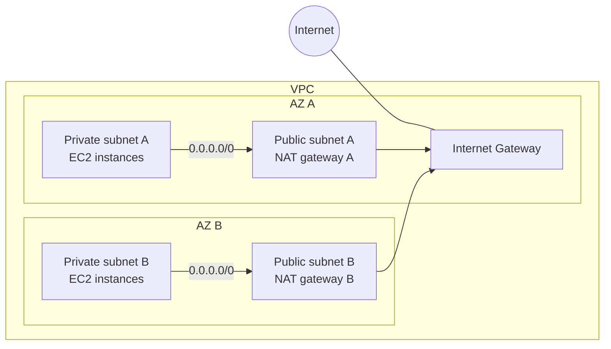
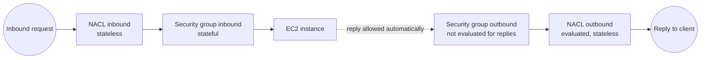
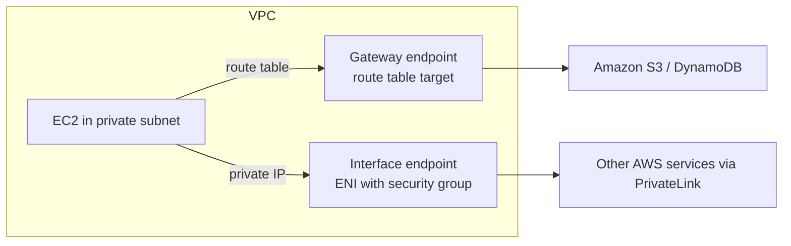
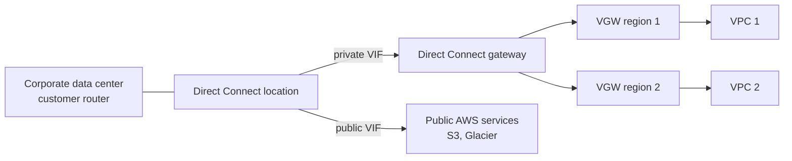

# 27 - Networking - VPC

Related: [[VPC]] · [[VPC Connectivity]] · [[VPC Monitoring, IPv6 & Network Firewall]] (Version C service notes) · [[EC2]] · [[S3]] · [[Cost Management & Billing]] · [[WAF, Shield & Firewall Manager]] · [[Athena, Glue & Lake Formation]] · [[CloudWatch]] · [[Exam Cheat Sheet]]

## Chapter summary
- **CIDR** = base IP + subnet mask (`/32` = 1 IP, `/24` = 256, `/16` = 65,536, `/0` = all). Private ranges: `10.0.0.0/8`, `172.16.0.0/12` (default VPC lives here), `192.168.0.0/16`.
- **VPC** = regional, up to **5 per region** (soft), **5 CIDRs per VPC**, each **/28 (16 IPs) to /16 (65,536 IPs)**, private ranges only. Subnets are tied to **one AZ**; AWS **reserves 5 IPs per subnet** (usable = size - 5).
- **Public subnet** = route to an **Internet Gateway (IGW)**. Private subnets reach the internet through a **NAT Gateway** (IPv4, managed, 5 -> 100 Gbps, one per AZ for HA; **regional NAT gateway** is the new simplified option) or an outdated **NAT instance** (disable source/destination check, Elastic IP). **Egress-only IGW** = NAT for IPv6.
- **Bastion host** = public EC2 used to SSH into private instances; lock its SG to your corporate CIDR, private SG allows SSH from the bastion SG.
- **Security group** = instance level, allow-only, **stateful**. **NACL** = subnet level, allow + deny, **stateless**, numbered rules (lowest first, first match wins), **ephemeral ports** matter; default NACL allows everything.
- **VPC Peering** = non-transitive, no overlapping CIDRs, must update route tables in both VPCs. **Transit Gateway** = transitive hub-and-spoke for VPCs, VPN, Direct Connect; supports **ECMP** and **IP multicast**.
- **VPC Endpoints** = private access to AWS services: **Gateway** (S3 and DynamoDB only, free, route-table target) vs **Interface** (ENI, PrivateLink, everything else, paid). Exam default for S3 = Gateway endpoint.
- **Hybrid**: **Site-to-Site VPN** (encrypted, over the internet; VGW + CGW; route propagation) vs **Direct Connect** (private, not encrypted, takes **> 1 month** to set up; Direct Connect Gateway for multi-region). DX + VPN as backup is a classic exam design.
- **VPC Flow Logs** (VPC / subnet / ENI level -> S3, CloudWatch Logs, Firehose) to troubleshoot SG vs NACL; **Traffic Mirroring** to copy ENI traffic to appliances; **Network Firewall** protects the whole VPC L3-L7.
- **Costs**: ingress free, same-AZ private IP free, cross-AZ and public IP traffic charged, cross-region and internet egress most expensive; Gateway endpoint instead of NAT gateway saves money.

---

## 01 - Section Introduction
(src: 27/01-Section Introduction)

- VPC is the backbone of everything built so far; this section builds a VPC from the ground up, step by step.
- Several resources (NAT gateway etc.) cost money: do the labs in one go (or two days) and delete everything afterwards.

---

## 02 - CIDR, Private vs Public IP
(src: 27/02-CIDR, Private vs Public IP)

- **CIDR** (Classless Inter-Domain Routing) defines IP ranges, e.g. in security group rules. Two parts: **base IP** (an IP inside the range, usually the first) and **subnet mask** (how many bits can change). The `/` form is used throughout AWS (`/8` = `255.0.0.0`, `/16` = `255.255.0.0`).
- An IP has 4 octets: `/32` no octet changes, `/24` last octet, `/16` last two, `/8` last three, `/0` all.

| CIDR | IPs | Example |
|---|---|---|
| /32 | 1 (2^0) | one single IP |
| /31 | 2 | .0 - .1 |
| /30 | 4 | .0 - .3 |
| /29 | 8 | .0 - .7 |
| /28 | 16 | .0 - .15 |
| /24 | 256 | 192.168.0.0 - 192.168.0.255 |
| /16 | 65,536 | last two octets change |
| /0 | all IPv4 | `0.0.0.0/0` |

- Exercises: `192.168.0.0/24` = 256 IPs; `192.168.0.0/16` = 65,536; `134.56.78.123/32` = 1 IP; `0.0.0.0/0` = all. Handy online CIDR <-> IP range calculator (e.g. `10.0.0.0/17` ~ 32,000 IPs).
- **Private IPv4 ranges** (IANA, for private LANs): `10.0.0.0/8` (big networks), `172.16.0.0/12` (AWS default VPC is in here), `192.168.0.0/16` (home networks). Everything else is public internet.

> [!tip] Exam
> /32 = one IP, /0 = all IPs; /24 = 256, /16 = 65,536. Know the three private ranges.

---

## 03 - Default VPC Overview
(src: 27/03-Default VPC Overview)

- Every new account has a **default VPC** (so EC2 works immediately). Instances launch into it if no subnet is chosen; it has internet connectivity and every instance gets a **public IPv4** plus public and private IPv4 DNS names. Best practice: create your own VPCs for production instead.
- Console walk-through: one VPC (no name tag), one IPv4 CIDR (a /16 = 65,536 IPs), no IPv6 CIDR, flow logs disabled. **3 default subnets, one per AZ** (high availability), each with its own CIDR (a /20 here = 4,096 addresses, but only **4,091 available** - 5 reserved, see lecture 06).
- Subnet defaults: **auto-assign public IPv4 = enabled**, a route table and a **default NACL** (allows all inbound and outbound traffic, all protocols).
- **Main route table**: two rules - the local VPC CIDR and `0.0.0.0/0` -> **Internet Gateway** (attached to the VPC). Subnets with no explicit association are **implicitly associated with the main route table**.

---

## 04 - VPC Overview
(src: 27/04-VPC Overview)

- **VPC = Virtual Private Cloud**; multiple VPCs per region: **max 5 per region (soft limit, can be raised)**.
- **Max 5 CIDRs per VPC**; each CIDR: **minimum /28 (16 IPs), maximum /16 (65,536 IPs)**.
- VPC is private, so only **private IPv4 ranges** are allowed.
- Choose a CIDR that **does not overlap** other VPCs or corporate networks you may connect to later.

> [!tip] Exam
> VPC CIDR: /28 to /16, max 5 CIDRs, 5 VPCs per region (soft). Overlapping CIDRs cannot be connected (peering etc.).

---

## 05 - VPC Hands On
(src: 27/05-VPC Hands On)

- Built manually (no VPC wizard) to learn the pieces. `/16` is the largest allowed (`/15` is too big). Tenancy **Default** (shared hardware) vs **Dedicated** (dedicated hardware, very expensive).
- A new VPC automatically gets a **main route table** and a **main NACL**; additional IPv4 CIDRs (and IPv6 CIDRs) can be added later via Edit CIDRs (up to 5 IPv4).

### Hands-on steps
1. VPC console -> Create VPC (VPC only) -> name `DemoVPC`, IPv4 CIDR `10.0.0.0/16`, no IPv6, tenancy Default.
2. Open the VPC: note 1 IPv4 CIDR, 0 IPv6, main route table and main NACL created.
3. (Demo only) Actions -> Edit CIDRs -> add `10.1.0.0/16` to show multiple CIDRs; the lab keeps only one.

---

## 06 - Subnet Overview
(src: 27/06-Subnet Overview)

- A **subnet** is a sub-range of the VPC's IPv4 addresses, in a single AZ. Public vs private is decided later (routing).
- **AWS reserves 5 IPs in each subnet** (first 4 + last 1); they cannot be assigned to instances. Example `10.0.0.0/24`:
  - `10.0.0.0` network address
  - `10.0.0.1` VPC router
  - `10.0.0.2` Amazon-provided DNS mapping
  - `10.0.0.3` reserved for future use
  - `10.0.0.255` network broadcast address (broadcast not supported in a VPC, still reserved)

> [!tip] Exam
> Need 29 usable IPs? `/27` = 32 - 5 = 27 (too few). Choose `/26` = 64 - 5 = 59.

---

## 07 - Subnet Hands On
(src: 27/07-Subnet Hands On)

- Four subnets across two AZs (high availability). Public subnets are small (front-facing resources such as load balancers); private subnets are larger.
- Available IPs = CIDR size - 5: a /24 shows **251**, a /20 shows **4,091**. Overlapping CIDRs are rejected. Subnets look identical until routing makes them public or private.

| Subnet | AZ | CIDR | Size |
|---|---|---|---|
| PublicSubnetA | eu-central-1a | 10.0.0.0/24 | 256 |
| PublicSubnetB | eu-central-1b | 10.0.1.0/24 | 256 |
| PrivateSubnetA | eu-central-1a | 10.0.16.0/20 | 4,096 (10.0.16.0 - 10.0.31.255) |
| PrivateSubnetB | eu-central-1b | 10.0.32.0/20 | 4,096 |

### Hands-on steps
1. VPC console -> Subnets -> filter by `DemoVPC`.
2. Create subnet: select DemoVPC; add `PublicSubnetA` (AZ a, 10.0.0.0/24), `PublicSubnetB` (AZ b, 10.0.1.0/24), `PrivateSubnetA` (AZ a, 10.0.16.0/20), `PrivateSubnetB` (AZ b, 10.0.32.0/20) - make sure each AZ is set.
3. Create; check the "available IPv4 addresses" column (251 / 4,091).

---

## 08 - Internet Gateways & Route Tables
(src: 27/08-Internet Gateways & Route Tables)

- **Internet Gateway (IGW)**: lets VPC resources reach the internet; **scales horizontally, highly available and redundant**, created separately from the VPC. **One VPC <-> one IGW**.
- An IGW alone does **not** give internet access: you must also **edit the route tables** (instance -> router -> IGW -> internet).

---

## 09 - Internet Gateways & Route Tables Hands On
(src: 27/09-Internet Gateways & Route Tables Hands On)

- A subnet's **auto-assign public IPv4** setting is off for new subnets; enable it on public subnets (it then defaults to enabled in the EC2 launch wizard).
- An instance with a public IP in a subnet **without IGW and route** still cannot be reached (EC2 Instance Connect fails).
- Best practice: create **explicit route tables** (public and private) instead of relying on the main route table; the main one then has no associations.
- Public route table: `10.0.0.0/16 -> local` (VPC CIDR) and `0.0.0.0/0 -> Internet Gateway`.

### Hands-on steps
1. Launch an instance (Amazon Linux 2, t2.micro, no key pair) in DemoVPC / PublicSubnetA; first edit subnet settings -> enable auto-assign public IPv4 for both public subnets; add SSH (22) rule.
2. Try EC2 Instance Connect: fails (no IGW).
3. Create Internet Gateway `DemoIGW` -> attach to DemoVPC; retry: still fails (no route).
4. Create route tables `PublicRouteTable` and `PrivateRouteTable` in DemoVPC; associate public subnets A/B and private subnets A/B respectively.
5. Public route table -> Edit routes -> add `0.0.0.0/0` -> target Internet Gateway (DemoIGW).
6. Retry EC2 Instance Connect: works; `ping google.com` works. Private instances still have no internet (next lectures).

> [!tip] Exam
> Public subnet = route table entry `0.0.0.0/0 -> IGW`. The `local` route covers traffic inside the VPC CIDR.

---

## 10 - Bastion Hosts
(src: 27/10-Bastion Hosts)

- A **bastion host** is an EC2 instance in a **public subnet** used to SSH into instances in **private subnets** (SSH to bastion, then SSH to private instance).
- **Security groups (exam)**:
  - Bastion SG: allow SSH (22) from the internet, but **restrict to your corporate public CIDR / specific IPs**, not everywhere (a compromised bastion is a risk).
  - Private instance SG: allow SSH (22) from the **bastion's private IP or its security group**.

---

## 11 - Bastion Hosts Hands On
(src: 27/11-Bastion Hosts Hands On)

- Instance in PublicSubnetA named "Bastion Host"; private EC2 instance in PrivateSubnetA with SG `private SG` allowing SSH **from the bastion's security group**. EC2 Instance Connect cannot reach the private instance (making it public would need IGW routes).
- Copying the private key to the bastion with an editor can corrupt formatting (invalid format) - re-paste it; `chmod` the file or SSH reports "unprotected private key".
- From the private instance `ping google.com` fails: no outbound internet.

### Hands-on steps
1. Create a key pair `DemoKeyPair` (.pem) for the private instance.
2. Launch instance (Amazon Linux 2, t2.micro) into DemoVPC / PrivateSubnetA; SG `private SG` with SSH from the bastion's SG.
3. Connect to the bastion (EC2 Instance Connect), create a file `demo-key-pair.pem` with the key content (vi/nano), `chmod 0400` it.
4. `ssh ec2-user@<private IP> -i demo-key-pair.pem` -> logged into the private instance.
5. `ping google.com` -> no reply (fixed in next lectures).

---

## 12 - NAT Instances
(src: 27/12-NAT Instances)

- **NAT** = Network Address Translation. A **NAT instance** lets private-subnet instances reach the internet. Outdated (NAT gateway is better) but **still appears on the exam**.
- Requirements: launch in a **public subnet**; **disable the source/destination check** on the EC2 instance; attach a fixed **Elastic IP**; private route table sends `0.0.0.0/0` to the NAT instance.
- How it works: private instance (source `10.0.0.20`) sends to public server `50.60.4.10` via the NAT instance, which **rewrites the packet source to its own public IP**; the reply comes back to the NAT instance, which rewrites the destination back to the private IP. Because it forwards traffic not addressed to itself, the **source/destination check must be disabled**.
- Drawbacks: pre-configured Amazon Linux NAT AMI reached **end of standard support on 31 Dec 2020**; **not highly available / resilient out of the box** (need multiple instances across AZs, ASG, resilient user-data); bandwidth depends on instance type; you manage security groups and rules (inbound HTTP/HTTPS from private subnets, SSH from home network; outbound as needed).

> [!tip] Exam
> NAT instance: public subnet + Elastic IP + source/destination check disabled + route table. NAT gateway is the recommended replacement.

---

## 13 - NAT Instances Hands On
(src: 27/13-NAT Instances Hands On)

- AMI: community AMI from AWS with name like `amzn-ami-vpc-nat` (x86_64, check published date; "somewhat deprecated" so any recent one works). SG rules: SSH from anywhere, HTTP and HTTPS from the VPC CIDR `10.0.0.0/16`, and **ICMP from the VPC CIDR** for ping.
- Stop and disable **source/destination check** (Networking -> Change source/destination check).
- Private route table: `0.0.0.0/0 -> NAT instance`. Result: ping, curl (HTTP/HTTPS) from the private instance work, and it still has **no public IP**.

### Hands-on steps
1. Launch instance -> Browse more AMIs -> Community AMIs -> search `NAT` -> pick an Amazon `vpc-nat` x86_64 AMI; t2.micro; DemoKeyPair; DemoVPC / PublicSubnetA; new SG `NAT instance SG` (SSH anywhere; HTTP and HTTPS from 10.0.0.0/16).
2. Instance -> Actions -> Networking -> Change source/destination check -> stop checking.
3. SSH to the private instance via the bastion; `ping google.com` still fails.
4. Private route table -> Edit routes -> `0.0.0.0/0` -> Instance -> the NAT instance.
5. Ping still fails: add inbound **All ICMP - IPv4** from `10.0.0.0/16` to the NAT instance SG.
6. `ping google.com` and `curl example.com` work. Stop or terminate the NAT instance.

---

## 14 - NAT Gateways
(src: 27/14-NAT Gateways)

- **NAT Gateway**: AWS-managed, higher bandwidth, built-in high availability, no administration. **Pay per hour plus per GB processed.** Created in a **specific AZ**, uses an **Elastic IP**; cannot be used by instances in the **same subnet** (needs another subnet). Placed in a **public subnet**; traffic flows private subnet -> NAT gateway -> IGW, so **a NAT gateway requires an Internet Gateway**.
- **Bandwidth 5 Gbps, auto-scales up to 100 Gbps**; **no security groups** to manage.
- **HA**: resilient only **within a single AZ**. For fault tolerance, create **one NAT gateway per AZ** (private subnet route tables point to the NAT in the same AZ; no cross-AZ wiring needed).

> [!info] Diagram
> **Explanation:** Each private subnet routes `0.0.0.0/0` to the NAT gateway in its own AZ; each NAT gateway sits in a public subnet whose route table points to the Internet Gateway. If one AZ fails, the other AZ keeps its own NAT gateway working. (Zonal NAT gateway layout described in the lecture.)
> **Reference:** [NAT gateways - Amazon VPC User Guide](https://docs.aws.amazon.com/vpc/latest/userguide/vpc-nat-gateway.html) and [Regional NAT gateways (zonal vs regional diagram)](https://docs.aws.amazon.com/vpc/latest/userguide/nat-gateways-regional.html)

| | NAT Gateway | NAT Instance |
|---|---|---|
| Availability | HA within an AZ; create one per AZ for multi-AZ | you manage failover scripts |
| Bandwidth | 5 -> 100 Gbps | depends on instance type |
| Maintenance | managed by AWS | you patch OS and software |
| Cost | per hour + per GB processed | EC2 per hour (type/size) + network out |
| Public IP | Elastic IP (allocated to the gateway) | Elastic IP (must be attached) |
| Security groups | not used | must configure |
| Bastion host | cannot be used as one | can be used as a bastion |

> [!tip] Exam
> NAT gateway = managed, IPv4 only, needs IGW, HA per AZ, no SG. NAT instance can act as bastion, NAT gateway cannot.

---

## 15 - NAT Gateways Hands On
(src: 27/15-NAT Gateways Hands On)

- After stopping the NAT instance, the private route table shows the route as a **blackhole** (target no longer valid).
- NAT gateway needs: a (public) subnet, connectivity type **Public**, an allocated **Elastic IP**. State is **Pending** for a while, then **Available**. No security group rules needed; just edit the route table.
- For HA you would create a second NAT gateway in another AZ and route its private subnets to it (not done in the lab).

### Hands-on steps
1. NAT gateways -> Create: name `DemoNATGW`, subnet `PublicSubnetA`, connectivity Public, Allocate Elastic IP -> Create.
2. Private route table -> Edit routes: delete the blackhole route; add `0.0.0.0/0` -> NAT Gateway `DemoNATGW`.
3. Wait until the NAT gateway is Active; from the private instance `curl google.com`, `ping google.com`, `sudo yum update` all work.

---

## 16 - Regional NAT Gateway
(src: 27/16-Regional NAT Gateway)

- **Regional NAT gateway (RNAT)**: a newer, **highly available NAT gateway associated directly with the VPC** (not a specific subnet).
- Create it at VPC level, route its traffic to the Internet Gateway through a route table; **no NAT gateway per AZ needed** (shared across AZs) and **no public subnet** needed to host it, so nothing unintended is created in public subnets.
- Private subnets point to it via their route table; when you add another AZ / private subnet it is **detected and the NAT gateway scales automatically**.
- Result: one central NAT gateway per VPC instead of one per AZ.

---

## 17 - NACL & Security Groups
(src: 27/17-NACL & Security Groups)

**Request flow (incoming)**: request -> **NACL inbound rules** (subnet boundary, **stateless**) -> **security group inbound rules** (instance, **stateful**) -> EC2 -> reply: SG outbound **not evaluated** (stateful) -> **NACL outbound rules evaluated** (stateless).
**Outgoing request**: SG outbound -> NACL outbound -> internet; reply: NACL inbound evaluated, SG inbound not needed (stateful).

> [!info] Diagram
> **Explanation:** For an incoming request, the NACL (subnet level) is checked first, then the security group (instance level). Because the security group is stateful, the reply is allowed automatically; because the NACL is stateless, its outbound rules are evaluated for the reply as well.
> **Reference:** [Control subnet traffic with network access control lists - Amazon VPC User Guide](https://docs.aws.amazon.com/vpc/latest/userguide/vpc-network-acls.html)

**NACL (Network Access Control List)** facts:
- Firewall at the **subnet level**; **one NACL per subnet**; new subnets get the **default NACL**.
- Rules are numbered **1 to 32,000**; **lower number = higher precedence; first match wins**. Example: ALLOW rule 100 and DENY rule 200 for the same IP -> allowed. Last rule `*` denies everything unmatched. AWS recommends numbering in **increments of 100** to leave room for inserts.
- A **newly created custom NACL denies everything** by default; **default NACL allows all inbound and outbound** for associated subnets (do not modify it; create custom ones).
- Great use case: **block a specific IP address at the subnet level**.

[verify] "Rules are numbered 1 to 32,000."
> [!warning] Correction [note]
> AWS documentation states each NACL rule has a number from **1 to 32766**. Source: [Control subnet traffic with network access control lists](https://docs.aws.amazon.com/vpc/latest/userguide/vpc-network-acls.html). The lecture's 32,000 is an approximation; the evaluation logic (lowest first, first match wins) is unchanged.

**Ephemeral ports**: a client connecting to a server's fixed port (80, 443, 22, 3306...) opens a random **ephemeral port** on itself for the life of the connection; the server's reply goes back to that port. Typical ranges: **Windows 10: 49,152 - 65,535; Linux: 32,768 - 60,999** (various OS differ).
- NACL example (web subnet -> DB subnet): web NACL **outbound TCP 3306** to DB CIDR; DB NACL **inbound TCP 3306** from web CIDR; DB NACL **outbound ephemeral ports (e.g. 1024-65535)** to web CIDR; web NACL **inbound ephemeral ports** from DB CIDR.
- With multiple subnets/NACLs, every combination of CIDRs must be allowed; update NACL rules when adding subnets.

| | Security group | NACL |
|---|---|---|
| Level | instance (ENI) | subnet |
| Rule types | **allow only** | **allow and deny** |
| State | **stateful** (return traffic automatic) | **stateless** (inbound and outbound both evaluated; mind ephemeral ports) |
| Evaluation | **all rules** evaluated | rules in number order, **first match wins** |
| Applies to | instances it is attached to (if specified) | **all instances in the associated subnet** |

> [!tip] Exam
> SG = stateful, allow-only, instance. NACL = stateless, allow+deny, subnet, numbered, first match wins. Block a single IP -> NACL. Default NACL allows everything; custom NACL denies everything.

---

## 18 - NACL & Security Groups Hands On
(src: 27/18-NACL & Security Groups Hands On)

- Default NACL is associated with all four subnets: inbound and outbound `ALL traffic` allowed (last `*` deny never reached).
- Web server on the bastion (httpd, "hello world"; SG inbound HTTP from anywhere). Added NACL **inbound deny HTTP at rule 80** -> page hangs (timeout; NACL blocked it). Renumbering the deny to **140** (after allow-all rule 100) -> page works again: **rule number precedence**.
- Statelessness demo: changing the NACL **outbound** rule to deny breaks the page even though inbound is allowed (return traffic blocked), regardless of the security group.
- Statefulness demo: removing **all SG outbound rules** does **not** break inbound HTTP (reply allowed automatically); it would only block connections the instance itself initiates.
- Troubleshooting lesson: SG rules looking fine does not mean the NACL is fine; check both.

### Hands-on steps
1. Network ACLs -> default NACL (4 subnets): inspect inbound/outbound rules.
2. On the bastion: `sudo yum install -y httpd`, `sudo systemctl enable httpd`, `sudo systemctl start httpd`, write "hello world" to `/var/www/html/index.html`; add HTTP (80) from anywhere to its SG; open the public IP in a browser.
3. Default NACL -> Edit inbound rules -> add rule 80, HTTP, source anywhere, **Deny** -> page times out; change number to 140 -> works.
4. Edit outbound `ALL traffic` rule to Deny -> page hangs; set it back to Allow.
5. Remove the SG outbound rule -> page still works (stateful); restore the outbound rule afterwards.

---

## 19 - VPC Peering
(src: 27/19-VPC Peering)

- **VPC peering** connects two VPCs privately over the AWS network so they behave as one network. Works **across regions and across accounts**.
- **CIDRs must not overlap** or peering cannot work.
- **Not transitive**: A-B and B-C peered does **not** let A talk to C; you need a separate A-C peering.
- You must also **update route tables in each VPC's subnets** so instances can reach each other.
- You can **reference a security group of a peered VPC** (across accounts, same region) in a rule instead of a CIDR.

> [!tip] Exam
> Peering = non-overlapping CIDRs + route tables on both sides + non-transitive. 3 VPCs fully connected = 3 peerings.

---

## 20 - VPC Peering Hands On
(src: 27/20-VPC Peering Hands On)

- Peer DemoVPC (`10.0.0.0/16`) with the default VPC (`172.31.0.0/16`). Before peering, `curl` from an instance in the default VPC to the bastion's private IP (`10.0.0.x:80`) **times out** (VPCs are isolated).
- Create a peering connection: requester = DemoVPC, acceptor = default VPC (same account/region here, but could be another account/region); CIDRs must not overlap. Status **Pending acceptance** -> accept it (the acceptor owner accepts; could be denied).
- After accepting you still must add routes: in DemoVPC's public route table add `172.31.0.0/16 -> peering connection`, and in the default VPC's main route table add `10.0.0.0/16 -> peering connection`. Only then does `curl` return "hello world".

### Hands-on steps
1. Launch an instance in the default VPC (new SG with SSH; key pair `DemoKeyPair`) - this is the "default VPC instance".
2. Connect (EC2 Instance Connect) to both instances; `curl <bastion private IP>:80` from the default VPC instance -> timeout.
3. VPC -> Peering connections -> Create `demo peering connection`: requester DemoVPC, accepter default VPC (My account, This region).
4. Actions -> Accept request.
5. DemoVPC public route table -> add route destination `172.31.0.0/16` target the peering connection.
6. Default VPC main route table -> add route destination `10.0.0.0/16` target the peering connection.
7. `curl` again -> "hello world".

---

## 21 - VPC Endpoints
(src: 27/21-VPC Endpoints)

- Many AWS services (DynamoDB, SNS, S3, CloudWatch...) have public endpoints; without endpoints private instances reach them via **NAT gateway -> IGW -> public internet**: costly (NAT gateway charges) and many hops.
- **VPC endpoints** let instances reach AWS services **privately over the AWS network**. They are powered by **AWS PrivateLink**, redundant, scale horizontally, and **remove the need for an IGW/NAT gateway** to reach AWS services. Troubleshooting: check **DNS resolution settings** in the VPC and **route tables**.

| | Interface Endpoint | Gateway Endpoint |
|---|---|---|
| Mechanism | provisions an **ENI** (private IP) in your VPC as entry point | a **gateway target in a route table** (no IPs, no SGs) |
| Security | **attach a security group** | route table only |
| Supported services | **most AWS services (if not all)** | **only Amazon S3 and DynamoDB** |
| Cost | **per hour + per GB processed** | **free**, scales automatically |
| Use for on-premises / other VPC access | yes (reachable via VPN, Direct Connect, peering) | no |

> [!info] Diagram
> **Explanation:** A gateway endpoint is added as a route-table target and only reaches S3 and DynamoDB; an interface endpoint is an ENI in a subnet (with a security group) that reaches other AWS services (and S3 too) through PrivateLink. Neither needs a NAT gateway or internet gateway.
> **Reference:** [AWS PrivateLink concepts - VPC endpoint types (Amazon VPC PrivateLink Guide)](https://docs.aws.amazon.com/vpc/latest/privatelink/concepts.html)

- S3 can be reached through either type. **At the exam, the Gateway endpoint is usually the answer** (route-table change only, free, scales). Choose the **Interface endpoint for S3** only when you need access **from on-premises (Site-to-Site VPN / Direct Connect)** or from **another VPC / region**.

[verify] "We have two types of VPC endpoints: Interface and Gateway."
> [!warning] Correction [note]
> AWS documentation now lists more endpoint types: Interface, Gateway Load Balancer, Resource, Service network, Tunnel, plus the Gateway type for S3 and DynamoDB (gateway endpoints do not use PrivateLink). For the SAA exam the Interface vs Gateway distinction still applies. Source: [AWS PrivateLink concepts](https://docs.aws.amazon.com/vpc/latest/privatelink/concepts.html).

> [!tip] Exam
> Gateway endpoint = S3 and DynamoDB only, free, route table. Interface endpoint = ENI + SG, PrivateLink, paid, everything else (and S3 for on-premises/cross-VPC).

---

## 22 - VPC Endpoints Hands On
(src: 27/22-VPC Endpoints Hands On)

- Goal: reach S3 from the private instance without internet. The instance needs an **IAM role** (S3 read-only) for `aws s3 ls`. Removing the NAT route in the private route table proves no internet (both `aws s3 ls` and `curl` fail).
- Create endpoint -> AWS services; searching `dynamodb` shows a *gateway* type, many others are *interface* type. An interface endpoint asks for VPC, DNS name enabled, subnets/AZs and a **security group**; a gateway endpoint asks for VPC, **route tables to update** and a policy (full access).
- After creating the S3 Gateway endpoint the private route table gets a route to it automatically (cannot delete that route without deleting the endpoint).
- CLI gotcha: the CLI default region is us-east-1 -> specify `--region eu-central-1` (your region) or `aws s3 ls` fails even with the endpoint.

### Hands-on steps
1. Terminate the default-VPC instance; connect to bastion, SSH to the private instance.
2. Create IAM role `DemoRoleEC2-S3ReadOnly` (EC2, `AmazonS3ReadOnlyAccess`); instance -> Security -> Modify IAM role; `aws s3 ls` works (internet still available).
3. Private route table -> remove the NAT route; `aws s3 ls` and `curl google.com` now fail.
4. VPC -> Endpoints -> Create endpoint: AWS services, S3 **Gateway** type, VPC DemoVPC, select the private route table, full access policy -> Create.
5. Check the private route table: new route to the endpoint.
6. Reconnect via the bastion; `aws s3 ls --region eu-central-1` (your region) lists buckets with no internet access.

---

## 23 - VPC Flow Logs
(src: 27/23-VPC Flow Logs)

- Capture IP traffic metadata at **VPC, subnet or ENI level** (three kinds); helps monitor and troubleshoot connectivity. Destinations: **Amazon S3, CloudWatch Logs, Kinesis Data Firehose**. Also captures traffic of AWS-managed interfaces: ELB, RDS, ElastiCache, Redshift, WorkSpaces, NAT gateway, Transit gateway.
- Record fields: version, account ID, interface ID, **source/destination address, source/destination port, protocol**, packets, bytes, start/end, **action (ACCEPT/REJECT)**, log status. Use to spot problematic IPs and ports, usage patterns, malicious behaviour, port scans.
- Query: **Athena on S3** (best) or **CloudWatch Logs Insights** for streaming analysis.
- **Troubleshooting SG vs NACL with `action`**:
  - Inbound REJECT -> NACL **or** security group.
  - Inbound ACCEPT + outbound REJECT -> **NACL** (SG is stateful so would have allowed the reply).
  - Outbound REJECT -> NACL or SG; outbound ACCEPT + inbound REJECT -> **NACL**.
- Architectures: flow logs -> CloudWatch Logs -> **Contributor Insights** (top-10 talkers); -> CloudWatch Logs **metric filter** (e.g. SSH/RDP spikes) -> **CloudWatch Alarm** -> **SNS**; -> S3 -> **Athena** -> **QuickSight**.
- Permissions: an **IAM role** for the flow-logs service must allow `logs:CreateLogGroup`, `logs:CreateLogStream`, `logs:PutLogEvents` (to publish to CloudWatch Logs).

[verify] "Destinations: S3, CloudWatch Logs and Kinesis Data Firehose."
> [!warning] Correction [note]
> Kinesis Data Firehose is now named **Amazon Data Firehose**; flow-log destinations are still CloudWatch Logs, S3 and Firehose. Source: [Logging IP traffic using VPC Flow Logs](https://docs.aws.amazon.com/vpc/latest/userguide/flow-logs.html).

> [!tip] Exam
> Inbound ACCEPT but outbound REJECT = NACL problem (stateless). Flow logs -> S3 + Athena for analysis; -> CloudWatch Logs for alarms/metric filters.

---

## 24 - VPC Flow Logs Hands On + Athena
(src: 27/24-VPC Flow Logs Hands On + Athena)

- Flow log options: filter (Accept / Reject / All), max aggregation interval (1 min or 10 min; 1 minute creates many more records and costs more, 10 minutes is usually better), destination S3 / CloudWatch Logs / Firehose (same or other account). For S3 a **bucket policy is created automatically** so the service can write.
- For CloudWatch Logs you need a **log group** and an **IAM role** (custom trust policy, principal service `vpc-flow-logs.amazonaws.com`; permission CloudWatchLogsFullAccess).
- CloudWatch Logs shows one log stream per ENI; many REJECT entries come from internet scanners/attackers (could block with a NACL).
- Athena: set a query result S3 location, create the flow-log table using the AWS tutorial DDL (partitioned), add a partition for the date, then `SELECT` rejected traffic. Glue can automate partition creation. Delete flow logs afterwards to avoid cost.

### Hands-on steps
1. VPC -> DemoVPC -> Flow logs -> Create: `DemoS3FlowLog`, filter All/Reject, 1 minute, destination S3 (create bucket in the same region and paste its ARN), default format.
2. Create second flow log `DemoFlowLogCloudWatchLogs` (1 minute, all traffic, destination CloudWatch Logs); create IAM role `flowlogsrole` (custom trust policy with `vpc-flow-logs.amazonaws.com`, CloudWatchLogsFullAccess) and log group `VPCFlowLogs` (retention 1 day).
3. Inspect S3 objects (`AWSLogs/<account>/vpcflowlogs/<region>/...`) and the CloudWatch log streams (match the ENI ID of the bastion).
4. Athena: set query results bucket (new bucket + `s3://.../athena/`); run the tutorial `CREATE TABLE` pointing at the flow-log S3 path; run `ALTER TABLE ... ADD PARTITION` for the date; `SELECT ... WHERE action='REJECT'`.
5. Delete the flow logs when finished.

---

## 25 - Site to Site VPN, Virtual Private Gateway & Customer Gateway
(src: 27/25-Site to Site VPN, Virtual Private Gateway & Customer Gateway)

- **Site-to-Site VPN** links a corporate data center to a VPC over the **public internet** with an **encrypted** connection.
- Components:
  - **Virtual Private Gateway (VGW)**: VPN concentrator on the AWS side, attached to the VPC; ASN can be customized.
  - **Customer Gateway (CGW)**: software or physical device on the customer side.
- **CGW IP address**: if the CGW has a public internet-routable IP, use it; if it is private behind a **NAT device with NAT-T enabled**, use the **public IP of the NAT device**.
- **Route propagation** must be enabled on the VPC subnets' route tables for the VPN to work.
- To **ping EC2 from on-premises**, the security group inbound must allow **ICMP**.
- **AWS VPN CloudHub**: multiple customer sites each with a CGW connect with VPN to **one VGW**; sites can communicate with each other through it. **Low-cost hub-and-spoke**, primary or secondary connectivity, **over the public internet (encrypted)**; set up multiple Site-to-Site VPN connections on the same VGW and enable **dynamic routing** plus route tables.

> [!tip] Exam
> VPN = encrypted over the internet; needs VGW + CGW; enable route propagation; CGW behind NAT -> use NAT device public IP; ICMP in SG to ping; CloudHub for multiple sites.

---

## 26 - Site to Site VPN, Virtual Private Gateway & Customer Gateway Hands On
(src: 27/26-Site to Site VPN, Virtual Private Gateway & Customer Gateway Hands On)

- Console tour only (no on-premises infrastructure). Customer Gateway: name, optional BGP ASN, **IP address of the device's external interface**, optional certificate ARN. Virtual Private Gateway: create with an ASN. Then create a **VPN Connection** (type Virtual private gateway) selecting the VGW and CGW; many routing/tunnel options are out of scope.
- For the exam: create **customer gateway -> virtual private gateway -> VPN connection** between them.

---

## 27 - Direct Connect & Direct Connect Gateway
(src: 27/27-Direct Connect & Direct Connect Gateway)

- **Direct Connect (DX)**: **dedicated private connection** from a remote network to your VPC, via an **AWS Direct Connect location**; needs a **virtual private gateway** on the VPC. One connection reaches **public resources (S3) via a public VIF** and **private resources (EC2) via a private VIF**.
- Use cases: **increased bandwidth / throughput** for large data sets, **lower cost**, **more consistent network experience** (real-time data feeds), **hybrid environments**. Supports **IPv4 and IPv6**.
- Layout: AWS region <-> Direct Connect location (AWS endpoint + your or partner router in a cage) <-> corporate data center (customer router/firewall). **Private VIF** -> VGW -> VPC private subnets; **public VIF** -> public AWS services (S3, Glacier) directly.
- **Direct Connect Gateway**: connect on-premises to **one or more VPCs in different regions** (private VIF -> DX Gateway -> VGW in each region).

> [!info] Diagram
> **Explanation:** One physical Direct Connect link carries virtual interfaces. A private VIF reaches VPCs (through a Direct Connect gateway to reach VPCs in several regions); a public VIF reaches public AWS services such as S3 without using the internet.
> **Reference:** [What is Direct Connect? - virtual interface types (AWS Direct Connect User Guide)](https://docs.aws.amazon.com/directconnect/latest/UserGuide/Welcome.html)

| Connection type | Capacity | Notes |
|---|---|---|
| Dedicated | **1 Gbps up to 400 Gbps** | physical Ethernet port dedicated to the customer; request to AWS, completed by an AWS Direct Connect partner |
| Hosted | **50 Mbps up to 25 Gbps** | requested via an AWS Direct Connect partner; capacity can be added/removed on demand |

- **Lead time often more than 1 month** to establish. Exam: "transfer data within a week, fast" -> **not Direct Connect** unless one already exists.
- **No encryption** by default (private but not encrypted). For encryption set up a **VPN over Direct Connect (IPsec)** - extra security, slightly more complex.
- **Resiliency (exam)**:
  - **High resiliency for critical workloads**: **one connection at each of two or more Direct Connect locations**.
  - **Maximum resiliency for critical workloads**: **two independent connections (separate devices) at each of two or more locations** (four connections).

> [!tip] Exam
> DX = private, not encrypted, > 1 month lead time; DX Gateway for multi-region/VPC; public VIF for S3, private VIF for VPC; need encryption -> add VPN.

---

## 28 - Direct Connect + Site to Site VPN
(src: 27/28-Direct Connect + Site to Site VPN)

- Exam architecture: Direct Connect as the expensive **primary** connection, and a **Site-to-Site VPN as backup** that takes over if Direct Connect fails (a second DX would be costlier). The VPN goes over the public internet.

> [!tip] Exam
> Cheap failover for Direct Connect = Site-to-Site VPN backup.

---

## 29 - Transit Gateway
(src: 27/29-Transit Gateway)

- Many VPC peerings + VPNs + Direct Connect + DX gateways get complicated. **Transit Gateway** provides **transitive** connectivity (hub-and-spoke / star) between **thousands of VPCs**, on-premises data centers, Site-to-Site VPN and Direct Connect; **VPCs need no peering** to each other.
- **Regional resource**, works **cross-region** (peer transit gateways across regions); **share across accounts with Resource Access Manager (RAM)**.
- **Route tables on the TGW** control which VPCs/connections can talk to each other. Works with Direct Connect Gateway and VPN connections. **Only AWS service supporting IP multicast.**
- **ECMP (equal-cost multi-path routing)** to **increase Site-to-Site VPN bandwidth**: a VPN connection has two tunnels; VPN to a **VGW** = one connection to one VPC, **1.25 Gbps max**; VPN to a **Transit Gateway** = one VPN to many VPCs, **2.5 Gbps via ECMP** across both tunnels; add more VPN attachments (e.g. a second = four tunnels) to double/triple throughput. You pay **per GB of data through the TGW**.
- **Share a Direct Connect connection across accounts/VPCs**: DX -> Direct Connect Gateway -> Transit Gateway -> VPCs in different accounts.

[verify] "A VPN connection gives 1.25 Gbps max; 2.5 Gbps with Transit Gateway ECMP."
> [!warning] Correction [note]
> AWS documents standard Site-to-Site VPN bandwidth as **up to 1.25 Gbps per tunnel**, and **Large Bandwidth Tunnels up to 5 Gbps per tunnel** for connections attached to a Transit Gateway or Cloud WAN (not for VGW); ECMP across several connections still scales further. The ECMP idea is unchanged for the exam. Source: [Tunnel options for your Site-to-Site VPN connection](https://docs.aws.amazon.com/vpn/latest/s2svpn/VPNTunnels.html).

> [!tip] Exam
> Transit Gateway = transitive hub; IP multicast; ECMP to boost VPN throughput; share via RAM; share Direct Connect across accounts.

---

## 30 - VPC Traffic Mirroring
(src: 27/30-VPC Traffic Mirroring)

- Capture and inspect network traffic **non-intrusively**: define **source ENIs** and **targets** (an ENI, or a **Network Load Balancer** in front of an ASG of security appliances), optionally a **filter**. Traffic to the source ENI is **also copied** to the target; the source instance is unaffected.
- Sources and targets must be in the same VPC, or different VPCs with **VPC peering**. Multiple sources allowed.
- Use cases: **content inspection, threat monitoring, network troubleshooting**.

---

## 31 - IPv6 for VPC
(src: 27/31-IPv6 for VPC)

- IPv4 offers ~4.3 billion addresses and is being exhausted; **IPv6** offers **3.4 x 10^38** addresses. Format: 8 groups of hexadecimal (0000 - ffff). In AWS every IPv6 address is **public and internet-routable**.
- **IPv4 cannot be disabled** in a VPC/subnet. Enable IPv6 for **dual-stack** mode: instances get at least a **private IPv4 and a public IPv6** and can reach the internet through the **Internet Gateway** (supports IPv4 and IPv6).
- **Troubleshooting (exam)**: IPv6-enabled VPC and you cannot launch an EC2 instance -> **not IPv6 exhaustion; the subnet has no free IPv4 addresses**. Fix: **add a new IPv4 CIDR** to the subnet/VPC.

[verify] "Every IPv6 address in AWS is public and internet-routable."
> [!warning] Correction [note]
> AWS now also offers **private IPv6 addresses** (ULA/GUA ranges via Amazon VPC IPAM, not advertised to the internet). Amazon-provided IPv6 addresses are still always public and advertised. Source: [IP addressing for your VPCs and subnets](https://docs.aws.amazon.com/vpc/latest/userguide/vpc-ip-addressing.html).

> [!tip] Exam
> Cannot launch EC2 in an IPv6 VPC -> out of IPv4 addresses in the subnet -> add an IPv4 CIDR.

---

## 32 - IPv6 for VPC - Hands On
(src: 27/32-IPv6 for VPC - Hands On)

- Add an **Amazon-provided IPv6 CIDR** to the VPC, associate an IPv6 CIDR with each subnet (e.g. `00` segment), enable **auto-assign IPv6** on subnets, and assign an IPv6 address to the instance ENI (Networking -> Manage IP addresses).
- To SSH over IPv6 the SG needs SSH from anywhere **IPv6** (`::/0`) as well; your own ISP must support IPv6 (test with a test-ipv6 website).
- The route tables automatically get an IPv6 **local** route, so IPv6 instances talk locally without the internet.
- A subnet still shows IPv4 availability (248 left): every instance still needs an IPv4 address, so exhausting IPv4 requires another CIDR.

### Hands-on steps
1. VPC -> Actions -> Edit CIDRs -> Add new IPv6 CIDR -> Amazon-provided -> select.
2. Subnets -> PublicSubnetA -> Edit IPv6 CIDRs -> add (e.g. `00`); Edit subnet settings -> enable auto-assign IPv6 (repeat for the others).
3. EC2 -> instance -> Networking -> Manage IP addresses -> Assign new IPv6 address (auto-assign); the instance shows an IPv6 address.
4. Security group inbound: add SSH from Anywhere-IPv6; connect via IPv6 if your machine has IPv6.
5. Look at the public route table: IPv6 CIDR -> local route added.

---

## 33 - Egress Only Internet Gateway
(src: 27/33-Egress Only Internet Gateway)

- **Egress-only Internet Gateway**: **IPv6 only**; the equivalent of a NAT gateway **for IPv6**. Allows **outbound** IPv6 connections from the VPC while **blocking the internet from initiating** connections to instances. Requires updating route tables.
- Route tables:
  - Public subnet: `local` (IPv4 CIDR), `local` (IPv6 CIDR), `0.0.0.0/0 -> IGW`, `::/0 -> IGW`.
  - Private subnet: `local` (IPv4), `local` (IPv6), `0.0.0.0/0 -> NAT gateway`, `::/0 -> egress-only IGW`.

| Gateway | Traffic | Direction |
|---|---|---|
| Internet Gateway | IPv4 and IPv6 | two-way |
| NAT Gateway | IPv4 | outbound only |
| Egress-only Internet Gateway | IPv6 | outbound only |

> [!tip] Exam
> IPv6 outbound-only from private subnet = egress-only IGW (`::/0`). IPv4 = NAT gateway (`0.0.0.0/0`).

---

## 34 - Egress Only Internet Gateway Hands On
(src: 27/34-Egress Only Internet Gateway Hands On)

- Create an egress-only IGW attached to DemoVPC, then edit the **private** route table only (not public): `::/0 -> egress-only IGW`. Private instances can reach the internet over IPv6 but are not reachable.

### Hands-on steps
1. VPC -> Egress Only Internet Gateways -> Create `DemoEIGW` -> attach to DemoVPC.
2. Private route table -> Edit routes -> add destination `::/0` -> target the egress-only internet gateway -> Save.

---

## 35 - Section Cleanup
(src: 27/35-Section Cleanup)

- Terminate (or stop) EC2 instances. Costly items to remove: **NAT gateway** (then **release its Elastic IP**), **VPC endpoints** (per-hour fee for interface endpoints), peering connections, internet gateway and egress-only IGW (detach, then delete), subnets and route tables before deleting the VPC. NACLs cost nothing.
- Check the bill (Billing -> Bills): in the lab NAT gateway had already cost about $1.25; a Route 53 hosted zone costs **$0.50 per month**; VPC Reachability Analyzer also cost some money.

---

## 36 - VPC Section Summary
(src: 27/36-VPC Section Summary)

- **CIDR** = IP range; **VPC** supports IPv4 and IPv6; **subnets** tied to an AZ (public/private); public = IGW + route; **route tables** route to IGW, peering, endpoints etc.
- **Bastion host** = public EC2 to SSH into private instances. **NAT instance** (old, disable source/destination check, edit SG) vs **NAT gateway** (managed, scalable, IPv4 targets).
- **NACL** = subnet firewall, stateless (mind ephemeral ports); **SG** = instance-level, stateful.
- **VPC peering**: non-overlapping CIDRs, non-transitive (3 VPCs -> 3 peerings). **VPC endpoints**: Gateway for S3 and DynamoDB, Interface for the rest. **Flow Logs**: VPC/subnet/ENI -> S3 + Athena or CloudWatch Logs + Insights.
- **Site-to-Site VPN** (VGW + CGW, public internet, **CloudHub** for multiple sites) vs **Direct Connect** (private, slow to establish, more stable) and **Direct Connect Gateway** (multi-region).
- **PrivateLink / VPC endpoint services**: expose your own service (via NLB + ENI) to many customer VPCs without peering, internet, NAT or route tables.
- **ClassicLink**: connect EC2-Classic instances to a VPC; described as soon to be deprecated.
- **Transit Gateway** = transitive peering for VPC/VPN/DX. **Traffic Mirroring** = copy ENI traffic for analysis. **IPv6** + **egress-only IGW** (NAT gateway for IPv6).

[verify] "ClassicLink ... is going to be deprecated very soon."
> [!warning] Correction [note]
> EC2-Classic networking has been retired (AWS expected all migrations complete by 15 August 2022) and the ClassicLink API is deprecated; it is no longer relevant for new designs. Source: [EC2-Classic Networking is Retiring](https://docs.aws.amazon.com/AWSEC2/latest/UserGuide/vpc-classiclink.html) (found via search; page itself not fetched - treat details as unconfirmed beyond the retirement).

---

## 37 - Networking Costs in AWS
(src: 27/37-Networking Costs in AWS)

Simplified US-based view of per-GB network costs (numbers change over time; know the relationships).

| Traffic | Cost |
|---|---|
| Into EC2 (ingress), from outside | free |
| EC2 to EC2, **same AZ, private IP** | free |
| EC2 to EC2, **different AZ, same region, using public/Elastic IP** | **$0.02 per GB** (traffic leaves and re-enters AWS network) |
| EC2 to EC2, **different AZ, same region, using private IP** | **half: ~$0.01 per GB** |
| Inter-region | **$0.02 per GB** |
| RDS read replica in same AZ | no network charge |
| RDS read replica in another AZ | **$0.01 per GB** replicated |
| S3 ingress | free |
| S3 -> internet (egress) | **$0.09 per GB** |
| S3 Transfer Acceleration (50-500% faster) | extra **$0.04 - $0.08 per GB** on top |
| S3 -> CloudFront | free |
| CloudFront -> internet | **$0.085 per GB** (cheaper than S3; requests ~7x cheaper; caching) |
| S3 Cross-Region Replication | **$0.02 per GB** |

- **Takeaways**: use **private IPs** instead of public IPs (cheaper and faster); keep chatty clusters in **one AZ** for savings, at the cost of high availability (balance HA vs cost per question).
- **Minimize egress** (outbound AWS -> outside; ingress is free): e.g. run the application on EC2 in the same AZ as the DB instead of pulling 100 MB to a corporate data center to return 50 KB of results. With Direct Connect choose a location **co-located in the same AWS region** for lower egress cost.
- **NAT gateway vs Gateway endpoint** to reach S3 from private subnets: NAT gateway path costs **$0.045 per hour + $0.045 per GB processed** (+ data transfer out $0.09 if S3 is cross-region, $0 same region); **Gateway endpoint = free** (instructor mentions $0.01 per GB in/out of S3 in the same region for the endpoint path) -> significantly cheaper.

[verify] All prices above are quoted from the lecture (US pricing, instructor says they change).
> [!warning] Correction [note]
> Not confirmed: I did not retrieve a current price page that lists these exact figures. AWS states NAT gateways are charged per hour plus per GB processed, and recommends gateway/interface endpoints to cut NAT data charges (Source: [Pricing for NAT gateways](https://docs.aws.amazon.com/vpc/latest/userguide/nat-gateway-pricing.html)). The lecture's "$0.09 per hour for data transfer out to S3" is probably meant per GB. Check [Amazon VPC pricing](https://aws.amazon.com/vpc/pricing/) before quoting numbers. Also note AWS now charges for all public IPv4 addresses ([IP addressing for your VPCs](https://docs.aws.amazon.com/vpc/latest/userguide/vpc-ip-addressing.html)).

> [!tip] Exam
> Private IP > public IP; same AZ is free; ingress is free, egress costs; Gateway endpoint (free) beats NAT gateway for S3 access; CloudFront in front of S3 is cheaper than serving from S3.

---

## 38 - AWS Network Firewall
(src: 27/38-AWS Network Firewall)

- Protection tools so far: NACLs, security groups, **AWS WAF** (malicious HTTP requests), **AWS Shield / Shield Advanced** (DDoS), **Firewall Manager** (manage WAF/Shield rules across accounts).
- **AWS Network Firewall** protects the **entire VPC** from **layer 3 to layer 7**; inspects traffic **in any direction**: VPC-to-VPC, outbound to internet, inbound from internet, to/from **Direct Connect and Site-to-Site VPN**.
- Internally uses the **AWS Gateway Load Balancer**, but with AWS-managed appliances (instead of third-party ones). Rules can be **centrally managed across accounts and VPCs with Firewall Manager**.
- Fine-grained controls: **thousands of rules**, filter by **IP and port** (tens of thousands of IPs), **protocol** (e.g. block outbound SMB), **domain** (allow outbound only to a given domain or software repository), **regex pattern matching**; actions **allow, drop or alert**; **active flow inspection** = intrusion prevention (IPS). Rule matches can be sent to **S3, CloudWatch Logs, Kinesis Data Firehose**.

> [!tip] Exam
> VPC-wide, sophisticated L3-L7 filtering (domain, protocol, IPS) = AWS Network Firewall (managed by Firewall Manager).

---

[verify] Labs use **Amazon Linux 2** (e.g. lectures 09, 11, 13, 15).
> [!warning] Correction [note]
> AWS states Amazon Linux 2 reached end of support on 30 June 2026 and recommends Amazon Linux 2023. Source: [Amazon Linux 2 FAQs](https://aws.amazon.com/amazon-linux-2/faqs/).

## Not covered in this chapter's lectures
- All 38 lectures have transcripts; none are placeholders.
