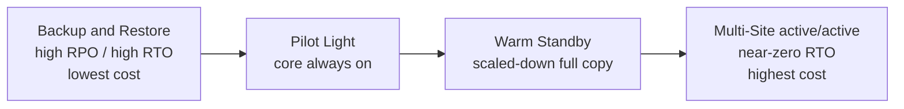

# 28 - Disaster Recovery & Migrations

Related: [[Disaster Recovery & Backup]] · [[Migration Services]] · [[RDS & Aurora]] · [[Data Transfer]] · [[Snow Family]] · [[Route 53]]

## Chapter summary
- **RPO** = how much data loss you accept (time between last backup and disaster); **RTO** = how much downtime you accept. Smaller RPO/RTO = higher cost.
- Four DR strategies, cheapest/slowest to most expensive/fastest: **Backup & Restore, Pilot Light, Warm Standby, Multi-Site (Hot Site, active-active)**.
- **Elastic Disaster Recovery (DRS)**: continuous block-level replication of servers into a low-cost AWS staging area; fail over in minutes, then fail back.
- **DMS** migrates databases (homogeneous or heterogeneous) with CDC; needs a replication EC2 instance (or serverless); use **SCT** only when engines differ; Multi-AZ gives a standby replication instance.
- RDS to Aurora migration options: snapshot restore, Aurora Read Replica then promote, Percona XtraBackup via S3, mysqldump, DMS.
- **AWS Backup** = central, policy-based (Backup Plans), cross-region/cross-account backups with **Vault Lock** (WORM).
- **MGN** = lift-and-shift rehosting (replaces CloudEndure Migration); **Application Discovery Service** plans, **Migration Hub** tracks.
- Large transfers: 200 TB over 100 Mbps internet = ~185 days; Direct Connect 1 Gbps = ~18.5 days (+~1 month setup); Snowball = ~1 week.
- **VMware Cloud on AWS** extends an on-premises VMware environment into AWS.

---

## 01 - Disaster Recovery in AWS
(src: 28/01-Disaster Recovery in AWS)

- **Disaster** = any event with negative impact on business continuity or finances. DR types: on-premises to on-premises (traditional, very expensive), on-premises to cloud (hybrid), cloud region A to region B (full cloud).
- **RPO (Recovery Point Objective)**: how often you back up / how far back you can recover. Backup every hour = up to 1 hour of data lost. Can be hours or one minute depending on requirements.
- **RTO (Recovery Time Objective)**: time between the disaster and recovery = downtime (24 hours may or may not be acceptable; sometimes 1 minute is needed).
- Lower RPO/RTO drives architecture decisions and cost.

| Strategy | RPO / RTO | Cost | Idea |
|---|---|---|---|
| Backup & Restore | high RPO, high RTO | cheapest | Only pay to store backups; rebuild infra on disaster |
| Pilot Light | lower RPO and RTO | low | Critical core (e.g. database) always running; rest created on disaster |
| Warm Standby | lower again | higher | Full system running at minimum size; scale up on disaster |
| Multi-Site / Hot Site | very low RTO (minutes or seconds) | most expensive | Two full production sites, active-active |

- **Backup & Restore**: on-premises data to S3 via Storage Gateway, lifecycle policy to Glacier, or weekly Snowball to Glacier (RPO about 1 week). In AWS: scheduled EBS / Redshift / RDS snapshots (RPO 24 h or 1 h depending on frequency). Restore with AMIs or from snapshots; slow, so high RTO.
- **Pilot Light**: small always-on core. Example: continuous replication from on-premises DB into an always-running RDS; EC2 not running; on disaster Route 53 fails over and EC2 is created. Very popular; only for critical core systems.
- **Warm Standby**: example with reverse proxy + app server + primary DB on premises; in AWS an RDS replica, an ASG at minimum capacity and an ELB ready. On disaster Route 53 fails over to the ELB and the ASG scales to production load.
- **Multi-Site / Hot Site**: Route 53 routes to both on-premises and AWS (active-active), full production scale on both, data replication. All-cloud variant: multi-region with Aurora primary + **Aurora Global Database** replicated to another region.

> [!info] Diagram
> **Explanation:** The four DR strategies ordered by increasing cost and decreasing recovery time. Backup and restore only keeps backups; pilot light keeps core data stores running; warm standby keeps a scaled-down, fully functional copy that can take traffic immediately; multi-site active/active serves traffic from all Regions.
> **Reference:** [Disaster recovery options in the cloud - Disaster Recovery of Workloads on AWS (AWS Whitepaper)](https://docs.aws.amazon.com/whitepapers/latest/disaster-recovery-workloads-on-aws/disaster-recovery-options-in-the-cloud.html)

**Real-life DR tips**
- **Backup**: EBS snapshots, RDS automated snapshots/backups; push to S3 / S3-IA / Glacier with lifecycle policies; Cross-Region Replication; Snowball or Storage Gateway from on premises.
- **High availability**: Route 53 to move DNS between regions; RDS Multi-AZ, ElastiCache Multi-AZ, EFS, S3. If Direct Connect fails, use Site-to-Site VPN as fallback.
- **Replication**: RDS cross-region replication, Aurora Global Database, database replication software on premises to RDS, Storage Gateway.
- **Automation**: CloudFormation / Elastic Beanstalk to recreate environments; CloudWatch alarms to recover/reboot EC2; Lambda for custom automation.
- **Chaos testing**: create disasters to test recovery, e.g. Netflix Simian Army (chaos monkeys) randomly terminating EC2 instances in production.

> [!tip] Exam
> Scenario questions ask which strategy to pick: Backup and Restore (cheap, slow), Pilot Light (core only), Warm Standby (scaled-down full), Multi-Site/Hot Site (fastest, costliest). RPO = data loss, RTO = downtime.

---

## 02 - Elastic Disaster Recovery (DRS)
(src: 28/02-Elastic Disaster Recovery (DRS))

- Formerly **CloudEndure Disaster Recovery** (acquired by AWS, then renamed).
- Quickly recovers **physical, virtual and cloud-based servers** into AWS; protects critical databases (Oracle, MySQL, SQL Server), enterprise apps (SAP), and helps against ransom attacks.
- **Continuous block-level replication** from the data center using an **AWS replication agent** into a low-cost **staging environment** (small EC2 instances + EBS volumes).
- On disaster: **fail over within minutes** from staging to production (bigger EC2 / better EBS). When the data center is back: **failback**.

---

## 03 - Database Migration Service (DMS)
(src: 28/03-Database Migration Service (DMS))

- Quick, secure database migration to AWS; **resilient and self-healing**; **source database stays available** during migration.
- Supports **homogeneous** (Oracle to Oracle, Postgres to Postgres) and **heterogeneous** (SQL Server to Aurora) migrations, plus **continuous replication using CDC (Change Data Capture)**.
- Requires an **EC2 replication instance** that runs the DMS software, pulls from source and writes to target.
- **Sources** (no need to memorize): on-premises/EC2 Oracle, SQL Server, MySQL, MariaDB, PostgreSQL, MongoDB, SAP, DB2; Azure SQL Database; any Amazon RDS incl. Aurora; S3; DocumentDB.
- **Targets**: on-premises/EC2 databases; any RDS; Redshift; DynamoDB; S3; OpenSearch; Kinesis Data Streams; Apache Kafka; DocumentDB; Neptune; Redis; Babelfish.
- **AWS SCT (Schema Conversion Tool)**: needed when source and target **engines differ** (OLTP: SQL Server/Oracle to MySQL/PostgreSQL/Aurora; analytics: Teradata/Oracle to Redshift). **Not needed for same engine** (on-premises PostgreSQL to RDS PostgreSQL; RDS is just a platform, the engine is the same). Oracle to Postgres needs SCT.
- Continuous replication setup: SCT server (best practice: on premises) converts schema into the target RDS; DMS replication instance does **full load + CDC** and writes into private subnets.
- **Multi-AZ deployment**: replication instance in one AZ with **synchronous** replication to a standby in another AZ. Benefits: resilience to AZ failure, data redundancy, eliminates I/O freezes, minimizes latency spikes.

> [!tip] Exam
> Different engines = DMS + SCT. Same engine = DMS only. Continuous replication = CDC. DMS runs on an EC2 replication instance; Multi-AZ gives a standby.

---

## 04 - Database Migration Service (DMS) - Hands On
(src: 28/04-Database Migration Service (DMS) - Hands On)

- Overview only: no database was available, so nothing was actually migrated.
- Console areas: discovery and assessment (data collector, analyze inventory), convert and move to managed (**Schema Conversion**), migrate or replicate data (endpoints, replication instance, tasks); **homogeneous data migration** when no schema conversion is needed.
- **Provisioned vs Serverless** replication: with Serverless DMS adjusts compute automatically and you choose no instance type.
- Task types: **migrate existing data (one-off)**, **migrate and replicate** (full load then CDC), **replicate only**.

### Hands-on steps
1. DMS -> Endpoints -> create a **source endpoint** (identifier, source engine e.g. Aurora MySQL, connection details); optionally **test the endpoint connection** from the replication instance.
2. Create a **target endpoint** (target engine e.g. DynamoDB; service role / endpoint settings; test connection).
3. Provisioned instances -> create a **replication instance** (choose size; use "estimate instance class and storage"; optionally high availability, network type, subnet group, security groups). Skip for serverless.
4. Tasks -> create task: source endpoint, target endpoint, task mode (provisioned instance or serverless), migration type (one-off / migrate + replicate / replicate only), logging and other settings.

---

## 05 - RDS & Aurora Migrations
(src: 28/05-RDS & Aurora Migrations)

Likely one exam question.

| Source | Option |
|---|---|
| RDS MySQL to Aurora MySQL | **1. Snapshot** of RDS MySQL, restore as Aurora MySQL (some downtime: stop operations first) |
| | **2. Aurora Read Replica** on top of RDS MySQL; when **replica lag = 0**, promote to its own cluster (takes longer, network cost) |
| External MySQL to Aurora MySQL | **Percona XtraBackup** backup file -> S3 -> import into new Aurora MySQL cluster (only Percona XtraBackup is supported) |
| | **mysqldump** piped into existing Aurora (slow, does not use S3) |
| Both DBs running | **DMS** continuous replication |
| RDS PostgreSQL to Aurora PostgreSQL | Snapshot restore, or Aurora Read Replica then promote at lag 0 |
| External PostgreSQL to Aurora PostgreSQL | Backup to S3, import with the **aws_s3 Aurora extension** (creates a new database) |
| | **DMS** continuous |

---

## 06 - On-Premises Strategies with AWS
(src: 28/06-On-Premises Strategies with AWS)

High-level service names only; know them so they do not surprise you in a question.

- **Amazon Linux 2 AMI as a VM** (ISO format) for VMware, KVM, VirtualBox, Hyper-V on premises (can use user data).

[verify] The lecture uses Amazon Linux 2 for the downloadable on-premises VM image.
> [!warning] Correction [note]
> AWS states Amazon Linux 2 reached end of support on 30 June 2026 and recommends Amazon Linux 2023. Source: [Amazon Linux 2 FAQs](https://aws.amazon.com/amazon-linux-2/faqs/).

- **VM Import/Export**: migrate existing VMs into EC2; create a DR repository for on-premises VMs; export VMs back from EC2 to on premises.
- **AWS Application Discovery Service**: gathers server utilization and dependency mappings to plan a migration; tracked in **AWS Migration Hub**.

[verify] Application Discovery Service and Migration Hub presented as current options.
> [!warning] Correction [note]
> AWS announced end of support for the Application Discovery Service **Discovery Connector** effective 17 November 2025, recommending the Agentless Collector instead; historic data stays available in Migration Hub. Source: [Deprecation of AWS Application Discovery Service Discovery Connector](https://aws.amazon.com/blogs/migration-and-modernization/deprecation-of-aws-application-discovery-service-discovery-connector/). A search result also claimed Migration Hub and Application Discovery Service closed to new customers on 7 November 2025, but I could not confirm this on an AWS page, so it is unconfirmed.

- **AWS DMS**: replicate on premises to AWS, AWS to AWS, or AWS to on premises (e.g. MySQL to DynamoDB).
- **AWS Application Migration Service (MGN)**: incremental replication of on-premises live servers to AWS.
- The instructor also lists "Server Migration Service" (SMS) among names to remember.

[verify] "Server Migration Service (SMS)" listed as a migration service.
> [!warning] Correction [note]
> AWS SMS has been discontinued; Application Migration Service (MGN) became the recommended primary lift-and-shift service from 31 March 2022. Source: [AWS offerings available to support your cloud migration (AWS Cloud Operations Blog)](https://aws.amazon.com/blogs/mt/aws-offerings-available-to-support-your-cloud-migration/) (from a search summary).

---

## 07 - AWS Backup
(src: 28/07-AWS Backup)

- **Fully managed, central** place to manage and automate backups across AWS services; no custom scripts or manual processes.
- Supported (growing list): EC2, EBS, S3, RDS (all engines) and Aurora, DynamoDB, DocumentDB, Neptune, EFS, FSx (Lustre, Windows File Server), Storage Gateway (Volume Gateway).
- Features: **cross-region** backups (DR), **cross-account** backups, **point-in-time recovery** for supported services (e.g. Aurora), on-demand and scheduled backups, **tag-based backup policies** (e.g. tag = production).
- **Backup Plans** define: frequency (every 12 hours, weekly, monthly, cron expression), backup window, transition to **cold storage** (never or after days/weeks/months/years), retention period.
- Flow: create plan -> assign resources -> data is backed up to an internal S3 bucket specific to AWS Backup.
- **Backup Vault Lock**: enforces **WORM (Write Once Read Many)**; backups in the vault cannot be deleted, even by the **root user**; protects against inadvertent or malicious deletes and updates that shorten or alter retention.

> [!tip] Exam
> Central, automated backup with cross-region/cross-account copy = AWS Backup. Cannot-be-deleted backups, even by root = Vault Lock (WORM).

---

## 08 - AWS Backup - Hands On
(src: 28/08-AWS Backup - Hands On)

- Plan options: start from a **template** (e.g. Daily-35day-Retention, Daily-Monthly-1yr-Retention), build a new plan, or define via JSON.
- Template Daily-Monthly-1yr-Retention has two rules: **daily** (default window 5:00 AM UTC, start within 8 hours, retained 5 weeks) and **monthly** (day 1 of each month, transition to cold storage after 1 month, retained 1 year). Each rule has a backup vault (default or custom) and an optional **copy to another region**.
- Resource assignment: IAM role (default role is created), include **all resource types** (typically combined with a tag, e.g. `environment = production`) or **specific resource types/resources**.
- Console areas: Backup vaults, **backup jobs, restore jobs, copy jobs**, Settings (backup policies, cross-account monitoring/backups).

### Hands-on steps
1. AWS Backup -> Create backup plan -> start with template Daily-Monthly-1yr-Retention, name `TestPlan`.
2. Review backup rules (daily and monthly): vault, frequency, window, cold storage, retention, copy destination; save and **Create plan**.
3. Assign resources: name `TestAssignments`, default IAM role, resource selection by tag `environment = production`.
4. Demo: an EBS volume (1 GB) tagged `environment = production` is picked up automatically by the plan.
5. Check jobs (backup / restore / copy) and settings.
6. Clean up: delete the EBS volume, delete the assignment (type its name), delete the backup plan (type its name).

---

## 09 - Application Migration Service (MGN)
(src: 28/09-Application Migration Service (MGN))

- Start fresh in the cloud = no migration needed; otherwise plan with **Application Discovery Service**: scans servers for utilization data and **dependency mapping**.
  - **Agentless Discovery (Connector)**: VM configuration and performance history (CPU, memory, disk).
  - **Discovery Agent**: more detail inside VMs: system configuration, performance, running processes, **network connections** between systems.
  - Results are viewed in **AWS Migration Hub**.
- **Application Migration Service (MGN)**: simplest way to move from on premises to AWS; formerly **CloudEndure Migration**. **Rehosting = lift-and-shift**, converts physical, virtual or other-cloud servers to run natively on AWS.
- How: replication agent on the source servers continuously replicates disks to low-cost EC2 + EBS in a staging area; at **cut-over** you launch bigger EC2 / better EBS in production.
- Wide platform/OS/database support, **minimal downtime**, lower cost (no need for complex engineers).

[verify] Discovery Connector (agentless) presented as current.
> [!warning] Correction [note]
> See lecture 06: the Discovery Connector reached end of support on 17 November 2025 (Agentless Collector replaces it). Source: [Deprecation of AWS Application Discovery Service Discovery Connector](https://aws.amazon.com/blogs/migration-and-modernization/deprecation-of-aws-application-discovery-service-discovery-connector/).

> [!tip] Exam
> Lift-and-shift / rehost servers = MGN. Plan and map dependencies = Application Discovery Service. Track = Migration Hub.

---

## 10 - Transferring Large Datasets into AWS
(src: 28/10-Transferring Large Datasets into AWS)

Example: **200 TB** with a **100 Mbps** internet connection.

| Method | Time | Notes |
|---|---|---|
| Internet / Site-to-Site VPN | ~16 million seconds = **~185 days** | immediate to set up |
| Direct Connect 1 Gbps | **~18.5 days** (10x faster) | one-time setup takes **~1 month** |
| Snowball | **~1 week** end to end (order, deliver, load, return, ingest) | can combine with DMS for database changes afterwards |

- Computation: TB -> GB -> MB -> x8 for megabits -> divide by line speed.
- **Ongoing replication**: Site-to-Site VPN, Direct Connect, DMS, DataSync (less data on an ongoing basis). **Snowball = one-off large transfers.**
- Exam asks for the easiest/fastest/most reliable way for small vs large data.

> [!tip] Exam
> One-off, hundreds of TB, slow link: Snowball. Ongoing: VPN, Direct Connect, DMS, DataSync.

[verify] The lecture's transfer options for large data include Snowball only (Snowmobile is mentioned in chapter 29 for petabytes).
> [!warning] Correction [note]
> Search results report AWS retired Snowmobile in April 2024 (suggesting Snowball Edge or DataSync). Only non-AWS news pages were found, so this is unconfirmed against an AWS source.

---

## 11 - VMware Cloud on AWS
(src: 28/11-VMware Cloud on AWS)

- For customers managing an on-premises **vSphere-based** data center with VMware Cloud who want to extend into AWS while still managing everything with VMware software.
- Extends VMware infrastructure (vSphere, vSAN, NSX) onto AWS.
- Use cases: extend compute/storage from the data center to the cloud, **migrate VMware workloads** to AWS, run production across multiple data centers (private, public, hybrid), **disaster recovery** using familiar tools.
- You can access AWS services from there: EC2, FSx, S3, RDS, Direct Connect, Redshift, etc.

---

## Not covered in this chapter's lectures
- All 11 lectures have transcripts. Lecture 04 and 08 are console tours (no step-by-step screen details beyond what is spoken).
