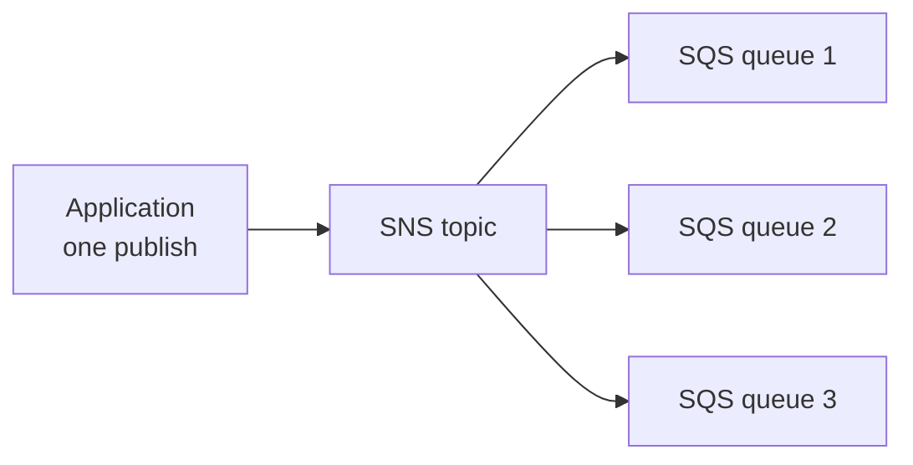

# 29 - More Solution Architectures

Related: [[Classic Solution Architectures]] · [[SQS]] · [[SNS]] · [[EventBridge]] · [[Lambda]] · [[CloudFront & Global Accelerator]] · [[WAF, Shield & Firewall Manager]] · [[VPC]] · [[ASG]] · [[EC2]] · [[EBS]] · [[FSx]] · [[Data Transfer]] · [[Outposts & Batch]]

## Chapter summary
- **SQS + Lambda**: failing messages retry endlessly; set a **DLQ** on the SQS side (e.g. after 5 tries). **SQS FIFO + Lambda** can block the whole queue on one bad message, so use a DLQ.
- **SNS + Lambda** is asynchronous; Lambda retries internally and the **DLQ is configured on the Lambda side**.
- **Fan-out** = SNS topic with several SQS queue subscribers: one publish, every queue gets it reliably.
- S3 event notifications go to SNS, SQS or Lambda; **EventBridge** adds JSON filtering, many destinations, archive/replay; EventBridge + CloudTrail can react to any API call.
- Caching can happen at CloudFront (edge), API Gateway (regional), app cache (Redis, Memcached, DAX); more caching upstream = less compute and latency but possibly stale data.
- Blocking an IP: NACL (deny rules) -> security group (allow only) -> optional on-instance firewall; with ALB use WAF; with CloudFront use WAF + Geo Restriction.
- **HPC**: Direct Connect / Snowball / DataSync for data; cluster placement group, EFA (Linux only, OS-bypass) vs ENA vs Intel 82599 VF; FSx for Lustre; Batch and ParallelCluster.
- Highly available single EC2: Elastic IP + CloudWatch + Lambda failover, or ASG min=max=desired=1 across 2 AZs with user data + instance role, plus lifecycle hooks + EBS snapshots for stateful instances.

---

## 01 - Event Processing in AWS
(src: 29/01-Event Processing in AWS)

**SQS / SNS with Lambda**
- **SQS + Lambda**: Lambda polls the queue; on failure the message returns to the queue and is retried, possibly in an infinite loop. Fix: configure the **SQS DLQ** to receive the message after e.g. **5 tries**.
- **SQS FIFO + Lambda**: messages processed in order, so one failing message blocks the entire queue processing. Use a DLQ to unblock.
- **SNS + Lambda**: SNS invokes Lambda **asynchronously**; Lambda retries internally **3 times**, then discards the message or sends it to a **DLQ configured on the Lambda service** (e.g. an SQS queue).
- Difference: for SQS the DLQ is set on the SQS side; for SNS -> Lambda the DLQ is set on the Lambda side.

[verify] "Lambda retries internally 3 times" for asynchronous invocations.
> [!warning] Correction [note]
> AWS documents that by default Lambda retries a failed asynchronous invocation up to **two** more times (three attempts in total, with one-minute and two-minute waits), and the retry count is configurable from 0 to 2. Source: [AWS Lambda now supports maximum event age and maximum retry attempts for asynchronous invocations](https://aws.amazon.com/about-aws/whats-new/2019/11/aws-lambda-supports-max-retry-attempts-event-age-asynchronous-invocations) (from a search summary).

**Fan-out pattern** (deliver one message to multiple SQS queues)
- Naive: application with the SDK sends to queue 1, 2, 3 in turn. Not reliable: if it crashes after queue 2, queue 3 never gets the message and queue contents diverge.
- Better: **SNS topic with SQS queues as subscribers**. The app does one publish to the topic; SNS fans it out to all queues (higher guarantee). Very common AWS pattern.

> [!info] Diagram
> **Explanation:** The application publishes once to an SNS topic. Each SQS queue is subscribed to the topic, so SNS delivers a copy to every queue and the messages persist in each queue for consumers to process later.
> **Reference:** [Fanout Amazon SNS notifications to Amazon SQS queues for asynchronous processing (Amazon SNS Developer Guide)](https://docs.aws.amazon.com/sns/latest/dg/sns-sqs-as-subscriber.html)

**S3 events**
- S3 event notifications: object created, removed, restored, replication events; filter by name (e.g. thumbnail generation). Targets: **SNS, SQS, Lambda**; as many events as you want. Usually delivered **within seconds, sometimes a minute or longer**.
- **EventBridge** alternative: all S3 events go to EventBridge; rules send to **over 18 AWS services**; **JSON-rule filtering** (metadata, object size, name), **multiple destinations** (Step Functions, Kinesis Streams, Firehose), **archive, replay, reliable delivery**.
- **EventBridge + CloudTrail**: any API call can trigger an event, e.g. DeleteTable on DynamoDB is logged by CloudTrail, triggers EventBridge, which alerts via SNS.
- **External events**: clients -> API Gateway -> Kinesis Data Streams -> Firehose -> S3.

> [!tip] Exam
> SQS DLQ is on the queue; Lambda async DLQ is on the Lambda. Fan-out = SNS + SQS. Need advanced filtering, archive/replay or many targets from S3 = EventBridge.

---

## 02 - Caching Strategies in AWS
(src: 29/02-Caching Strategies in AWS)

Typical architecture: **CloudFront** -> **API Gateway** -> app logic (EC2 or Lambda) -> database with an internal cache (**Redis, Memcached, DAX**); static content: CloudFront -> S3.

| Layer | Where | Notes |
|---|---|---|
| CloudFront | edge, closest to users | fastest response; content may be outdated, use a **TTL**; balance edge vs app caching |
| API Gateway | regional | has its own cache; works without CloudFront; network latency still between client and region |
| App cache (Redis, Memcached, DAX for DynamoDB) | in front of DB | stores frequent/complex query results; reduces database pressure, increases read capacity |
| Database / S3 | - | no caching capability of their own |

- Moving along the path to the backend, more computation, cost and latency are incurred.
- No right or wrong: decide **where, how, how long** to cache, whether some latency is acceptable, and **which content**.

---

## 03 - Blocking an IP Address in AWS
(src: 29/03-Blocking an IP Address in AWS)

- **EC2 in a public subnet**: first line = **NACL** (explicit allow/deny rules, cheap and simple); second = **security group** (allow rules only; you can only allow known client IPs); optional **firewall software on the instance** (full control, but uses instance CPU).
- **ALB in public subnet, EC2 in private subnet**: ALB terminates the connection (client -> ALB, ALB -> EC2). EC2's security group allows only the ALB; manage security with the ALB's security group and its features; the NACL still allows/denies at the public subnet level. Same for **NLB** with security groups.
- **ALB + WAF**: IP address filtering and much more, at an extra cost.
- **CloudFront in front of a public ALB**: traffic comes from CloudFront edge locations' public IPs, so the **NACL cannot filter the real client**; the ALB security group must allow only **CloudFront public IPs**. Block a country with **CloudFront Geo Restriction**; use **WAF at CloudFront** for IP filtering.
- Tip: draw the network path to decide where each rule belongs.

> [!tip] Exam
> Deny a specific IP = NACL (security groups cannot deny). Behind CloudFront, filter at CloudFront (WAF / Geo Restriction), not the NACL.

---

## 04 - High Performance Computing (HPC) on AWS
(src: 29/04-High Performance Computing (HPC) on AWS)

- Cloud is ideal for HPC: create huge numbers of resources quickly, speed up results by adding more, **pay only for what you use**, destroy when done.
- Uses: genomics, computational chemistry, financial risk modeling, weather prediction, ML/deep learning, autonomous driving.

**Data transfer**
- **Direct Connect**: GB/s over a private secure network. **Snowball / Snowmobile**: PB, one-off. **DataSync**: agents move large data between on-premises (NFS/SMB) and S3, EFS, FSx for Windows.

[verify] Snowmobile named as a PB transfer option.
> [!warning] Correction [note]
> Search results report AWS retired Snowmobile in April 2024; only non-AWS news pages were found, so this is unconfirmed against an AWS source.

**Compute and networking**
- EC2 CPU- or GPU-optimized; **Spot Instances / Spot Fleets** for savings; **Auto Scaling**.
- **Cluster placement group**: same rack, same AZ, low latency, 10 Gbps network (in the lecture example).
- **EC2 Enhanced Networking (SR-IOV)**: higher bandwidth, higher PPS, lower latency.
  - **ENA (Elastic Network Adapter)**: up to **100 Gbps**; most recent and popular.
  - **Intel 82599 VF**: up to **10 Gbps**; legacy.
- **EFA (Elastic Fabric Adapter)**: improved ENA for HPC; **Linux only**; for **inter-node / tightly coupled** workloads; uses **MPI** and **bypasses the Linux OS** for lower latency and more reliable transport.

| | Purpose | Limit |
|---|---|---|
| ENA | enhanced networking | up to 100 Gbps |
| Intel 82599 VF | legacy enhanced networking | up to 10 Gbps |
| EFA | HPC, tightly coupled, OS bypass (MPI) | Linux only |

**Storage**
- Instance-attached: **EBS up to 256,000 IOPS with io2 Block Express**; **instance store** up to millions of IOPS (lowest latency, lost if instance lost).
- Network: **S3** (large objects, not a file system); **EFS** (IOPS scale with size, or provisioned IOPS mode); **FSx for Lustre** (HPC-optimized, millions of IOPS, backed by S3).

**Automation and orchestration**
- **AWS Batch**: multi-node parallel jobs across EC2 instances; schedules jobs and launches EC2 for you.
- **AWS ParallelCluster**: open-source cluster management tool; configure with text files; automates VPC, subnet, cluster and instance types; a parameter enables **EFA** on the cluster.

> [!tip] Exam
> Know ENA vs EFA vs ENI. HPC networking = cluster placement group + EFA. HPC file system = FSx for Lustre. ParallelCluster is used with EFA.

---

## 05 - EC2 Instance High Availability
(src: 29/05-EC2 Instance High Availability)

An EC2 instance by default lives in one AZ. Ways to make it highly available (users always reach it via an **Elastic IP**, which can be attached to only one instance at a time):

**1. Standby instance + monitoring**
- **CloudWatch Event/Alarm** (e.g. instance terminated, CPU 100%) triggers a **Lambda** function that starts the standby instance (if not running) and calls the API to **attach the Elastic IP** to it.

**2. Auto Scaling Group, min = 1, max = 1, desired = 1, over 2 AZs**
- Only one instance ever runs. If it is terminated, the ASG creates a replacement in another AZ. **EC2 user data** acquires and attaches the Elastic IP (found by **tags**). No CloudWatch alarm needed.
- The instance needs an **instance role** allowing the API calls to attach the Elastic IP.

**3. Stateful instance with EBS (e.g. database)**
- EBS volumes are locked to one AZ. Use an **ASG lifecycle hook on termination** to script an **EBS snapshot** (tagged); a **lifecycle hook on launch** creates an EBS volume from the snapshot in the correct AZ and attaches it to the replacement; user data attaches the Elastic IP; instance role allows the API calls.

> [!tip] Exam
> ASG with min=max=desired=1 across 2 AZs = self-healing single instance; EBS is AZ-bound, so move data via snapshots + lifecycle hooks.

---

## Not covered in this chapter's lectures
- All 5 lectures have transcripts; none are hands-on.
