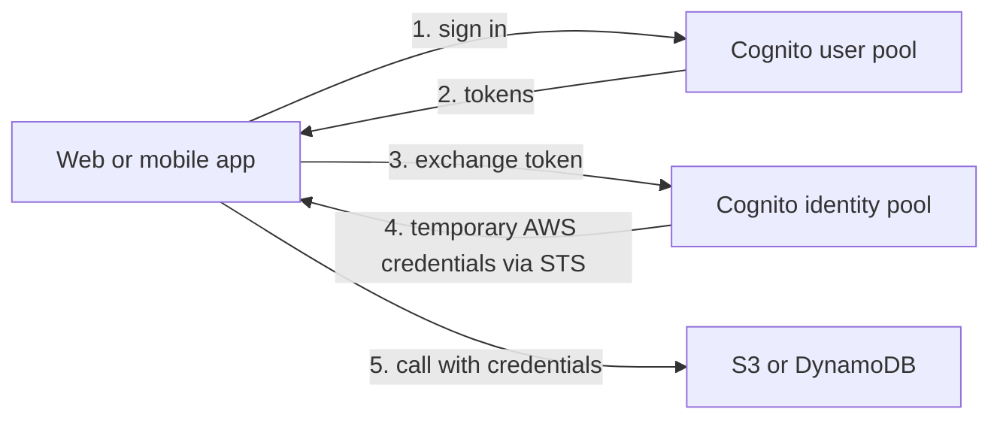

# API Gateway, Step Functions & Cognito

Concept-only note merged from chapter 19 (lectures 15-18). Lab steps: [[19 - Serverless Overviews]] (Version B). Backend compute: [[Lambda]]; data: [[DynamoDB]]; end-to-end designs: [[Serverless Solution Architectures]].

## 1. API Gateway: what and why
(src: 19/15-API Gateway Overview)
- **Serverless** service to create public **REST APIs** for clients. Clients could call Lambda directly (needs IAM permissions) or via an **ALB** ([[ELB]]), but API Gateway adds far more features.
- Features: **WebSocket** support (real-time streaming), **API versioning** (v1, v2, v3 without breaking clients), **multiple environments/stages** (dev, test, prod), many **authentication/authorization** options, **API keys**, **request throttling**, **Swagger / OpenAPI 3.0** import and export, **request/response transformation and validation**, **SDK and API specification generation**, **response caching**.

### Integrations
| Backend | Why |
|---|---|
| **Lambda** | most common; full serverless REST API |
| **HTTP** (on-premises API, or an ALB) | add rate limiting, caching, authentication, API keys in front |
| **AWS service** (any AWS API) | e.g. start a **Step Functions** workflow, post to **SQS**; add auth, public exposure, rate control |

Example: clients send HTTP to API Gateway, which writes to **Kinesis Data Streams** -> Firehose -> S3 (JSON) with no servers and no AWS credentials given to clients ([[Kinesis & Firehose]]).

### Endpoint types
| Type | Behavior |
|---|---|
| **Edge-optimized** (default) | for global clients; requests routed via **CloudFront edge locations**; API still lives in one Region |
| **Regional** | clients in the same Region; no CloudFront (you may add your own CloudFront distribution for more control) |
| **Private** | accessible only **inside your VPC** via **interface VPC endpoints (ENIs)**; access defined by a **resource policy** |

### Security
- **IAM roles** (internal apps, e.g. on EC2); **Cognito** (external users, mobile/web apps); **custom authorizer** (your own logic, a Lambda function).
- **HTTPS custom domain** via **ACM** ([[KMS, CloudHSM & ACM]]): certificate must be in **us-east-1** for an **edge-optimized** endpoint; for a **regional** endpoint it is in the **same Region** as the API stage. Then a **CNAME or A-alias record in Route 53** ([[Route 53]]).

### Console concepts worth keeping
(src: 19/16-API Gateway Basics Hands-On, concepts only)
- API types in the console: **HTTP API, WebSocket API, REST API (public or private)**.
- Integration types: **Lambda function, HTTP, Mock, AWS service, VPC link**.
- **Lambda proxy integration**: API Gateway passes the whole request (resource, path, method, headers, query strings) to Lambda, and Lambda must return status code, headers and body, which API Gateway interprets.
- API Gateway has a **default integration timeout of 29 seconds**, regardless of the Lambda timeout; it can be set lower. [verify]
- Changes take effect only after **deploying the API to a stage** (e.g. `dev`); the stage gives an invoke URL. Resources (paths such as `/houses`) and methods (GET, ...) build the API. Linking a Lambda function automatically adds a **resource-based policy** on the function that lets API Gateway invoke it.
- A call with no matching route/auth returns `Missing Authentication Token`.

[verify] "Default timeout is 29 seconds" (implied as a fixed ceiling).
> [!warning] Correction [note]
> AWS announced (June 2024) that for **Regional and private REST APIs** the integration timeout can be raised **above 29 seconds** through a Service Quotas request, which may require lowering the account-level throttle quota; **edge-optimized APIs remain capped at 29 s**. Source: [Amazon API Gateway integration timeout limit increase beyond 29 seconds](https://aws.amazon.com/about-aws/whats-new/2024/06/amazon-api-gateway-integration-timeout-limit-29-seconds/).

> [!tip] Exam
> API Gateway + Lambda = serverless REST API. Need auth, throttling, API keys, caching or versioning in front of HTTP/AWS services = API Gateway. Edge-optimized cert in us-east-1; regional cert in the API's Region.

## 2. Step Functions
(src: 19/17-Step Functions)
- **Serverless visual workflow** to **orchestrate** (usually) Lambda functions: design a graph and define what happens next on success or failure.
- Features: **sequencing, parallel execution, conditions, timeouts, error handling**.
- Integrates beyond Lambda: **EC2, ECS tasks, on-premises servers, API Gateway, SQS** and many more AWS services.
- Supports **human approval** steps (workflow pauses; "yes" continues, "no" fails).
- Use cases: **order fulfillment, data processing, web applications**, any complex workflow that is easier to model as a graph.

> [!tip] Exam
> Orchestrate multi-step serverless workflows with retries and approvals = **Step Functions**.

## 3. Amazon Cognito
(src: 19/18-Amazon Cognito Overview)
- Gives **identities to users outside your AWS account** (web and mobile app users). Keywords: hundreds of users, mobile users, SAML. (IAM users are for people inside your account.)

| | Cognito User Pools (CUP) | Cognito Identity Pools (Federated Identities) |
|---|---|---|
| Purpose | **sign-in / user directory** for app users (authentication) | **temporary AWS credentials** for direct AWS access (authorization) |
| Features | serverless user database; username/email + password; password reset; email and phone verification; **MFA**; **social login** (Facebook, Google) | users from User Pools, third-party logins (social, SAML, OpenID Connect); IAM policies defined in the identity pool, customizable by **user ID**; **default IAM role** for guest or role-less authenticated users |
| Integrations | **API Gateway** and **Application Load Balancer** | S3, DynamoDB directly, or through API Gateway |

### User pool with API Gateway or ALB
- API Gateway: user logs in to the User Pool, gets a **token**, sends it to API Gateway, which **verifies it** and passes the user identity to the Lambda backend.
- ALB: same idea; the ALB authenticates against the User Pool and forwards the request to the backend with **extra headers carrying the user identity**.
- Authentication responsibility moves from your backend to the API Gateway / ALB.

### Identity pool flow and DynamoDB row-level security
- App logs in (User Pool, social, SAML, OIDC) -> gets a token -> **exchanges it at the Identity Pool** for **temporary AWS credentials**. The pool validates the token and builds an **IAM policy specific to that user**; the app then accesses S3 or DynamoDB **without API Gateway or ALB**.
- **Row-level security in DynamoDB**: policy condition that the **leading key equals the Cognito identity user ID**, so the user can only read/write their own items.

> [!info] Diagram
> **Explanation:** The user signs in to a user pool and receives tokens. The app presents a token to the identity pool, which returns temporary limited-privilege AWS credentials (issued through AWS STS). The app uses them to call AWS services directly.
> **Reference:** [What is Amazon Cognito? (Amazon Cognito Developer Guide)](https://docs.aws.amazon.com/cognito/latest/developerguide/what-is-amazon-cognito.html)

> [!tip] Exam
> **User Pools = who are you (authenticate, integrates with API Gateway / ALB). Identity Pools = what AWS resources can you reach (temporary credentials, fine-grained IAM).** Never ship AWS access keys in a mobile app; use Cognito. See also [[IAM]] and [[Organizations & Identity Federation]].

## Not included here
- 19/16 hands-on console narration (only the concepts above are kept).
- Lambda: [[Lambda]]; DynamoDB (19/12-14): [[DynamoDB]].
