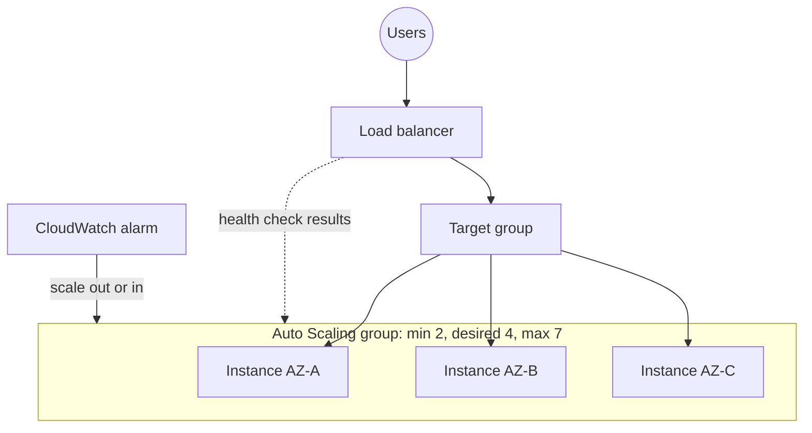

# Auto Scaling Groups (ASG)

Concept-only note. Lab steps are in [[08 - High Availability and Scalability - ELB & ASG]] (Version B). Load balancing is in [[ELB]].

## 1. Purpose and capacity settings
(src: 08/14-Auto Scaling Groups (ASG) Overview, 08/15-Auto Scaling Groups Hands On)
- Load changes over time; instances can be created and removed quickly through the EC2 API, so an ASG automates it.
- Goals: **scale out** (add instances) when load rises, **scale in** (remove instances) when it falls; **replace unhealthy instances** (terminate, then launch a new one); keep **min / max** bounds.
- **ASG itself is free**; you pay only for the underlying resources (EC2 instances, etc.).

| Setting | Meaning |
|---|---|
| **Minimum capacity** | fewest instances kept running (example: 2) |
| **Desired capacity** | current target number (example: 4) |
| **Maximum capacity** | upper bound for scaling out (example: 7) |

- Changing desired capacity above the actual count makes the ASG launch instances; lowering it makes the ASG pick instances to terminate. The max must be raised if desired exceeds it; for scaling policies to add capacity, max must be greater than min.

## 2. Launch template
(src: 08/14, 08/15)
- Defines how instances are launched: **AMI, instance type, EC2 user data, EBS volumes, security groups, SSH key pair, IAM role**, network/subnet and load balancer information. Options mirror a normal EC2 launch (see [[EC2]]). Subnets are chosen on the ASG, not in the template.
- The ASG adds its own min / max / initial capacity and **scaling policies**.
- The older **launch configuration** is **deprecated**; launch templates are the way to go.
- The ASG can override the instance type requirements; **AZ distribution** "balanced best effort" spreads instances across the selected AZs.

[verify] "Launch configurations are deprecated."
> [!warning] Correction [note]
> Confirmed. AWS states that accounts created on or after **1 October 2024** cannot create new launch configurations by any method, and recommends migrating to launch templates. Source: [Auto Scaling launch configurations](https://docs.aws.amazon.com/autoscaling/ec2/userguide/launch-configurations.html).

## 3. ASG with a load balancer and health checks
(src: 08/14, 08/15)
- Attach the ASG to a load balancer **target group**: every instance launched is **registered automatically**, and when scaling out the new instances immediately receive traffic; on scale in they are **deregistered**.
- **Health checks**: EC2 status checks and optionally the **ELB health check**. If the load balancer deems an instance unhealthy, the ASG **terminates and replaces** it.
- A new instance shows unhealthy while it is bootstrapping; if it never turns healthy it is terminated and replaced in a loop. Typical causes are a misconfigured **security group** or **user data script**.

> [!info] Diagram
> **Explanation:** The load balancer spreads traffic to the instances of the ASG (across AZs through the target group). Its health checks are passed to the ASG, which replaces unhealthy instances; CloudWatch alarms trigger scale-out and scale-in. Capacity numbers are the lecture's example.
> **Reference:** [Auto Scaling benefits for application architecture (Amazon EC2 Auto Scaling User Guide)](https://docs.aws.amazon.com/autoscaling/ec2/userguide/auto-scaling-benefits.html)

> [!tip] Exam
> ASG + ELB: ELB health checks can make the ASG replace instances. ASG is free; launch template defines the instances. Multi-AZ ASG = high availability.

## 4. Scaling policies
(src: 08/16-Auto Scaling Groups - Scaling Policies, 08/17-Auto Scaling Groups - Scaling Policies Hands On)
Scaling is driven by **CloudWatch alarms** on a metric (e.g. average CPU of the ASG); see [[CloudWatch]].

| Policy | How it works | Notes |
|---|---|---|
| **Target tracking** (dynamic) | pick a metric and a target value (e.g. average CPU **40%**); the ASG scales out/in to keep it near the target | simplest; **creates the CloudWatch alarms for you** (an AlarmHigh to scale out and an AlarmLow to scale in) |
| **Simple scaling** (dynamic) | a **CloudWatch alarm you create beforehand** triggers one adjustment, e.g. add 2 units or 10% of the group | one fixed action per alarm |
| **Step scaling** (dynamic) | alarm value decides the step size: very high = add many (e.g. 10), high but lower = add fewer (e.g. 1) | multiple thresholds |
| **Scheduled** | change min / desired / max at a given time, once or recurring, with start/end | for **known patterns**, e.g. promotion on Saturday, 5 pm Fridays raise min to 10 |
| **Predictive** | **machine-learning** forecast from historical load (about the previous week), then schedules capacity ahead | for **cyclical, repeating** patterns; choose a metric (CPU, network in/out, ALB request count, custom) and a target (e.g. 50% CPU) |

- Example seen: target tracking at 40% CPU; stressing the instance pushed CPU high, the alarm fired and desired capacity went 1 -> 2 -> 3; once CPU fell the low alarm scaled back in to 1. As shown, the scale-out alarm used 3 data points within 3 minutes while the scale-in alarm needed many more (about 15), so scale-in is slower.

### Good metrics to scale on
- **Average CPU utilization** across the group.
- **RequestCountPerTarget** (ALB): keep requests per instance near the optimal value you measured (e.g. 1,000).
- **Average network in / out** for network-bound apps (uploads, downloads).
- **Any custom metric** pushed to CloudWatch.

## 5. Scaling cooldown
(src: 08/16-Auto Scaling Groups - Scaling Policies)
- After a scaling activity the ASG enters a **cooldown, default 300 seconds (5 min)** during which it **does not launch or terminate** more instances, so metrics can stabilize.
- Decision: scaling action requested -> cooldown active? yes: ignore; no: launch/terminate.
- Tips: use a **ready-to-use (pre-baked) AMI** so instances start serving faster, which lets you shorten the cooldown; enable **detailed monitoring** (1-minute metrics) for the ASG.

[verify] "During the cooldown the ASG will not launch or terminate additional instances" (applied to all policy types).
> [!warning] Correction [note]
> AWS says the **cooldown applies to simple scaling policies**; **target tracking and step scaling** can scale out immediately and use an **instance warmup** instead, and AWS recommends target tracking over simple scaling. The 300-second default is confirmed. Source: [Scaling cooldowns for Amazon EC2 Auto Scaling](https://docs.aws.amazon.com/autoscaling/ec2/userguide/ec2-auto-scaling-scaling-cooldowns.html).

> [!tip] Exam
> Know the five policy types (target tracking, simple/step, scheduled, predictive), the default 300 s cooldown, and CPU / RequestCountPerTarget / network / custom metrics.

## Not included here
- Hands-on narration of 08/15 (create launch template and ASG, manual resize) and 08/17 (create policies, CPU stress test with the `stress` tool); only their concepts are merged above.
- Load balancer content (08/01-13) -> [[ELB]].
- No lecture in this range lacks a transcript.
