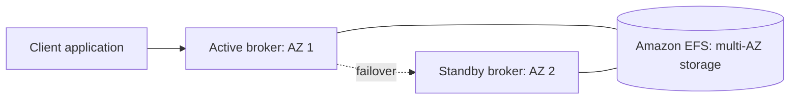

# Amazon MQ & SQS vs SNS vs Kinesis

Concept-only note. See [[17 - Decoupling Applications - SQS, SNS, Kinesis, Amazon MQ]] (Version B). Details per service: [[SQS]], [[SNS]], [[Kinesis & Firehose]].

## 1. Amazon MQ
(src: 17/16-Amazon MQ)
- SQS and SNS are **cloud-native, proprietary AWS APIs**. On-premises apps typically use **open protocols: MQTT, AMQP, STOMP, Openwire, WSS**. To migrate without re-engineering the app, use **Amazon MQ**.
- **Managed message broker** for **RabbitMQ** and **ActiveMQ**.
- Offers **both queue (like SQS) and topic (like SNS) features** in one broker.
- Trade-offs: **does not scale as much as SQS/SNS** (which scale almost without limit); **runs on servers**, so server failures are possible -> run **Multi-AZ with failover** for high availability.
- **HA design**: brokers in two AZs, **one active, one standby**; **Amazon EFS** is the shared backend storage so the standby (also mounted on EFS) has the same data after failover. See [[EFS]].

> [!info] Diagram
> **Explanation:** One broker is active and the other waits in a second AZ. Both attach to EFS, which stores data redundantly across AZs, so after a failover the standby serves the same data.
> **Reference:** [Deployment options for Amazon MQ for ActiveMQ brokers (Amazon MQ Developer Guide)](https://docs.aws.amazon.com/amazon-mq/latest/developer-guide/amazon-mq-broker-architecture.html)

[verify] "EFS is the backend storage for failover" is stated generically for Amazon MQ.
> [!warning] Correction [note]
> AWS documents EFS for **ActiveMQ** active/standby brokers (EBS or EFS is possible for single-instance brokers). The page fetched covers ActiveMQ only; RabbitMQ high availability (cluster deployment) was not verified here. Source: [Deployment options for Amazon MQ for ActiveMQ brokers](https://docs.aws.amazon.com/amazon-mq/latest/developer-guide/amazon-mq-broker-architecture.html).

> [!tip] Exam
> Migrating an on-premises app that uses MQTT/AMQP/STOMP/Openwire/WSS without code changes -> Amazon MQ. Building new cloud-native -> SQS/SNS.

## 2. SQS vs SNS vs Kinesis
(src: 17/15-SQS vs SNS vs Kinesis)

| | SQS | SNS | Kinesis Data Streams |
|---|---|---|---|
| Model | queue; **consumers pull** | **pub/sub; push** to many subscribers (each gets a copy) | streaming; consumers **pull** (shared) or **push** (enhanced fan-out) |
| Consumers | many workers share and **delete** messages | up to **12,500,000 subscribers per topic** [verify] | shared: **2 MB/s per shard**; enhanced fan-out: **2 MB/s per shard per consumer** |
| Capacity | no provisioning, scales to hundreds of thousands of messages quickly | no provisioning; hundreds of thousands of topics | **provision shards** in advance (scale yourself) or **on-demand mode** |
| Persistence | until deleted (retention) | **not persistent**: undelivered data can be lost | **replay possible**; data expires after **1 to 365 days** |
| Ordering | only with **FIFO queues** | FIFO topics (with SQS FIFO) | **per shard** |
| Extras | per-message **delay** (e.g. 30 s) | fan-out with SQS; SNS FIFO + SQS FIFO | real-time big data, analytics, ETL |

[verify] The 12,500,000 subscribers per topic figure (earlier SNS lecture says 12,000,000+); unconfirmed, see [[SNS]].

> [!tip] Exam
> Queue and decouple, delete after processing -> SQS. Notify many receivers -> SNS (fan-out with SQS). Real-time big data with replay -> Kinesis. Open-protocol migration -> Amazon MQ.

## Not included here
- Pattern details: SQS+ASG, FIFO, visibility timeout -> [[SQS]]; fan-out and filtering -> [[SNS]]; shards and Firehose -> [[Kinesis & Firehose]].
- All 17/15-16 lectures have transcripts.
