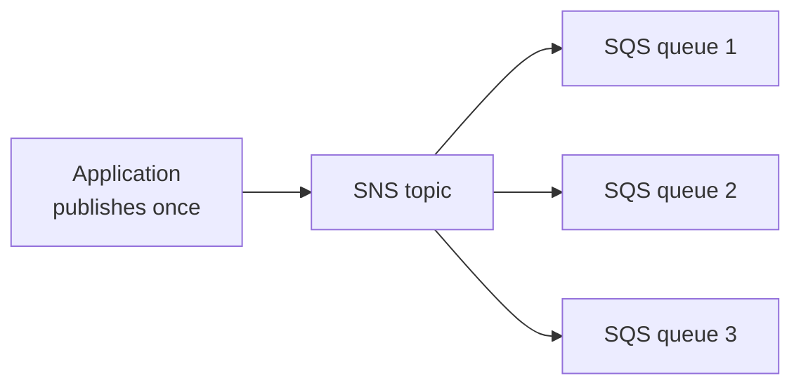

# Classic Solution Architectures

Concept-only note that ties the individual services together. No labs exist for these lectures; the case studies are in [[11 - Classic Solutions Architecture Discussions]] and [[29 - More Solution Architectures]] (Version B). Serverless equivalents: [[Serverless Solution Architectures]].

## 1. Approach
(src: 11/01-Solutions Architecture Discussions Overview)
- Case studies of increasing complexity (WhatIsTheTime.com, MyClothes.com, MyWordPress.com) show how EC2, ELB, ASG, EBS, EFS, RDS, ElastiCache and Route 53 fit together. The instructor stresses being fully comfortable with this chapter for the exam.

## 2. Stateless web app: WhatIsTheTime.com (evolution)
(src: 11/02-WhatsTheTime.com)
No database needed; each server knows the time. Start small, accept downtime, then grow.

| Step | Design | Limitation / lesson |
|---|---|---|
| 1 | One public **t2.micro** EC2 + **Elastic IP** | works as PoC |
| 2 | **Vertical scaling**: stop, change type (m5.large), start | **downtime**; EIP keeps the same address |
| 3 | **Horizontal scaling**: several instances each with an EIP | clients must know every IP; hard to manage |
| 4 | Drop EIPs (**max 5 EIPs per Region per account by default**); Route 53 **A record, TTL 1 hour** returning instance IPs | removing an instance leaves clients with stale IPs for the TTL |
| 5 | **ALB** (public) + private EC2 instances; SG on EC2 references the ELB's SG; **Route 53 Alias record** (ELB IPs change, so no A record); **health checks** | manual add/remove of instances is hard |
| 6 | **ASG** behind the ELB, scales with demand | all instances in one AZ: an AZ failure takes the app down |
| 7 | **Multi-AZ** ELB + ASG (e.g. 2+2+1 across AZ1-3) | survives AZ loss |
| 8 | **Reserve** capacity for the ASG minimum (Reserved/Savings); On-Demand for temporary; Spot optional (can be terminated) | cost optimization |

> [!tip] Exam
> Alias record to an ELB (not A record). ELB health checks stop traffic to bad instances. SG referencing: EC2 only accepts traffic from the ELB's SG. Multi-AZ for HA; reserve the baseline.

## 3. Stateful web app: MyClothes.com (shopping cart)
(src: 11/03-MyClothes.com)
Goal: keep the web tier **stateless/horizontally scalable** yet never lose the cart; store user data (address) durably.

| Approach to cart state | How it works | Pros / cons |
|---|---|---|
| **ELB stickiness (session affinity)** | same client always goes to the same instance | simple; cart **lost if the instance is terminated** |
| **User cookies** | cart content sent by the client in cookies each request | instances stay stateless; **heavier HTTP requests**, **security risk** (cookies can be altered, so **validate** them), **cookie size under 4 KB** |
| **Server session** (session ID in cookie) | cart stored in **ElastiCache** (sub-millisecond), key = session ID; **DynamoDB** is an alternative | **more secure**, very common pattern |

- **User data** (address, name): stored in **RDS** (long-term storage), accessed by every instance.
- **Scaling reads**: **RDS read replicas** (up to **15**; master takes writes) or **lazy loading** with ElastiCache (check cache; on miss read RDS and populate cache): fewer RDS reads, lower CPU, better performance, but **cache maintenance** is done application-side.
- **Survive disasters**: Route 53 is already highly available; **Multi-AZ** for ELB, ASG, **RDS Multi-AZ** (standby takes over) and **ElastiCache Multi-AZ (Redis)**.
- **Security groups**: ALB open to HTTP/HTTPS from anywhere; EC2 only from the ALB SG; ElastiCache and RDS only from the EC2 SG.
- Result: a **3-tier** architecture (client, web, database); more features cost more, so know the trade-offs.

> [!tip] Exam
> Stickiness = simple but not resilient. Cookies = stateless but small/untrusted. Session ID + ElastiCache/DynamoDB = stateless web tier with server-side state. Read replicas or cache to scale reads; Multi-AZ for DR.

## 4. WordPress: MyWordPress.com (shared storage)
(src: 11/04-MyWordPress.com)
- Blog data in a MySQL DB: **RDS Multi-AZ**, or **Aurora MySQL** (Multi-AZ, read replicas, global databases; less operations, scales better; the instructor's preferred choice).
- **Image uploads**: with one EC2 + one **EBS** volume it works; with several instances across AZs each has its **own EBS volume**, so an uploaded image may not exist on the instance that serves the next request.
- Fix: **EFS** (NFS) with **ENIs in each AZ**; storage is **shared across all instances and AZs**.
- Cost trade-off: **EBS is cheaper than EFS**, but EFS gives the shared, multi-AZ access needed here.

> [!tip] Exam
> EBS = one instance, one AZ. Many instances/AZs needing the same files = EFS.

## 5. Event processing patterns
(src: 29/01-Event Processing in AWS)

| Pattern | Retry / failure behavior |
|---|---|
| **SQS + Lambda** | Lambda polls the queue; failed messages return to the queue and retry (possible endless loop); set a **DLQ on the SQS queue** (e.g. after 5 receives) |
| **SQS FIFO + Lambda** | processed **in order**, so one bad message **blocks** the queue; use a DLQ on the queue |
| **SNS + Lambda** | **asynchronous** invocation; Lambda retries internally (instructor: 3 times), then discards or sends to a **DLQ configured on the Lambda side** |

[verify] "Lambda retries 3 times for SNS asynchronous invocation."
> [!warning] Correction [note]
> AWS: by default Lambda runs the function **two more times** after a failed async invocation (so 3 attempts in total), with 1 and 2 minute waits; discarded events can go to a DLQ or on-failure destination. Source: [How Lambda handles errors and retries with asynchronous invocation](https://docs.aws.amazon.com/lambda/latest/dg/invocation-async-error-handling.html).

- **Fan-out (SNS + SQS)**: instead of the app sending the same message to several queues with the SDK (not reliable: a crash mid-way leaves queues inconsistent), publish **once to an SNS topic** with the SQS queues subscribed; SNS delivers to all.

> [!info] Diagram
> **Explanation:** The application publishes a single message to the SNS topic; SNS pushes a copy to every subscribed SQS queue, giving a higher delivery guarantee than writing to each queue separately.
> **Reference:** [Fanout Amazon SNS notifications to Amazon SQS queues (Amazon SNS Developer Guide)](https://docs.aws.amazon.com/sns/latest/dg/sns-sqs-as-subscriber.html)

- **S3 event notifications**: react to object created, removed, restored, replication events; **filter by name** (e.g. thumbnails); destinations **SNS, SQS, Lambda**; usually delivered in **seconds, sometimes a minute or longer**.
- **S3 + EventBridge**: all events go to EventBridge; rules can send to **18+ AWS services**; advanced **JSON filtering** (metadata, object size, name), multiple destinations (Step Functions, Kinesis Streams, Firehose), **archive, replay**, reliable delivery.
- **API calls via CloudTrail + EventBridge**: any API call (e.g. DynamoDB DeleteTable) is logged in CloudTrail, triggers an EventBridge event, which can alert via SNS.
- **External events**: clients -> API Gateway -> Kinesis Data Streams -> Firehose -> S3.

[verify] "S3 event notifications to SNS, SQS or Lambda" and "over 18 services" for EventBridge targets (counts change over time); unconfirmed here.

## 6. Caching strategies
(src: 29/02-Caching Strategies in AWS)
Typical path: CloudFront -> API Gateway -> app logic (EC2/Lambda) -> cache (Redis, Memcached, DAX) -> database; static route: CloudFront -> S3.

| Layer | Characteristics |
|---|---|
| **CloudFront** | caches at the **edge**, closest to users, fastest; data may be outdated, so use a **TTL** |
| **API Gateway** | optional **regional** cache (no need for CloudFront) |
| **App cache** (Redis, Memcached, DAX for DynamoDB) | stores frequent/complex query results; **saves pressure on the DB** and raises read capacity |
| **Database / S3** | **no built-in caching** capability |

- Moving along the chain toward the origin increases **computation cost and latency**. No single right answer: decide **where, how, how long** to cache and what staleness is acceptable.

## 7. Blocking an IP address / network defense layers
(src: 29/03-Blocking an IP Address in AWS)
- **NACL** (subnet level): can **explicitly deny or allow**; cheap, first line of defense. **Security group**: allow rules only (no deny), so you can only whitelist known client IPs. Optional **firewall software on the instance** inspects packets (most control, but **uses instance CPU**).
- **ALB/NLB in a public subnet** terminates the connection; EC2 instances sit in **private subnets** and their SG allows only the ELB's SG. Security can be managed at the ELB (SG, extra features) and NACL on the public subnet. Same for NLB.
- **WAF on the ALB**: IP address filtering and much more (costs extra).
- **CloudFront in front of a public ALB**: traffic reaches the ALB from CloudFront edge IPs, so the **NACL cannot filter the real client**; the ALB's SG must **allow CloudFront public IPs**. Use **CloudFront geo restriction** to block a country, and **WAF on CloudFront** for IP filtering.
- Tip: draw the network path to decide where each rule belongs.

> [!tip] Exam
> Blocking one IP: NACL deny (subnet) or WAF (ALB/CloudFront). SG cannot deny. Behind CloudFront, NACL/SG see CloudFront IPs, not the client.

## 8. High Performance Computing (HPC)
(src: 29/04-High Performance Computing (HPC) on AWS)
- Cloud fits HPC: create very many resources quickly, speed up results, **pay only for use**, destroy afterwards. Uses: genomics, computational chemistry, financial risk modeling, weather prediction, ML/deep learning, autonomous driving.

| Area | Services |
|---|---|
| Data transfer | **Direct Connect** (GB/s, private); **Snowball / Snowmobile** (PB, one-off); **DataSync** (agents, NFS/SMB to S3, EFS, FSx for Windows) |
| Compute | CPU- or GPU-optimized **EC2**; **Spot / Spot Fleet**; **ASG**; **cluster placement group** (same rack/AZ, low latency, 10 Gbps example) |
| Networking | **EC2 Enhanced Networking (SR-IOV)**: higher bandwidth, higher PPS, lower latency. **ENA**: up to **100 Gbps**. **Intel 82599 VF**: up to **10 Gbps**, legacy. **EFA** (Elastic Fabric Adapter): improved ENA for HPC, **Linux only**, for **tightly coupled / inter-node** workloads, uses **MPI**, **bypasses the OS** for lower latency and more reliable transport |
| Storage (instance-attached) | **EBS** up to **256,000 IOPS** with io2 Block Express; **instance store** millions of IOPS (lost with the instance) |
| Storage (network) | **S3** (large objects); **EFS** (IOPS scale with size, or provisioned IOPS); **FSx for Lustre** (HPC-optimized, millions of IOPS, backed by S3) |
| Automation | **AWS Batch** (multi-node parallel jobs across EC2); **AWS ParallelCluster** (open-source, text-file config, automates VPC, subnet, cluster and instance types; has a parameter to enable **EFA**) |

> [!tip] Exam
> ENA = enhanced networking; EFA = HPC / MPI / OS-bypass (Linux); cluster placement group = best network performance; ParallelCluster + EFA; FSx for Lustre for HPC storage. HPC is a combination of services, not a single service.

[verify] "EFA only works for Linux."
> [!warning] Correction [note]
> AWS lists Linux distributions as supported operating systems; on Windows an EFA interface works only as ENA except for AWS CDI SDK based applications. Source: [Elastic Fabric Adapter (Amazon EC2 User Guide)](https://docs.aws.amazon.com/AWSEC2/latest/UserGuide/efa.html). The instructor's statement holds for typical HPC use.

## 9. EC2 instance high availability
(src: 29/05-EC2 Instance High Availability)
EC2 is launched in a single AZ by default; HA must be engineered.
1. **Standby instance + Elastic IP**: CloudWatch **alarm or event** (e.g. instance terminated, CPU at 100%) triggers **Lambda**, which starts the standby (if needed) and **re-attaches the Elastic IP** (an EIP attaches to one instance at a time). Users keep the same IP.
2. **ASG min=1, max=1, desired=1 across two AZs**: when the instance dies, the ASG launches a replacement in another AZ; **User Data attaches the Elastic IP (found by tags)** via API calls, so the instance needs an **instance role**. No CloudWatch alarm needed; max 1 ensures never two instances.
3. **Stateful with EBS**: ASG **lifecycle hook on termination** takes an **EBS snapshot** (tagged); a **lifecycle hook on launch** creates a volume from the snapshot in the right AZ and attaches it; User Data attaches the EIP; instance role required. (EBS volumes are locked to one AZ.)

> [!tip] Exam
> Patterns: alarm -> Lambda -> move EIP; ASG 1/1/1 + User Data + role; lifecycle hooks + snapshots to move EBS data across AZs.

## 10. More architecture resources
(src: 31/04-Examples of Architecture - AWS Certified Solutions Architect Associate)
- **AWS Architecture Center**: **2,000+** reference architecture diagrams with PDF/HTML guides (e.g. automating DR for relational databases, WordPress best practices), filterable.
- **AWS Solutions Library**: vetted solutions with architecture diagrams, **CloudFormation templates**, implementation guides and GitHub code (e.g. Live Streaming on AWS, Serverless Image Handler); browse by industry, technology, organization type.

## Not included here
- Beanstalk lectures 11/05-07 -> [[Elastic Beanstalk]]; 11/05 "Instantiating applications quickly" is not part of this note's source list.
- Serverless architectures (ch 20) -> [[Serverless Solution Architectures]].
- Well-Architected / Trusted Advisor (31/02-03) -> [[Well-Architected & Trusted Advisor]].
- DR strategies (RPO/RTO, pilot light, etc.) -> [[Disaster Recovery & Backup]].
- No lectures in this note's source list lack a transcript.
