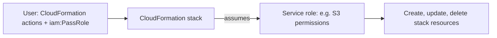

# AWS CloudFormation

Concept-only note. Lab steps are in [[30 - Other Services]] (Version B).

## 1. What and why
(src: 30/02-CloudFormation Intro)
- **Declarative infrastructure as code**: describe the resources you want (security group, 2 EC2 instances, S3 bucket, load balancer...) and CloudFormation creates them **in the right order** with the exact configuration. Most AWS resources are supported; unsupported ones can use a **custom resource**.
- Benefits:
  - **IaC**: no manual resource creation; changes go through **code review**.
  - **Cost**: every stack resource gets the same **stack tags**; costs can be estimated from templates; savings strategy, e.g. **delete a dev stack at 5 PM and recreate it at 8-9 AM**.
  - **Productivity**: destroy/recreate on the fly; **diagrams** from templates (Infrastructure Composer / Application Composer); no need to work out creation order; reuse existing templates and documentation.

> [!tip] Exam
> CloudFormation = infrastructure as code; repeat an architecture across **environments, regions or accounts**.

## 2. Stacks, updates and change sets
(src: 30/03-CloudFormation - Hands On, concepts only)
- A template is deployed as a **stack**; **parameters** make templates reusable; tags set on the stack propagate to resources (plus CloudFormation-added tags: stack name, logical ID, stack ID).
- On **update**, CloudFormation shows a **change set** previewing adds/modifications/removals. A modification may show **Replacement = true**: the old resource is deleted and a new one created (beware of data on it).
- CloudFormation determines dependency order itself (e.g. security groups before the instance) and cleans up the replaced resource afterwards.
- AMI IDs and Availability Zones are region-scoped, so a template with hard-coded values works only in that region.
- **Do not change stack resources manually**: update the template, or delete the stack, which removes all resources in the correct order.

## 3. Service role
(src: 30/04-CloudFormation - Service Role)
- A **service role** is an IAM role dedicated to CloudFormation so it can **create, update and delete stack resources on your behalf**. If none is specified, CloudFormation uses the user's own permissions.
- Use case: **least privilege**. Users get permission only to operate on CloudFormation and to **pass** the role (`iam:PassRole`), not direct permissions on the resources (e.g. role with S3 bucket permissions lets users create buckets only via the stack).
- If the role lacks permissions for the template's resources (e.g. S3-only role, EC2 in template), the stack fails.

> [!info] Diagram
> **Explanation:** The user only needs CloudFormation permissions and permission to pass the role; CloudFormation then acts with the service role's credentials.
> **Reference:** [CloudFormation service role (AWS CloudFormation User Guide)](https://docs.aws.amazon.com/AWSCloudFormation/latest/UserGuide/using-iam-servicerole.html)

> [!warning] Note
> AWS adds: once set, the service role is always used for that stack's operations and cannot be removed after creation; other users with stack permissions can use it even without `iam:PassRole`, so keep it least-privilege. Source: [CloudFormation service role](https://docs.aws.amazon.com/AWSCloudFormation/latest/UserGuide/using-iam-servicerole.html).

> [!tip] Exam
> Users need **iam:PassRole** to hand a service role to CloudFormation.

## Not included here
- Hands-on steps (uploading templates, creating/updating/deleting a stack) -> [[30 - Other Services]].
- Other lectures of chapter 30 belong to other notes.
