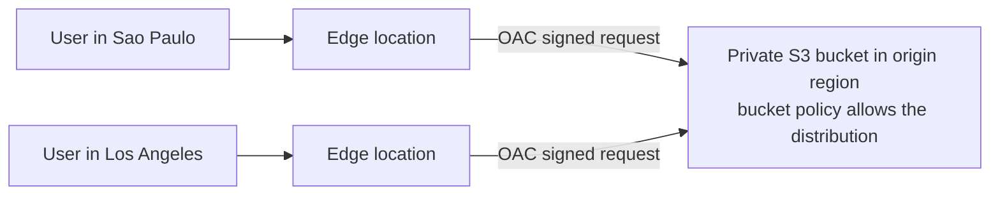
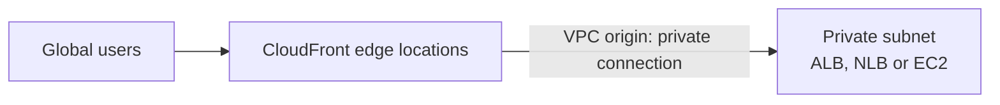
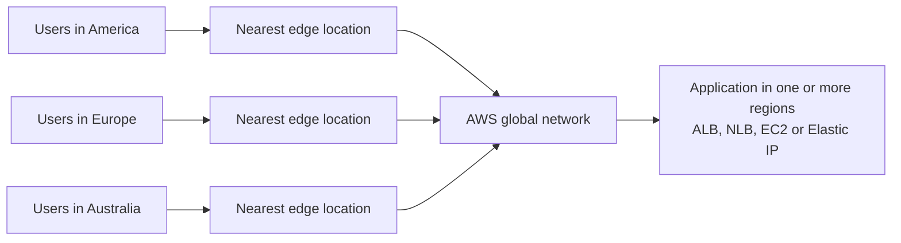

# CloudFront & Global Accelerator

Concept-only note. Console walkthroughs (creating a CloudFront distribution on S3, the Global Accelerator demo with EC2 in two regions) are in [[15 - CloudFront & Global Accelerator]] (Version B). Both services use the AWS edge network but solve different problems (see section 8).

## 1. CloudFront overview
(src: 15/01-CloudFront Overview)
- **Content Delivery Network (CDN)**: anytime the exam says CDN, think CloudFront. It **caches content at edge locations** around the world, so global users get **lower latency** and better read performance.
- Made of hundreds of **points of presence** (edge locations plus edge caches).
- **DDoS protection** comes from being globally distributed, plus integration with **AWS Shield** and **Web Application Firewall** ([[WAF, Shield & Firewall Manager]]).
- Flow: client sends an HTTP request to the nearest edge location; if the object is **in the edge cache**, it is returned directly; if not, the edge fetches it from the **origin**, caches it locally and returns it. The next user at that edge is served from cache.

[verify] "CloudFront has about 216 points of presence."
> [!warning] Correction [note]
> AWS's CloudFront features page now states "750+ POPs in 100+ cities across 50+ countries" plus 1,140+ embedded POPs in ISP networks. Source: [Amazon CloudFront features](https://aws.amazon.com/cloudfront/features/).

## 2. Origins
(src: 15/01-CloudFront Overview, 15/02-CloudFront with S3 - Hands On, 15/03-CloudFront - ALB-EC2 as an Origin)

| Origin type | Details |
|---|---|
| **Amazon S3 bucket** | distribute and cache files at the edge; can also **upload** files to S3 through CloudFront; access secured with **Origin Access Control (OAC)** and an **S3 bucket policy** |
| **VPC origin** | apps in **private subnets**: private ALB, private NLB, private EC2 instances |
| **Custom origin (HTTP)** | S3 **website** endpoint (bucket must first be enabled as a static website) or any **public HTTP backend** such as a public load balancer |

(The console in the lecture also listed API Gateway and Elemental MediaPackage as origin types.)

### 2.1 S3 origin with OAC
- Bucket stays **private**; a **bucket policy** grants access to the CloudFront distribution (OAC). Users reach objects only through CloudFront, so objects need not be public, and cached objects load almost instantly.
- The bucket policy is created for you when you enable private bucket access during distribution setup.

[verify] The lecture names OAC only; the older OAI is not mentioned.
> [!warning] Correction [note]
> AWS recommends OAC over the legacy origin access identity (OAI): OAC supports all regions, SSE-KMS objects and PUT/DELETE requests. An S3 bucket configured as a **website endpoint** cannot use OAC and must be a custom origin. Source: [Restrict access to an Amazon S3 origin](https://docs.aws.amazon.com/AmazonCloudFront/latest/DeveloperGuide/private-content-restricting-access-to-s3.html).

> [!info] Diagram
> **Explanation:** Users hit the nearest edge location. On a cache miss, the edge requests the object from the private S3 origin using origin access control; the bucket policy allows only that CloudFront distribution. Subsequent requests at the same edge are served from cache.
> **Reference:** [Restrict access to an Amazon S3 origin (CloudFront Developer Guide)](https://docs.aws.amazon.com/AmazonCloudFront/latest/DeveloperGuide/private-content-restricting-access-to-s3.html)

### 2.2 ALB / EC2 origins: VPC origins (new) vs public (old)
- **VPC origins (better, newer way)**: deliver content from **private subnets**; nothing needs to be exposed to the internet. Supports **private ALB, NLB and EC2 instances**. CloudFront links to the backend through the VPC origin; you choose exactly what to expose through CloudFront. Described as one of the most secure setups.
- **Public network (older way)**: EC2 instance or ALB must be **public**; you allow the **published CloudFront edge IP ranges** in the **security group**. For an ALB, EC2 instances behind it can stay private (ALB-to-EC2 via security groups). Drawbacks: you must look up and maintain the IP list, and if someone changes the security group the backend becomes reachable by more than CloudFront.

> [!info] Diagram
> **Explanation:** CloudFront reaches applications in private subnets through a VPC origin, so the load balancer or instance needs no public exposure; CloudFront is the single point of entry.
> **Reference:** [Restrict access with VPC origins (CloudFront Developer Guide)](https://docs.aws.amazon.com/AmazonCloudFront/latest/DeveloperGuide/private-content-vpc-origins.html)

> [!tip] Exam
> CloudFront in front of a **private** ALB/NLB/EC2 -> **VPC origin**. Private S3 content via CloudFront -> **OAC + bucket policy**.

## 3. Geo restriction
(src: 15/04-CloudFront - Geo Restriction)
- Restrict who can access the distribution **by country**: **allow list** (approved countries) or **block list** (banned countries).
- Country is determined by matching the viewer IP against a **third-party Geo-IP database**.
- Use case: **copyright laws / content licensing**.
- In the lecture's console the setting was only available on a paid / pay-as-you-go plan (not the free plan), and the instructor expects the options to change over time; check the plan details when planning.

## 4. Cache invalidation
(src: 15/05-CloudFront - Cache Invalidation)
- If you update the origin, edge locations keep serving the old cached copy **until the TTL expires** (example: TTL of one day).
- To force a refresh: run a **CloudFront invalidation** on an **entire** cache (`*`) or **specific paths** (e.g. `/index.html`, `/images/*`). The edges remove those objects; the next request misses, goes to the origin and caches the new version.

> [!tip] Exam
> Need new origin content visible immediately despite TTL -> **CloudFront invalidation** (partial or full).

## 5. Pricing plans seen in the lecture
(src: 15/02-CloudFront with S3 - Hands On)
- The console offered **plans**: a **Free** plan (monthly request allowance, always-on DNS protection, global CDN, free TLS certificates) and higher tiers adding things like edge key-value store, advanced DDoS protection, uptime SLA and WordPress protection, plus **pay-as-you-go** (billed on traffic, extra for some features). The instructor mentions VPC origin and layer-7 protection as business-plan items. Plan names and contents may change; treat as informational.

## 6. CloudFront vs S3 Cross-Region Replication
(src: 15/01-CloudFront Overview)

| | CloudFront | S3 Cross-Region Replication |
|---|---|---|
| Reach | global edge network (~216 POPs per the lecture, see correction above) | only the regions you configure, per region |
| Freshness | **cached** (e.g. ~a day TTL) | **near real time**, no caching |
| Best for | **static content** available everywhere | **dynamic content** needing low latency in a few regions |
| Access | read | read-only replicas |

## 7. AWS Global Accelerator
(src: 15/06-AWS Global Accelerator - Overview, 15/07-AWS Global Accelerator - Hands On)
**Problem:** an app deployed in one region (example: a public ALB in India) with users worldwide. Traffic crosses many router hops on the **public internet**: added latency and risk.

**Unicast vs Anycast IP**
- **Unicast**: one server, one IP address.
- **Anycast**: **many servers share the same IP**; the client is routed to the **nearest** one.

**How it works**
- Global Accelerator gives you **2 static Anycast IPs** (global). Client traffic enters the **nearest edge location** and then travels over the **private AWS global network** to your application, giving lower latency and more stable performance.
- Endpoints (**public or private**): **Elastic IP, EC2 instance, Application Load Balancer, Network Load Balancer**, in one or several regions.
- **Health checks** on endpoints and **automatic regional failover in under 1 minute** -> good for **disaster recovery**.
- **No client-cache issues**: the two Anycast IPs never change. Clients only need **two IPs whitelisted**.
- **DDoS protection** via AWS Shield.
- Configuration concepts seen in the demo: **accelerator** (standard), **listeners** (protocol TCP/UDP + port), **endpoint groups per region** (with traffic dial, health checks and port overrides), **endpoint weights**, optional **client affinity** (none or by source IP). Global Accelerator is a **global service** (region selector shows "Global").

[verify] "Failover in less than one minute."
> [!warning] Correction [note]
> Unconfirmed: the AWS "What is Global Accelerator" page says it reacts "instantly" to health or configuration changes but gives no specific failover time. It does confirm two static IPv4 anycast addresses (four for dual-stack) and endpoints of NLB, ALB, EC2 and Elastic IP. Source: [What is AWS Global Accelerator?](https://docs.aws.amazon.com/global-accelerator/latest/dg/what-is-global-accelerator.html).

> [!info] Diagram
> **Explanation:** Users connect to the same two anycast IPs and enter AWS at the closest edge location. From there traffic rides the private AWS backbone to the healthy endpoint, instead of crossing many public-internet hops.
> **Reference:** [What is AWS Global Accelerator? (Developer Guide)](https://docs.aws.amazon.com/global-accelerator/latest/dg/what-is-global-accelerator.html)

## 8. CloudFront vs Global Accelerator

| | CloudFront | Global Accelerator |
|---|---|---|
| Network | same AWS global network and edge locations | same |
| DDoS | Shield integration | Shield integration |
| Content | **cacheable** (images, video) **and dynamic** (API acceleration, dynamic site delivery) | wide range of apps over **TCP or UDP** |
| Delivery | served **from the edge** (cache) | packets **proxied** from edge to the app in one or more regions; **no caching** |
| Best for | HTTP content delivery | **non-HTTP** (gaming, IoT, VoIP); HTTP needing **static global IPs**; **deterministic, fast regional failover** |

> [!tip] Exam
> Caching static/dynamic web content = CloudFront. Static anycast IPs, TCP/UDP, non-HTTP, fast regional failover = Global Accelerator. Both integrate with Shield. "CDN" always means CloudFront.

## Not included here
- Hands-on narration of 15/02 (CloudFront + S3 distribution) and 15/07 (Global Accelerator with EC2 in two regions, VPN test, cleanup): see [[15 - CloudFront & Global Accelerator]].
- All 7 lectures in chapter 15 had transcripts; none missing.
