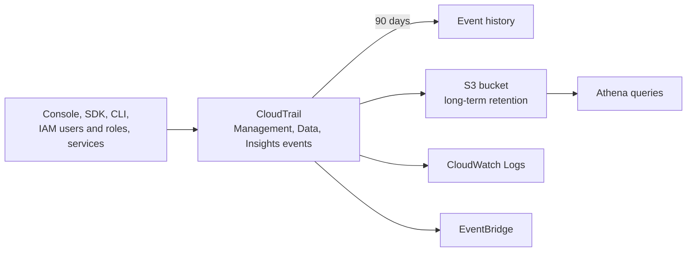
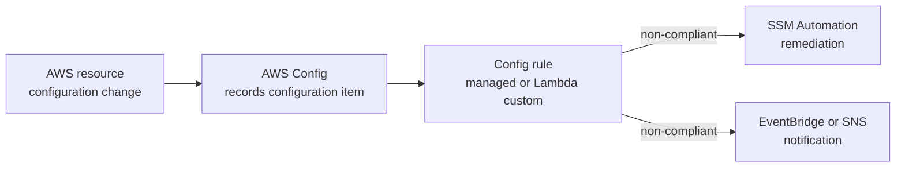

# AWS CloudTrail and AWS Config

Concept-only note. Console demos are in [[24 - Monitoring & Audit - CloudWatch, CloudTrail & Config]] (Version B). Related: [[CloudWatch]], [[EventBridge]].

## 1. CloudTrail overview
(src: 24/13-CloudTrail Overview, 24/14-CloudTrail Hands On [concepts only])
- **Governance, compliance and audit** for the account. **Enabled by default.** Records the history of **events and API calls** made through the console, SDK, CLI, IAM users/roles and other AWS services.
- A **trail** can apply to **all regions or one region**; send logs to **CloudWatch Logs** and/or **S3** (e.g. gather all regions into one bucket).
- Typical question: "who terminated this EC2 instance, and when?" -> CloudTrail. The event shows event source, access key used, region and the full event.
- **Event history**: 90 days of management events in the console.

### 1.1 Event types

| Type | What | Logged by default? | Read/Write split |
|---|---|---|---|
| **Management events** | operations on resources: `AttachRolePolicy`, create subnet, set up logging | **Yes** (always) | Read (list users/instances) vs Write (delete a table; higher importance) |
| **Data events** | **S3 object-level** (`GetObject`, `DeleteObject`, `PutObject`), **Lambda Invoke** | **No** (high volume) | Read vs Write |
| **Insights events** | unusual activity detected | Must enable (paid) | - |

### 1.2 CloudTrail Insights
- **Enable and pay** for it. Builds a **baseline** of normal management activity, then continuously analyzes **write** management events to detect **unusual activity**: inaccurate resource provisioning, hitting service limits, bursts of IAM actions, gaps in periodic maintenance.
- Insights events appear in the CloudTrail console, can go to **S3**, and generate an **EventBridge event** for automation (e.g. email).

### 1.3 Retention
- Events kept **90 days** in CloudTrail. For longer (e.g. an audit a year later): **log to S3** and query with **Athena** ([[Athena, Glue & Lake Formation]]).

> [!info] Diagram
> **Explanation:** All account activity is recorded by CloudTrail; event history keeps 90 days, trails deliver to S3 (queried with Athena) and CloudWatch Logs, and events can trigger EventBridge rules.
> **Reference:** [CloudTrail concepts (AWS CloudTrail User Guide)](https://docs.aws.amazon.com/awscloudtrail/latest/userguide/cloudtrail-concepts.html) - event history is "the past 90 days of CloudTrail management events"; trails log management events by default, not data or Insights events.

> [!tip] Exam
> CloudTrail = who did what API call. Data events (S3 objects, Lambda invoke) are **off by default**. Beyond 90 days -> S3 + Athena. API call alerts -> CloudTrail + EventBridge.

## 2. AWS Config overview
(src: 24/16-AWS Config - Overview, 24/17-AWS Config - Hands On [concepts only])
- **Audit and record compliance** of resources, and **record configurations and their changes over time**. Example questions: unrestricted SSH on security groups? public S3 buckets? did an ALB configuration change?
- **Per-region service**; can **aggregate across regions and accounts** (aggregators) into one place. Configuration history can be stored in **S3** and analyzed with **Athena**.
- You choose which resource types to record (all, or specific types), optionally including **global resources** (IAM users, groups, roles, customer managed policies). Delivery goes to an S3 bucket via a service-linked role; optional **SNS** stream for all configuration changes.

### 2.1 Rules
- **AWS managed rules** (instructor says "over 75"), or **custom rules** you define with **Lambda**. Examples: each EBS volume is gp2; each EC2 in dev is `t2.micro`; **restricted-ssh** on security groups; **approved-amis-by-id** (needs a parameter listing approved AMI IDs).
- **Trigger**: on **configuration change** or at **periodic intervals** (e.g. every 2 hours).
- **Rules only evaluate compliance; they do NOT block actions** and do not replace IAM.

[verify] "There are over 75 AWS managed rules."
> [!warning] Correction [note]
> The AWS managed rules list is much longer now (about 825 entries on the list page when I counted). Source: [List of AWS Config Managed Rules](https://docs.aws.amazon.com/config/latest/developerguide/managed-rules-by-aws-config.html).

### 2.2 Pricing
- No free tier; can get expensive. Instructor: "0.003 cents per configuration item recorded per region and 0.001 cents per rule evaluation per region."

[verify] Units "cents".
> [!warning] Correction [note]
> AWS pricing shows **$0.003 per configuration item** (continuous recording; $0.012 for periodic) and **$0.001 per rule evaluation** (first 100,000/month), i.e. dollars, not cents. Source: [AWS Config pricing](https://aws.amazon.com/config/pricing/).

### 2.3 Resource view
- Per resource: **compliance over time**, **configuration timeline** (what changed, when, who), linked to the **CloudTrail** API calls that caused it. Example: restricted-ssh flags a security group with port 22 open to anywhere; after the ingress rule is removed, Config re-evaluates and marks it compliant.

### 2.4 Remediation and notifications
- **Remediation** uses **SSM Automation documents** (AWS-managed or custom; a custom one can invoke Lambda). Example: `RevokeUnusedIAMUserCredentials` deactivates IAM access keys older than 90 days. See [[Systems Manager]].
- Remediation can be **manual or automatic**, with **retries** (up to 5, with configurable retry seconds).
- **Notifications**: **EventBridge** rules on non-compliance, or send all changes/compliance notifications to **SNS** (filter the SNS topic for specific events, e.g. to an admin email or Slack).

> [!info] Diagram
> **Explanation:** Config records resource changes, evaluates them against rules, and for non-compliant resources can run an SSM Automation remediation and/or notify through EventBridge or SNS. It detects and reacts; it does not deny the change.
> **Reference:** [AWS Config managed rules (AWS Config Developer Guide)](https://docs.aws.amazon.com/config/latest/developerguide/managed-rules-by-aws-config.html). Remediation and notification flow follows the lecture; I did not fetch a page for those steps.

> [!tip] Exam
> Config = configuration history + compliance rules; **does not prevent** actions. Remediate with SSM Automation. Per-region, use aggregators for multi-account.

## 3. CloudWatch vs CloudTrail vs Config
(src: 24/18-CloudTrail vs CloudWatch vs Config)

| Service | Purpose | Example on an ELB |
|---|---|---|
| **CloudWatch** | performance **metrics**, dashboards, alarms/events, **log** aggregation and analysis | incoming connections, % of error codes over time, dashboard (even global across load balancers) |
| **CloudTrail** | record **API calls** by anyone/anything; trails per resource type | who changed the security group rules or removed the SSL certificate |
| **Config** | record **configuration changes** and evaluate against **compliance rules**; timeline of changes and compliance | track SG rules and config changes (e.g. certificate modified); rules like "an SSL certificate must always be attached" and "no unencrypted traffic" |

> [!tip] Exam
> Performance/metrics -> CloudWatch. Who made the API call -> CloudTrail. What changed and is it compliant -> Config. They are complementary. See [[ELB]].

## Not included here
- Hands-on narration of 24/14 (terminating an instance and finding the event) and 24/17 (setting up Config, managed rule, remediation screens).
- CloudWatch (24/01-09, 24/12) -> [[CloudWatch]]; EventBridge (24/10, 24/11, 24/15) -> [[EventBridge]]. All lectures have transcripts.
