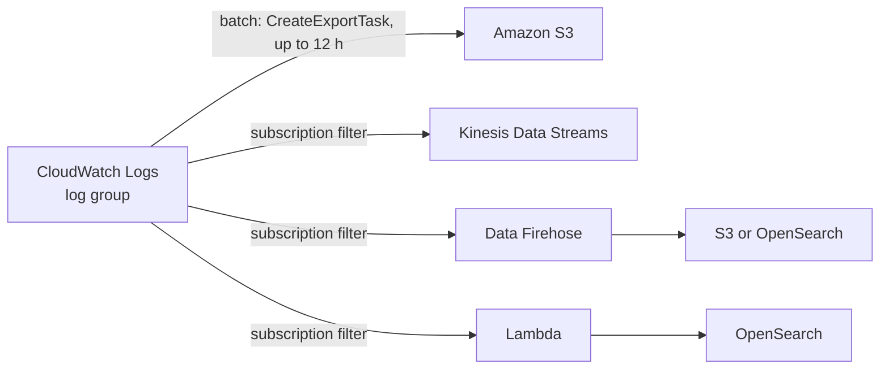

# Amazon CloudWatch

Concept-only note merged from chapter 24. Console walkthroughs are left out; see [[24 - Monitoring & Audit - CloudWatch, CloudTrail & Config]] (Version B) for the lab steps. Event routing is in [[EventBridge]]; API auditing and compliance are in [[CloudTrail & Config]].

## 1. Why monitoring
(src: 24/01-AWS Monitoring - Section Introduction)
- Monitoring covers metrics, logs, tracing and audit of who did what in your infrastructure. Never deploy without it.

## 2. CloudWatch Metrics
(src: 24/02-CloudWatch Metrics)
- CloudWatch provides **metrics for every AWS service**; a metric is a variable you monitor (EC2 `CPUUtilization`, `NetworkIn`; S3 bucket size).
- Metrics live in **namespaces** (one per service) and have **dimensions** (attributes, e.g. instance ID, environment): **up to 30 dimensions per metric**. Metrics are **time-based** (timestamp required).
- **Dashboards** show many metrics at once. **Custom metrics** cover what AWS does not send (classic example: **RAM usage of an EC2 instance**).
- EC2 default monitoring = a data point every **5 minutes**; **detailed monitoring = every 1 minute** (extra cost).
- **Metric streams**: continuously stream metrics out of CloudWatch with **near real-time, low-latency** delivery to **Kinesis Data Firehose** (then S3 -> Athena, Redshift, OpenSearch) or directly to third parties (Datadog, Dynatrace, New Relic, Splunk, Sumo Logic). You can stream all namespaces or filter a subset.

[verify] Instructor calls the destination "Kinesis Data Firehose".
> [!warning] Correction [note]
> AWS docs now call it **Amazon Data Firehose**. Same service, renamed. Source: [Real-time processing of log data with subscriptions](https://docs.aws.amazon.com/AmazonCloudWatch/latest/logs/Subscriptions.html).

> [!tip] Exam
> Out of the box EC2 gives CPU, disk and network at a high level, **not memory or swap**. RAM needs a custom metric or the Unified Agent.

## 3. CloudWatch Logs
(src: 24/03-CloudWatch Logs, 24/04-CloudWatch Logs - Hands On [concepts only], 24/05-CloudWatch Logs - Live Tail - Hands On [concepts only])
- **Log group** = usually one application; **log stream** = instance, log file or container inside it.
- **Retention policy** per group: never expire, or **1 day to 10 years**.
- Encrypted by default; optional **KMS** customer keys.
- Sources: SDK, CloudWatch Logs Agent, Unified Agent, **Elastic Beanstalk**, **ECS** (containers), **Lambda** (function logs), **VPC Flow Logs**, **API Gateway** (requests), **CloudTrail** (via filter), **Route 53** (DNS queries).
- **Metric filter**: counts occurrences of a word or pattern in log lines and turns them into a **metric**; only applies to **new** log data, not history. A **CloudWatch Alarm on a metric filter** gives alerting on logs (e.g. too many "error" lines -> SNS).
- **Live Tail**: watch log events arrive in real time for debugging, filtered by log group/stream. Only about 1 hour/day free, then charged.

[verify] "About one hour a day of Live Tail is free."
> [!warning] Correction [note]
> Unconfirmed: I did not fetch an AWS page for the Live Tail free allowance. Check the CloudWatch pricing page before relying on it.

### 3.1 Logs Insights
- Query engine inside CloudWatch Logs with a purpose-built query language: fields auto-detected, filter, aggregate stats, sort, limit. Choose a time range, get a visualization plus the matching log lines. Queries can be **saved** and added to **dashboards**; you can query **multiple log groups, even across accounts**.
- Sample queries: 25 most recent events, count of exceptions, filter a specific IP.
- **It queries historical data only; it is NOT a real-time engine.**

### 3.2 Exporting and streaming logs

| Method | Mode | Destinations | Notes |
|---|---|---|---|
| **Export task** (`CreateExportTask`) | Batch | **S3** | can take **up to 12 hours**; not real time |
| **Subscription filter** | Real-time / near real-time stream | Kinesis Data Streams, Kinesis Data Firehose, Lambda (and OpenSearch) | filter pattern chooses which events are delivered |

- From Kinesis Data Streams you can integrate with Firehose, Kinesis Data Analytics, EC2, Lambda; from Firehose near real-time to S3 or OpenSearch; Lambda (custom or managed) can load OpenSearch in real time.
- **Cross-account / cross-region aggregation**: subscription filters from many accounts/regions feed one central Kinesis Data Stream -> Firehose -> S3.
- Cross-account setup: sender account's subscription filter -> **subscription destination** (virtual representation of the recipient's Kinesis stream) + **destination access policy** allowing the sender; recipient creates an **IAM role** allowed to put records into the stream and assumable by the sender.

> [!info] Diagram
> **Explanation:** A log group can be exported in batch to S3, or streamed through a subscription filter to Kinesis Data Streams, Data Firehose or Lambda, which then forward to S3 or OpenSearch. Subscriptions are the real-time path; export is the batch path.
> **Reference:** [Real-time processing of log data with subscriptions (Amazon CloudWatch Logs User Guide)](https://docs.aws.amazon.com/AmazonCloudWatch/latest/logs/Subscriptions.html)

> [!tip] Exam
> Logs to S3 in batch = Export task (up to 12 h). Real-time = subscription filter -> Kinesis / Firehose / Lambda. Logs Insights = historical queries only.

## 4. CloudWatch Agents
(src: 24/06-CloudWatch Agent & CloudWatch Logs Agent)
- **By default no logs leave an EC2 instance.** Install and start an agent; the instance needs an **IAM role** allowing it to send to CloudWatch ([[IAM]]). Agents also work on **on-premises servers**.

| | CloudWatch Logs Agent (old) | CloudWatch Unified Agent (new) |
|---|---|---|
| Sends logs | yes | yes |
| System-level metrics (RAM, processes, swap...) | **no** | **yes** |
| Central config | no | **via SSM Parameter Store** |

- Unified Agent metrics are far more granular: CPU (active, guest, idle, system, user, steal), disk (free/used/total, IO, reads/writes, IOPS), RAM (free, used, total, cached), netstat (TCP/UDP connections, packets, bytes), processes (running, sleeping, blocked, dead), swap space.
- The Logs Agent is described by the instructor as effectively deprecated.

> [!tip] Exam
> More granularity than default EC2 metrics (RAM, processes, swap) = **CloudWatch Unified Agent**. See [[Parameter Store & Secrets Manager]] for central config.

## 5. CloudWatch Alarms
(src: 24/07-CloudWatch Alarms, 24/08-CloudWatch Alarms Hands On [concepts only])
- An alarm triggers actions from **any metric**; options include sampling, percentage, maximum, etc.
- **States**: `OK` (not triggered), `INSUFFICIENT_DATA` (not enough data), `ALARM` (threshold breached).
- **Period**: evaluation window; short or long. **High-resolution custom metrics**: **10 s, 30 s, or multiples of 60 s**.
- Threshold types: static or anomaly detection; "M out of N" data points (e.g. 3 of 3 on 5-minute period = 15 minutes above 95%).

| Alarm target | Examples |
|---|---|
| EC2 action | stop, terminate, reboot, **recover** |
| Auto Scaling action | scale out / scale in ([[ASG]]) |
| SNS notification | then fan out, e.g. to Lambda ([[SNS]], [[Lambda]]) |

### 5.1 Composite alarms
- A single alarm watches one metric; a **composite alarm** watches the **states of multiple other alarms** with **AND / OR**. Purpose: **reduce alarm noise** (e.g. alert only when CPU is high AND IOPS is high).

### 5.2 EC2 instance recovery
- Status checks: **instance status** (the VM), **system status** (underlying hardware), **attached EBS status**. An alarm on a check can **recover** the instance onto another host.
- Recovery keeps the **same private, public and Elastic IP, metadata and placement group**; can also notify an SNS topic.

### 5.3 Testing
- `aws cloudwatch set-alarm-state` forces an alarm into any state to test the action wiring without breaching the threshold.

> [!tip] Exam
> Alarm states: OK / INSUFFICIENT_DATA / ALARM. Composite alarms = AND/OR of other alarms. Alarm on a status check -> EC2 recovery keeps IPs and placement group.

## 6. CloudWatch Network Synthetic Monitor
(src: 24/09-CloudWatch Network Synthetic Monitor)
- Detects network problems (**packet loss, latency, jitter**) between an **on-premises data center and AWS** over **Direct Connect** or **Site-to-Site VPN**. See [[VPC Connectivity]].
- **No agent needed**; probes **ICMP or TCP over IPv4**; results published to CloudWatch Metrics in near real time.

## 7. Insights products (high level only)
(src: 24/12-CloudWatch Insights and Operational Visibility)

| Product | Purpose | Key facts |
|---|---|---|
| **Container Insights** | metrics + logs from containers | **ECS, EKS, Kubernetes on EC2, Fargate**; on Kubernetes uses a **containerized CloudWatch agent** to discover containers. See [[Containers (ECS, ECR, EKS)]] |
| **Lambda Insights** | troubleshoot serverless | CPU time, memory, disk, network, **cold starts**, worker shutdowns; delivered as a **Lambda layer**; own dashboard |
| **Contributor Insights** | **top-N contributors** from logs | e.g. top 10 IPs in VPC Flow Logs (heavy talkers / bad hosts), URLs causing most DNS errors; custom rules or AWS-built rules; built on CloudWatch Logs |
| **Application Insights** | automated dashboard of problems for an app | EC2 apps on chosen tech (Java, .NET, IIS, DBs) linked to EBS, RDS, ELB, ASG, Lambda, SQS, DynamoDB, S3, ECS, EKS, SNS, API Gateway; uses **SageMaker** internally; findings go to **EventBridge** and **SSM OpsCenter** |

> [!tip] Exam
> "Top N contributors" = Contributor Insights. Containers = Container Insights. Know these only at this level.

## Not included here
- Hands-on narration of 24/04, 24/05 and 24/08 (console clicks, demo Lambda, creating an EC2 to terminate on alarm) -> [[24 - Monitoring & Audit - CloudWatch, CloudTrail & Config]].
- EventBridge (24/10, 24/11, 24/15) -> [[EventBridge]]. CloudTrail and Config (24/13, 24/14, 24/16-18) -> [[CloudTrail & Config]].
- All chapter 24 lectures have transcripts.
