# Containers on AWS: Docker, ECS, Fargate, ECR, EKS

Concept-only note. Lab steps (cluster, task definition, service, EKS console tour, clean-up) are in [[18 - Containers on AWS]] (Version B).

## 1. Docker basics
(src: 18/01-Docker Introduction)
- Docker = platform to package apps into standardized **containers** that run the same on any OS/machine (no compatibility issues, predictable behavior). Use cases: **microservice architectures**, **lift-and-shift** of on-premises apps, any container workload.
- A server (for example EC2) runs the Docker agent/daemon; many containers (Java, Node.js, MySQL...) run on top, including several copies of the same one.
- **Image storage**: Docker Hub (public; base images such as Ubuntu, MySQL) or **Amazon ECR** (private, plus the **ECR Public Gallery**).
- Workflow: Dockerfile -> build -> image -> **push** to a repository -> **pull** -> run = container.

| | Virtual machine (e.g. EC2) | Docker container |
|---|---|---|
| Layers | infrastructure, host OS, hypervisor, guest OS, app | infrastructure, host OS, Docker daemon, lightweight containers |
| Isolation | strongly isolated, no shared resources | share host resources (network, some data): slightly less secure |
| Density | fewer per server | **more containers per server** |

- AWS container services: **ECS** (AWS-native), **EKS** (managed Kubernetes), **Fargate** (serverless compute for ECS and EKS), **ECR** (image registry).

## 2. ECS launch types
(src: 18/02-Amazon ECS, 18/03-Creating ECS Cluster - Hands On)
- You run an **ECS task** on an **ECS cluster**.
- **EC2 launch type**: cluster = EC2 instances **you provision and maintain**; each instance runs the **ECS agent**, which registers it to the cluster. ECS then places/starts/stops containers on them.
- **Fargate launch type**: **serverless**, no instances to manage. You write a **task definition** (CPU + RAM) and AWS runs the task. To scale, just increase the number of tasks.
- Capacity options seen when creating a cluster: Fargate only; Fargate + **ECS Managed Instances** (AWS manages the EC2 instances for you; needs an instance profile and an infrastructure role); Fargate + self-managed instances (the old way: you manage an ASG, AMI, instance type; AWS is steering people away from it).
- Cluster **capacity providers**: `FARGATE`, `FARGATE_SPOT` (Spot mode), and an **ASG provider** (EC2). Registered EC2s appear as **container instances** showing available CPU/memory.
- Fargate task size ranges up to **16 vCPU** and up to ~120 GB memory; Fargate gives ephemeral storage (~21 GB default).

```mermaid
flowchart TB
    Cluster["ECS cluster"] --> Cap["Capacity"]
    Cap --> EC2["Amazon EC2 instances: you manage"]
    Cap --> MI["ECS Managed Instances: AWS manages"]
    Cap --> FG["AWS Fargate: serverless"]
```

> [!info] Diagram
> **Explanation:** An ECS cluster draws capacity from EC2 instances you manage, ECS Managed Instances (EC2 managed by AWS) or serverless Fargate.
> **Reference:** [What is Amazon Elastic Container Service? (Amazon ECS Developer Guide)](https://docs.aws.amazon.com/AmazonECS/latest/developerguide/Welcome.html)

> [!tip] Exam
> The exam favors **Fargate**: serverless and far easier to manage than the EC2 launch type.

## 3. IAM roles for ECS
(src: 18/02-Amazon ECS)

| Role | Applies to | Used by | Purpose |
|---|---|---|---|
| **EC2 instance profile** | EC2 launch type only | the ECS agent | call ECS API to register, send container logs to CloudWatch Logs, pull images from ECR, reference secrets in Secrets Manager / SSM Parameter Store |
| **ECS task role** | EC2 and Fargate | the task's containers | per-task permissions (e.g. task A -> S3, task B -> DynamoDB); **defined in the task definition** |

- Task execution role (Fargate) is auto-created by ECS if missing; it is separate from the task role, which you add only if the containers call AWS APIs. See [[IAM]], [[Parameter Store & Secrets Manager]].

> [!tip] Exam
> Know the difference: EC2 instance profile (agent, EC2 type only) vs ECS task role (per task, both types).

## 4. Load balancer integration
(src: 18/02-Amazon ECS, 18/04-Creating ECS Service - Hands On)
- **ALB**: supports most use cases and is the good default; works with Fargate. Tasks register as targets by (private) IP.
- **NLB**: only for very high throughput/performance, or combined with **AWS PrivateLink**.
- **Classic LB**: possible but not recommended (no advanced features) and **cannot be linked to Fargate**. See [[ELB]].

## 5. Data persistence
(src: 18/02-Amazon ECS)
- **EFS** as data volume: network file system compatible with **both EC2 and Fargate**; tasks in any AZ share the same data. Fargate + EFS = serverless persistent, **multi-AZ shared storage** for containers. See [[EFS]].
- **S3 as a file system** (newer option): mount an S3 bucket onto tasks (ECS Managed Instances and Fargate); changes sync to the bucket. Use case: containers needing shared file access to data already in S3.

## 6. Service auto scaling
(src: 18/05-Amazon ECS - Auto Scaling, 18/04 service concepts)
- A **service** keeps a desired number of tasks (replica mode); you can change it manually or automatically through **AWS Application Auto Scaling**.
- Scaling metrics (only these three): **ECS service CPU utilization**, **memory utilization**, **ALB request count per target**.
- Policies: **target tracking**, **step scaling**, **scheduled scaling**.
- Flow: CloudWatch metric -> CloudWatch alarm -> Application Auto Scaling raises desired task count -> new task.
- **Task-level scaling is not cluster scaling.** On the EC2 launch type you must also scale the instances:
  - **ASG scaling** (e.g. on CPU), or
  - **ECS Cluster Capacity Provider** (smarter): paired with an ASG, it scales the ASG automatically when tasks lack CPU/RAM.
- Fargate avoids all instance scaling. See [[ASG]].

> [!tip] Exam
> EC2 launch type: prefer Capacity Provider over plain ASG scaling. Fargate is the easiest.

## 7. ECS solution architectures
(src: 18/06-Amazon ECS - Solutions Architectures)
- **S3 -> EventBridge -> ECS task (Fargate)**: object upload triggers a rule that runs a task; the task role lets it read S3 and write to DynamoDB. Fully serverless object processing. See [[EventBridge]].
- **EventBridge schedule** (e.g. every hour) runs a Fargate task for batch work against S3.
- **SQS-driven service**: tasks poll an SQS queue; service auto scaling adds tasks as queue depth grows. See [[SQS]].
- **EventBridge on ECS events**: task state changes (e.g. `STOPPED` with stopped reason) can notify an SNS topic, giving visibility into container lifecycle. See [[SNS]].

## 8. Amazon ECR
(src: 18/08-Amazon ECR)
- **Elastic Container Registry**: store and manage Docker images; **private** (your accounts) or **public** (ECR Public Gallery).
- Fully integrated with ECS; images are **stored in S3** behind the scenes. Access is controlled by **IAM** (instance role needs permission to pull; permission errors -> check policies).
- Features: **image vulnerability scanning, versioning, image tags, image lifecycle**.

> [!tip] Exam
> "Store Docker images" = ECR.

## 9. Amazon EKS
(src: 18/09-Amazon EKS - Overview, 18/10-Amazon EKS - Hands On concepts)
- **Elastic Kubernetes Service**: managed **Kubernetes** (open source, cloud-agnostic, used by many providers). Alternative to ECS with a different API. Use when the company already uses Kubernetes on-premises or in another cloud, or wants the Kubernetes API / easier multi-cloud migration.
- Launch modes: **EC2** (worker nodes) or **Fargate** (serverless pods). **Pods** are the EKS equivalent of ECS tasks.
- Typical layout: VPC with public/private subnets across AZs; nodes (EC2, optionally in an ASG) run pods; expose via a public or private load balancer.

| Node type | Who manages | Notes |
|---|---|---|
| **Managed node groups** | AWS creates/manages nodes in an ASG | On-Demand and Spot |
| **Self-managed nodes** | you create, register to the cluster, run in an ASG | EKS Optimized AMI or own AMI; On-Demand and Spot |
| **Fargate** | nobody: no nodes | no maintenance |

- **EKS Auto Mode** (seen in the demo): when a pod cannot fit on existing nodes, EKS creates a node automatically (infrastructure managed by EKS).
- Data volumes: define a **StorageClass** manifest using a **CSI** (Container Storage Interface) driver. Supported: **EBS**, **EFS** (the **only one that works with Fargate**), **FSx for Lustre**, **FSx for NetApp ONTAP**. Add-ons such as the EBS/EFS CSI drivers enable them.

> [!tip] Exam
> Kubernetes / pods / "cloud-agnostic containers" = EKS. EFS is the only StorageClass for EKS on Fargate.

## Not included here
- Hands-on narration: 18/03, 18/04, 18/07 (clean-up), 18/10 (console tour) -> [[18 - Containers on AWS]].
- All lectures in this topic have transcripts.
