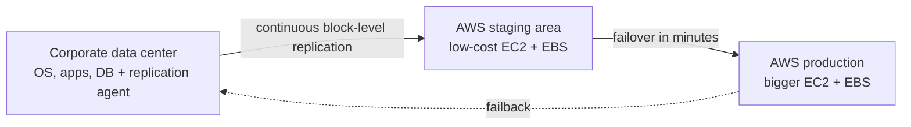

# Disaster Recovery & Backup

Concept-only note covering DR strategies, Elastic Disaster Recovery (DRS) and AWS Backup. Lab steps for AWS Backup are in [[28 - Disaster Recovery & Migrations]] (Version B). Migration tools are in [[Migration Services]].

## 1. Disaster recovery basics
(src: 28/01-Disaster Recovery in AWS)
- **Disaster** = any event with a negative impact on business continuity or finances. DR = preparing for and recovering from it.
- Types of DR: **on-premises to on-premises** (traditional, very expensive); **hybrid** (on-premises main site, cloud as recovery site); **full cloud** (AWS Region A to Region B).
- Two key terms (exam):
  - **RPO (Recovery Point Objective)**: how far back in time you can recover = how often you back up. Time between last backup and the disaster = **data loss** (hourly backups = up to 1 hour lost; can be 1 minute depending on requirements).
  - **RTO (Recovery Time Objective)**: time between the disaster and recovery = **downtime** of the application (could be 24 hours, could be 1 minute).
- Smaller RPO/RTO usually means higher cost; the requirements drive the architecture.

> [!tip] Exam
> RPO = data loss tolerated. RTO = downtime tolerated. Lower targets cost more.

## 2. DR strategies (cheapest/slowest to costliest/fastest)
(src: 28/01-Disaster Recovery in AWS)

| Strategy | What runs in AWS | RPO / RTO | Cost | Notes |
|---|---|---|---|---|
| **Backup and Restore** | nothing; only stored backups | **high RPO, high RTO** | cheapest (storage only) | Backups via Storage Gateway + lifecycle to Glacier, or weekly **Snowball** into Glacier (RPO about 1 week); in-cloud EBS/Redshift/RDS snapshots (RPO 24 h or 1 h depending on schedule). Restore with AMIs / snapshots. |
| **Pilot Light** | small version of the app, **critical core only** (e.g. RDS with continuous replication); EC2 not running | lower RPO and RTO | low | On disaster: **Route 53** fails over, EC2 is created in the cloud, DB already ready. Very popular choice; only for critical core systems. |
| **Warm Standby** | **full system at minimum size** (RDS replica, ELB, ASG at min capacity) | lower again | more costly | On disaster: Route 53 fails over to the ELB, app switches to the replica DB, **ASG scales** to production load. |
| **Multi-Site / Hot Site** | **full production scale in both** on-premises and AWS (active-active) | RTO of **minutes or seconds**, lowest | very expensive | Route 53 routes to both; all-cloud variant = multi-Region, e.g. **Aurora Global Database** to another Region. |

> [!info] Diagram
> **Explanation:** The four strategies in increasing order of cost and decreasing recovery time. Backup and Restore keeps only backups; Pilot Light keeps the core (data) always on; Warm Standby keeps a scaled-down but functional copy; Multi-site runs full production in more than one location.
> **Reference:** [Disaster recovery options in the cloud (AWS Disaster Recovery of Workloads on AWS whitepaper)](https://docs.aws.amazon.com/whitepapers/latest/disaster-recovery-workloads-on-aws/disaster-recovery-options-in-the-cloud.html)

> [!tip] Exam
> Scenario questions ask which strategy to recommend. Pilot Light = only core (DB) running, compute created on failover. Warm Standby = everything running, small, scale up on failover. Hot site = full scale, lowest RTO, highest cost.

## 3. DR tips (real-life)
(src: 28/01-Disaster Recovery in AWS)
- **Backup**: EBS snapshots, RDS automated snapshots/backups; push to S3 / S3-IA / Glacier; lifecycle policies; **Cross-Region Replication** for backups in other Regions; Snowball or Storage Gateway from on-premises.
- **High availability**: Route 53 to migrate DNS between Regions; RDS Multi-AZ, ElastiCache Multi-AZ, EFS, S3 are highly available by default. If **Direct Connect** fails, use **Site-to-Site VPN** as the recovery option.
- **Replication**: RDS cross-Region replication, Aurora + Global Databases, DB replication software from on-premises to RDS, Storage Gateway.
- **Automation**: CloudFormation / Elastic Beanstalk to recreate whole environments; CloudWatch alarms to recover/reboot EC2; Lambda to automate infrastructure.
- **Chaos testing**: create failures on purpose to test recovery. Example: Netflix **Simian Army** randomly terminates EC2 instances in production.

[verify] "Both Pilot Light and Warm Standby are described on an on-premises to cloud basis with Route 53 failover" (instructor's framing).
> [!warning] Correction [note]
> The AWS whitepaper frames strategies mainly as Region-to-Region and notes Pilot Light cannot process requests until extra actions are taken, whereas Warm Standby can handle traffic (at reduced capacity) immediately. Source: [Disaster recovery options in the cloud](https://docs.aws.amazon.com/whitepapers/latest/disaster-recovery-workloads-on-aws/disaster-recovery-options-in-the-cloud.html).

## 4. AWS Elastic Disaster Recovery (DRS)
(src: 28/02-Elastic Disaster Recovery (DRS))
- Formerly **CloudEndure Disaster Recovery** (acquired by AWS, then renamed).
- Quickly recovers **physical, virtual and cloud-based servers** into AWS. Protects critical databases (Oracle, MySQL, SQL Server) and enterprise apps (SAP), and helps against ransomware.
- How: an **AWS replication agent** on the source servers gives **continuous block-level replication** of disks into a **staging area** in AWS (low-cost EC2 and EBS).
- On disaster: **fail over within minutes** from staging to production (larger EC2 instances, better EBS volumes). When the source site is back: **failback** to it.

> [!info] Diagram
> **Explanation:** The agent replicates disks to a cheap staging area; on a disaster, full-size instances are launched from it; failback returns operations to the original site.
> **Reference:** [What is Elastic Disaster Recovery? (AWS DRS User Guide)](https://docs.aws.amazon.com/drs/latest/userguide/what-is-drs.html)

## 5. AWS Backup
(src: 28/07-AWS Backup, 28/08-AWS Backup - Hands On [concepts only])
- **Fully managed**; **centrally manage and automate backups** across AWS services; no custom scripts or manual processes; central view of backup strategy.
- Supported (growing list): EC2, EBS, S3, RDS (all engines) / Aurora, DynamoDB, DocumentDB, Neptune, EFS, FSx (Lustre, Windows File Server), Storage Gateway (Volume Gateway).
- Features: **cross-Region** backups (DR), **cross-account** backups, **point-in-time recovery** for supported services (e.g. Aurora), **on-demand and scheduled** backups, **tag-based backup policies** (e.g. only resources tagged `production`).
- **Backup Plan** = policy defining: frequency (every 12 hours, weekly, monthly, cron expression), **backup window**, **transition to cold storage** (never, or after days/weeks/months/years), **retention period** (always, or days/weeks/months/years). Plans can have multiple rules (e.g. daily + monthly) and use templates (e.g. Daily-35day-Retention, Daily-Monthly-1yr-Retention) or JSON.
- Resources are assigned to a plan (all resource types or specific ones; commonly combined with **tags**). Backups land in a **Backup Vault** (S3-backed, internal to AWS Backup); jobs: backup, restore, copy.
- **Backup Vault Lock**: enforces **WORM (Write Once Read Many)**; backups in the vault **cannot be deleted**, even by the **root user**; protects against inadvertent or malicious deletes and updates that shorten or alter retention.

> [!tip] Exam
> AWS Backup = central, policy-based, cross-Region/cross-account backups. Vault Lock = WORM, nobody (not even root) can delete backups.

## Not included here
- Hands-on narration of 28/08 (backup plan console walkthrough) -> [[28 - Disaster Recovery & Migrations]].
- DMS, MGN, VMware, large data transfers -> [[Migration Services]], [[Data Transfer]].
- 28/05 RDS & Aurora Migrations -> [[RDS & Aurora]].
