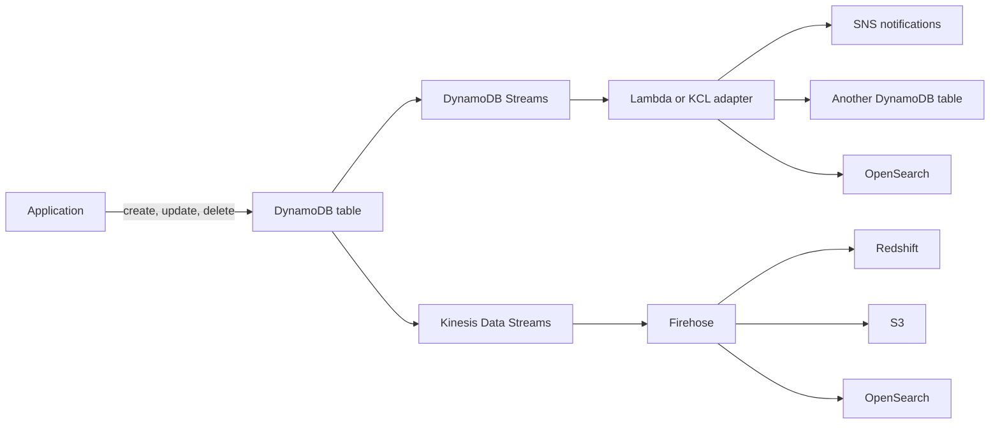

# Amazon DynamoDB

Concept-only note. Lab steps: [[19 - Serverless Overviews]] and [[21 - Databases in AWS]] in Version B (chapter notes 19 and 21). Related: [[Lambda]], [[ElastiCache]], [[Other Databases & Choosing a DB]].

## 1. What it is
(src: 19/12-Amazon DynamoDB, 21/05-DynamoDB)
- Fully managed, **serverless, proprietary AWS, NoSQL** database; highly available with replication across **multiple AZs by default**. Not relational, but supports **transactions**.
- Scale: millions of requests/second, trillions of rows, hundreds of TB; **single-digit millisecond** latency, consistent. Reads and writes are decoupled.
- Security/authz/admin through **IAM**; no maintenance or patching; low cost; auto scaling.
- There is no "database" to create: the service is the database, you create **tables**.
- **Table classes**: *Standard* (frequently accessed) and *Standard-IA* (infrequently accessed).

## 2. Data model
(src: 19/12, 19/13-Amazon DynamoDB - Hands-On (concept only))
- Table = items (rows) with attributes (columns). **Primary key** chosen at creation: **partition key**, optionally plus **sort key**.
- Unlimited items; attributes can be added any time and can be null; items in one table may carry different attributes (unlike RDS/Aurora where schema changes are hard).
- **Max item size 400 KB** - not for large objects.
- Types: scalar (String, Number, Binary, Boolean, Null), List, Map, Set.

> [!tip] Exam
> "Schema must evolve rapidly / flexible schema" -> DynamoDB over RDS/Aurora. Use cases: serverless apps with small documents (hundreds of KB max), and a distributed serverless cache / key-value store (can replace ElastiCache for session data with TTL).

## 3. Capacity modes
(src: 19/12, 19/13, 21/05)

| | Provisioned (default) | On-Demand |
|---|---|---|
| Capacity | You set **RCU / WCU** in advance (reads/writes per second) | Scales automatically; **no RCU/WCU concept** |
| Pay | Per provisioned RCU/WCU | Per request (every read and write) |
| Auto scaling | Optional: min / max / target utilization (e.g. 70%) adjusts RCU/WCU to load | n/a |
| Best for | Predictable, smoothly changing load; cost saving | Unpredictable load, sudden steep spikes, or very few transactions (4-5 a day) |

- Instructor: on-demand is **2-3x more expensive** than provisioned [verify]
> [!warning] Correction [note]
> AWS cut on-demand throughput prices by **50%** (and global tables by up to 67%) effective 1 Nov 2024, so the 2-3x gap no longer holds. Source: [AWS Database Blog - DynamoDB lowers pricing for on-demand throughput and global tables](https://aws.amazon.com/blogs/database/new-amazon-dynamodb-lowers-pricing-for-on-demand-throughput-and-global-tables/) (from search results; exact new ratio unconfirmed).

> [!tip] Exam
> Traffic going from 1,000 to 1 million transactions in under a minute -> provisioned mode does not scale fast enough -> **On-Demand**.

## 4. DAX (DynamoDB Accelerator)
(src: 19/14-Amazon DynamoDB - Advanced Features, 21/05)
- Fully managed, highly available, **in-memory cache** for DynamoDB; **microsecond** latency for cached reads; solves read congestion.
- **No application logic change**: compatible with existing DynamoDB APIs; app connects to the DAX cluster (several cache nodes).
- Default cache **TTL 5 minutes** (configurable).
- DAX vs ElastiCache: DAX caches individual objects and query/scan results; ElastiCache suits storing **aggregation / heavy computation results**. Complementary, not drop-in replacements.

## 5. Streams and event processing
(src: 19/14, 21/05)
Capture every create/update/delete. Uses: react in real time (welcome email), usage analytics, derived tables, cross-region replication, invoke Lambda.

| | DynamoDB Streams | Kinesis Data Streams |
|---|---|---|
| Retention | **24 hours** | up to **1 year** |
| Consumers | limited number | many more |
| Processing | Lambda triggers, DynamoDB Streams Kinesis Adapter (KCL) on EC2/Lambda | Lambda, Kinesis Data Analytics, Firehose, Glue streaming ETL, ... |

> [!info] Diagram
> **Explanation:** Table changes go to either DynamoDB Streams (processed by Lambda or a KCL consumer for notifications, derived tables, search indexing) or Kinesis Data Streams (delivered by Firehose to Redshift, S3 or OpenSearch). This is the lecture's example; other consumers are possible.
> **Reference:** [Change data capture for DynamoDB Streams (Amazon DynamoDB Developer Guide)](https://docs.aws.amazon.com/amazondynamodb/latest/developerguide/Streams.html) - confirms the 24-hour stream retention, ordered records, and Lambda / Kinesis Adapter consumers; the downstream targets in the diagram are the instructor's example.

## 6. Global tables
(src: 19/14, 21/05)
- Table replicated across **multiple Regions** with **two-way, active-active** replication: read and write in any Region, low latency everywhere.
- Instructor: **DynamoDB Streams must be enabled** first, as it is the underlying replication mechanism.

> [!tip] Exam
> Global tables = active-active multi-region. (AWS docs describe them as multi-active, multi-Region with any replica serving reads and writes: [Global tables](https://docs.aws.amazon.com/amazondynamodb/latest/developerguide/GlobalTables.html).)

## 7. TTL
(src: 19/14, 21/05)
- Automatically **expires and deletes items** after an expiry timestamp attribute (Unix epoch, e.g. `ExpTime`); deletion happens eventually via a background process.
- Use cases: keep only recent data, regulatory deletion (e.g. after 2 years), **web session handling** (e.g. session kept 2 hours in a central table).

## 8. Backup and DR
(src: 19/14, 21/05)
- **PITR (continuous backups)**: optional; restore to any point in the last **35 days**; restore creates a **new table**.
- **On-demand backups**: kept until deleted explicitly; no performance/latency impact; restore creates a new table.
- **AWS Backup** adds lifecycle policies and **cross-region copy** for DR. See [[Disaster Recovery & Backup]].

## 9. S3 integration
(src: 19/14, 21/05)
- **Export to S3**: requires **PITR**; any point in the last 35 days; **no read capacity used**, no performance impact; formats **DynamoDB JSON** or **ION**. Uses: analytics with [[Athena, Glue & Lake Formation]], audit snapshots, ETL before re-import.
- **Import from S3**: CSV, JSON or ION into a **new table**; **no write capacity consumed**; errors logged in CloudWatch Logs.

## Not included here
- 19/13 Amazon DynamoDB - Hands-On (console steps; table-creation concepts kept above; instructor's cost estimate 71 cents/month for 1 RCU + 1 WCU omitted as screen detail).
- 21/06 S3 (belongs to [[S3]]); other 21 lectures in [[Other Databases & Choosing a DB]].
