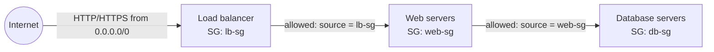
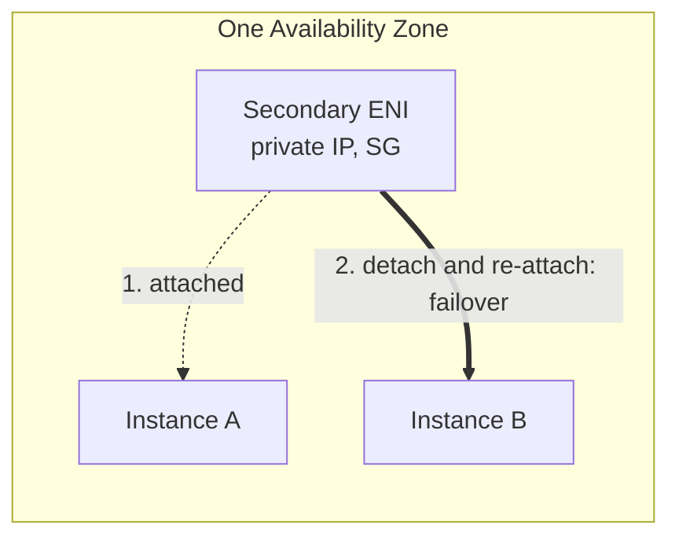
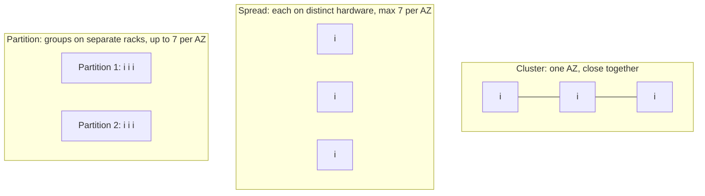
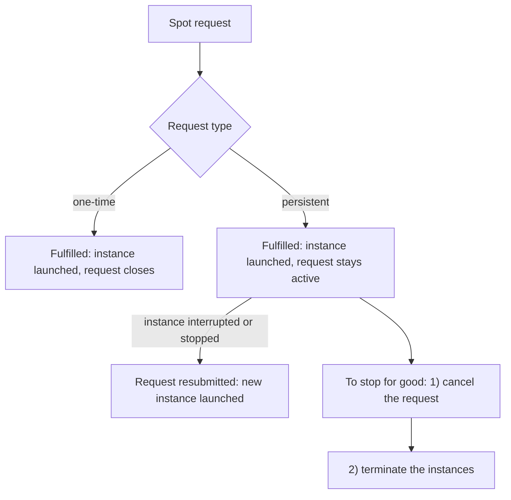

# Amazon EC2 (Elastic Compute Cloud)

Concept-only note. Merged across chapters 05, 06 and the AMI / Instance Store lectures of 07. Hands-on narration is intentionally left out (see [[05 - EC2 Fundamentals]] in Version B for the lab steps). EBS and EFS belong in their own notes: [[EBS]], [[EFS]].

## 1. What EC2 is
(src: 05/02-EC2 Basics)
- IaaS on AWS: rent **virtual machines (instances)**; part of a family of building blocks: EBS volumes, ELB, ASG.
- Choose per instance: OS (Linux, Windows, macOS), CPU, RAM, storage (network-attached EBS/EFS or hardware-attached **instance store**), network card and public IP, **security group**, **User Data**.
- **User Data = bootstrap script**: runs **once, at first boot**, as **root**; automates updates, installs, downloads; more work = slower boot.

> [!tip] Exam
> EC2 User Data runs only at first launch, with root privileges.

## 2. Instance types
(src: 05/04-EC2 Instance Types Basics)
- Naming `m5.2xlarge` = class `m` + generation `5` + size `2xlarge`.

| Family | Typical use | Prefix examples |
|---|---|---|
| General purpose | balanced; web servers, code repositories | T, M |
| Compute optimized | batch processing, media transcoding, high performance web servers, HPC, ML, gaming servers | C |
| Memory optimized | in-memory DBs, distributed caches (ElastiCache), BI, real-time big data processing | R, X1, High Memory, Z1 |
| Storage optimized | high local I/O: OLTP, relational/NoSQL, Redis, data warehousing, distributed file systems | I, D, H1 |
| Accelerated computing, HPC optimized | (named only) | - |

- Examples: t2.micro = 1 vCPU / 1 GB; r5.16xlarge = 16 vCPU / 512 GB; c5d.4xlarge = 16 vCPU / 32 GB. Names need not be memorized; families and use cases do.

## 3. AMI (Amazon Machine Image)
(src: 07/05-AMI Overview)
- An AMI is the customization of an instance: OS, software configuration, monitoring tools. Custom AMIs = **faster boot/configuration** because software is pre-packaged.
- AMIs are **built for a region**, and can be **copied across regions**.
- Sources: **public AMI** (AWS-provided, e.g. Amazon Linux 2), **your own AMI** (you build and maintain it), **AWS Marketplace AMI** (made and possibly sold by others).
- Process: launch and customize an instance -> **stop it** (data integrity) -> create the AMI (**EBS snapshots are created behind the scenes**) -> launch instances from it, including in other AZs.

[verify] The lecture uses Amazon Linux 2 as the standard public AMI.
> [!warning] Correction [note]
> AWS states Amazon Linux 2 reached end of support on 30 June 2026 and recommends Amazon Linux 2023. Source: [Amazon Linux 2 FAQs](https://aws.amazon.com/amazon-linux-2/faqs/).

## 4. Security groups
(src: 05/05-Security Groups & Classic Ports Overview, 05/06-Security Groups Hands On)
- Instance-level firewall controlling **inbound and outbound** traffic; **allow rules only**.
- Rule fields: type, protocol, port, source (IPv4/IPv6 CIDR, **another security group**, prefix list). `0.0.0.0/0` = everything.
- **Defaults**: all inbound blocked; all outbound allowed.
- Scope and attachment: many instances <-> many security groups (rules add up); tied to a **region/VPC combination**; enforced **outside** the instance.
- Good practice: separate SG for SSH. "My IP" source breaks if your IP changes.
- **Timeout -> security group**; **connection refused -> application** (traffic got through).
- **Referencing another SG** authorizes members of that group regardless of their IPs (common with load balancers).

> [!info] Diagram
> **Explanation:** Each tier has its own security group; inbound rules name the previous tier's SG as the source, so access follows group membership rather than IP addresses.
> **Reference:** [Security group rules - Security group referencing (Amazon VPC User Guide)](https://docs.aws.amazon.com/vpc/latest/userguide/security-group-rules.html)

| Port | Protocol / use |
|---|---|
| 22 | SSH (Linux login) and SFTP |
| 21 | FTP |
| 80 | HTTP |
| 443 | HTTPS |
| 3389 | RDP (Windows login) |

> [!tip] Exam
> Timeout = SG. Refused = app. 22 = SSH/Linux, 3389 = RDP/Windows. SG can reference SGs.

## 5. Connecting to instances
(src: 05/07-SSH Overview, 05/08-How to SSH using Linux or Mac, 05/09-How to SSH using Windows, 05/10-How to SSH using Windows 10, 05/12-EC2 Instance Connect)
- **SSH** (port 22): Mac/Linux and Windows 10+ via terminal; **PuTTY** for older Windows (needs `.ppk` key; `.pem` for others); default user on Amazon Linux is **`ec2-user`**.
- **EC2 Instance Connect**: browser-based; AWS pushes a **temporary SSH key**, so no key management; still needs **port 22** open (and IPv6 rules in some setups).
- Typical SSH errors: *too many authentication failures* (no key); *unprotected key file* (key permissions too open; Linux/Mac `0400`).

[verify] "EC2 Instance Connect only works with Amazon Linux 2."
> [!warning] Correction [note]
> AWS documents EC2 Instance Connect for Amazon Linux 2, AL2023 and Ubuntu (default users `ec2-user` / `ubuntu`). Source: [Connect using EC2 Instance Connect](https://docs.aws.amazon.com/AWSEC2/latest/UserGuide/ec2-instance-connect-methods.html).

## 6. Credentials: use IAM roles
(src: 05/13-EC2 Instance Roles Demo)
- Never store IAM access keys (`aws configure`) on an instance: anyone with access to the instance can read them.
- Attach an **IAM role** to the instance; permissions follow the role's policies (changes can take a short time to propagate).

> [!tip] Exam
> Give EC2 access to AWS services with an IAM role, not access keys. See [[IAM]].

## 7. IP addressing
(src: 06/01-Private vs Public vs Elastic IP, 05/03, 06/02)
- **IPv4** ~3.7 billion public addresses; **IPv6** exists (IoT oriented); the course uses IPv4.
- **Public IP**: reachable on the internet, globally unique. **Private IP**: only within the private network (unique only inside it; different networks can reuse ranges); private machines reach the internet through an **internet gateway / NAT device**.
- An instance gets a private IP and (by default) a public IP. **SSH from the internet needs the public IP** (private works only over VPN/same network).
- **Stop then start -> public IPv4 may change; private IPv4 stays**. A plain reboot does not change it.
- **Elastic IP**: a public IPv4 you own until released; attaches to **one instance at a time**; masks failure by remapping to another instance; **5 per account/region by default** (can be raised). It stays with a stopped instance.
- The instructor's guidance: **avoid Elastic IPs** (poor architecture); prefer a random public IP + **DNS name** ([[Route 53]]), or better a **load balancer** ([[ELB]]) with no public IP on instances.

[verify] "Public IPv4/Elastic IP cost about $0.005/hour (~$3.50/month), with 750 free hours/month of public IPv4 in the free tier."
> [!warning] Correction [note]
> AWS says all public IPv4 addresses are charged, including those on running instances and Elastic IPs, whether in use or idle. The default quota of 5 Elastic IPs per Region is confirmed. The free-tier hours and exact price were not confirmed. Source: [Elastic IP addresses](https://docs.aws.amazon.com/AWSEC2/latest/UserGuide/elastic-ip-addresses-eip.html).

## 8. Elastic Network Interfaces (ENI)
(src: 06/05-Elastic Network Interfaces (ENI) - Overview, 06/06-ENI Hands On; 06/07 has no transcript)
- ENI = **logical virtual network card in a VPC**; gives an instance network access (primary `eth0`).
- Attributes: **primary private IPv4** + secondary private IPv4s; one Elastic IP per private IPv4; one or more public IPv4; **security groups**; MAC address.
- **Bound to one AZ.** Can be created independently, attached/detached on the fly, and **moved between instances for failover** (the private IP moves with it).
- ENIs created with an instance are **deleted when it terminates**; manually created ENIs **stay**.

> [!info] Diagram
> **Explanation:** A secondary network interface carries its private IP and security groups. Detaching it from instance A and attaching it to instance B in the same AZ redirects traffic to B. This is the lecture's failover example.
> **Reference:** [Elastic network interfaces (Amazon EC2 User Guide)](https://docs.aws.amazon.com/AWSEC2/latest/UserGuide/using-eni.html) - "When you move a network interface from one instance to another, network traffic is redirected from the original instance to the new instance."

> [!tip] Exam
> ENI = AZ-bound, movable network card for failover; keeps its private IP and SGs.

## 9. Placement groups
(src: 06/03-EC2 Placement Groups, 06/04 settings only)
You influence how instances are placed on AWS hardware (no direct hardware access).

| Strategy | Layout | Pros | Cons / limits | Use cases |
|---|---|---|---|---|
| **Cluster** | same rack/low-latency hardware, **single AZ** | ~**10 Gbps** between instances (enhanced networking), low latency, high throughput | AZ failure = all fail | big data jobs needing speed; tight-coupled low-latency apps |
| **Spread** | each instance on **distinct hardware**, can span **multiple AZs** | minimal correlated failure | **max 7 running instances per AZ per group** | critical applications needing isolation |
| **Partition** | instances in **partitions = separate racks**; up to **7 partitions per AZ**, multi-AZ | hundreds of instances; failure isolated per partition; partition info via metadata | app must be partition-aware | HDFS, HBase, Cassandra, Kafka |
| **Precision time** | hardware with direct high-precision time sources (Amazon Time Sync, PTP hardware clock, packet timestamping) | very accurate clocks | specialized | distributed DBs, financial timestamping, event ordering |

> [!info] Diagram
> **Explanation:** Cluster trades resilience for network performance (one AZ). Spread places each instance on its own hardware for isolation (7 per AZ). Partition groups many instances into partitions with their own racks, so a rack failure affects only one partition.
> **Reference:** [Placement strategies for your placement groups (Amazon EC2 User Guide)](https://docs.aws.amazon.com/AWSEC2/latest/UserGuide/placement-strategies.html) - confirms single-AZ cluster, 7 instances per AZ for rack-level spread, up to 7 partitions per AZ.

> [!tip] Exam
> Low latency/high throughput -> Cluster. Max isolation of few critical instances -> Spread (7 per AZ). Big distributed data stores -> Partition.

## 10. Hibernate
(src: 06/08-EC2 Hibernate, 06/09 settings only)
- Stop keeps EBS data; terminate deletes the root volume if so configured. A normal start re-boots the OS, runs the User Data again only the first time, then warms the application.
- **Hibernate**: RAM contents are **written to the root EBS volume**; the OS is frozen not shut down; on start RAM is reloaded, so the instance resumes **as if never stopped** (faster boot, preserves in-memory state, long-running processes).
- Requirements/limits: **root volume must be EBS and encrypted**, big enough for the RAM; instance **RAM < 150 GB**; **not for bare metal**; Linux and Windows; works for **On-Demand, Reserved and Spot**; hibernation meant for **no more than 60 days**; hibernation must be enabled at launch (stop-hibernate behavior).

> [!warning] Correction [note]
> AWS confirms: RAM size below 150 GiB for Linux (Windows: 16 GiB or less), encrypted EBS root volume, no bare metal, supported for On-Demand and Spot (Spot needs a persistent request), and hibernation cannot be enabled on an existing instance. The **60-day** limit was not found on that page. Source: [Prerequisites for EC2 instance hibernation](https://docs.aws.amazon.com/AWSEC2/latest/UserGuide/hibernating-prerequisites.html).

[verify] "Hibernation is meant to be no more than 60 days."

> [!tip] Exam
> Hibernate = RAM state saved to encrypted EBS root volume; instance resumes with processes intact.

## 11. EC2 Instance Store
(src: 07/07-EC2 Instance Store)
- **Hardware disk physically attached** to the host server: very high I/O (example: I3 instances reach millions of random read/write IOPS vs ~32,000 for a gp2 EBS volume).
- **Ephemeral**: data is **lost if the instance is stopped or terminated**, or if the underlying hardware fails; backups/replication are **your responsibility**.
- Use for buffers, caches, scratch/temporary data; **not** long-term storage (use [[EBS]]).

> [!tip] Exam
> "Very high performance hardware-attached volume" -> EC2 Instance Store. Not durable.

## 12. Purchasing options
(src: 05/14-EC2 Instance Purchasing Options)

| Option | Commitment | Discount | Key facts | Best for |
|---|---|---|---|---|
| **On-Demand** | none | none | pay per use, highest cost | short, unpredictable, uninterrupted |
| **Reserved (Standard)** | 1 or 3 yrs | up to **72%** | fixed type/region/tenancy/OS; no/partial/all upfront; regional or **zonal (reserves capacity in AZ)**; sell in RI Marketplace | steady-state, DBs |
| **Convertible RI** | 1 or 3 yrs | up to **66%** | can change type, family, OS, scope, tenancy | steady-state with flexibility |
| **Savings Plans** | **$/hour**, 1 or 3 yrs | ~up to 70% | excess billed On-Demand; **EC2 Instance Savings Plan**: locked to family + region, flexible on size, OS, tenancy | long workloads, flexibility |
| **Spot** | none | up to **90%** | can be reclaimed any time | resilient/flexible workloads; **not critical jobs or databases** |
| **Dedicated Host** | on-demand or reserved 1/3 yrs | reservation up to ~70% | **whole physical server**, visibility of sockets/cores | BYOL (per socket/core/VM), compliance; most expensive |
| **Dedicated Instances** | - | - | hardware dedicated to you; may share with your other instances; **no placement control** | hardware not shared with other customers |
| **Capacity Reservation** | none, cancel any time | **none** | reserve On-Demand capacity in a **specific AZ**; billed On-Demand rate whether used or not | guaranteed capacity; combine with RIs/Savings Plans for discounts |

- Resort analogy: On-Demand = walk in; Reserved = long stay discount; Savings Plan = commit spend, change rooms; Spot = last-minute rooms you can lose; Dedicated Host = whole building; Capacity Reservation = pay for a room you may not use.
- Price example (m4.large, us-east-1; On-Demand ~$0.10/h): Spot up to ~61% off; RI/Savings Plan depend on term and upfront.

> [!tip] Exam
> Pick by workload: Spot for resilient batch; Dedicated Host for licenses/compliance; Capacity Reservation = capacity not discount; Savings Plan = $/hour commitment.

[verify] "Linux/Windows billed per second after the first minute; other OSes per hour."
> [!warning] Correction [note]
> AWS documents per-second billing with a 60-second minimum for running On-Demand instances and does not mention a per-hour exception on that page. Source: [Purchasing On-Demand Instances](https://docs.aws.amazon.com/AWSEC2/latest/UserGuide/ec2-on-demand-instances.html).

## 13. Spot Instances and Spot Fleet
(src: 05/15-Spot Instances & Spot Fleet, 05/16 settings only)
- Up to 90% off; price varies by AZ and over time; on interruption you can **stop or terminate** with a **2-minute grace period** to shut down gracefully. Use for batch jobs, data analysis, failure-resilient workloads.
- Spot request: count, max price, launch spec (AMI...), valid from/until, **type**:
  - **One-time** - fulfil once, request closes;
  - **Persistent** - request keeps the target count and **relaunches** after interruption/stop (until expiry).
- Cancel only when **open, active or disabled**. **Cancelling a request does not terminate instances.** To remove persistent Spot capacity: **cancel the request first, then terminate the instances** (else it relaunches them).
- **Spot Fleet** = Spot (+ optional On-Demand) instances to meet a **target capacity** across multiple **launch pools** (type, OS, AZ); stops when budget or capacity reached.
- Allocation strategies:

| Strategy | Behavior | Best for |
|---|---|---|
| `lowestPrice` | cheapest pool | short workloads, cost |
| `diversified` | spread across all pools | availability, long workloads |
| `capacityOptimized` | pool with optimal capacity | fewer interruptions |
| `priceCapacityOptimized` | highest-capacity pools first, then lowest price | **best for most workloads** |

> [!info] Diagram
> **Explanation:** One-time requests end after launch; persistent requests replace interrupted instances. Cancel before terminating or the request relaunches them. Simplified from the lecture.
> **Reference:** [Create a Spot Instance request - request types (Amazon EC2 User Guide)](https://docs.aws.amazon.com/AWSEC2/latest/UserGuide/spot-requests.html). The cancel-then-terminate order comes from the lecture, not that page.

[verify] "If the spot price goes above your max price, you lose the instance."
> [!warning] Correction [note]
> AWS recommends **No maximum price**: you pay the current Spot price (capped at On-Demand) regardless of any maximum; setting a maximum makes interruptions **more frequent**. Instances can also be interrupted for capacity reasons. Sources: [Create a Spot Instance request](https://docs.aws.amazon.com/AWSEC2/latest/UserGuide/spot-requests.html), [Spot Instance interruptions](https://docs.aws.amazon.com/AWSEC2/latest/UserGuide/spot-interruptions.html).

> [!tip] Exam
> Spot Fleet strategies: lowestPrice, diversified, capacityOptimized, priceCapacityOptimized. Cancel the request, then terminate instances.

## Not included here
- Budget/billing setup (05/01) -> belongs in a Billing & Cost Management note.
- EBS volumes, snapshots, encryption, EFS (ch 07) -> [[EBS]], [[EFS]].
- Lectures without transcript: 05/11 SSH Troubleshooting, 06/07 ENI Extra Reading.
