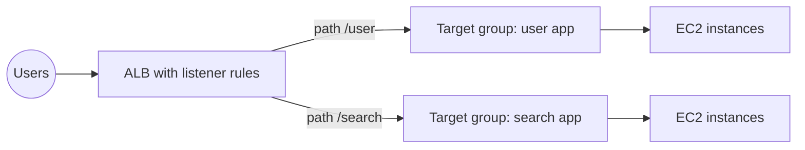
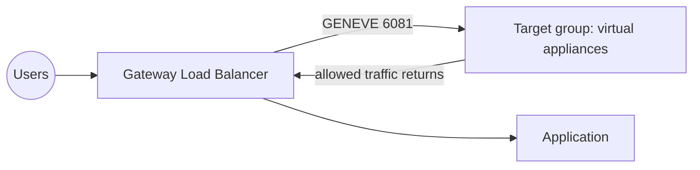
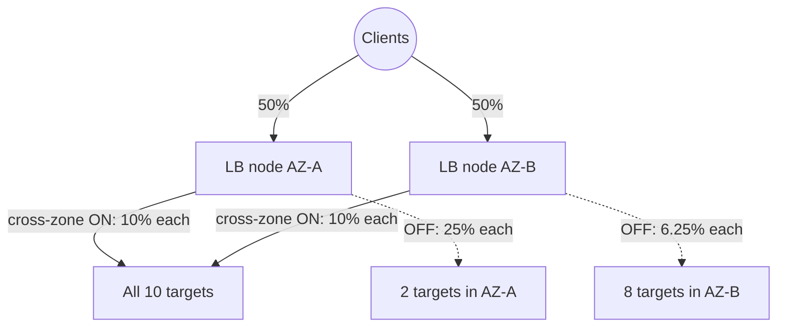

# Elastic Load Balancing (ELB)

Concept-only note covering scalability / high availability basics and the four load balancer types. Lab steps are in [[08 - High Availability and Scalability - ELB & ASG]] (Version B). Auto scaling is in [[ASG]].

## 1. Scalability vs high availability
(src: 08/01-High Availability and Scalability)

| Term | Meaning | Example |
|---|---|---|
| **Vertical scalability** | bigger instance (scale up/down) | t2.micro -> t2.large; common for **non-distributed systems such as databases** (RDS, ElastiCache); limited by hardware |
| **Horizontal scalability (elasticity)** | more instances (scale **out** / **in**) | implies a distributed system; typical for web/modern apps; easy with EC2 |
| **High availability** | run in **at least 2 AZs / data centers** to survive a data-center loss | ASG multi-AZ, load balancer multi-AZ |

- HA often goes with horizontal scaling but not always. HA can be **passive** (RDS Multi-AZ) or **active** (horizontal scaling across AZs).
- EC2 range quoted: smallest `t2.nano` (0.5 GB RAM, 1 vCPU) to `u-12tb1.metal` (12.3 TB RAM, 450 vCPUs); these will grow over time.
- Call-center analogy: junior -> senior operator = vertical; hire more operators = horizontal; offices in two cities = HA.

> [!tip] Exam
> Scale up/down = vertical. Scale out/in = horizontal. HA = multiple AZs. Questions can trick you on these terms.

## 2. What a load balancer does
(src: 08/02-Elastic Load Balancing (ELB) Overview)
- Forwards incoming traffic to multiple **downstream EC2 instances**; users see **one endpoint** (a fixed DNS host name) and do not know the backend.
- Benefits: single point of access, seamless handling of backend failure via **health checks**, **SSL termination (HTTPS)**, **stickiness with cookies**, **HA across zones**, separating public from private traffic.
- ELB is a **managed** service: AWS handles upgrades, maintenance, high availability; you only get a few configuration knobs. Cheaper and far simpler than running your own.
- Integrates with EC2, ASG, ECS, ACM, CloudWatch, [[Route 53]], WAF, Global Accelerator.

### Health checks
- Check a **protocol + port + route** (example: HTTP, port 4567, `/health`).
- Anything other than an OK response (**HTTP 200**) marks the instance **unhealthy**; no traffic is sent to it.
- Health checks are configured at the **target group** level.

## 3. The four load balancer types
(src: 08/02, 08/03, 08/06, 08/08, 08/04)

| Type | Since | Layer | Protocols | Notes |
|---|---|---|---|---|
| **Classic (CLB)** | 2009, v1 / previous generation | - | HTTP, HTTPS, TCP, SSL (secure TCP) | AWS does not want you to use it; shown as deprecated in the console |
| **Application (ALB)** | 2016 | **7** | HTTP, HTTPS, **WebSocket**, HTTP/2 | content-based routing |
| **Network (NLB)** | 2017 | **4** | TCP, TLS (secure TCP), **UDP** | ultra-high performance, static IP |
| **Gateway (GWLB)** | 2020 | **3** | IP packets | third-party network appliances |

- Use the newer generations: more features.
- Each can be **internal (private)** or **external (public)**.

[verify] The instructor says the Classic Load Balancer "is going away" and "will be retired very soon".
> [!warning] Correction [note]
> AWS documentation calls Classic Load Balancers the **previous generation** and recommends migrating to a current-generation load balancer. The page fetched does not announce a retirement date. Source: [What is a Classic Load Balancer?](https://docs.aws.amazon.com/elasticloadbalancing/latest/classic/introduction.html). Retirement is unconfirmed.

## 4. Security groups with a load balancer
(src: 08/02, 08/05 concept)

| SG | Inbound rule |
|---|---|
| Load balancer SG | ports **80 / 443** from `0.0.0.0/0` (anywhere) |
| EC2 instance SG | port 80, **source = the load balancer's security group** (not an IP range) |

- Effect: instances accept traffic **only** if it originates from the load balancer; direct access to the instance times out.
- NLB: you can (and, per the instructor, should) also attach a security group to the NLB; the instances' SG must then allow the NLB's SG too, otherwise targets fail health checks and show **unhealthy**.

> [!tip] Exam
> SG chaining: instance SG references the LB SG. See [[EC2]] for security group basics.

## 5. Application Load Balancer (ALB)
(src: 08/03-Application Load Balancer (ALB), 08/04 and 08/05 concepts)
- **Layer 7 only (HTTP/HTTPS/WebSocket)**; supports HTTP/2 and **redirects** (e.g. HTTP -> HTTPS at the LB).
- Load balances to **multiple applications** on the same or different machines, grouped in **target groups**. One ALB can front many apps (a CLB needs one load balancer per application).
- Great for **microservices and container-based apps**; has **dynamic port mapping** for ECS (see [[Containers (ECS, ECR, EKS)]]).
- Fixed DNS host name (like CLB).

### Routing (listener rules)
- Rules have **conditions**, an **action** and a **priority**.
- Routing on: **URL path** (`/users`, `/posts`), **host name** (`one.example.com`), **query string** / parameters (`?Platform=Mobile`), **HTTP headers**, HTTP method, source IP.
- Actions: **forward** to one or more target groups, **redirect** (URL, protocol, status code), **fixed response** (e.g. 404 custom message).
- Rule priority runs from 1 (highest) up to **50,000**; the lowest number wins when several rules match; there is also a default rule. The instructor mentions roughly **100 rules** per listener (a limit that can change).

### Target groups
- Targets: **EC2 instances** (can be managed by an ASG), **ECS tasks**, **Lambda functions**, **private IP addresses** (including on-premises servers over a connection).
- **Health checks are done at the target group level**; ALB routes to multiple target groups.

### Client IP
- The ALB terminates the connection; targets see the **ALB's private IP**. The real client IP is in **`X-Forwarded-For`**, port in **`X-Forwarded-Port`**, protocol in **`X-Forwarded-Proto`**.

> [!info] Diagram
> **Explanation:** One internet-facing ALB evaluates listener rules in priority order and forwards each request to the target group matching the rule (here by URL path); health checks run per target group. Mirrors the lecture's two-microservice example.
> **Reference:** [How Elastic Load Balancing works - request routing (ELB User Guide)](https://docs.aws.amazon.com/elasticloadbalancing/latest/userguide/how-elastic-load-balancing-works.html)

> [!tip] Exam
> Path/host/query/header routing, microservices, containers, Lambda targets -> ALB. Real client IP -> `X-Forwarded-For`.

## 6. Network Load Balancer (NLB)
(src: 08/06-Network Load Balancer (NLB), 08/07 concepts)
- **Layer 4**: **TCP, UDP** (and TLS). "UDP or TCP in the exam -> think NLB".
- **Millions of requests per second, ultra-low latency.**
- **One static IP per AZ**, and you can attach an **Elastic IP per AZ**. Needed when clients must whitelist a small set of fixed IPs.
- Target groups: **EC2 instances** and **private IP addresses** (hard-coded; EC2 or on-premises). NLB can sit **in front of an ALB** (fixed IPs from NLB + HTTP rules from ALB).
- **Health checks** support **TCP, HTTP, HTTPS**.
- Listener protocols seen: TCP, TCP_UDP, TLS, UDP.

> [!tip] Exam
> Extreme performance, TCP/UDP, or static / Elastic IPs -> NLB. NLB in front of ALB is a valid combination.

## 7. Gateway Load Balancer (GWLB)
(src: 08/08-Gateway Load Balancer (GWLB))
- Deploy, scale and manage a **fleet of third-party network virtual appliances**: firewalls, **intrusion detection / prevention (IDS/IPS)**, **deep packet inspection**, payload modification.
- **Layer 3 (IP packets)**. Two functions: a **transparent network gateway** (single entry and exit for all VPC traffic) and a **load balancer** across the appliances.
- Route tables in the VPC are updated so traffic goes **GWLB -> appliances -> back to GWLB -> application**; appliances may drop traffic. Transparent to the application.
- Protocol: **GENEVE on port 6081**.
- Target groups: **EC2 instances** (by instance ID) or **private IP addresses** (e.g. appliances on-premises).
- The instructor skips a lab; expect only high-level questions.

> [!info] Diagram
> **Explanation:** All traffic first goes through the GWLB, which spreads it across appliances (firewall, IDS/IPS, DPI). Approved traffic returns to the GWLB and is forwarded to the application; rejected traffic is dropped. Simplified (the real design uses GWLB endpoints and route tables).
> **Reference:** [What is a Gateway Load Balancer? (ELB Gateway User Guide)](https://docs.aws.amazon.com/elasticloadbalancing/latest/gateway/introduction.html)

> [!tip] Exam
> Third-party security appliances / traffic inspection, **GENEVE port 6081**, layer 3 -> Gateway Load Balancer.

## 8. Sticky sessions (session affinity)
(src: 08/09-Elastic Load Balancer - Sticky Sessions)
- A client keeps going to the **same backend instance** (so session data such as login is not lost).
- Works for **CLB, ALB, NLB**. Implemented with a **cookie with an expiration date**; after expiry the client may land on another instance.
- Downside: possible **load imbalance** across instances.
- Enabled at the **target group** level; duration **1 second to 7 days** (default shown: 1 day).

| Cookie type | Generated by | Name | Notes |
|---|---|---|---|
| **Application-based (custom)** | the target (your app) | you choose it per target group; **not** `AWSALB`, `AWSALBAPP`, `AWSALBTG` (reserved) | can include custom attributes |
| **Application-based (ALB-generated)** | the load balancer | `AWSALBAPP` | companion to the app cookie |
| **Duration-based** | the load balancer | **`AWSALB`** (ALB), **`AWSELB`** (CLB) | expiry set by duration |

- Exact names need not be memorized; know there are application-based and duration-based cookies (relevant again for CloudFront).

> [!warning] Correction [note]
> AWS notes that duration-based and ALB-generated application cookies carry their own non-configurable 7-day expiry, and stickiness is not supported when cross-zone load balancing is turned off at the target group. Source: [Edit target group attributes for your ALB](https://docs.aws.amazon.com/elasticloadbalancing/latest/application/edit-target-group-attributes.html).

## 9. Cross-zone load balancing
(src: 08/10-Elastic Load Balancer - Cross Zone Load Balancing)
- **Enabled**: each LB node spreads traffic **evenly across all registered instances in all AZs**.
- **Disabled**: each node sends traffic only to instances **in its own AZ**.
- Example (2 instances in AZ-A, 8 in AZ-B; each node gets 50% of client traffic): enabled = **10% per instance**; disabled = **25% per instance in A, 6.25% per instance in B**.

> [!info] Diagram
> **Explanation:** Solid arrows: with cross-zone on, both nodes spread over all 10 targets so each gets 10%. Dotted arrows: with it off, each node serves only its own AZ, so the 2 targets in AZ-A get 25% each and the 8 in AZ-B 6.25% each.
> **Reference:** [How Elastic Load Balancing works - cross-zone load balancing (ELB User Guide)](https://docs.aws.amazon.com/elasticloadbalancing/latest/userguide/how-elastic-load-balancing-works.html)

| Load balancer | Default | Inter-AZ data charge |
|---|---|---|
| **ALB** | **Enabled** (always on at LB level; can be turned off per **target group**) | **No charge** |
| **NLB** | **Disabled** | **Charges apply** if enabled |
| **GWLB** | **Disabled** | **Charges apply** if enabled |
| **CLB** | Disabled (per lecture) | No charge if enabled |

[verify] "Classic Load Balancer cross-zone load balancing is disabled by default."
> [!warning] Correction [note]
> For a CLB, the default depends on how it is created: **disabled** via API/CLI, but **selected by default in the console**. ALB (always on at LB level, can be disabled per target group) and NLB/GWLB (disabled by default) match the lecture. The inter-AZ charge claims were not confirmed on that page. Source: [How Elastic Load Balancing works](https://docs.aws.amazon.com/elasticloadbalancing/latest/userguide/how-elastic-load-balancing-works.html).

> [!tip] Exam
> ALB: cross-zone on by default, free. NLB / GWLB: off by default, paid if enabled.

## 10. SSL / TLS certificates
(src: 08/11-Elastic Load Balancer - SSL Certificates, 08/12 concepts)
- An SSL/TLS certificate gives **in-flight encryption** between client and load balancer. **SSL** = Secure Sockets Layer; **TLS** = Transport Layer Security (the newer version, mainly used today; people still say "SSL").
- **Public certificates** are issued by Certificate Authorities (Comodo, Symantec, GoDaddy, GlobalSign, DigiCert, Let's Encrypt...) and **expire**, so must be renewed.
- Flow: clients use **HTTPS** over the internet to the LB; the LB performs **SSL termination** and can talk **HTTP** to the instances inside the private VPC.
- The LB loads an **X.509 certificate** (server certificate), managed in **ACM (AWS Certificate Manager)**; you can also **upload your own** certificate (import into ACM; IAM as a source is not recommended).
- An **HTTPS listener** must have a **default certificate**; you can add an optional list of certificates for multiple domains.
- A **security policy** sets supported SSL/TLS versions (for legacy clients). NLB TLS listeners also offer ALPN (application-layer protocol negotiation, advanced).

### SNI (Server Name Indication)
- Solves loading **multiple certificates on one server** to serve multiple websites. The client states the **target hostname in the initial SSL handshake**; the server picks the right certificate. Newer protocol; not all clients support it.
- Works with **ALB, NLB and CloudFront**; **does not work with CLB**.

| Load balancer | Certificates |
|---|---|
| **CLB** | **one** certificate; multiple hostnames need multiple CLBs |
| **ALB** | multiple listeners, **multiple certificates**, uses **SNI** |
| **NLB** | multiple listeners, **multiple certificates**, uses **SNI** |

> [!tip] Exam
> Multiple SSL certificates on one load balancer -> ALB or NLB (SNI). CLB = one certificate. Certificates managed in ACM.

## 11. Connection draining / deregistration delay
(src: 08/13-Elastic Load Balancer - Connection Draining)
- Gives instances time to **finish in-flight requests** while being **deregistered or marked unhealthy**. The LB stops sending **new** requests to the draining instance.
- Name: **Connection Draining** on **CLB**; **Deregistration Delay** on **ALB and NLB**.
- Range **1 to 3,600 seconds**, default **300 seconds** (5 min); **0 disables** draining.
- Short requests (under a second) -> low value (e.g. 30 s) so instances go offline fast. Long requests (uploads, long-lived) -> high value, but instances stay longer.

> [!warning] Correction [note]
> AWS confirms the 300-second default and that no new requests go to a deregistering target (state `draining`, then `unused`). The 1-3,600 range was not shown on the page fetched. Source: [Edit target group attributes for your ALB](https://docs.aws.amazon.com/elasticloadbalancing/latest/application/edit-target-group-attributes.html).

## Not included here
- Hands-on narration: 08/04 and 08/05 (ALB labs), 08/07 (NLB lab), 08/12 (SSL lab); only their concepts are merged above.
- Auto Scaling Groups (08/14-17) -> [[ASG]].
- No lecture in this range lacks a transcript.
