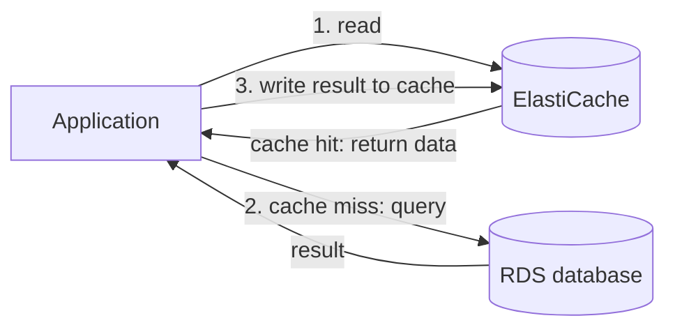

# Amazon ElastiCache

Concept-only note. The console walkthrough (creating a Redis cluster) is in [[09 - RDS, Aurora & ElastiCache]] (Version B). The database behind the cache is covered in [[RDS & Aurora]].

## 1. What ElastiCache is
(src: 09/11-ElastiCache Overview, 21/04-ElastiCache)
- Managed **Redis or Memcached** (the console also offers **Valkey**, a Redis replacement and the recommended engine): same idea as RDS, but for caches.
- A cache is an **in-memory data store** with very high performance and **sub-millisecond latency** on reads.
- Goals: **reduce load on databases** for read-intensive workloads (common queries served from cache), and make applications **stateless** by keeping state (sessions) in the cache.
- AWS handles OS maintenance, patching, optimization, setup, configuration, monitoring, failure recovery and backups; you must provision an **instance type** (node type).
- Deployment options seen: **serverless** or **node-based cluster**; can also run on premises via **AWS Outposts**.
- **You cannot use SQL** on ElastiCache. Use cases: key/value store, caching database queries, user session data.

> [!tip] Exam
> ElastiCache **requires application code changes** (query the cache before/after the database). If a question asks for caching with **no code change**, ElastiCache is not the answer.

[verify] The lecture only names Redis and Memcached as the engines.
> [!warning] Correction [note]
> AWS ElastiCache now supports **Valkey, Redis OSS and Memcached** (the lecture's own hands-on shows Valkey as the recommended option). Source: [Authenticating with IAM - Amazon ElastiCache](https://docs.aws.amazon.com/AmazonElastiCache/latest/dg/auth-iam.html) (from a search summary).

## 2. Architectures
(src: 09/11-ElastiCache Overview)
- **Cache in front of RDS**: the application queries ElastiCache first. **Cache hit** = data returned directly, no database trip. **Cache miss** = read from the database, then **write the result into the cache** so the next request hits. This relieves the RDS database.
- **User session store**: the user logs in on one application instance, which writes session data to ElastiCache; if the user is routed to another instance it reads the session from the cache and the user stays logged in.
- Hard part of caching: a **cache invalidation strategy** so only current data is served.

> [!info] Diagram
> **Explanation:** The application checks the cache first. On a miss it reads from the database and then populates the cache so that later requests are cache hits (lazy loading).
> **Reference:** [Caching strategies for Memcached - Amazon ElastiCache](https://docs.aws.amazon.com/AmazonElastiCache/latest/dg/Strategies.html) - describes the same hit / miss / write-to-cache flow for lazy loading.

## 3. Redis vs Memcached
(src: 09/11-ElastiCache Overview, 09/12-ElastiCache Hands On (concepts only))
The exam rarely asks this, but it is a reference point.

| | Redis | Memcached |
|---|---|---|
| High availability | **Multi-AZ with auto-failover**, read replicas | **No HA, no replication** |
| Scaling | Read replicas for reads; **cluster mode** = multiple shards | **Multiple nodes with sharding** (data partitioned) |
| Durability | **AOF persistence** | No persistence; a node issue can lose cache data |
| Backup / restore | Yes | Only for the **serverless** version, not self-managed |
| Data structures | Sets and **sorted sets** (leaderboards) | Simple |
| Threading | - | **Multi-threaded** |

- Redis in the hands-on: **cluster mode disabled** = one shard with **1 primary + up to 5 read replicas**; **cluster mode enabled** = multiple shards across servers. Primary endpoint for writes, reader endpoint for reads. A **subnet group** tells ElastiCache which subnets can host the cache.
- Mental picture: Redis = a node replicated to another; Memcached = several nodes sharing partitioned data.

## 4. Security
(src: 09/13-ElastiCache for Solution Architects, 09/12, 21/04)
- **IAM authentication**: for **Redis only** (per the lecture); otherwise username/password. **IAM policies** otherwise only secure **AWS API-level** actions.
- **Redis AUTH**: set a **password / token** when creating the cluster; extra layer on top of **security groups**. Also user group access control lists.
- **SSL / TLS in-flight encryption** supported; enabling it unlocks the access-control features (Redis AUTH / user groups). **Encryption at rest** with **KMS**.
- **Memcached**: **SASL-based** authentication (just remember the name).
- Also: security groups, backups/snapshots/point-in-time restore for Redis, managed scheduled maintenance, CloudWatch log export (slow logs, engine logs).

[verify] "IAM authentication is supported for Redis only."
> [!warning] Correction [note]
> AWS documents IAM authentication for **Valkey or Redis OSS version 7 or above** (not Memcached). Source: [Authenticating with IAM - Amazon ElastiCache](https://docs.aws.amazon.com/AmazonElastiCache/latest/dg/auth-iam.html) (from a search summary).

## 5. Data loading patterns
(src: 09/13-ElastiCache for Solution Architects)

| Pattern | How it works | Trade-off |
|---|---|---|
| **Lazy loading** | Only data that was **read** is cached (load on cache miss) | Data can become **stale** |
| **Write-through** | Add/update the cache **whenever data is written to the database** | **No stale data** |
| **Session store** | Sessions kept in cache, expired with **TTL** | - |

- "There are only two hard things in computer science: cache invalidation and naming things."

> [!tip] Exam
> Lazy loading = load on miss, may be stale. Write-through = update cache on every DB write, never stale. Sessions = TTL.

## 6. Redis use case: gaming leaderboard
(src: 09/13-ElastiCache for Solution Architects)
- Redis **Sorted Sets** guarantee **uniqueness and element ordering**; each new element is ranked in real time.
- Gives a **real-time leaderboard** (number 1, 2, 3...) available to all clients without building the ranking logic in the application.

> [!tip] Exam
> "Real-time gaming leaderboard" -> **ElastiCache for Redis (sorted sets)**.

## Not included here
- Hands-on cluster creation and deletion (09/12): see [[09 - RDS, Aurora & ElastiCache]]; its conceptual options are folded into sections 3 and 4.
- RDS / Aurora content: [[RDS & Aurora]].
- No transcript-less lectures in this source list.
