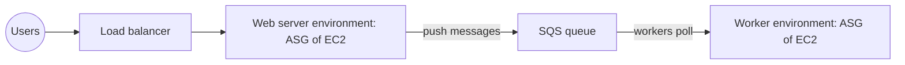

# AWS Elastic Beanstalk

Concept-only note from chapter 11. Lab steps (creating the sample Node.js environment) are in [[11 - Classic Solutions Architecture Discussions]] (Version B). Broader architecture patterns: [[Classic Solution Architectures]].

## 1. Instantiating applications quickly
(src: 11/05-Instantiating applications quickly)
- Launching a full stack (installing apps, restoring data, configuring) is slow; use the cloud to speed it up:

| Resource | Speed-up technique |
|---|---|
| **EC2** | **Golden AMI**: pre-install the app and OS dependencies, create an AMI, launch future instances from it (fastest start) |
| **EC2 (dynamic config)** | **User Data** bootstrapping for dynamic values (e.g. database URL/password); slow if it installs everything |
| **RDS** | restore from a **snapshot**: schema and data are already there (faster than big insert statements) |
| **EBS** | restore from a **snapshot**: already formatted and holding data |

- Best practice is a **hybrid**: golden AMI + User Data. **Elastic Beanstalk uses this same hybrid principle** (pre-configured AMI plus added user data).

> [!tip] Exam
> Fast startup = Golden AMI + User Data for dynamic bits; RDS/EBS from snapshots.

## 2. What Beanstalk is
(src: 11/06-Beanstalk Overview)
- Most web apps share the same architecture: load balancer + Auto Scaling group across AZs + EC2, plus RDS (with replicas) and ElastiCache. Recreating it for every app is painful.
- **Elastic Beanstalk = developer-centric, managed PaaS** view of deploying on AWS: one interface that reuses EC2, ASG, ELB, RDS, etc. It handles **capacity provisioning, load balancer configuration, scaling, application health monitoring, instance configuration**. Your responsibility is **the code**; you keep full control over each component's configuration.
- **Beanstalk itself is free; you pay for the underlying resources** (instances, ASG, ELB, RDS...).
- Behind the scenes it deploys via **CloudFormation** (events come from a CloudFormation stack, with ASG, launch configuration, security groups, Elastic IP). Beanstalk is centered on **code and environments**; CloudFormation deploys arbitrary infrastructure. See [[CloudFormation]].
- Offers a good way of updating applications (new version uploaded and deployed to the environment).

[verify] The lecture says the stack uses an Auto Scaling "launch configuration".
> [!warning] Correction [note]
> Unconfirmed in the sources I fetched. The AWS Welcome page confirms there is no extra charge for Beanstalk (pay only for the underlying resources) and notes a newer **Cluster mode on Amazon EKS** alongside the classic **Standard mode on EC2**; the lecture covers only the EC2-based (Standard) model. Source: [What is AWS Elastic Beanstalk?](https://docs.aws.amazon.com/elasticbeanstalk/latest/dg/Welcome.html).

## 3. Components and workflow
(src: 11/06-Beanstalk Overview, 11/07-Beanstalk Hands On)
- **Application**: collection of Beanstalk components (environments, versions, configurations).
- **Application version**: an iteration of your code (v1, v2, v3...).
- **Environment**: collection of AWS resources running **one application version at a time**; you can update an environment from v1 to v2. You can create **multiple environments** (dev, test, prod).
- **Tiers**: **web server environment** and **worker environment**.
- Workflow: create application -> upload version -> launch environment -> manage environment lifecycle -> upload new version and redeploy.
- Console areas per environment: health, logs, monitoring, alarms, managed updates, configuration. A service role and an **EC2 instance profile** (role for the instances) are needed.

## 4. Supported platforms
(src: 11/06-Beanstalk Overview)
- Go, Java SE, Java with Tomcat, .NET Core on Linux, .NET on Windows Server, Node.js, PHP, Python, Ruby, Packer Builder, Single Docker container, Multi Docker container, Preconfigured Docker.
- Idea: you can deploy practically anything.

[verify] Platform list as given in the lecture (e.g. Packer Builder, multi-container Docker).
> [!warning] Correction [note]
> Unconfirmed; the AWS Welcome page lists Go, Java, .NET, Node.js, PHP, Python, Ruby and Docker containers, without naming Packer Builder or multi-container Docker. Source: [What is AWS Elastic Beanstalk?](https://docs.aws.amazon.com/elasticbeanstalk/latest/dg/Welcome.html).

## 5. Web vs worker tier
(src: 11/06-Beanstalk Overview)

| | Web server tier | Worker tier |
|---|---|---|
| Clients | access via load balancer | **no direct client access** |
| Architecture | ELB -> ASG of EC2 web servers | **SQS queue** -> EC2 workers pull messages |
| Scaling | usual ASG policies | **scales on number of SQS messages** |

- Both can be combined: the web environment pushes messages to the worker environment's SQS queue. See [[SQS]].

> [!info] Diagram
> **Explanation:** The web tier serves users through a load balancer; it can push jobs to an SQS queue that the worker tier polls and processes, scaling with the queue length. The AWS page cited shows one web server and one worker environment per application.
> **Reference:** [What is AWS Elastic Beanstalk? (AWS Elastic Beanstalk Developer Guide)](https://docs.aws.amazon.com/elasticbeanstalk/latest/dg/Welcome.html)

## 6. Deployment modes
(src: 11/06-Beanstalk Overview, 11/07-Beanstalk Hands On)

| Mode | Layout | Use |
|---|---|---|
| **Single instance** | one EC2 instance with an **Elastic IP**, optionally an RDS database; managed by an ASG of one instance; free-tier eligible preset | **development** |
| **High availability with load balancer** | ELB across **multiple AZs** + ASG, optional **Multi-AZ RDS** (primary + standby) | **production** |

> [!tip] Exam
> Beanstalk = deploy code without managing infra (PaaS, free service, pay for resources). Know: application / version / environment, web vs worker (SQS), single instance (dev) vs HA with ELB (prod). Beanstalk is code-centric; CloudFormation is for arbitrary infrastructure.

## Not included here
- Hands-on narration of creating the sample Node.js environment, IAM roles in the wizard, inspecting CloudFormation/EC2/ASG/Elastic IP, and cleanup (11/07 steps) -> [[11 - Classic Solutions Architecture Discussions]].
- Other chapter 11 lectures belong to [[Classic Solution Architectures]].
- All three source lectures have transcripts.
