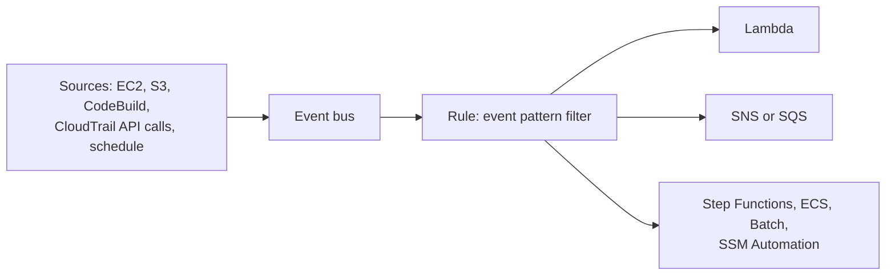
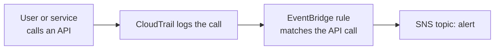

# Amazon EventBridge

Concept-only note. Console demo steps are in [[24 - Monitoring & Audit - CloudWatch, CloudTrail & Config]] (Version B). Related: [[CloudWatch]], [[CloudTrail & Config]].

## 1. What it is
(src: 24/10-EventBridge Overview (formerly CloudWatch Events))
- EventBridge was formerly **CloudWatch Events**; the exam uses the name EventBridge.
- Two uses: **schedule** (cron jobs, e.g. trigger a Lambda every hour) and **event pattern rules** reacting to something happening (e.g. **IAM root user sign-in** -> SNS -> email).
- **Sources**: EC2 state changes, CodeBuild failures, S3 events (object upload), Trusted Advisor findings, **any API call via CloudTrail**, schedules/cron (every 4 hours, Monday 8:00 am...).
- Flow: event -> optional **filter** (e.g. only a given bucket) -> EventBridge produces a **JSON document** (instance ID, time, IP...) -> **targets**.
- **Targets**: Lambda, AWS Batch, ECS task, SQS, SNS, Kinesis Data Streams, Step Functions, CodePipeline, CodeBuild, SSM Automation, EC2 actions (start/stop/reboot).

> [!info] Diagram
> **Explanation:** Sources emit events to an event bus; rules filter by pattern and route matching events to one or more targets. Pipes and Scheduler are separate EventBridge features.
> **Reference:** [What is Amazon EventBridge? (EventBridge User Guide)](https://docs.aws.amazon.com/eventbridge/latest/userguide/eb-what-is.html)

## 2. Event buses

| Bus | Source of events |
|---|---|
| **Default event bus** | AWS services (events generated by AWS) |
| **Partner event bus** | SaaS partners (Zendesk, Datadog, Auth0...); react to changes outside AWS |
| **Custom event bus** | your own applications send their own events; same rules/targets |

- **Cross-account access** with **resource-based policies**: allow/deny events from other accounts or regions. Typical use: a **central event bus** in an AWS Organization where other accounts `PutEvents` ([[Organizations & Identity Federation]]).
- **API destinations**: send events to an external HTTP endpoint.

## 3. Archive and replay
- **Archive** all events or a filtered subset, with indefinite or fixed retention; **replay** archived events for debugging or retesting a fixed function.

## 4. Schema Registry
- EventBridge **infers the schema** of events on a bus; the registry lets you **generate code** that knows the event structure; schemas are **versioned**. AWS service events have built-in schemas; custom registries possible.

## 5. Other features named in the demo lecture
(src: 24/11-Amazon EventBridge - Hands On, concepts only)
- **Rule with event pattern** (example: EC2 Instance State-change Notification filtering `state` = `shutting-down` or `terminated` -> SNS). Target options include retry policy and **dead-letter queue**; an execution role is needed.
- **EventBridge Schedule**: newer scheduler than the old "schedule rule"; **one-time** or **recurring**, **cron-based** or **rate-based**, optional flexible time window.
- **Pipes**: point-to-point from one event source to one target with optional filtering and enrichment.

## 6. CloudTrail integration (intercept API calls)
(src: 24/15-CloudTrail - EventBridge Integration)
- Every API call is logged by CloudTrail and also arrives in EventBridge as an event; build rules on a specific API to alert.

| API call (service) | Use |
|---|---|
| `DeleteTable` (DynamoDB) | notify via SNS when a table is deleted |
| `AssumeRole` (IAM) | notify when a role is assumed |
| `AuthorizeSecurityGroupIngress` (EC2) | notify on security-group inbound rule changes |

> [!info] Diagram
> **Explanation:** An API call is recorded by CloudTrail and appears as an event in EventBridge; a rule matching that API (e.g. DeleteTable) sends an SNS notification.
> **Reference:** [Events in Amazon EventBridge](https://docs.aws.amazon.com/eventbridge/latest/userguide/eb-events.html) - "AWS CloudTrail publishes events when you make API calls."

> [!tip] Exam
> EventBridge = formerly CloudWatch Events. Schedule/cron + event patterns. React to **any API call** = CloudTrail + EventBridge. Cross-account = resource-based policy on the bus. Replay = archive.

## Not included here
- Console demo narration of 24/11 (creating the rule, SNS topic, schedule).
- Other 24 lectures: [[CloudWatch]], [[CloudTrail & Config]]. All lectures have transcripts.
