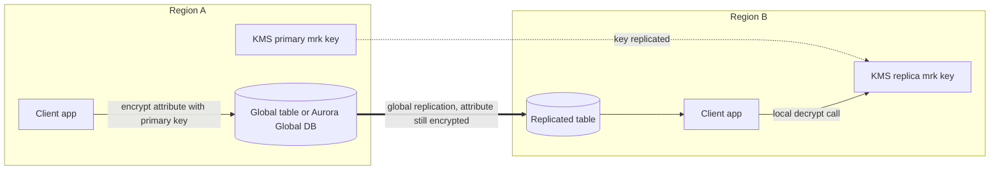

# KMS, CloudHSM & ACM

Concept-only note covering encryption basics, AWS KMS, KMS Multi-Region keys, encrypted AMI sharing, AWS CloudHSM and AWS Certificate Manager. CLI demo narration is left out; lab steps live in [[26 - Security & Encryption]] (Version B). Related: [[S3 Security & Encryption]], [[Parameter Store & Secrets Manager]].

## 1. Encryption 101
(src: 26/02-Encryption 101)

| Type | Where encryption/decryption happens | Notes |
|---|---|---|
| **In flight** (TLS/SSL) | Before sending / after receiving, between client and server | TLS = newer SSL; uses TLS certificates (HTTPS); prevents man-in-the-middle sniffing |
| **Server-side at rest** | Server encrypts after receiving, decrypts before sending back | Data key held/managed by the service (e.g. S3 with a data key) |
| **Client-side** | Client encrypts and decrypts; server never able to decrypt | Used when the server is not trusted; client keeps the data key; encrypted object can be stored anywhere (FTP, S3, EBS...) |

## 2. KMS overview
(src: 26/03-KMS Overview, 26/04-KMS Hands On w- CLI)
- **AWS KMS** = AWS-managed encryption keys. Whenever an AWS service says "encryption", it is most likely KMS.
- Integrated with **IAM** for authorization; **every API call using a key is auditable in CloudTrail** (exam topic, see [[CloudTrail & Config]]).
- Integrated with most services (EBS, S3, RDS, SSM...). Can also be called via CLI/SDK: encrypt secrets with a KMS key rather than storing them in plain text in code or environment variables.
- Term: **KMS key** (formerly "KMS customer master key", renamed to avoid confusion with "customer managed keys").

### Key types
| Type | Description | Use |
|---|---|---|
| **Symmetric** | One key to encrypt and decrypt; you never see the key, only call the KMS API | All AWS services integrated with KMS use symmetric keys |
| **Asymmetric** | Public key (encrypt) + private key (decrypt); public key can be downloaded, private key only usable via API | Encrypt/decrypt or **sign/verify**; encryption by users outside AWS who cannot call the KMS API |

### Key ownership and cost
| Key | Cost | Notes |
|---|---|---|
| **AWS owned** | Free | Used by e.g. SSE-S3, SSE for DynamoDB; not visible to you |
| **AWS managed** | Free | Named `aws/<service>` (e.g. `aws/rds`, `aws/ebs`); usable only from that service |
| **Customer managed (CMK)** | **$1 / month** | Created by you; imported keys also $1 / month |
| API calls | ~**$0.03 per 10,000** calls | Charged for every KMS API call |

- **Rotation**: AWS managed keys rotate automatically **every 1 year**; customer managed keys: enable automatic rotation (period configurable; the demo shows 90 days up to 2,560 days, default one year) plus **on-demand rotation**; **imported keys can only be rotated manually** (use an **alias** to point to the new key). Rotation history is visible per key.

[verify] "Imported keys can only be rotated manually."
> [!warning] Correction [note]
> AWS documents that **on-demand rotation** is supported for symmetric keys with imported (EXTERNAL origin) material, while **automatic** rotation is only for symmetric keys whose material is generated by KMS. Asymmetric, HMAC and custom-key-store keys can only be rotated manually. The default automatic rotation period is 365 days; AWS managed keys rotate every year (changed from every 3 years in May 2022). The 90 to 2,560 day range was not confirmed on the fetched page. Source: [Rotate AWS KMS keys](https://docs.aws.amazon.com/kms/latest/developerguide/rotate-keys.html).

- **Keys are per Region.** Moving an encrypted EBS volume to another Region: snapshot (encrypted with same key) -> copy snapshot to the other Region and **re-encrypt with a different KMS key** (AWS does it) -> restore a volume with the new key. The same KMS key cannot exist in two Regions (except Multi-Region keys, section 4).

### Key policies
- Control access to KMS keys, like an S3 bucket policy; **without a key policy nobody can access the key**.
- **Default key policy** (created if you give none): allows everyone in the account, so IAM policies grant the access.
- **Custom key policy**: define users/roles allowed to use the key and who can administer it; **required for cross-account access**.
- AWS managed keys carry key policies restricting use to the owning service (e.g. condition on the calling service via `ViaService`).

**Cross-account encrypted snapshot copy**
1. Encrypt the snapshot with a **customer managed key** (custom policy needed).
2. Attach a key policy authorizing the target account.
3. Share the encrypted snapshot with the target account.
4. In the target account, copy the snapshot and re-encrypt with a CMK of that account; create the volume.

> [!tip] Exam
> KMS = managed keys, IAM + key policy, CloudTrail audit, regional. Cross-account sharing of an encrypted snapshot needs a customer managed key with a custom key policy. No key policy = no access.

## 3. Encrypted AMI sharing
(src: 26/07-Encrypted AMI Sharing Process)
1. In the source account, modify the AMI's **launch permissions** to add the target account ID.
2. **Share the KMS key** with the target account (key policy).
3. In the target account, an IAM role/user needs KMS permissions: `DescribeKey`, `ReEncrypt*`, `CreateGrant`, `Decrypt`.
4. Launch the instance; optionally re-encrypt the volumes with a key owned by the target account.

## 4. KMS Multi-Region keys
(src: 26/05-KMS - Multi-Region Keys)
- A **primary** key in one Region replicated to **replica** keys in others: **same key ID (prefix `mrk-`) and same key material**; automatic rotation of the primary is replicated too.
- Encrypt in one Region, decrypt in another with **no re-encryption and no cross-Region API call**.
- **Not global**: primary and replicas are managed independently (own key policy). AWS recommends them only for specific use cases (KMS prefers single-Region keys).
- Use cases: global client-side encryption; **client-side encryption of specific attributes** in **DynamoDB Global Tables** (DynamoDB Encryption Client) or columns in **Aurora Global Database** (AWS Encryption SDK). Replicated data stays encrypted, clients in the other Region decrypt locally with the replica key (lower latency).
- Benefit: even **database administrators cannot read** the encrypted attribute (e.g. SSN) without access to the KMS key.

> [!info] Diagram
> **Explanation:** The client encrypts one sensitive attribute with the primary Multi-Region key and stores it. Global Tables / Global Database replicate the row; the Region B client decrypts the attribute locally with the replica key (same key ID and material).
> **Reference:** [Rotate AWS KMS keys - Rotating multi-Region keys (AWS KMS Developer Guide)](https://docs.aws.amazon.com/kms/latest/developerguide/rotate-keys.html) (confirms primary/replica key material synchronization; the DynamoDB/Aurora client-side flow comes from the lecture).

> [!tip] Exam
> Multi-Region keys = same key ID and material across Regions, enable cross-Region client-side encryption (Global Tables / Global Aurora). Not a global service.

## 5. AWS CloudHSM
(src: 26/13-AWS CloudHSM)
- **KMS**: AWS manages the software and has control of the keys. **CloudHSM**: AWS provisions a dedicated **hardware security module (HSM)**; **you manage the keys entirely** (AWS cannot access them).
- Tamper-resistant, **FIPS 140-2 Level 3**; supports symmetric and asymmetric keys (SSL/TLS keys, etc.); **no free tier**.
- You use the **CloudHSM client software** to manage keys, users and permissions. IAM only controls creating/reading/updating/deleting the HSM **cluster**.
- **High availability**: cluster across **multiple AZs** (e.g. 2), HSMs replicate each other, client can connect to any.
- Integrations: **Redshift** (key management/encryption); good fit for **SSE-C** on S3 (you hold keys); **KMS custom key store** backed by CloudHSM, so EBS, S3, RDS etc. can use keys stored in your cluster; KMS API calls reaching it are logged in CloudTrail.

[verify] "FIPS 140-2 Level 3."
> [!warning] Correction [note]
> AWS now says CloudHSM HSMs are either **FIPS 140-2 Level 3 or FIPS 140-3 Level 3** validated (for clusters in FIPS mode); non-FIPS mode clusters also exist. Source: [What is AWS CloudHSM?](https://docs.aws.amazon.com/cloudhsm/latest/userguide/introduction.html).

| Feature | KMS | CloudHSM |
|---|---|---|
| Tenancy | Multi-tenant | **Single tenant** |
| Standard | FIPS 140-2 Level 3 (lecture: same standard) | FIPS 140-2 Level 3 |
| Master keys | AWS owned, AWS managed, customer managed | **Customer managed only** |
| Key types | Symmetric, asymmetric, digital signing | Symmetric, asymmetric, digital signing, hashing |
| Accessibility | Multiple Regions | Deployed in a VPC; shareable across VPCs (VPC sharing) |
| Crypto acceleration | None | SSL/TLS acceleration, Oracle TDE acceleration |
| Auth | **IAM** | Own user/permission mechanism (CloudHSM software) |
| High availability | Managed, always available | Multiple HSMs across AZs |
| Audit | CloudTrail, CloudWatch | CloudTrail, CloudWatch; MFA support |
| Cost | Free tier available | No free tier |

> [!tip] Exam
> Need to manage your own keys on dedicated, single-tenant hardware, or SSE-C style control -> CloudHSM. Access via IAM only -> KMS.

## 6. AWS Certificate Manager (ACM)
(src: 26/12-AWS Certificate Manager (ACM))
- Provision, manage and deploy **TLS certificates** (in-flight encryption, HTTPS). Public and private certificates; **public certificates are free**; automatic renewal.
- Integrates with: **ELB** (CLB, ALB, NLB), **CloudFront**, **API Gateway**.

### Requesting a public certificate
1. List domain names: FQDN (e.g. `corp.example.com`) or wildcard (`*.example.com`).
2. Choose validation: **DNS validation** (create a CNAME record; automatic with [[Route 53]]; **preferred for automatic renewal**) or **email validation** (emails to the domain's registrar contacts).
3. Wait a few hours; certificate is issued and **auto-renewed 60 days before expiry** (ACM-generated certs).

[verify] "ACM renews certificates 60 days before expiry."
> [!warning] Correction [note]
> The 60-day figure is unconfirmed (the fetched pages did not state it). AWS confirms: certificates validated via DNS are renewed automatically; **imported certificates are not eligible** for managed renewal; ACM certificates are **regional** resources renewed independently per Region. Source: [Managed certificate renewal in ACM](https://docs.aws.amazon.com/acm/latest/userguide/managed-renewal.html).

### Imported certificates and expiry alerts
- A certificate generated outside ACM and imported has **no automatic renewal**; import a new one before expiry.
- ACM sends **daily expiration events to EventBridge starting 45 days before expiry** (configurable, e.g. 30), which can trigger Lambda, SNS or SQS ([[EventBridge]]).
- Alternative: **AWS Config managed rule `acm-certificate-expiration-check`** (configurable days); non-compliance events go to EventBridge ([[CloudTrail & Config]]).

### ACM with ALB
- Attach the ACM certificate to the ALB HTTPS listener; add a **redirect rule HTTP -> HTTPS** so users end up on HTTPS, then traffic goes to the ASG ([[ELB]]).

### ACM with API Gateway
- Endpoint types: **edge-optimized** (global clients, via CloudFront edge, API in one Region), **regional** (clients in same Region; can add your own CloudFront), **private** (VPC only via interface endpoints + resource policy). ACM applies to edge-optimized and regional.
- Create a **custom domain name** in API Gateway, then a CNAME or alias record in Route 53.

| Endpoint | Where the ACM certificate must live |
|---|---|
| Edge-optimized | **us-east-1** (CloudFront's Region) |
| Regional | Same Region as the API stage |

> [!tip] Exam
> CloudFront / edge-optimized API Gateway -> certificate in us-east-1. Imported certs do not auto-renew. Expiry alerts: EventBridge (45 days) or Config rule. DNS validation = easy auto-renewal. See [[CloudFront & Global Accelerator]], [[API Gateway, Step Functions & Cognito]].

## Not included here
- 26/01 Section Introduction (admin only).
- 26/04 KMS Hands On w/ CLI: console and CLI narration dropped (encrypt/decrypt commands, base64 handling); concepts merged above. Lab steps: [[26 - Security & Encryption]].
- 26/06 S3 Replication with Encryption -> [[S3 Security & Encryption]]; 26/08-11 -> [[Parameter Store & Secrets Manager]]; 26/14-18 -> WAF, Shield & Firewall Manager; 26/19-21 -> GuardDuty, Inspector & Macie.
- No lecture in this note lacks a transcript.
