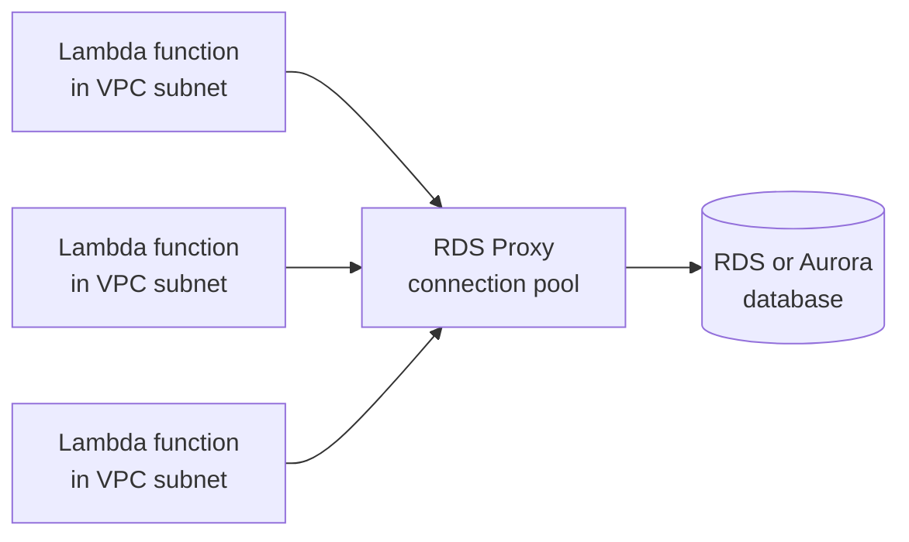

# AWS Lambda

Concept-only note merged from chapter 19. Hands-on narration is left out (lab steps: [[19 - Serverless Overviews]] in Version B). Related services: [[DynamoDB]], [[API Gateway, Step Functions & Cognito]], [[Serverless Solution Architectures]]. The lecture "RDS - Invoking Lambda & Event Notifications" (19/11) is covered in [[RDS & Aurora]].

## 1. What serverless means
(src: 19/02-Serverless Introduction)
- Serverless = **you do not manage or provision servers**; servers still exist. Originally FaaS (Function as a Service, pioneered by Lambda); now any fully managed service you do not provision.
- AWS serverless set: **Lambda, DynamoDB, Cognito, API Gateway, S3, SNS, SQS, Kinesis Data Firehose, Aurora Serverless, Step Functions, Fargate**.
- Reference flow: users -> CloudFront + S3 (static) -> Cognito (identity) -> API Gateway (REST) -> Lambda -> DynamoDB.

> [!tip] Exam
> The exam tests serverless knowledge heavily. Lecture 19/01 (section intro) has no transcript.

## 2. Lambda vs EC2 and key properties
(src: 19/03-Lambda Overview)

| | EC2 | Lambda |
|---|---|---|
| Servers | provisioned, limited by CPU/RAM chosen | none to manage |
| Running | continuously (even when idle) | **on demand**, only billed while running |
| Duration | unlimited | short executions, **up to 15 minutes** |
| Scaling | manual / Auto Scaling groups | **automatic** (more invocations = more concurrent functions) |

- **Memory up to 10 GB per function**; raising RAM also improves **CPU and network** quality.
- Languages: Node.js, Python, Java, C# (.NET Core / PowerShell), Ruby; others via **custom runtime API** (e.g. Rust, Go). Most important: Node.js and Python.
- **Container images on Lambda** are possible (must implement the Lambda Runtime API), but for Docker images the exam prefers **ECS / Fargate** ([[Containers (ECS, ECR, EKS)]]).
- Monitoring through CloudWatch ([[CloudWatch]]). Each function has an **execution role** (like an EC2 instance role) for permissions, e.g. write to CloudWatch Logs; add policies to the role to reach S3 etc.

### Pricing
- Pay per **request** and per **compute time** (duration billed in **1 ms** increments).
- First **1 million requests free**, then **$0.20 per extra 1 million**.
- **400,000 GB-seconds free per month** (= 400,000 s at 1 GB, or 8x more seconds at 128 MB), then **$1 per 600,000 GB-s**.
- Usually very cheap.

### Integrations (examples)
API Gateway (REST API), Kinesis (transform data), DynamoDB (triggers), S3 (file events), CloudFront (Lambda@Edge), EventBridge / CloudWatch Events (react to infra events), CloudWatch Logs (stream logs), SNS, SQS (process messages), Cognito (react to user login).

### Classic patterns
- **Serverless thumbnails**: image uploaded to S3 -> S3 event notification -> Lambda creates thumbnail (to same or another bucket) and writes metadata (name, size, date) to DynamoDB.
- **Serverless CRON**: EventBridge / CloudWatch Events rule on a schedule (e.g. hourly) -> Lambda; no always-on EC2 for cron.

## 3. Limits (per Region)
(src: 19/05-Lambda Limits)

| Limit | Value (as taught) |
|---|---|
| Memory | 128 MB to 10 GB, in 64 MB increments [verify] |
| Max execution time | 900 s (15 min) |
| Environment variables | 4 KB |
| Disk `/tmp` (for big files) | up to 10 GB |
| Concurrent executions | 1000 (can be increased by support request) [verify] |
| Deployment package (zip) | 50 MB compressed, 250 MB uncompressed |

[verify] Memory in 64 MB increments; 1000 default concurrency.
> [!warning] Correction [note]
> AWS now documents memory as **128 MB to 10,240 MB in 1 MB increments**; `/tmp` is **512 MB to 10,240 MB**; the 50 MB zipped (direct upload) / 250 MB unzipped limits, 4 KB environment variables and 900 s timeout are confirmed. The default 1000 concurrent executions is confirmed, but **new accounts have reduced concurrency and memory quotas** that AWS raises automatically with usage. Source: [Lambda quotas](https://docs.aws.amazon.com/lambda/latest/dg/gettingstarted-limits.html).

> [!tip] Exam
> Needs like "30 GB RAM", "30 minutes of runtime" or "a 3 GB file in the package" mean Lambda is the wrong choice. Large files: use `/tmp` at runtime, not the package.

## 4. Concurrency and throttling
(src: 19/06-Lambda Concurrency, 19/07-Lambda Concurrency - Hands On [concepts only])
- More invocations = more concurrent executions; up to **1000** per account per Region by default (support ticket for more).
- **Reserved concurrency** is set **per function**: a cap (e.g. 50) and also a guarantee. Account pool example: reserve 20 for one function -> 980 left unreserved for the others. Reserved concurrency **0 = function always throttled**.
- Invocations above the limit are **throttled**:
  - **Synchronous** -> **429 ThrottleError** returned to the caller.
  - **Asynchronous** -> automatic retries, then **DLQ** (dead-letter queue).
- **The limit is shared by all functions in the account**: a traffic spike on one function (e.g. behind an ALB) can consume all 1000 and throttle others (API Gateway, SDK/CLI callers). Set reserved concurrency to protect them.
- **Async retries** (e.g. S3 event notifications): Lambda returns throttled (429) / system (5xx) errors to the internal event queue and retries **for up to 6 hours**, with exponential backoff from **1 second up to 5 minutes**.

### Cold starts and provisioned concurrency
- **Cold start**: a new instance loads code and runs **initialization outside the handler** (SDK clients, DB connections, dependencies). The first request on a new instance has higher latency.
- **Provisioned concurrency**: concurrency **allocated in advance**, so no cold start and lower latency. Applied to an **alias or version** (not `$LATEST`); **it costs money**. Can be managed with **Application Auto Scaling** (scheduled or target tracking).
- VPC cold starts were greatly reduced by AWS improvements announced in 2019.

## 5. SnapStart
(src: 19/08-Lambda SnapStart)
- Improves startup performance **up to 10x**, advertised **at no extra cost** for **Java, Python and .NET** [verify].
- Without SnapStart: lifecycle = **Initialize -> Invoke -> Shutdown**, and initialization can be slow (e.g. Java).
- With SnapStart: when you **publish a new version**, Lambda initializes the function and takes a **snapshot of memory and disk state**; invocations resume from the cached snapshot and go straight to Invoke.

[verify] "No extra cost for Java, Python and .NET."
> [!warning] Correction [note]
> AWS says there is **no additional cost for Java managed runtimes**; for other runtimes you pay for **snapshot caching** (minimum 3 hours per published version) and **restoration**. Supported: Java 11+, Python 3.12+, .NET 8+. SnapStart works only on **published versions/aliases (not `$LATEST`)** and does not support provisioned concurrency or EFS. Source: [Lambda SnapStart](https://docs.aws.amazon.com/lambda/latest/dg/snapstart.html).

> [!tip] Exam
> Cold start fix choices: **SnapStart** (snapshot at publish) or **provisioned concurrency** (pre-warmed instances, extra cost).

## 6. Edge functions: CloudFront Functions vs Lambda@Edge
(src: 19/09-Lambda@Edge & CloudFront Functions)
- **Edge functions** = code attached to **CloudFront** distributions, run close to users, serverless, deployed globally, pay per use. See [[CloudFront & Global Accelerator]].
- Use cases: website security and privacy, dynamic web apps at the edge, SEO, intelligent routing across origins, bot mitigation, real-time image transformation, A/B testing, authentication and authorization, user prioritization, tracking and analytics.
- Four CloudFront event points: **viewer request** (after CloudFront receives request), **origin request** (before forwarding to origin), **origin response** (after origin replies), **viewer response** (before returning to viewer).

| | CloudFront Functions | Lambda@Edge |
|---|---|---|
| Language | JavaScript only | Node.js, Python |
| Scale | millions of requests/s | thousands of requests/s |
| Triggers | viewer request / response only | viewer **and** origin request / response |
| Max duration | **< 1 ms** | **5-10 s** [verify] |
| CPU / memory | lightweight, native to CloudFront | adjustable; can load libraries / SDK |
| Network / file / body access | no | network access, file system, **HTTP body** |
| Authoring | managed inside CloudFront | author in **us-east-1**, CloudFront replicates globally |
| Typical use | **cache key normalization**, header manipulation, URL rewrite/redirect, **JWT** validation | longer logic, third-party libraries, calls to AWS services/external services |

[verify] "Lambda@Edge max execution 5 to 10 seconds."
> [!warning] Correction [note]
> AWS's comparison page lists Lambda@Edge at **5-30 seconds** (exact value depends on the trigger; viewer events are shorter than origin events). CloudFront Functions: under 1 ms, JavaScript (ECMAScript 5.1), 128 MB fixed. Source: [Choose between CloudFront Functions and Lambda@Edge](https://docs.aws.amazon.com/AmazonCloudFront/latest/DeveloperGuide/edge-functions-choose.html).

> [!tip] Exam
> Simple, ultra-fast, high-scale viewer-only tweaks = CloudFront Functions. Origin-side triggers, longer runtime, body access or SDK calls = Lambda@Edge.

## 7. Lambda in a VPC and RDS Proxy
(src: 19/10-Lambda in VPC)
- **Default**: Lambda runs in an **AWS-owned VPC**, outside yours. It can reach the public internet and **DynamoDB** (public AWS service), but **not private resources** (RDS, ElastiCache, internal load balancers).
- **Launch in your VPC**: specify **VPC ID, subnets and a security group**; Lambda creates an **ENI** in your subnets and gets private connectivity.
- **Problem**: many short-lived functions open many DB connections -> too many connections, timeouts on RDS.
- **RDS Proxy** pools and shares connections. Benefits: **scalability** (connection pooling), **availability** (failover time reduced by **66%** and connections preserved; RDS and Aurora), and **IAM authentication** enforced at the proxy with credentials in **Secrets Manager**.
- RDS Proxy is **never publicly accessible**, so Lambda **must be in the VPC** to reach it.

> [!info] Diagram
> **Explanation:** Many Lambda functions (each with an ENI in the VPC) connect to RDS Proxy instead of the database. The proxy keeps a smaller pool of reused database connections, protecting the database from connection storms. The proxy must be in the same VPC as the database and is not publicly accessible.
> **Reference:** [Amazon RDS Proxy (Amazon RDS User Guide)](https://docs.aws.amazon.com/AmazonRDS/latest/UserGuide/rds-proxy.html)

> [!tip] Exam
> Lambda + RDS with connection errors under load = **RDS Proxy**, and Lambda in the VPC. Lambda reaches DynamoDB without being in a VPC.

## Not included here
- 19/01-About the Serverless Section: no transcript available.
- 19/04-Lambda Hands-On and 19/07-Lambda Concurrency - Hands On: console narration dropped (concepts kept above).
- 19/11 (RDS invoking Lambda): see [[RDS & Aurora]]. 19/12-14: see [[DynamoDB]]. 19/15-18: see [[API Gateway, Step Functions & Cognito]].
