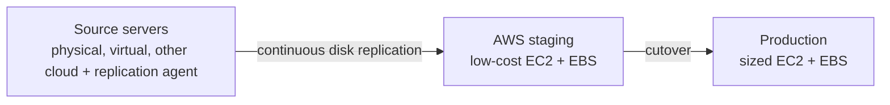

# Migration Services

Concept-only note on moving on-premises workloads to AWS: DMS/SCT, Application Discovery, MGN, VM Import/Export, VMware Cloud on AWS. Lab/overview steps for DMS are in [[28 - Disaster Recovery & Migrations]] (Version B). For DR see [[Disaster Recovery & Backup]]; for bulk data see [[Data Transfer]].

## 1. Database Migration Service (DMS)
(src: 28/03-Database Migration Service (DMS), 28/04-Database Migration Service (DMS) - Hands On [concepts only], 28/06-On-Premises Strategies with AWS)
- Quick, secure database migration to AWS; **resilient and self-healing**; **source database stays available** during migration.
- **Homogeneous** (Oracle to Oracle, Postgres to Postgres) and **heterogeneous** (SQL Server to Aurora) migrations; **continuous replication using CDC (Change Data Capture)**.
- Needs an **EC2 instance (replication instance)** running DMS that pulls from the source and writes to the target. Can also be **Serverless** (no instance provisioned; DMS adjusts compute automatically).
- Direction: on-premises to AWS, AWS to AWS, or AWS to on-premises.
- Sources (examples): on-premises / EC2 databases (Oracle, SQL Server, MySQL, MariaDB, PostgreSQL, MongoDB, SAP, DB2), Azure SQL Database, any RDS incl. Aurora, S3, DocumentDB.
- Targets (examples): on-premises / EC2 databases, any RDS, Redshift, DynamoDB, S3, OpenSearch, Kinesis Data Streams, Apache Kafka, DocumentDB, Neptune, Redis, Babelfish. No need to memorize lists.
- Concept of setup: create **source endpoint** and **target endpoint**, then a **replication task** with a type: migrate existing data once (full load), **full load + CDC**, or CDC only.
- **AWS SCT (Schema Conversion Tool)**: converts the schema between **different engines** (OLTP: SQL Server/Oracle to MySQL/PostgreSQL/Aurora; analytics: Teradata/Oracle to Redshift). **Not needed for the same engine** (on-premises PostgreSQL to RDS PostgreSQL; RDS is only a platform, the engine is PostgreSQL). SCT server can be installed on-premises (best practice).
- **Multi-AZ DMS**: replication instance in one AZ with **synchronous** standby replica in another AZ: resilience to AZ failure, data redundancy, eliminates I/O freezes, minimizes latency spikes.

> [!tip] Exam
> Different engines = DMS **plus SCT**. Same engine = DMS only. Continuous replication = CDC. DMS needs a replication instance (or serverless).

## 2. Planning: Application Discovery Service and Migration Hub
(src: 28/09-Application Migration Service (MGN), 28/06-On-Premises Strategies with AWS)
- Starting fresh in the cloud needs no migration; migrating from data centers needs planning.
- **AWS Application Discovery Service** scans servers for **utilization data and dependency mappings** (what to migrate and in what order).
  - **Agentless Discovery (Connector)**: VM inventory, configuration, performance history (CPU, memory, disk).
  - **Agent-based (Discovery Agent)**: more detail from inside the VM: system configuration, performance, running processes, **network connections** between systems (dependency mapping).
- Results are viewed in **AWS Migration Hub**, which also tracks migrations.

[verify] AWS Migration Hub is presented as the place to view and track migrations.
> [!warning] Correction [note]
> AWS Migration Hub is **no longer open to new customers as of 7 November 2025**; existing customers can continue, no new features are planned, and AWS Transform is the successor. Source: [AWS Migration Hub availability change](https://docs.aws.amazon.com/migrationhub/latest/ug/migrationhub-availability-change.html). Exam content may still reference Migration Hub.

## 3. Application Migration Service (MGN)
(src: 28/09-Application Migration Service (MGN), 28/06-On-Premises Strategies with AWS)
- Simplest way to move servers to AWS: **rehosting (lift-and-shift)** of physical, virtual or other-cloud servers to run natively on AWS. Formerly **CloudEndure Migration**.
- How: **replication agent** on the source gives **continuous replication** of disks into low-cost EC2 and EBS in a staging area; at **cutover** you launch bigger EC2 instances and EBS volumes for production.
- Wide range of platforms, OSes and databases; **minimal downtime**; reduced cost (no complex engineering; automated).

> [!info] Diagram
> **Explanation:** Disks are replicated continuously to a staging area; at cutover, production-sized instances are launched from the replicated data (rehost).
> **Reference:** [What is AWS Transform MGN? (Application Migration Service User Guide)](https://docs.aws.amazon.com/mgn/latest/ug/what-is-application-migration-service.html)

[verify] Service is named "AWS Application Migration Service (MGN)".
> [!warning] Correction [note]
> The AWS user guide now names it **AWS Transform MGN** (still abbreviated MGN), with continuous block-level replication and cutover windows of minutes. Source: [What is AWS Transform MGN?](https://docs.aws.amazon.com/mgn/latest/ug/what-is-application-migration-service.html).

> [!tip] Exam
> MGN = lift-and-shift / rehost of servers, continuous replication then cutover. DMS = databases. Same agent-and-staging idea as [[Disaster Recovery & Backup]] DRS.

## 4. On-premises strategies (high-level names)
(src: 28/06-On-Premises Strategies with AWS)
- **Amazon Linux 2 AMI as a VM** (ISO format) to run on VMware, KVM, VirtualBox, Hyper-V on-premises.
- **VM Import/Export**: migrate existing VMs into EC2; build a DR repository for on-premises VMs; **export back** from EC2 to on-premises.
- **Application Discovery Service**, **Migration Hub**, **DMS**, **MGN** as above. The lecture also lists "Server Migration Service (SMS)" as a migration service; remember names only.

[verify] "Server Migration Service (SMS)" and the Amazon Linux 2 on-premises ISO.
> [!warning] Correction [note]
> **AWS Server Migration Service was discontinued on 31 March 2022**; AWS recommends **Application Migration Service** for lift-and-shift. Source: [AWS Server Migration Service (GovCloud docs, discontinuation notice)](https://docs.aws.amazon.com/govcloud-us/latest/UserGuide/govcloud-sms.html) (from a search summary; confirm on the page). Amazon Linux 2 end of support is covered in [[EC2]]; the on-premises ISO availability for AL2 is unconfirmed here.

## 5. VMware Cloud on AWS
(src: 28/11-VMware Cloud on AWS)
- For customers running **VMware (vSphere-based) data centers** who want to extend capacity to AWS while continuing to manage everything with **VMware Cloud software** (vSphere, vSAN, NSX).
- Use cases: extend compute/storage to the cloud; **migrate VMware-based workloads** to AWS; run production across multiple data centers (private, public, hybrid); **disaster recovery** using the same tools.
- Gives access to AWS services: EC2, FSx, S3, RDS, Direct Connect, Redshift, etc.

> [!tip] Exam
> Existing VMware on-premises and want to extend/migrate to AWS with the same tooling = VMware Cloud on AWS.

## Not included here
- 28/05 RDS & Aurora Migrations -> [[RDS & Aurora]].
- 28/10 Transferring Large Datasets into AWS (Snowball, DataSync, etc.) -> [[Data Transfer]].
- DMS console overview steps (28/04) -> [[28 - Disaster Recovery & Migrations]].
