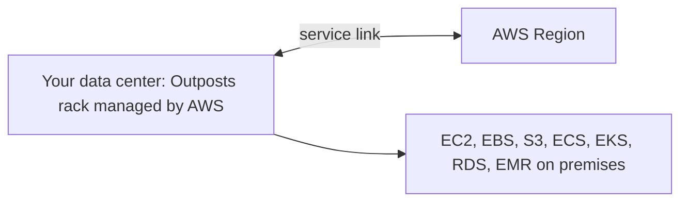

# AWS Outposts and AWS Batch

Concept-only note. See [[30 - Other Services]] (Version B) for the chapter context.

## 1. AWS Outposts
(src: 30/11-AWS Outposts)
- **Hybrid cloud** = on-premises infrastructure alongside cloud, normally meaning two skillsets and two APIs. **Outposts** = **server racks** that bring the **same AWS infrastructure, services, APIs and tools** into your own data center.
- AWS **sets up and manages** the racks (fully managed service); they come preloaded with AWS services, extending the cloud to on-premises.
- **Your responsibility: physical security of the rack**, since it sits in your data center.
- Benefits: **low-latency** access to on-premises systems; **local data processing**; **data residency** (data can stay on-premises); easy migration path on-premises -> Outpost -> cloud.
- Services you can run: **EC2, EBS, S3, EKS, ECS, RDS, EMR**.

[verify] The lecture describes Outposts as server racks only.
> [!warning] Correction [note]
> AWS documents two form factors: **Outposts racks** (42U) and **Outposts servers** (1U/2U); servers support fewer services (for example EC2 and ECS, but not RDS, EBS, S3 or EKS nodes). Source: [What is AWS Outposts?](https://docs.aws.amazon.com/outposts/latest/userguide/what-is-outposts.html).

> [!info] Diagram
> **Explanation:** The Outpost is an extension of an AWS Region deployed in your site; it connects back to the Region through a service link and runs AWS services locally.
> **Reference:** [What is AWS Outposts? (AWS Outposts User Guide)](https://docs.aws.amazon.com/outposts/latest/userguide/what-is-outposts.html)

> [!tip] Exam
> "Same AWS APIs/services on premises, AWS-managed hardware, hybrid, low latency, local processing, data residency" = Outposts.

## 2. AWS Batch
(src: 30/12-AWS Batch)
- **Fully managed batch processing at any scale**; run hundreds of thousands of batch jobs. A **batch job has a start and an end** (e.g. 1 AM to 3 AM), unlike continuous/streaming jobs.
- Batch **dynamically launches EC2 or Spot Instances** with the right CPU/memory for the job queue; you submit or schedule jobs to a **queue** and Batch does the rest. Cost optimized (right number of instances/Spot).
- Jobs are defined as **Docker images** and run on **ECS, EKS or Fargate** (see [[Containers (ECS, ECR, EKS)]]).
- Example: image uploaded to S3 triggers a Batch job; Batch runs an ECS cluster of EC2/Spot instances running the Docker image, writing processed output to another S3 bucket.

| | Lambda | Batch |
|---|---|---|
| Time limit | **15 minutes** | **none** (EC2-based) |
| Runtime | limited languages | **any runtime** packaged as Docker image |
| Disk | limited temporary space | EBS or instance store (much more) |
| Model | serverless | **managed**, not serverless (real EC2 instances, managed by AWS) |

> [!tip] Exam
> Batch vs Lambda: no time limit, any Docker runtime, larger disk, EC2/Spot based. See [[Lambda]].

## Not included here
- Other chapter 30 lectures (SES, Pinpoint, AppFlow, Amplify, Cost Explorer, Anomaly Detection, Instance Scheduler) are in their own notes.
- All lectures here have transcripts.
