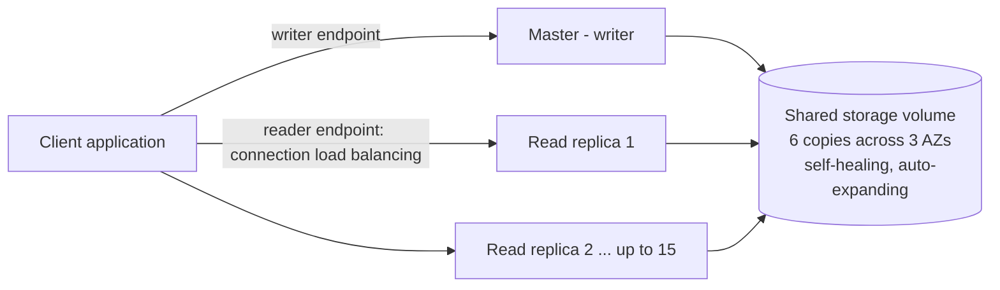

# Amazon RDS & Amazon Aurora

Concept-only note. Lab steps (creating RDS / Aurora databases, connecting with a SQL client, deleting them) are in [[09 - RDS, Aurora & ElastiCache]] (Version B). Caching in front of a database is in [[ElastiCache]]; broader database selection in [[Other Databases & Choosing a DB]].

## 1. RDS overview
(src: 09/01-Amazon RDS Overview, 21/02-RDS)
- **RDS = Relational Database Service**: managed database service for engines that use **SQL**.
- Engines: **PostgreSQL, MySQL, MariaDB, Oracle, Microsoft SQL Server, IBM DB2, Aurora** (AWS proprietary).
- Why RDS instead of a self-managed DB on EC2: automated provisioning and OS patching, **continuous backups** with **Point in Time Restore**, monitoring dashboards, **read replicas**, **Multi-AZ** (disaster recovery), **maintenance windows** for upgrades, scaling (vertical = bigger instance type; horizontal = read replicas), storage backed by [[EBS]].
- **No SSH** into the underlying instance (managed service), except with RDS Custom.
- You still provision an instance size and EBS volume type/size; managed maintenance can bring **downtime**.
- Use case: relational data, **OLTP**, SQL queries and transactions.

### RDS Storage Auto Scaling
- Set the initial storage (e.g. 20 GB) and a **maximum storage threshold**; RDS grows storage automatically, no downtime, no manual operation.
- Triggers when **all** of these hold: free storage **< 10%** of allocated, low-storage condition lasted **> 5 minutes**, and **6 hours** since the last modification.
- Good for unpredictable workloads; supports **all RDS engines**.

> [!tip] Exam
> "Avoid manually scaling database storage" -> RDS Storage Auto Scaling (needs a max storage threshold).

## 2. Read Replicas vs Multi-AZ
(src: 09/02-RDS Read Replicas vs Multi AZ, 09/03-Amazon RDS Hands On for the Multi-AZ options mentioned)

### Read Replicas (scale reads)
- Up to **15 read replicas**; placement: **same AZ, cross-AZ, or cross-region**.
- **Asynchronous** replication -> reads are **eventually consistent**.
- A replica can be **promoted** to its own standalone database (leaves replication).
- The application must update its **connection string** to use the replicas.
- Only **SELECT** (reads); no INSERT / UPDATE / DELETE.
- Classic use case: run **reporting / analytics** on a replica so the production database is not overloaded.
- **Network cost**: replication traffic between AZs in the **same region is free** for RDS (managed service exception); **cross-region replication is charged**.

[verify] "Up to 15 read replicas per source database, in the same AZ, cross-AZ or cross-region."
> [!warning] Correction [note]
> AWS documents up to 15 read replicas per source for RDS MySQL, MariaDB and PostgreSQL, of which up to 5 can be cross-region. Other engines may allow fewer. Source: [Amazon RDS for MySQL, MariaDB and PostgreSQL now support up to 15 read replicas](https://aws.amazon.com/about-aws/whats-new/2022/10/amazon-rds-mysql-mariadb-postgre-sql-support-15-read-replicas-3x-read-capacity). Per-engine limits for Oracle/SQL Server/Db2 were not checked.

### Multi-AZ (disaster recovery / high availability)
- **Synchronous** replication from the master to a **standby** in another AZ; a write is accepted only when also replicated.
- Applications use **one DNS name**; on failure the standby is promoted and DNS **fails over automatically** (AZ loss, network loss, instance or storage failure). No manual app changes (apps should retry connecting).
- The standby is **not for scaling**: nobody can read or write to it.
- **Read replicas can themselves be set up as Multi-AZ** (common exam question).
- **Single-AZ -> Multi-AZ is zero downtime**: just *modify* the database and enable Multi-AZ. Internally: snapshot taken -> restored into a new standby -> synchronization established -> standby catches up.
- The hands-on lecture also mentions two production Multi-AZ shapes: **Multi-AZ DB instance deployment** (primary + 1 standby) and **Multi-AZ DB cluster deployment** (3 instances), not detailed further.

| | Read Replica | Multi-AZ |
|---|---|---|
| Purpose | Scale reads | HA / disaster recovery |
| Replication | Asynchronous (eventual consistency) | Synchronous |
| Max | 15 | 1 standby (instance deployment) |
| Scope | Same AZ, cross-AZ, cross-region | Different AZ (same region) |
| Readable | Yes (SELECT only) | No (standby not accessible) |
| Failover | Manual promotion | Automatic (single DNS name) |
| Cross-AZ traffic cost (same region) | Free | n/a |

> [!tip] Exam
> Scale reads / run analytics -> Read Replica. Disaster recovery / HA -> Multi-AZ. Single-AZ to Multi-AZ = no downtime (snapshot -> restore -> sync).

## 3. RDS Custom
(src: 09/04-RDS Custom for Oracle and Microsoft SQL Server)
- For **Oracle and Microsoft SQL Server only**; keeps automated setup, operations and scaling but gives **access to the OS and database customization**: configure internal settings, install patches, enable native features, **SSH or SSM Session Manager** into the underlying EC2 instance.
- Recommended: **deactivate automation mode** while customizing, and **take a snapshot first** (you may break things).
- RDS = AWS manages DB and OS; RDS Custom = you have full admin access to OS and DB.

## 4. Amazon Aurora
(src: 09/05-Amazon Aurora, 09/06-Amazon Aurora - Hands On (concepts only), 21/03-Aurora)
- **Proprietary AWS** technology, **compatible with PostgreSQL and MySQL** (same drivers). Cloud-optimized: about **5x** the performance of MySQL on RDS and **3x** of PostgreSQL on RDS.
- Cost about **20% more than RDS**, but more efficient at scale.
- **Storage and compute are separate.**
- Storage: starts at **10 GB**, **auto-grows up to 256 TB**; no monitoring of disk needed.
- Up to **15 read replicas**, replica lag typically **< 10 ms**; replicas support **cross-region** replication.
- **Failover** is much faster than RDS Multi-AZ: **under 30 seconds on average**; any replica can become the master.
- High availability by default.

[verify] "Aurora storage auto-grows up to 256 TB."
> [!warning] Correction [note]
> Confirmed: AWS documents a maximum cluster volume of 256 TiB (grows in 10 GB increments, you pay only for space used), supported on specific engine versions. Source: [Amazon Aurora storage](https://docs.aws.amazon.com/AmazonRDS/latest/AuroraUserGuide/Aurora.Overview.StorageReliability.html) and [Aurora MySQL 256 TiB announcement](https://aws.amazon.com/about-aws/whats-new/2025/07/amazon-aurora-mysql-database-clusters-256-tib-storage/).

### 4.1 Storage design: HA and self-healing
- Data is stored as **6 copies across 3 AZs** (cannot be changed). **4 of 6** copies needed for **writes**; **3 of 6** for **reads**.
- **Self-healing** with peer-to-peer replication when data is corrupted; striped across **hundreds of volumes**.
- It is a **shared logical storage volume** (replication, self-healing, auto-expansion); you do not manage it.

### 4.2 Cluster and endpoints
- **One master (writer)** takes writes; up to 15 read replicas serve reads. Replica **auto scaling** (e.g. target 60% average CPU or average connections; min 1, max 15 replicas) keeps the right number of replicas.
- **Writer endpoint**: DNS name always pointing to the master (even after failover).
- **Reader endpoint**: connection-level **load balancing** across all read replicas (balances per connection, not per statement); automatically covers new replicas from auto scaling.
- **Custom endpoints**: define a **subset** of instances (e.g. the larger replicas for analytical queries); once defined, the reader endpoint is generally no longer used. Create several custom endpoints for different workloads.
- Each instance also has its own dedicated endpoint, but applications should use the writer / reader endpoints.

> [!info] Diagram
> **Explanation:** One writer instance and up to 15 readers share one logical cluster volume replicated six times across three AZs. Clients use the writer endpoint (always the current master) and the reader endpoint (spreads connections over replicas).
> **Reference:** [Amazon Aurora endpoint connections](https://docs.aws.amazon.com/AmazonRDS/latest/AuroraUserGuide/Aurora.Overview.Endpoints.html) and [Amazon Aurora storage](https://docs.aws.amazon.com/AmazonRDS/latest/AuroraUserGuide/Aurora.Overview.StorageReliability.html). The writer endpoint is called the "cluster endpoint" in AWS docs.

> [!tip] Exam
> 6 copies / 3 AZs, 4 of 6 write, 3 of 6 read. Writer endpoint + reader endpoint. Shared auto-expanding storage. Failover < 30 s.

### 4.3 Other Aurora features
(src: 09/05, 09/06, 09/07-Amazon Aurora - Advanced Concepts, 21/03)
- **Replica auto scaling**: more replicas are added under load and the reader endpoint extends to them.
- **Aurora Serverless**: automated instantiation and auto scaling by actual usage; no capacity planning; **pay per second**; for **infrequent, intermittent or unpredictable** workloads. Clients talk to an Aurora-managed **proxy fleet**. In the console (Serverless v2) you set a **minimum and maximum ACU (Aurora Capacity Unit)** instead of an instance type.
- **Cluster storage configuration**: **Aurora Standard** (cost-effective, moderate I/O) or **Aurora I/O-Optimized** (high I/O workloads).
- **Global Aurora**: see section 5.
- **Aurora Machine Learning**: ML predictions via the **SQL interface**, integrating **SageMaker** (any ML model) and **Comprehend** (sentiment analysis); no ML experience needed; use cases: fraud detection, ads targeting, sentiment analysis, product recommendation.
- **Babelfish for Aurora PostgreSQL**: lets Aurora PostgreSQL understand **T-SQL** (Microsoft SQL Server) commands, so SQL Server apps migrate with **little to no code change**, same driver. Data migration is done with **AWS SCT and DMS**.
- **Backtrack**: restore data to any point in time **without using backups**, can rewind repeatedly (e.g. 4 PM, then 5 PM).
- **Aurora Database Cloning**: new cluster from an existing one, **faster than snapshot and restore**; uses **copy-on-write** (initially shares the same data volume, new storage is allocated only as data diverges). Typical use: staging from production without impacting production.
- Same security, monitoring and maintenance as RDS, plus zero-downtime patching, push-button scaling.
- Local write forwarding: writes sent to a replica can be forwarded to the writer (mentioned as a console option).

## 5. Aurora Global Database
(src: 09/07-Amazon Aurora - Advanced Concepts, 21/03-Aurora)
- Cross-region read replica = simple DR option; **Aurora Global Database** is the **recommended** way.
- **1 primary region** (reads and writes) + up to **10 secondary read-only regions**, up to **16 read replicas per secondary region**.
- Cross-region replication lag **< 1 second** (storage-level replication).
- Benefits: low-latency reads worldwide, DR; promoting a secondary region has **RTO < 1 minute**.

> [!tip] Exam
> "Replicate across regions in under 1 second" / "DR with RTO under 1 minute" -> **Aurora Global Database**.

> [!warning] Correction [note]
> Confirmed against AWS docs: one primary region, up to 10 secondary regions, up to 16 replicas per secondary, typical lag under 1 second, failover to a secondary region in under a minute. Source: [Using Amazon Aurora Global Database](https://docs.aws.amazon.com/AmazonRDS/latest/AuroraUserGuide/aurora-global-database.html) and [switchover or failover in Global Database](https://docs.aws.amazon.com/AmazonRDS/latest/AuroraUserGuide/aurora-global-database-disaster-recovery.html) (from search summaries).

## 6. Backup, restore and cloning
(src: 09/08-RDS & Aurora - Backup and Monitoring, 21/02, 21/03)

| | RDS | Aurora |
|---|---|---|
| Automated backups | Daily full backup in the backup window + **transaction logs every 5 min**; retention **1-35 days**; **0 disables** | Same, 1-35 days, **cannot be disabled** |
| Point-in-time restore | To any time up to **5 minutes ago** within retention | Any point within retention |
| Manual snapshots | User-triggered, kept **as long as you want** | Same |
| Restore result | Always creates a **new database** | Same |

- Trick (cost): for a DB used only occasionally (e.g. 2 hours per month), **snapshot then delete** the instance, restore when needed. A *stopped* RDS instance still costs storage; the snapshot costs much less.
- **Restore from S3**: RDS MySQL <- backup of an on-premises DB uploaded to S3. Aurora MySQL <- backup made with **Percona XtraBackup** (only supported tool) uploaded to S3.
- Aurora cloning: see section 4.3.

> [!tip] Exam
> Automated backups = 1-35 days + PITR; manual snapshot = retained indefinitely. Percona XtraBackup + S3 -> Aurora MySQL.

## 7. Security
(src: 09/09-RDS Security, 21/02)
- **At rest**: **KMS** encryption of master and replicas, defined **at launch**. If the master is **not encrypted, replicas cannot be encrypted**. To encrypt an existing unencrypted DB: **snapshot -> restore as encrypted**.
- **In flight**: TLS enabled by default; clients use the **AWS TLS root certificates**.
- **Authentication**: username/password, or **IAM** (e.g. EC2 instance role authenticating to the DB).
- **Network**: **security groups** (ports, IPs, security groups). No SSH except RDS Custom.
- **Audit logs**: can be enabled; kept briefly, so send to **CloudWatch Logs** for long retention.
- Credentials can be managed by **Secrets Manager** (console option at creation; has a cost).
- RDS instances can be created with a **subnet group** and optional public access; a default port example is MySQL 3306 (hands-on).

## 8. RDS Proxy
(src: 09/10-RDS Proxy, 21/02)
- Fully managed, **serverless**, **auto scaling**, **highly available (multi-AZ)** database proxy inside your VPC.
- **Pools and shares connections** -> fewer connections to the DB, less CPU/RAM stress, fewer open connections and timeouts.
- **Reduces failover time by up to 66%** (RDS and Aurora): the proxy handles failover, apps keep connecting to it.
- Supports **MySQL, PostgreSQL, MariaDB, Microsoft SQL Server, Aurora MySQL and PostgreSQL**; **no code change** (just change the endpoint).
- Can **enforce IAM authentication**; credentials stored in **Secrets Manager**.
- **Never publicly accessible** (VPC only).
- Key use case: **Lambda functions** that multiply quickly and open many short-lived connections; the proxy pools them.

> [!tip] Exam
> Many connections / Lambda to RDS -> RDS Proxy. Enforce IAM auth for the DB -> RDS Proxy. Failover time -66%.

## 9. Migrating to Aurora
(src: 28/05-RDS & Aurora Migrations)
Likely worth one exam question.

| From | Option |
|---|---|
| RDS MySQL | **Snapshot** restored as Aurora MySQL (some downtime) **or** create an **Aurora Read Replica** of the RDS MySQL; when **replica lag = 0** promote it to its own cluster (slower, possible network cost) |
| External MySQL | **Percona XtraBackup** -> file in **S3** -> import into new Aurora MySQL cluster; or **mysqldump** piped into Aurora (slow, no S3); or **DMS** for continuous replication |
| RDS PostgreSQL | Snapshot restored as Aurora PostgreSQL, **or** Aurora Read Replica then promote when lag = 0 |
| External PostgreSQL | Backup -> **S3** -> import with the **aws_s3 Aurora extension**; or **DMS** |

## 10. Invoking Lambda and event notifications
(src: 19/11-RDS - Invoking Lambda & Event Notifications)
- **Invoke Lambda from inside the DB** (supported e.g. by **RDS for PostgreSQL** and **Aurora MySQL**): configured **from within the database** (not the console); example: an insert into a registration table triggers a Lambda that sends a welcome email. Requirements: **network path** from the DB to Lambda (public access, NAT gateway or VPC endpoint) and an **IAM policy** allowing the DB instance to invoke the function.
- **RDS event notifications**: about the **DB instance itself** (creation, start, snapshots, parameter group, security group, proxy, custom engine version), **not about data** in the DB. Near real time (up to **5 minutes**). Deliver to **SNS** (then SQS, Lambda...) or **EventBridge** (many targets).

> [!tip] Exam
> Event notification = DB lifecycle events, never data changes. For data events, invoke Lambda from the database.

## Not included here
- Hands-on creation of RDS (09/03) and Aurora (09/06): see [[09 - RDS, Aurora & ElastiCache]].
- ElastiCache lectures (09/11-13, 21/04): see [[ElastiCache]].
- Lecture without transcript: 09/14-List of Ports to be familiar with.
