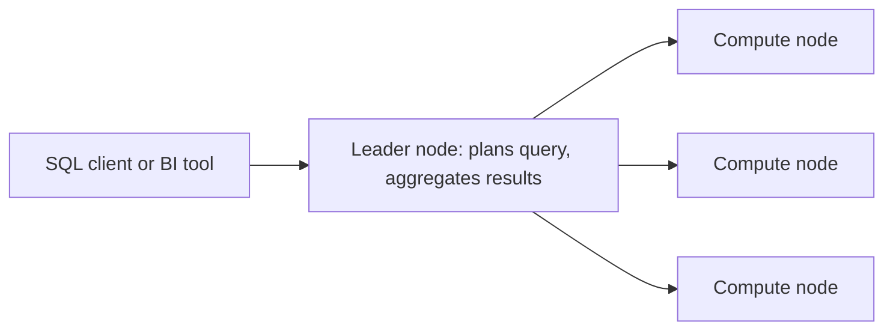

# Redshift, EMR, OpenSearch & QuickSight

Concept-only note. Lab steps: [[22 - Data & Analytics]] (Version B). Related: [[Athena, Glue & Lake Formation]], [[Kinesis & Firehose]].

## 1. Amazon Redshift
(src: 22/03-Redshift)
- Data warehouse based on **PostgreSQL**, but **OLAP** (analytics), not OLTP. Claimed **10x better performance** than other warehouses; scales to **petabytes**.
- **Columnar storage** + **parallel query engine**; SQL interface; BI tools (QuickSight, Tableau) integrate directly.
- Two modes: **provisioned cluster** (choose instance types, can use reserved instances) or **serverless** (AWS manages nodes).
- vs Athena: Redshift = faster queries, joins and aggregations thanks to indexes, but needs a cluster; Athena = serverless, data stays in S3.

### Architecture

> [!info] Diagram
> **Explanation:** Clients talk only to the leader node, which parses the query and builds the plan, sends work to compute nodes, and aggregates their intermediate results for the client.
> **Reference:** [Data warehouse system architecture (Amazon Redshift Database Developer Guide)](https://docs.aws.amazon.com/redshift/latest/dg/c_high_level_system_architecture.html)

### Snapshots and DR
- Historically **single AZ** for most clusters; a **Multi-AZ** mode now exists for some cluster types (instructor). Single-AZ DR relies on **snapshots**.
- Snapshots: point-in-time, **incremental**, stored internally in **S3**, restored into a **new cluster**.
- Automated: about **every 8 hours or every 5 GB** of change; configurable retention. Manual: kept until you delete them.
- Can **auto-copy snapshots (automated or manual) to another Region** for DR. See [[Disaster Recovery & Backup]].
> [!warning] Correction [note]
> Confirmed: by default about every eight hours or every 5 GB per node of data changes, whichever comes first; default retention is 1 day; RA3 retention 1-35 days. Source: [Amazon Redshift snapshots and backups](https://docs.aws.amazon.com/redshift/latest/mgmt/working-with-snapshots.html).

### Loading data
| Method | Notes |
|---|---|
| **Kinesis Data Firehose** | writes to S3 first, then issues an automatic **COPY** into Redshift |
| **S3 COPY command** | manual; uses an **IAM role**; traffic goes over the internet path unless **Enhanced VPC Routing** is enabled (keeps traffic inside the VPC) |
| **JDBC driver** | from apps (e.g. EC2); **write in large batches**, not row by row |

### Redshift Spectrum
- Query **data in S3 without loading it**, using far more processing power than your cluster has. **A Redshift cluster must already exist** to start the query.
- The query is fanned out to **thousands of Spectrum nodes** that read S3, aggregate, and send results back to your cluster.

> [!tip] Exam
> Analytics/warehouse/OLAP/BI on petabytes -> Redshift. Query S3 with Redshift's power without loading -> Spectrum. Cross-region DR -> automated snapshot copy.

## 2. Amazon EMR
(src: 22/05-EMR)
- **Elastic MapReduce**: provisions **Hadoop clusters** (can be hundreds of EC2 instances) for big data; bundles/configures Spark, HBase, Presto, Flink; supports auto scaling and **Spot** instances.
- Use cases: data processing, machine learning, web indexing, big data.

| Node type | Role | Purchasing |
|---|---|---|
| **Master** | manages cluster, coordinates, health; **long running** | on-demand / reserved |
| **Core** | runs tasks **and stores data**; long running | on-demand / reserved |
| **Task** | runs tasks only; optional | **Spot** (good fit) |

- On-demand = reliable, predictable, never terminated. Reserved (min 1 year) = big savings, EMR uses them automatically. Spot = cheaper, can be terminated.
- Deployment: **long-running** clusters (suit reserved) or **transient** clusters (run a job, tear down).

> [!tip] Exam
> Hadoop / Spark big data clusters -> EMR.

## 3. Amazon OpenSearch Service
(src: 22/04-OpenSearch (ex- ElasticSearch))
- Successor to **Amazon Elasticsearch Service**; renamed due to licensing issues.
- DynamoDB queries only by primary key / indexes; OpenSearch **searches any field, including partial matches**. Used as a **complement** to another database; also supports **analytics**.
- Modes: **managed cluster** (visible instances) or **serverless**.
- Own query language; **SQL only via plugin**. Security: Cognito, IAM, encryption at rest and in flight. **OpenSearch Dashboards** for visualization.
- Ingest: Firehose, IoT, CloudWatch Logs, custom apps.

Common patterns:
- **DynamoDB -> DynamoDB Stream -> Lambda -> OpenSearch** (real time); app searches OpenSearch for an item ID, then fetches the full item from DynamoDB. See [[DynamoDB]].
- **CloudWatch Logs** -> subscription filter -> AWS-managed Lambda -> OpenSearch (real time), or subscription filter -> Firehose -> OpenSearch (near real time).
- **Kinesis Data Streams** -> Firehose (optional Lambda transform) -> OpenSearch (near real time), or KDS -> custom Lambda -> OpenSearch (real time).

## 4. Amazon QuickSight
(src: 22/06-QuickSight)
- Serverless, ML-powered **BI service**: interactive dashboards; fast, auto scaling, embeddable in websites; **per-session pricing**.
- Use cases: business analytics, visualizations, ad hoc analysis.
- **Data sources**: RDS, Aurora, Redshift, Athena, S3, OpenSearch, Timestream; SaaS (Salesforce, Jira); third-party DBs (Teradata, on-prem JDBC); imported files (Excel, CSV, JSON, TSV, log formats). Exam favourites: **QuickSight + Athena**, **QuickSight + Redshift**.
- **SPICE**: in-memory computation engine; works **only for data imported into QuickSight**, not live connections to other databases.
- **Enterprise edition**: **column-level security (CLS)**.
- **Users** (Standard) and **groups** (Enterprise only) exist **only inside QuickSight**, not IAM users (IAM is for administration).
- **Analysis** vs **dashboard**: a dashboard is a **read-only snapshot of an analysis** preserving filters, parameters, controls, sort; publish and share with users/groups; viewers can see the underlying data.

[verify] Instructor refers to the service and its Standard/Enterprise editions as "Amazon QuickSight".
> [!warning] Correction [note]
> Per search results, AWS introduced Amazon Quick Suite on 9 Oct 2025 as the evolution of QuickSight, with QuickSight BI capabilities (including SPICE and dashboard sharing) retained as "Quick Sight". Whether the Standard/Enterprise edition split still applies was not confirmed. Source: [AWS News Blog - Amazon Quick Suite](https://aws.amazon.com/blogs/aws/reimagine-the-way-you-work-with-ai-agents-in-amazon-quick-suite/) (from search listing; page not fetched). Exam material may still say QuickSight.

## Comparison

| Need | Service |
|---|---|
| Serverless SQL on S3 | Athena |
| Warehouse / OLAP, joins, BI | Redshift |
| Hadoop / Spark clusters | EMR |
| Free-text and partial-match search | OpenSearch |
| Dashboards | QuickSight |

## Not included here
- No transcript-less lectures in this range. Athena, Glue, Lake Formation: [[Athena, Glue & Lake Formation]]; Flink, MSK: [[Streaming Analytics - Flink & MSK]].
