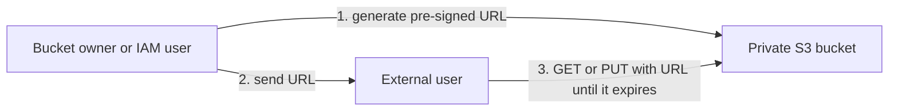
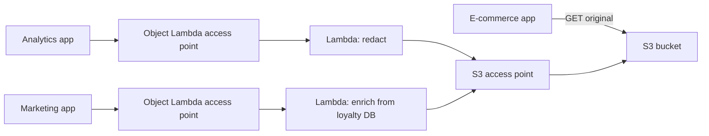

# S3 Security & Encryption

Concept-only note. Lab steps (encryption, CORS, MFA Delete, access logs, pre-signed URLs) are in [[14 - Amazon S3 Security]] (Version B); the replication-with-encryption lecture is also in [[26 - Security & Encryption]]. Core S3 (buckets, storage classes, versioning, replication) is in [[S3]]; KMS itself is in [[KMS, CloudHSM & ACM]].

## 1. Encryption options at a glance
(src: 14/01-S3 Encryption, 14/03-S3 Encryption - Hands On)

| Option | Who owns/manages the key | Key points |
|---|---|---|
| **SSE-S3** | AWS (S3-owned key; you never see it) | AES-256; header `x-amz-server-side-encryption: AES256`; **on by default** for new buckets and objects |
| **SSE-KMS** | KMS key you control (in AWS KMS) | user control + **audit with CloudTrail**; header `x-amz-server-side-encryption: aws:kms`; need access to the object **and** the KMS key to read |
| **DSSE-KMS** | KMS key + S3-managed key | **dual-layer** server-side encryption (object encrypted twice); header value `aws:kms:dsse` |
| **SSE-C** | Customer, outside AWS | key sent with **every request** over **HTTPS only**; S3 never stores the key (discarded after use); **CLI/API only, not the console** |
| **Client-side** | Customer fully | client encrypts before upload and decrypts after download (e.g. a client-side encryption library); S3 is unaware |

[verify] "DSSE-KMS = first layer with the KMS key, second layer with S3-managed keys."
> [!warning] Correction [note]
> Consistent with AWS: the first layer uses a unique data key generated by KMS, the second layer a separate AES-256 key managed by S3; the header value is `aws:kms:dsse`. Additionally, **S3 Bucket Keys are not supported for DSSE-KMS**. Source: [Using dual-layer server-side encryption with AWS KMS keys (DSSE-KMS)](https://docs.aws.amazon.com/AmazonS3/latest/userguide/UsingDSSEncryption.html).

> [!tip] Exam
> Know which option fits which wording: "AWS-managed, default" = SSE-S3; "audit key usage / control keys" = SSE-KMS; "multi-layer encryption" = DSSE-KMS; "keys managed outside AWS but S3 does the encryption" = SSE-C; "client does everything" = client-side.

## 2. SSE-KMS limits and bucket keys
(src: 14/01-S3 Encryption, 14/03-S3 Encryption - Hands On)
- Every upload calls KMS `GenerateDataKey`; every download calls KMS `Decrypt`. These count toward the **KMS API quota per second**, which the instructor puts at **5,000-30,000 requests/s depending on region**, increasable via Service Quotas. A very high-throughput bucket on SSE-KMS can hit **throttling** (exam topic).
- **S3 Bucket Key** (shown when SSE-KMS is chosen as default encryption; on by default there) **reduces KMS API calls and therefore cost**; does not apply to SSE-S3.
- In the console you can set default encryption to SSE-S3, SSE-KMS or DSSE-KMS, or override per object. **Editing an object's encryption creates a new version** (with versioning on). The default AWS-managed `aws/s3` KMS key costs nothing; your own KMS keys cost per month.

[verify] "KMS quota is between 5,000 and 30,000 requests per second depending on region."
> [!warning] Correction [note]
> AWS now documents symmetric cryptographic-operation quotas of 10,000/s (default), 20,000/s in several regions and 100,000/s in us-east-1, us-west-2 and eu-west-1; all are adjustable. The page still cites "5,500 (or 10,000 or 50,000)" S3 SSE-KMS uploads/downloads per second as an example. The exam-level point (throttling, ask for a quota increase) is unchanged. Source: [AWS KMS request quotas](https://docs.aws.amazon.com/kms/latest/developerguide/requests-per-second.html).

[verify] "SSE-C can be enabled/used from the CLI" (implied as always available).
> [!warning] Correction [note]
> AWS documents that SSE-C is **disabled by default for new general purpose buckets**; uploads with SSE-C require setting `BlockedEncryptionTypes` to `NONE` in the bucket's encryption configuration. SSE-C still cannot be used from the console. Source: [Specifying SSE-C](https://docs.aws.amazon.com/AmazonS3/latest/userguide/specifying-s3-c-encryption.html).

## 3. Default encryption vs bucket policy
(src: 14/04-S3 Default Encryption)
- All buckets default to **SSE-S3** for new objects; you can change the default (e.g. to SSE-KMS).
- A **bucket policy can force** a specific encryption: deny `PutObject` when the encryption header is missing or not `aws:kms`, or when the SSE-C algorithm header is absent.
- **Bucket policies are evaluated before default encryption settings.**

## 4. Encryption in transit and forcing HTTPS
(src: 14/01-S3 Encryption)
- S3 has an **HTTP** (unencrypted) and an **HTTPS** (SSL/TLS, in flight) endpoint; HTTPS is recommended and **mandatory for SSE-C**. Most clients use HTTPS by default.
- To force it: bucket policy that **denies `s3:GetObject` when `aws:SecureTransport` is `false`**.

## 5. Replication and encrypted objects
(src: 26/06-S3 Replication with Encryption)

| Source object | Replicated by default? |
|---|---|
| Unencrypted | Yes |
| SSE-S3 | Yes |
| SSE-C | Yes |
| **SSE-KMS** | **No** - must enable the option |

- For SSE-KMS replication: choose the **target KMS key**, adapt the **target key policy**, and give the replication **IAM role** permission to **decrypt** with the source key and **re-encrypt** with the target key.
- Heavy encrypt/decrypt activity can cause **KMS throttling** -> raise quotas.
- **Multi-Region keys** can be used, but S3 treats them as **independent keys**: the object is still decrypted and re-encrypted.

## 6. CORS (Cross-Origin Resource Sharing)
(src: 14/05-S3 CORS, 14/06-S3 CORS Hands On)
- **Origin = scheme (protocol) + host + port** (e.g. `https://www.example.com`, implied port 443). Same origin = same scheme, host and port; `www.example.com` vs `other.example.com` are different origins.
- CORS is a **web-browser security mechanism**: a page from origin A may only fetch from origin B if B allows it with `Access-Control-Allow-Origin` (and related) headers. The browser sends a **pre-flight** request (`OPTIONS`, carrying the page's origin); B answers with allowed origins and methods (GET/PUT/DELETE).
- On S3: when a client requests a bucket from another origin (e.g. a static website in bucket A loading images from website bucket B), **bucket B needs a CORS configuration** (JSON) allowing the origin of A, or `*` for all origins.
- The instructor says CORS is tested in **one exam question**, usually "images/assets from one S3 bucket blocked from a site on another origin -> enable CORS on the bucket serving the assets".

## 7. MFA Delete
(src: 14/07-S3 MFA Delete, 14/08-S3 MFA Delete Hands On)
- Forces an **MFA code** (virtual app or hardware device) for destructive versioning operations.
- **Required for:** permanently deleting an object version; suspending versioning. **Not required for:** enabling versioning; listing deleted versions.
- Prerequisites: **versioning must be enabled**; **only the bucket owner (root account)** can enable/disable MFA Delete.
- It **cannot be enabled from the console UI** (per the lecture) - it is done through the **CLI/API** with the root user's MFA device ARN and code. Simple deletes only add a delete marker; permanent deletes of a version are blocked.
- The instructor warns that root access keys are bad practice: use them only for this step, then deactivate/delete them.

> [!tip] Exam
> MFA Delete = extra protection against permanent deletion of object versions; needs versioning; root-only to turn on.

## 8. Server access logs
(src: 14/09-S3 Access Logs, 14/10-S3 Access Logs - Hands On)
- Logs **every request** to a bucket (from any account, authorized or denied) as files in **another S3 bucket**, for audit; analyze with **Athena** ([[Athena, Glue & Lake Formation]]).
- The **target logging bucket must be in the same region**. Enabling logging **updates the target bucket policy** so the S3 logging service can write.
- Delivery is **not instant** (can take hours); logs have a defined format; optional prefix and key format.
- **Never use the monitored bucket as the logging bucket**: it creates an endless logging loop, exponential growth and a large bill.

## 9. Pre-signed URLs
(src: 14/11-S3 Pre-signed URLs, 14/12-S3 Pre-signed URLs - Hands On)
- A URL generated from the **console, CLI or SDK** that carries the **generator's permissions** (for `GET` or `PUT`) and **expires**.
- Expiry per the lecture: **console up to 12 hours; CLI up to 168 hours**.
- Use cases: private bucket, temporary download for one file (premium video for logged-in users); dynamically generated links for a changing set of users; temporary **upload** to a precise location while the bucket stays private.

> [!info] Confirmed
> AWS confirms 1 minute to 12 hours from the console and up to 7 days (= 168 h) with the CLI/SDKs; with temporary credentials (e.g. an IAM role) the URL stops working when those credentials expire. Source: [Download and upload objects with presigned URLs](https://docs.aws.amazon.com/AmazonS3/latest/userguide/using-presigned-url.html).

> [!info] Diagram
> **Explanation:** The URL embeds the generator's credentials-based signature, so the external user can access one object without AWS credentials and without making the bucket public, but only until the URL expires.
> **Reference:** [Download and upload objects with presigned URLs (Amazon S3 User Guide)](https://docs.aws.amazon.com/AmazonS3/latest/userguide/using-presigned-url.html)

## 10. WORM: Glacier Vault Lock and S3 Object Lock
(src: 14/13-Glacier Vault Lock & S3 Object Lock)
**WORM = Write Once, Read Many.**

| Feature | Scope | Behavior |
|---|---|---|
| **S3 Glacier Vault Lock** | whole **vault** | create a **Vault Lock Policy**, then **lock** it: it can no longer be changed or deleted by anyone; objects cannot be deleted (even by admins or AWS); compliance / data retention |
| **S3 Object Lock** | **per object version** | **requires versioning**; blocks deletion/overwrite of a version for a set time |

S3 Object Lock modes and extras:

| Mode / feature | Who can alter or delete? | Notes |
|---|---|---|
| **Compliance** | **nobody, including root**; mode cannot be changed, retention period **cannot be shortened** | strictest; like Vault Lock |
| **Governance** | most users cannot; **admins with special IAM permissions** can change retention or delete | more flexible |
| **Retention period** | - | set in either mode for a fixed time; can be **extended** |
| **Legal hold** | protects the object **indefinitely, independent of retention mode/period** | placed/removed by anyone with IAM permission **`s3:PutObjectLegalHold`** (e.g. trial or investigation) |

> [!tip] Exam
> Whole-vault immutability = Glacier Vault Lock. Per-object WORM = S3 Object Lock (needs versioning). Compliance = nobody can delete, even root. Governance = privileged IAM users can. Legal hold = no expiry, separate from retention.

## 11. S3 Access Points
(src: 14/14-S3 Access Points)
- Problem: one bucket with finance, sales and other data; a single ever-growing **bucket policy** becomes unmanageable.
- Solution: create **access points**, each with its **own policy** (similar to a bucket policy) and **own DNS name**; the bucket policy stays simple. Example: Finance AP -> read/write on the `finance` prefix; Sales AP -> `sales` prefix; Analytics AP -> read-only on finance and sales.
- Network origin: an access point can be reachable from the **internet** or restricted to a **VPC** (private).
- **VPC origin access point**: create a **VPC endpoint** (see [[VPC]]) to reach it privately. The **VPC endpoint policy** must allow access to both the target bucket and the access point. Security therefore sits at three levels: VPC endpoint policy, access point policy, bucket policy.

## 12. S3 Object Lambda
(src: 14/15-S3 Object Lambda)
- Modify an object **on the fly as it is retrieved**, instead of duplicating buckets per consumer. Needs an **S3 access point** plus a **[[Lambda]] function**, exposed through an **S3 Object Lambda access point**.
- Example: one bucket; the e-commerce app reads originals directly; the analytics app uses an Object Lambda access point whose function **redacts** data; the marketing app uses another whose function **enriches** objects from a customer-loyalty database.
- Use cases: **redact PII** for analytics / non-production, convert **XML to JSON**, **resize and watermark images** per requesting user.

> [!info] Diagram
> **Explanation:** All consumers share one bucket. Analytics and marketing call an Object Lambda access point; it invokes a Lambda function, which fetches the object through a standard (supporting) access point and returns a transformed result.
> **Reference:** [Transforming objects with S3 Object Lambda (Amazon S3 User Guide)](https://docs.aws.amazon.com/AmazonS3/latest/userguide/transforming-objects.html)

[verify] S3 Object Lambda is presented as a generally available feature.
> [!warning] Correction [note]
> AWS states that as of **7 November 2025** S3 Object Lambda is available only to existing customers and select APN partners. Source: [Transforming objects with S3 Object Lambda](https://docs.aws.amazon.com/AmazonS3/latest/userguide/transforming-objects.html).

## Not included here
- Hands-on narration for 14/03, 14/06, 14/08, 14/10, 14/12 (steps live in [[14 - Amazon S3 Security]]).
- Lecture without transcript: **14/02-About DSSE-KMS** (DSSE-KMS facts above come from 14/01 only).
- Other 26 lectures (KMS basics, multi-region keys, encrypted AMI sharing, etc.) -> [[KMS, CloudHSM & ACM]]; core S3 -> [[S3]].
