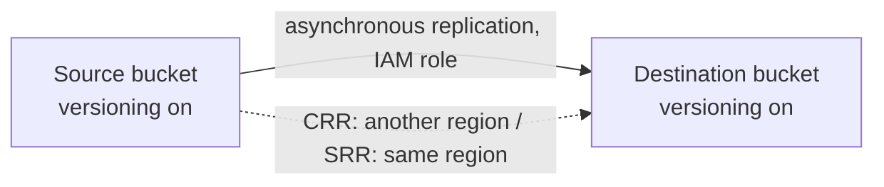

# Amazon S3 (Simple Storage Service)

Concept-only note, merged across chapters 12, 13 and the S3 summary lecture of 21. Lab steps are in [[12 - Amazon S3 Introduction]] and [[13 - Advanced Amazon S3]] (Version B). Encryption, access points, Object Lock, CORS and Block Public Access detail belong in [[S3 Security & Encryption]].

## 1. What S3 is: buckets and objects
(src: 12/01-S3 Overview, 12/02-S3 Hands On, 21/06-S3)
- "Infinitely scaling" object storage; a core AWS building block used by many services and websites. Serverless key-value store: great for **big objects**, not for many small ones.
- Use cases: backup/storage, disaster recovery (copy to another region), archive, hybrid cloud storage, application and media hosting, **data lake** and big-data analytics, software delivery, static websites. Examples: NASDAQ keeps 7 years of data in S3 Glacier; Sysco runs analytics on S3 data.
- **Bucket** = top-level container, **defined at region level** (the console shows all buckets from all regions in one list).
- Bucket types: **General purpose** (most common, recommended) and **Directory** (low-latency, used by S3 Express One Zone).
- **Naming**: historically a globally unique name; now an optional **Account Regional namespace** where AWS adds a suffix (account + region) so any name you choose is available and reusable across regions/accounts.
  - Rules: no uppercase, no underscore, not an IP address, start with a lowercase letter or number, must not start with `xn--`, must not end with `-s3alias`.
- **Object** = key + value (+ metadata, tags, version ID).
  - **Key** = full path (`my_folder1/another_folder/my_file.txt`) = **prefix** (`my_folder1/another_folder/`) + **object name**. S3 has no real directories; the console "folders" are just key prefixes.
  - **Max object size 50 TB**; uploads **> 5 GB must use multi-part upload**.
  - **Metadata**: system- or user-defined key/value pairs. **Tags**: Unicode key/value pairs, **up to 10**, useful for security and lifecycle. **Version ID** if versioning is on.
- Objects are private by default; the plain object URL returns AccessDenied, while a **pre-signed URL** carries the requester's signature/credentials and works only for that authorized access.

> [!tip] Exam
> Bucket = regional; key = prefix + object name; max object 50 TB; multi-part mandatory above 5 GB.

## 2. Security basics (bucket policies)
(src: 12/03-S3 Security- Bucket Policy, 12/04 policy-generator demo only)
Full security and encryption topics: [[S3 Security & Encryption]].
- **User-based**: IAM policies on users/roles. **Resource-based**: **bucket policies** (bucket-wide JSON rules, the most common method), object ACLs and bucket ACLs (finer grain, less common, can be disabled).
- An IAM principal can access an object if **IAM permissions OR the resource policy allow it, and there is no explicit deny**.
- Bucket policy JSON: **Resource** (bucket/objects, e.g. `arn:.../bucket/*`, the `/*` is needed for object actions such as GetObject), **Effect** (Allow/Deny), **Action** (e.g. `s3:GetObject`), **Principal** (account/user; `*` = anyone).
- Bucket policy uses: grant **public read**, **force encryption at upload**, grant **cross-account** access.

| Who needs access | Mechanism |
|---|---|
| Public website visitor | Bucket policy allowing public GetObject |
| IAM user in your account | IAM policy |
| EC2 instance | **IAM role** (not a user) |
| User in another account | Bucket policy (cross-account) |

- **Block Public Access** = extra safety layer against data leaks: even a public bucket policy is ineffective while it is on. Can be set **at account level** if no bucket should ever be public.

> [!tip] Exam
> EC2 -> S3: IAM role. Cross-account: bucket policy. Public bucket needs BOTH Block Public Access off AND a public bucket policy.

## 3. Static website hosting
(src: 12/05-S3 Website Overview, 12/06-S3 Website Hands On)
- S3 can host **static websites**; the endpoint depends on the region (the two URL formats differ only by a dash vs a dot after `s3-website`). Needs an **index document** (e.g. `index.html`).
- **403 Forbidden** after enabling website hosting = bucket is not publicly readable -> add a public-read bucket policy (and disable Block Public Access).

## 4. Versioning
(src: 12/07-S3 Versioning, 12/08-S3 Versioning - Hands On)
- Enabled **at bucket level**; re-uploading the same key creates a new version (v1, v2, ...). Best practice.
- Benefits: protects against **unintended deletes**; easy **rollback**.
- **Delete without version ID** = adds a **delete marker** (object looks gone, 404; previous versions remain). Removing the delete marker restores the object.
- **Delete with a specific version ID** = **permanent delete**, cannot be undone.
- Files uploaded before versioning was enabled have version ID **null**. **Suspending** versioning does **not** delete earlier versions (safe).

> [!tip] Exam
> Delete = delete marker (recoverable). Delete of a version ID = permanent. Suspend = keeps old versions.

## 5. Replication (CRR and SRR)
(src: 12/09-S3 Replication, 12/10-S3 Replication Notes, 12/11-S3 Replication - Hands On)
- **Asynchronous**, background copy between buckets: **CRR** (different regions) and **SRR** (same region). Buckets may be in **different accounts**.
- Requirements: **versioning enabled on source and destination**; S3 needs an **IAM role/permissions** to read from source and write to destination.
- Use cases: CRR = compliance, lower latency, cross-account copies; SRR = **aggregate logs** from several buckets, **live replication between prod and test**.

> [!info] Diagram
> **Explanation:** New objects written to the source bucket are copied asynchronously to the destination. CRR targets a bucket in another Region, SRR one in the same Region; both buckets can belong to different accounts.
> **Reference:** [Replicating objects within and across Regions (Amazon S3 User Guide)](https://docs.aws.amazon.com/AmazonS3/latest/userguide/replication.html)

Behaviors to remember:
- After enabling, **only new objects** are replicated. **Existing objects** (and objects that failed replication) need **S3 Batch Replication**.
- **Version IDs are preserved** in the replica; replication of a small object took on the order of seconds to ~10 s in the demo.
- **Delete markers**: replication is an **optional setting** (off by default). **Deletes with a version ID are never replicated** (protects from malicious deletes).
- **No chaining**: bucket 1 -> bucket 2 -> bucket 3 does not copy bucket 1's objects into bucket 3.

> [!tip] Exam
> Versioning required; only new objects (Batch Replication for old); delete markers optional; permanent deletes not replicated; no chaining.

## 6. Storage classes
(src: 12/12-S3 Storage Classes Overview, 12/13-S3 Storage Classes Hands On, 21/06)
- Class is chosen at upload, can be **changed manually**, or moved automatically with **lifecycle rules** (section 7).
- **Durability = 11 nines (99.999999999%) for all classes** (about one object lost per 10,000 years for 10 million objects). **Availability varies by class.** S3 Standard 99.99% = about 53 minutes/year unavailable.

| Class | Availability | AZs | Min storage duration | Retrieval / key facts | Use cases |
|---|---|---|---|---|---|
| **Standard** | 99.99% | multi (survives 2 concurrent facility failures) | none | low latency, high throughput; default | big data analytics, mobile/gaming, content distribution |
| **Standard-IA** | 99.9% | multi | 30 days | cheaper storage, **retrieval fee** | DR, backups |
| **One Zone-IA** | 99.5% | **1** (data lost if AZ destroyed) | 30 days | retrieval fee | secondary backup copies, re-creatable data |
| **Glacier Instant Retrieval** | - | - | **90 days** | **milliseconds** | archive accessed about once a quarter |
| **Glacier Flexible Retrieval** | - | - | **90 days** | Expedited 1-5 min; Standard 3-5 h; **Bulk 5-12 h (free)** | archive, can wait |
| **Glacier Deep Archive** | - | - | **180 days** | Standard 12 h; Bulk 48 h; lowest cost | long-term archive |
| **Intelligent-Tiering** | - | - | none | small monthly **monitoring and auto-tiering fee**, **no retrieval charge** | unknown/changing access pattern |

- Glacier classes: low-cost archive, pay storage + retrieval. "Instant" = immediate; "Flexible" = willing to wait (previously just "S3 Glacier").
- **Intelligent-Tiering tiers**: Frequent Access (default, automatic) -> Infrequent Access (not accessed **30 days**, automatic) -> Archive Instant Access (**90 days**, automatic) -> **Archive Access** (optional, 90 to 700+ days) -> **Deep Archive Access** (optional, 180 to 700+ days).
- The instructor says you do not need to memorize the full comparison chart or prices, only understand the classes. **Reduced Redundancy** is deprecated and not covered.

[verify] "Glacier Flexible Retrieval: Expedited 1-5 min, Standard 3-5 h, Bulk 5-12 h; Deep Archive Standard 12 h, Bulk 48 h."
> [!warning] Correction [note]
> Retrieval times were not confirmed on the pages fetched (the storage-class pages describe Flexible Retrieval as "minutes to hours" and Deep Archive as "hours"). Minimum durations (90/180 days), 30 days for IA classes, availability figures (99.99%, 99.9%, 99.5%) and Intelligent-Tiering tier thresholds (30/90/180 days) are confirmed. Source: [Understanding and managing Amazon S3 storage classes](https://docs.aws.amazon.com/AmazonS3/latest/userguide/storage-class-intro.html). The same page notes Standard-IA/One Zone-IA bill a **128 KB minimum object size** (not mentioned in the lecture).

> [!tip] Exam
> Rapid access but infrequent -> Standard-IA; re-creatable -> One Zone-IA; archive in ms -> Glacier Instant; unknown pattern -> Intelligent-Tiering; cheapest archive -> Deep Archive (180 days).

## 7. S3 Express One Zone
(src: 12/14-S3 Express One Zone)
- High-performance class stored in a **directory bucket**, **single AZ of your choice**.
- **Hundreds of thousands of requests/second, single-digit millisecond latency**; about **10x** S3 Standard performance at about **50% lower cost** (per lecture). Lower availability (one AZ). [verify]
> [!warning] Correction [note]
> AWS now states S3 Express One Zone delivers data access speed **up to 10x faster** and **request costs up to 80% lower** than S3 Standard (the 50% figure reflects earlier pricing). Source: [Amazon S3 Express One Zone](https://aws.amazon.com/s3/storage-classes/express-one-zone/).
- **Co-locate storage and compute in the same AZ** to cut latency and possibly network cost.
- Use cases: latency-sensitive and data-intensive apps, AI/ML training, financial modeling, media processing, HPC; integrates with SageMaker training, Athena, EMR, Glue.

> [!tip] Exam
> Single-digit ms, one AZ, directory bucket, co-locate with compute.

## 8. Lifecycle rules and S3 Analytics
(src: 13/01-S3 Lifecycle Rules (with S3 Analytics), 13/02-S3 Lifecycle Rules - Hands On concepts only)
- Objects can transition between classes in many permutations (Standard -> Standard-IA -> Intelligent-Tiering -> One Zone-IA -> Glacier tiers -> Deep Archive).
- A rule has:
  - **Transition actions** (e.g. to Standard-IA 60 days after creation, to Glacier after 6 months);
  - **Expiration actions** (delete access logs after 365 days, delete **old versions**, delete **incomplete multi-part uploads** e.g. older than 2 weeks).
  - Scope: whole bucket, a **prefix**, or **object tags** (e.g. only the finance department).
- The console offers five action types: move **current** versions between classes; move **non-current** versions; expire current versions; permanently delete non-current versions; delete expired delete markers / incomplete multi-part uploads.

**Exam scenarios**
| Scenario | Design |
|---|---|
| Source images must be instantly retrievable 60 days, then up to 6 h wait; thumbnails re-creatable, kept 60 days | Source images in **Standard**, lifecycle to **Glacier** after 60 days. Thumbnails (separate **prefix**) in **One Zone-IA**, **expire** after 60 days |
| Deleted objects recoverable immediately for 30 days, then within 48 h up to 365 days | Enable **versioning** (delete marker hides object); lifecycle moves **non-current versions** to **Standard-IA**, then to **Glacier Deep Archive** |

- **S3 Analytics (Storage Class Analysis)** recommends when to transition **Standard -> Standard-IA** only (not One Zone-IA or Glacier). Produces a **daily-updated CSV report**; takes **24-48 hours** to start showing data.

> [!tip] Exam
> Lifecycle = transition + expiration, by prefix/tag. Analytics only advises Standard vs Standard-IA.

## 9. Requester Pays
(src: 13/03-S3 Requester Pays)
- Normally the bucket owner pays storage **and** data-transfer costs. With **Requester Pays**, the owner still pays storage, but the **requester pays the request and download (networking) cost**.
- Useful for sharing large datasets with other accounts. The requester must be **authenticated in AWS (not anonymous)** so AWS can bill them.

## 10. Event Notifications
(src: 13/04-S3 Event Notifications, 13/05 console demo only)
- Events: object created, removed, restored, replication events, etc.; **filter** by name (e.g. suffix `.jpg`). Example: generate thumbnails on upload. Delivered usually in **seconds**, sometimes a minute or more.
- **Destinations**: **SNS topic, SQS queue, Lambda function** ([[SNS]], [[SQS]], [[Lambda]]).
- Permissions use **resource policies**, not IAM roles: SNS resource access policy, SQS resource access policy, Lambda resource policy allowing S3 to publish/invoke.
- **EventBridge integration**: all events also go to [[EventBridge]]; rules route to **18+ AWS services**; adds advanced filtering (metadata, object size, name), multiple destinations (Step Functions, Kinesis Data Streams, Firehose), archive and replay, more reliable delivery.

> [!tip] Exam
> Native targets: SNS, SQS, Lambda. Need richer filtering or more targets -> EventBridge. Permissions are resource policies on the target.

## 11. Performance
(src: 13/06-S3 Performance, 21/06)
- **Baseline**: auto-scales; **100-200 ms** first-byte latency; **3,500 PUT/COPY/POST/DELETE** and **5,500 GET/HEAD requests/second per prefix**; no limit on number of prefixes (4 prefixes read evenly = 22,000 GET/HEAD/s). Prefix = everything between bucket and object name.

| Technique | Purpose | Details |
|---|---|---|
| **Multi-part upload** | faster uploads | **recommended > 100 MB, required > 5 GB**; parts uploaded in parallel, reassembled by S3 |
| **Transfer Acceleration** | faster upload/download over distance | upload to nearest **edge location** (200+), then fast private AWS network to the target-region bucket; compatible with multi-part upload |
| **Byte-range fetches** | faster downloads and resilience | parallel GETs of byte ranges; retry only failed range; or fetch just a **header** (e.g. first 50 bytes) |
| **S3 Select** (21/06) | retrieve only needed data | server-side filtering, less data transferred |

[verify] S3 Select is presented as a current performance feature.
> [!warning] Correction [note]
> AWS states Amazon S3 Select is no longer available to new customers (existing customers can continue). Source: [Querying data in place with Amazon S3 Select](https://docs.aws.amazon.com/AmazonS3/latest/userguide/selecting-content-from-objects.html).

> [!info] Source check
> The 3,500/5,500 per-prefix rates and ~100-200 ms first-byte latency are confirmed: [Best practices design patterns: optimizing Amazon S3 performance](https://docs.aws.amazon.com/AmazonS3/latest/userguide/optimizing-performance.html). The 50 TB object limit is confirmed (AWS adds that the multipart-derived ceiling is about 53.7 TB): [Amazon S3 objects overview](https://docs.aws.amazon.com/AmazonS3/latest/userguide/UsingObjects.html).

> [!tip] Exam
> Upload speed over distance -> Transfer Acceleration; big files -> multi-part; fast partial reads/parallel downloads -> byte-range fetches. Also see [[CloudFront & Global Accelerator]].

## 12. Batch Operations
(src: 13/07-S3 Batch Operations, 21/06)
- Perform a bulk action on **existing objects with one request**: modify metadata/properties, **copy between buckets**, **encrypt all unencrypted objects**, change ACLs/tags, **restore from Glacier**, **invoke a Lambda** per object. Also used to copy existing files before enabling replication.
- A **job** = list of objects + action + optional parameters. Advantages over scripting: retries, progress tracking, completion notifications, reports.
- Build the object list with **S3 Inventory**, filter with **Athena** ([[Athena, Glue & Lake Formation]]), pass to Batch Operations.

> [!tip] Exam
> "Encrypt all existing unencrypted objects" -> S3 Inventory + Athena + S3 Batch Operations.

## 13. Storage Lens
(src: 13/08-S3 Storage Lens)
- Analyze, optimize and apply protection best practices to storage **across an AWS Organization**; find anomalies and cost savings. Aggregate by organization, account, region, bucket or prefix. Export to S3 as **CSV or Parquet**.
- **Default dashboard** is preconfigured, covers multiple accounts and regions; cannot be deleted, only disabled.
- Metric categories: **summary** (storage bytes, object counts), **cost optimization** (non-current version bytes, incomplete multi-part upload bytes), **data protection** (versioning, MFA delete, SSE-KMS, replication-rule bucket counts), **access management** (object ownership), **event**, **performance** (Transfer Acceleration), **activity** (requests, bytes, HTTP status codes such as 200/403).

| | Free metrics | Advanced (paid) metrics and recommendations |
|---|---|---|
| Scope | about **28 usage metrics**, all customers | adds activity, advanced cost optimization, advanced data protection, status codes |
| Retention | queryable **14 days** | **15 months** |
| CloudWatch | - | published to CloudWatch at no extra charge |
| Prefix level | - | yes |

> [!tip] Exam
> Organization-wide visibility, unencrypted-object counts, buckets lacking best practices -> Storage Lens. Free vs paid: 14 days vs 15 months.

## 14. Summary: S3 from a database perspective
(src: 21/06-S3)
- Key-value store for big objects (poor for many small ones), serverless, 50 TB max object, versioning, tiers managed by lifecycle.
- Know: versioning, encryption (SSE-S3, SSE-KMS, SSE-C, client-side, TLS, default encryption), replication, MFA delete, access logs, bucket policies/ACLs/access points, S3 Object Lambda, CORS, Object Lock/Vault Lock (covered in [[S3 Security & Encryption]]), Batch Operations + Inventory, multi-part upload, Transfer Acceleration, Event Notifications (SNS, SQS, Lambda, EventBridge). See [[Storage Options Compared]].

## Not included here
- Hands-on narration for 12/02, 12/04, 12/06, 12/08, 12/11, 12/13, 13/02, 13/05 (concepts extracted above; lab steps in Version B).
- Encryption, Object Lock, access points, CORS (chapter 14) -> [[S3 Security & Encryption]].
- No lecture in this note's source list lacked a transcript.
