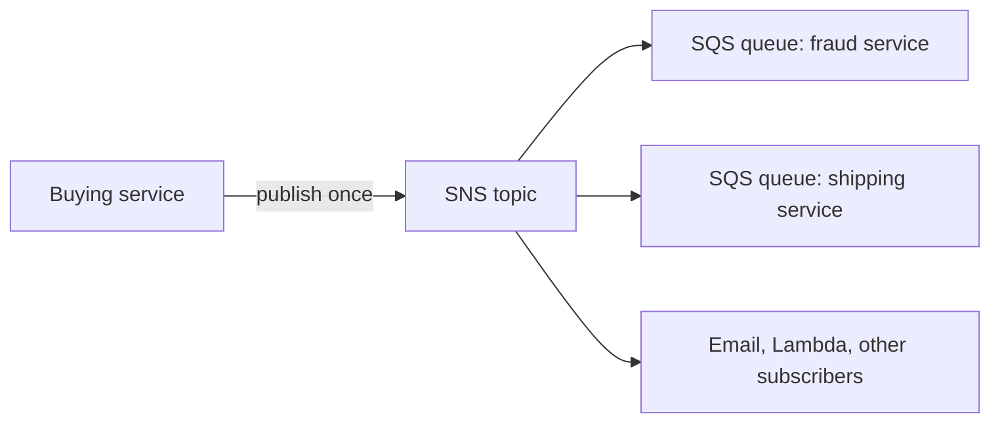

# Amazon SNS (Simple Notification Service)

Concept-only note. Lab steps (create topic, email subscription) are in [[17 - Decoupling Applications - SQS, SNS, Kinesis, Amazon MQ]] (Version B). Related: [[SQS]], [[Kinesis & Firehose]], [[Amazon MQ & Messaging Comparison]].

## 1. Pub/Sub model
(src: 17/08-Amazon Simple Notification Service (AWS SNS))
- One message, many receivers. Instead of the producer integrating with each receiver (email, fraud service, shipping service, SQS queue), it **publishes once to an SNS topic**; every **subscriber** gets a copy. Adding a receiver means adding a subscription, not changing the producer.
- Each subscriber receives **all messages** unless a **filter policy** is used.
- Limits quoted (lecture says you are never tested on limits): up to **12,000,000+ subscriptions per topic**, **100,000 topics per account** (can be raised).

[verify] "12,000,000+ subscriptions per topic" (a later lecture says 12,500,000).
> [!warning] Unconfirmed
> The two lecture figures differ and could not be confirmed from an AWS source I could retrieve (the quota page fetched returned a conflicting summary). Treat as an order-of-magnitude figure; the instructor says it can change over time.

## 2. Subscribers and sources
(src: 17/08, 17/10-SNS - Hands On)
- **Subscriber protocols**: Kinesis Data Firehose, SQS, Lambda, Email, Email-JSON, HTTP, HTTPS, SMS / mobile notifications. Remember this list for the exam.
- **Firehose subscriber** sends data on to S3, Redshift, etc. ([[Kinesis & Firehose]]).
- **Sources**: many AWS services publish notifications into SNS: CloudWatch alarms, ASG notifications, CloudFormation state changes, Budgets, S3 events, DMS, Lambda, DynamoDB, RDS events.
- **Publish**: create topic -> create subscription(s) -> publish with the topic publish SDK. Email subscriptions must be **confirmed** by the recipient (pending confirmation until then).
- **Direct publish for mobile apps**: create a platform application and platform endpoint (Google GCM, Apple APNS, Amazon ADM).

## 3. Topic types
(src: 17/10, 17/09-SNS and SQS - Fan Out Pattern)

| | Standard topic | FIFO topic |
|---|---|---|
| Ordering | best effort | strict, by message group ID |
| Delivery | at least once | exactly once (deduplication ID or content-based) |
| Throughput | highest publishes/second | same as SQS FIFO (lecture: up to 300 publishes/s) |
| Subscribers | SQS, Lambda, HTTP(S), SMS, email, mobile | **SQS queues only** (standard or FIFO queues) |
| Name | any | must end with `.fifo` |

> [!tip] Exam
> Need fan-out + ordering + deduplication -> **SNS FIFO topic -> SQS FIFO queues**.

[verify] "Only SQS queues can subscribe to FIFO topics" is directionally right.
> [!warning] Correction [note]
> AWS confirms FIFO topics deliver to SQS standard and FIFO queues and cannot deliver to email, mobile, SMS or HTTP(S) endpoints; for Lambda, subscribe a queue and trigger the function from the queue. Source: [Amazon SNS message delivery for FIFO topics](https://docs.aws.amazon.com/sns/latest/dg/fifo-message-delivery.html).

## 4. Security
(src: 17/08)
- Same as SQS: **in-flight HTTPS**, **at-rest KMS** encryption, optional client-side encryption (client's job).
- **IAM policies** regulate the SNS API; **SNS access policies** (like S3 bucket policies) enable cross-account access and let services such as **S3 events** write to a topic.

## 5. Fan-out pattern (SNS + SQS)
(src: 17/09)
- Push once to a topic and **subscribe many SQS queues**. Avoids lost messages when the app crashes mid-way, delivery failures, or when queues are added later. Fully decoupled, **no data loss**; SQS adds persistence, delayed processing and retries.
- The SQS queue **access policy must allow the SNS topic to write** to it.
- **Cross-region delivery**: an SNS topic can send to SQS queues in other regions if permissions allow.

> [!info] Diagram
> **Explanation:** The producer publishes one message to the topic; SNS pushes a copy to every subscribed queue (and other subscriber types). Each queue buffers messages for its own consumer.
> **Reference:** [Fanout Amazon SNS notifications to Amazon SQS queues (Amazon SNS Developer Guide)](https://docs.aws.amazon.com/sns/latest/dg/sns-sqs-as-subscriber.html)

- **S3 events to multiple queues**: S3 allows only **one event rule per combination of event type and prefix** (e.g. object created + `images/`). To notify several queues, send the S3 event to an SNS topic and fan out to many SQS queues, Lambda, email, etc.
- **SNS -> Kinesis Data Firehose -> S3** (or any Firehose destination) to persist topic messages.

## 6. Message filtering
(src: 17/09, 17/10)
- A **JSON filter policy** on a subscription limits which messages it receives. **No policy = receives everything** (default).
- Example: transactions with `State` = Placed go to a "placed orders" queue, Canceled to another queue and an email subscription, Declined to a third; one more queue with no filter gets all messages.
- Filtering also works with FIFO topics.

> [!tip] Exam
> Different subscribers need different subsets of the same topic -> SNS message filtering (JSON policy), not multiple topics.

## Not included here
- 17/10 SNS hands-on: console clicks and the mailinator email demo omitted; concepts kept above.
- Queues, polling and visibility -> [[SQS]]; streaming -> [[Kinesis & Firehose]]; push to mobile/email services beyond SNS -> see Version B chapter 30 notes.
- All 17/08-10 lectures have transcripts.
