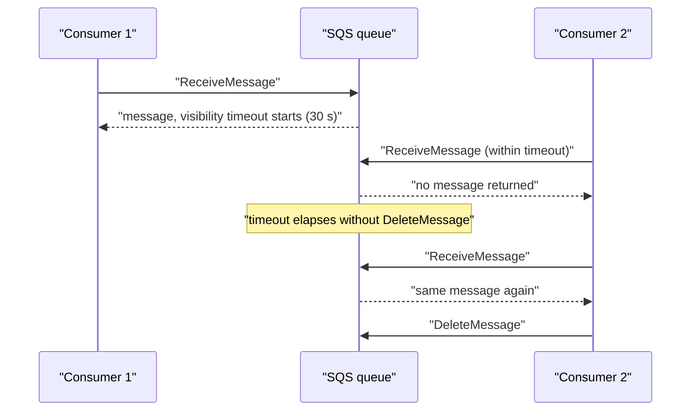

# Amazon SQS (Simple Queue Service)

Concept-only note. Lab steps (create queue, send/receive, FIFO demo) are in [[17 - Decoupling Applications - SQS, SNS, Kinesis, Amazon MQ]] (Version B). Related: [[SNS]], [[Kinesis & Firehose]], [[Amazon MQ & Messaging Comparison]], [[ASG]].

## 1. Why decouple: sync vs async
(src: 17/01-Introduction to Messaging)
- **Synchronous**: services call each other directly (buying service -> shipping service). A sudden spike (e.g. 1,000 videos to encode instead of the usual 10) can overwhelm the receiver.
- **Asynchronous / event based**: a middleware sits between services (buying service puts a message in a queue; shipping service reads it when ready). Services **scale independently**.
- Three decoupling layers, all scale very well: **SQS** (queue model), **SNS** (pub/sub model), **Kinesis** (real-time streaming, big data).

## 2. Standard queue basics
(src: 17/02-Amazon SQS - Standard Queues Overview, 17/03-SQS - Standard Queue Hands On)
- Oldest AWS service (10+ years), **fully managed**; the answer to "application decoupling" on the exam.
- **Producers** send messages (SDK, `SendMessage` API); **consumers** (EC2, on-premises servers, Lambda) **poll** the queue, process, then **delete** (`DeleteMessage`). Message persists until deleted.
- Consumers receive **up to 10 messages per poll**; multiple consumers process in parallel (horizontal scaling).

| Property | Standard queue |
|---|---|
| Throughput | **Unlimited** (messages/sec and messages in queue) |
| Retention | **4 days default, max 14 days**; unread/undeleted messages are lost after that |
| Latency | **< 10 ms** on publish and receive |
| Message size | "< 1,024 KB" per message (lecture); console shows max **256 KB** [verify] |
| Delivery | **At-least-once** (duplicates possible), **best-effort ordering** (out of order possible) |

[verify] Message size: the lecture states less than 1,024 KB in one place and 256 KB (console maximum) in the hands-on.
> [!warning] Correction [note]
> AWS documents the maximum message size as **1,048,576 bytes (1 MiB)**; larger payloads can use the SQS Extended Client Library (reference in S3, up to 2 GB). Retention (default 4 days, max 14 days) is confirmed. Source: [Amazon SQS message quotas](https://docs.aws.amazon.com/AWSSimpleQueueService/latest/SQSDeveloperGuide/quotas-messages.html).

- **Queue config items seen**: visibility timeout, delivery delay, wait time (long polling), retention period, max message size, encryption, access policy, redrive/dead-letter queue (not covered in depth in the lectures).
- Message metadata includes message ID, body hash, sender, **receive count**, size; optional message attributes (key/value; out of exam scope).
- **Purge queue** deletes all messages: handy in development, avoid in production.
- Monitoring metric: **approximate number of messages** (queue length) and **approximate age of the oldest message**, both usable to scale consumers.

## 3. Security
(src: 17/02, 17/03)
- In flight: **HTTPS API**. At rest: **SSE-SQS** (default, SQS-managed key, like SSE-S3) or **SSE-KMS** (AWS managed alias `aws/sqs` or own key; data key reuse period e.g. 5 minutes limits KMS calls). Optionally **client-side encryption** (client does it itself).
- Access control: **IAM policies** for the SQS API and **SQS access (resource) policies**, similar to S3 bucket policies, used for **cross-account access** and to let **SNS or S3 (events)** write to a queue.

## 4. Visibility timeout
(src: 17/04-SQS - Message Visibility Timeout)
- After a consumer receives a message (`ReceiveMessage`) it becomes **invisible to other consumers** for the visibility timeout; **default 30 seconds**, range **0 seconds to 12 hours**.
- If not deleted before it elapses, the message returns to the queue and is received again (receive count increments) -> possible **duplicate processing**.
- Consumer needing more time calls **`ChangeMessageVisibility`** to extend the timeout for that message.
- Tuning: too high -> a crashed consumer's message takes hours to reappear; too low -> duplicates because processing is not finished.

> [!info] Diagram
> **Explanation:** While Consumer 1 holds the message it is hidden from Consumer 2. If Consumer 1 never deletes it, the message becomes visible after the timeout and another consumer receives it a second time; deleting it ends the cycle.
> **Reference:** [Amazon SQS visibility timeout (SQS Developer Guide)](https://docs.aws.amazon.com/AWSSimpleQueueService/latest/SQSDeveloperGuide/sqs-visibility-timeout.html)

> [!tip] Exam
> Visibility timeout default 30 s (max 12 h). Message processed twice -> timeout too short; use `ChangeMessageVisibility`.

## 5. Long polling
(src: 17/05-SQS - Long Polling)
- Consumer waits for messages to arrive when the queue is empty -> **fewer API calls** and **lower latency** (message is delivered as soon as it arrives).
- Wait time **1 to 20 seconds**; **20 seconds preferred**. **Prefer long polling over short polling.**
- Enable at **queue level** or per request with the **`WaitTimeSeconds`** parameter.

## 6. FIFO queues
(src: 17/06-SQS - FIFO Queues)
- **First in, first out**: messages are read in the order sent (standard queues can be out of order).
- Name **must end with `.fifo`**.
- Throughput: about **300 messages/s without batching, 3,000 messages/s with batching**.
- **Exactly-once send**: provide a **deduplication ID** per message; the same ID seen within **5 minutes** is dropped. **Content-based deduplication** setting can derive it from the body.
- **Ordering guarantee is per message group ID** (required on every send): messages of one group are ordered.

[verify] The 300 / 3,000 per second throughput figure.
> [!warning] Correction [note]
> AWS confirms 300 TPS per API action without batching and 3,000 messages/s with batching (10 per batch) for default FIFO queues, and adds a **high throughput mode** that raises limits (up to 70,000 TPS non-batched in us-east-1, us-west-2 and eu-west-1; lower in other Regions). Source: [Amazon SQS message quotas](https://docs.aws.amazon.com/AWSSimpleQueueService/latest/SQSDeveloperGuide/quotas-messages.html).

## 7. SQS + Auto Scaling Group
(src: 17/02, 17/07-SQS + Auto Scaling Group)
- Consumers run on EC2 in an [[ASG]]; the **CloudWatch metric `ApproximateNumberOfMessages` (queue length)** drives a [[CloudWatch]] alarm (e.g. above 1,000) that triggers ASG scale out; scales in the same way when the queue drains.
- **Pattern 1: buffer for database writes.** During a spike, app tier writes transactions into SQS (infinitely scalable, durable) instead of directly to RDS/Aurora/DynamoDB; a second ASG dequeues and inserts, **deleting the message only after a successful insert**. Works when the client does not need immediate confirmation of the DB write.
- **Pattern 2: decouple application tiers** (e.g. front end enqueues video-processing requests; back-end ASG processes and stores in S3). Each tier scales independently and can use different instance types (e.g. GPU instances for the back end).

> [!tip] Exam
> "Decoupling", "sudden spike", "timeouts", "must not lose requests" -> SQS (with ASG scaling on queue length). Dequeue/delete only after success.

## Not included here
- Lectures 17/03 (SQS standard hands-on) and 17/06 console demo: only the concepts above were kept.
- SNS, Kinesis, Amazon MQ -> [[SNS]], [[Kinesis & Firehose]], [[Amazon MQ & Messaging Comparison]].
- Dead-letter queue: only mentioned as a setting ("seen later"); no dedicated lecture in this chapter.
- All 17/01-07 lectures have transcripts.
